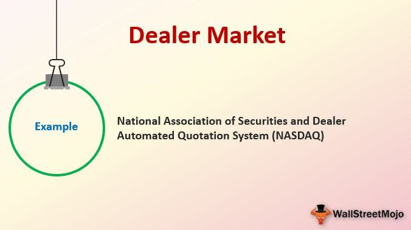

The financial world is vast and multifaceted, with various market structures and trading methodologies available to investors. Understanding these concepts is essential for anyone looking to navigate the complexities of financial trading and investment. In this article, we will explore four critical markets and trading methods: auction markets, dealer markets, broker markets, and algorithmic trading. Auction markets are characterized by simultaneous bids and offers from buyers and sellers, establishing prices where the highest buyer's offer meets the lowest seller's price. Dealer markets, on the other hand, involve intermediaries known as dealers, who play a critical role in providing liquidity by buying and selling assets from their inventory. Broker markets facilitate trades by connecting buyers and sellers through agents who do not trade on their own account. Finally, algorithmic trading employs sophisticated computer algorithms to enhance trading efficiency and speed, significantly impacting modern financial practice. Each market type boasts unique attributes and mechanisms, and together they form an integrated landscape that supports diverse trading strategies and investment needs. In understanding these, investors are better equipped to leverage opportunities and mitigate risks within the dynamic financial markets.

## Table of Contents



## Auction Market

An auction market is a structured financial platform where trades are executed based on the simultaneous submission of bids by buyers and offers by sellers. This structure inherently supports the formulation of a transparent and efficient market environment, critical for ensuring that securities are traded at fair market values. Auction markets operate by matching the highest bid with the lowest offer, thereby determining the transaction price. This process reinforces market equilibrium and allows supply and demand to drive price discovery.

A core feature of auction markets is their transparency. All participants have access to the same information regarding bids, offers, and completed transactions. This openness ensures an equitable trading scenario, reducing the potential for price manipulation. Additionally, auction markets often facilitate large volumes of trade, contributing to liquidity and minimizing transaction costs.

In practical terms, auction markets can be observed in both traditional and digital forms. The New York Stock Exchange (NYSE), for instance, operates as a premier example of a physical auction market. A central location and electronic systems integrate to enable the efficient interaction of buyers and sellers. Trading occurs through a continuous auction format, where designated market makers oversee transactions, thereby adding a layer of human oversight to the automated process.

Beyond traditional stock exchanges, online platforms have increasingly adopted auction-style mechanisms. These platforms utilize sophisticated algorithms to match bids and offers in real-time across global markets, enhancing accessibility and speed of execution. Such systems are designed to handle vast numbers of transactions with high precision, leveraging advanced computing technologies.

The mechanics of auction markets can be expressed through mathematical models that depict the equilibrium price finding process. Let $P_b$ be the highest price a buyer is willing to pay and $P_s$ be the lowest price a seller is willing to accept. The trade price $P_t$ is determined when $P_b \geq P_s$. This simple yet powerful model illustrates the equilibrium principle underlying auction markets, where trade only occurs when there is a consensus on price.

Python code, though not necessary for a basic understanding, can be used to simulate an auction market environment. This code snippet demonstrates a simplified matching of bids and offers:

```python
def auction_market(bids, offers):
    bids.sort(reverse=True)  # Sort bids in descending order
    offers.sort()            # Sort offers in ascending order
    trades = []

    while bids and offers and bids[0] >= offers[0]:
        trade_price = (bids[0] + offers[0]) / 2  # Calculate trade price
        trades.append(trade_price)
        bids.pop(0)  # Remove matched bid
        offers.pop(0)  # Remove matched offer

    return trades

# Example lists of bids and offers
bids = [100, 99, 98, 95]
offers = [97, 96, 94, 92]
trades = auction_market(bids, offers)
print("Executed trades at prices:", trades)
```

Auction markets exemplify a fundamental component of the financial system's infrastructure, aiding in the truthful assessment of a security's value through transparent and orderly trading environments.

## Dealer Market

In a dealer market, the execution of trades occurs through intermediaries known as dealers. These dealers play a critical role in providing [liquidity](/wiki/liquidity-risk-premium) and transparency by setting and posting buy and sell prices for various securities or financial instruments. By doing so, they enable continuous trading flow and ensure that market participants can transact efficiently even when there is no immediate direct counterpart.

Dealer markets primarily involve instruments such as bonds and foreign exchange. The Nasdaq stock market is one of the most notable examples of a dealer market where electronic platforms facilitate the execution of trades by matching buy and sell prices quoted by dealers.

A defining characteristic of dealer markets is the bid-ask spread. This is the difference between the price a dealer is willing to pay for a security (bid) and the price at which they are willing to sell it (ask). The bid-ask spread serves multiple functions: it compensates dealers for the risk they undertake by holding securities, provides a profit margin, and accounts for transaction costs.

Mathematically, if $P_{ask}$ denotes the asking price set by the dealer, and $P_{bid}$ the bid price, then the spread $S$ can be expressed as:

$$
S = P_{ask} - P_{bid}
$$

Dealers adjust the bid-ask spread based on various factors, including market [volatility](/wiki/volatility-trading-strategies), liquidity of the asset, and the dealer's inventory levels and risk exposure. By strategically managing these spreads, dealers can effectively control risk and ensure continuous market operations.

Overall, dealer markets play a pivotal role in global finance by enhancing liquidity and enabling the smooth transaction of financial instruments, especially in sectors where direct buyer-seller interactions are less feasible.

## Broker Market

Broker markets are fundamental components of the financial ecosystem, facilitating transactions between buyers and sellers through intermediaries known as brokers. In this market structure, the role of the broker is to act as an agent, executing trades on behalf of clients rather than trading on their own account. This distinguishes them from dealers, who act as principals, buying and selling securities for their own portfolios.

Brokers are essential in ensuring that clients can access various financial instruments and execute trades efficiently. They connect disparate buyers and sellers, often through sophisticated trading platforms and electronic networks. By providing this connectivity, brokers earn commissions on the transactions they facilitate, which is a primary revenue stream for brokerage firms.

Understanding the distinction between broker and dealer markets is crucial for grasping the mechanics of financial trading. While brokers act as connectors and enablers in the trading process, they do not hold inventory of securities. In contrast, dealers maintain inventory and offer liquidity through their buy and sell operations, profiting from the bid-ask spread.

Platforms like Robinhood exemplify the broker market model, offering users the ability to trade stocks, options, and other financial instruments without constituting their own marketplace. These platforms provide user-friendly interfaces and tools, empowering individual investors to engage with the financial markets directly. Despite providing a platform for trading, they primarily generate income through commissions or other brokerage-related services.

Broker markets thus occupy a pivotal role in the financial system, enabling efficient market access and fostering competitive markets through the agency-based trading model. By linking clients to the broader financial landscape, brokers contribute to market transparency and price discovery, facilitating informed investment decisions.

## Algorithmic Trading

Algorithmic trading relies on sophisticated computer algorithms to autonomously make trading decisions and execute orders with precision and speed that surpass human capabilities. This trading method employs complex mathematical models to scrutinize extensive volumes of market data, identify patterns, and ascertain potential trading opportunities. The hallmark of [algorithmic trading](/wiki/algorithmic-trading) is its ability to perform high-frequency trading ([HFT](/wiki/high-frequency-trading-strategies)), where thousands of transactions can be completed in fractions of a second. This is pivotal in executing large orders discreetly, thereby minimizing their market impact.

The algorithms utilized in this form of trading are designed to consider numerous variables simultaneously; they can include technical indicators, price movement, volatility indices, and other financial metrics that help forecast price changes. A simple example of a trading algorithm is the moving average crossover, where buy or sell signals are generated based on the crossing of short-term and long-term moving averages:

```python
def moving_average(data, window_size):
    return [sum(data[i:i+window_size])/window_size for i in range(len(data)-window_size+1)]

def trading_signals(prices):
    short_window = 40
    long_window = 100

    short_ma = moving_average(prices, short_window)
    long_ma = moving_average(prices, long_window)

    signals = []

    for i in range(min(len(short_ma), len(long_ma))):
        if short_ma[i] > long_ma[i]:
            signals.append("Buy")
        elif short_ma[i] < long_ma[i]:
            signals.append("Sell")
        else:
            signals.append("Hold")

    return signals
```

Algorithmic trading plays a significant role in enhancing market liquidity and efficiency. Liquidity is improved as algorithms provide consistent buy and sell orders, enabling smoother transactions and tighter bid-ask spreads. Moreover, because algorithmic trading can quickly assimilate and act on new information, it leads to prices more accurately reflecting available data, thus making markets more efficient.

A crucial component of algorithmic trading is its robust risk management framework. Algorithms are programmed to follow specific parameters and limits, ensuring that trades are executed within predefined risk thresholds. This reduces the likelihood of human error, emotional trading, and unintentional biases affecting trading decisions.

Over the years, algorithmic trading has become indispensable across various market environments, leading to structural changes in how financial markets operate. It supports different trading strategies, including [arbitrage](/wiki/arbitrage), [market making](/wiki/market-making), and [trend following](/wiki/trend-following), each contributing to the market's dynamic behavior. As technology advances, the continuous refinement of algorithms promises to further transform trading practices, offering new avenues for efficiency and strategic implementation. The potential for innovation in algorithmic trading remains vast, especially as [artificial intelligence](/wiki/ai-artificial-intelligence) and [machine learning](/wiki/machine-learning) become more deeply integrated into trading systems.

## Comparative Analysis

Auction, dealer, and broker markets each perform unique functions within the financial ecosystem, guided by their distinct operational mechanisms.

Auction markets are notable for facilitating direct interactions between buyers and sellers. In these markets, participants simultaneously submit their bids and offers, creating an environment characterized by transparency and price discovery based on the equilibrium of supply and demand. This mechanism ensures that transactions are conducted at fair market values, where the highest price a buyer is willing to pay meets the lowest price a seller will accept. Stock exchanges, such as the New York Stock Exchange (NYSE), exemplify auction markets, emphasizing competitive bidding processes.

In contrast, dealer markets operate through intermediaries known as dealers. These markets do not require direct interaction between buyers and sellers for every transaction. Instead, dealers provide liquidity by continuously quoting buy and sell prices for specific securities, undertaking the risk of holding inventories. The presence of a bid-ask spread, the difference between the price to buy (bid) and the price to sell (ask), is a key feature, enabling dealers to manage risk and gain profit. The Nasdaq acts as a prominent example of a dealer market, where trading in equities occurs through a network of dealers.

Broker markets, meanwhile, are distinguished by the execution of trades through brokers who act as [agents](/wiki/agents) for their clients. Brokers do not own the assets traded; instead, they connect buyers and sellers while [earning](/wiki/earning-announcement) a commission for their services. Unlike dealer markets, brokers do not provide liquidity but serve as facilitators within the trading ecosystem. Broker platforms such as Robinhood exemplify this model by offering users an accessible way to conduct trades without acting as the counterparty.

The emergence of algorithmic trading has intricately integrated into these varied market structures, revolutionizing trading practices by enhancing speed and precision. Shaped by complex algorithms that handle large volumes of data, algorithmic trading identifies trading opportunities and executes orders at rapid speeds often unobtainable by humans. This technological infusion contributes significantly to market liquidity and efficiency across auction, dealer, and broker markets. In high-frequency trading or executing large orders while minimizing market impact, algorithmic trading serves as a pivotal component in modern finance, ensuring that markets continue to evolve with sophistication and depth.

## Conclusion

Understanding the various market types and trading mechanisms, such as auction, dealer, and broker markets, alongside algorithmic trading, is fundamental for effectively navigating today's complex financial markets. Each market type presents its own set of advantages and challenges, tailored to different investment strategies and risk profiles. Auction markets are lauded for their transparency and efficiency in pricing through direct buyer-seller interactions. Dealer markets, with intermediaries providing liquidity, are crucial for handling less frequent trades or less liquid securities. Broker markets, distinguished by their agency role, cater to clients aiming to connect with the broader market.

The continuous advancement of algorithmic trading introduces new levels of efficiency and strategic possibilities in both traditional and modern financial landscapes. High-frequency trading, a subset of algorithmic trading, leverages sophisticated algorithms to execute trades at speeds beyond human capability. This not only enhances market liquidity but also contributes to price accuracy across all market types.

By comprehending these trading platforms and methodologies, investors can strategically position themselves to capitalize on market opportunities and manage inherent risks effectively. Whether one's approach is aggressive or conservative, understanding how each market functions and the role technology plays is vital for crafting informed investment decisions. This knowledge, combined with vigilance toward the evolving dynamics of financial markets, empowers investors to adapt and thrive regardless of market conditions.

## References & Further Reading

[1]: Madhavan, A. (2000). ["Market Microstructure: A Survey."](https://www.sciencedirect.com/science/article/pii/S1386418100000070) The Review of Financial Studies, 13(2), 205-263.

[2]: O'Hara, M. (1995). ["Market Microstructure Theory."](https://www.semanticscholar.org/paper/Market-Microstructure-Theory-O'Hara/2bd0833b023f3270a2a6bf301e86b8e02e2f28ed) Blackwell Publishers.

[3]: Harris, L. (2003). ["Trading and Exchanges: Market Microstructure for Practitioners."](https://academic.oup.com/book/52292) Oxford University Press.

[4]: Hendershott, T., Jones, C. M., & Menkveld, A. J. (2011). ["Does Algorithmic Trading Improve Liquidity?"](https://onlinelibrary.wiley.com/doi/full/10.1111/j.1540-6261.2010.01624.x) The Journal of Finance, 66(1), 1-33.

[5]: Aldridge, I. (2013). ["High-Frequency Trading: A Practical Guide to Algorithmic Strategies and Trading Systems."](https://www.amazon.com/High-Frequency-Trading-Practical-Algorithmic-Strategies/dp/1118343506) Wiley.

[6]: Hasbrouck, J. (2007). ["Empirical Market Microstructure: The Institutions, Economics, and Econometrics of Securities Trading."](https://academic.oup.com/book/52241) Oxford University Press.