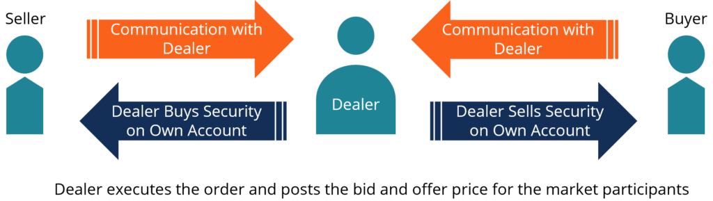

## Table of Contents

## What is a dealer market?

A dealer market is a type of financial market where dealers buy and sell securities directly to and from investors. Unlike an auction market where buyers and sellers come together to trade, in a dealer market, dealers act as the main traders. They keep an inventory of securities and are ready to buy or sell at any time. This makes it easier for investors to trade because they can go directly to a dealer instead of waiting for another investor.

In a dealer market, the price of securities is set by the dealers themselves. They might offer different prices to buy and sell the same security, which is known as the bid-ask spread. This spread is how dealers make money. For example, a dealer might buy a stock for $10 and sell it for $10.05. The difference, in this case, five cents, is their profit. This system helps keep the market running smoothly because dealers are always ready to trade, providing liquidity to the market.

## How does a dealer market differ from a broker market?

In a dealer market, dealers are the key players. They buy and sell securities directly to and from investors. Dealers keep a stock of securities and are always ready to trade. They set the prices, and they make money from the difference between the price they buy at and the price they sell at. This is called the bid-ask spread. For example, if a dealer buys a stock for $10 and sells it for $10.05, the five cents difference is their profit. This system helps keep the market liquid because dealers are always ready to buy or sell.

In a broker market, brokers act as middlemen between buyers and sellers. They don't buy or sell securities themselves. Instead, they help investors find each other to make trades. Brokers earn money through commissions or fees for their services. For example, if you want to buy a stock, a broker will find someone willing to sell it to you and charge you a fee for making the connection. This system can be slower because it depends on finding another investor to trade with, but it can also be more transparent since the prices are set by the market rather than by dealers.

## What are the key characteristics of an auction market?

An auction market is a place where buyers and sellers come together to trade things like stocks or bonds. In this market, the price of what's being traded is decided by how much people are willing to pay and how much sellers are willing to accept. This happens through a process called bidding. If you want to buy something, you might offer a certain price, and if someone else wants it too, they might offer a higher price. The highest bidder gets to buy, and the seller gets the highest price someone is willing to pay.

This type of market is different from a dealer market because there are no dealers setting the prices. Instead, everyone who wants to trade can join in, and the price is set by what the market thinks is fair. This can make the market more open and fair because everyone has a chance to influence the price. However, it can also be slower because you have to wait for someone else to want to trade with you. Examples of auction markets include stock exchanges like the New York Stock Exchange, where people gather to trade stocks.

## Can you explain the role of dealers in a dealer market?

In a dealer market, dealers are like the main traders. They buy and sell things like stocks or bonds directly to and from people who want to invest. Dealers keep a bunch of these securities with them, ready to trade at any time. When someone wants to buy or sell, they go straight to the dealer instead of waiting for another investor. This makes trading easier and faster because dealers are always ready to do business.

Dealers also set the prices for the securities they trade. They might offer to buy something for one price and sell it for a slightly higher price. This difference, called the bid-ask spread, is how dealers make money. For example, if a dealer buys a stock for $10 and sells it for $10.05, they make five cents on that trade. By always being ready to buy or sell, dealers help keep the market running smoothly and make sure there's always someone to trade with.

## How do transactions occur in a broker market?

In a broker market, transactions happen with the help of brokers. Brokers are like helpers who connect people who want to buy things with people who want to sell them. If you want to buy a stock, you tell your broker what you want. The broker then looks around to find someone who is willing to sell that stock to you. Once they find a seller, they help you make the deal. For their help, brokers charge a fee or a commission.

This way of trading can take a bit longer because you have to wait for the broker to find someone to trade with. But it can also be more open and fair because the prices are set by what buyers and sellers agree on, not by dealers. Brokers don't keep stocks themselves; they just help make the connection between buyers and sellers. This system makes sure that everyone has a chance to trade at a price they think is fair.

## What are the advantages of using a dealer market over an auction market?

Using a dealer market has some big advantages over an auction market. In a dealer market, dealers are always ready to buy or sell. This means if you want to trade, you can do it right away without waiting for someone else to want to trade too. This makes trading faster and easier. Also, dealers keep a bunch of stocks or bonds with them, so there's always someone to trade with. This helps keep the market running smoothly because there's always someone ready to do business.

Another advantage is that dealers set the prices. They might offer to buy something for one price and sell it for a little more. This difference, called the bid-ask spread, is how dealers make money. But it also means you know what price you'll get when you trade. In an auction market, you have to wait and see what price people will agree on, which can take longer and be less certain. So, a dealer market can be more predictable and convenient for people who want to trade quickly and easily.

## How do price setting mechanisms differ between dealer, broker, and auction markets?

In a dealer market, dealers set the prices. They decide how much they'll buy a stock or bond for and how much they'll sell it for. This means if you want to trade, you know right away what price you'll get. Dealers make money from the difference between the price they buy at and the price they sell at, called the bid-ask spread. For example, if a dealer buys a stock for $10 and sells it for $10.05, they make five cents. This system makes trading quick and easy because dealers are always ready to trade.

In a broker market, prices are set by what buyers and sellers agree on. Brokers help connect people who want to buy with people who want to sell, but they don't set the prices themselves. When you want to buy or sell, your broker finds someone to trade with you. The price you get depends on what the other person is willing to accept. This can take longer because you have to wait for the broker to find someone, but it can be more fair because everyone has a say in the price.

In an auction market, prices are decided by how much people are willing to pay and how much sellers are willing to accept. Everyone who wants to trade can join in, and the price is set by what the market thinks is fair. If you want to buy something, you might offer a certain price, and if someone else wants it too, they might offer a higher price. The highest bidder gets to buy, and the seller gets the highest price someone is willing to pay. This can make the market more open and fair, but it can also be slower because you have to wait for someone else to want to trade with you.

## What are the potential risks associated with trading in a dealer market?

Trading in a dealer market can have some risks. One big risk is that dealers set the prices. This means you might not always get the best price because you're trading with the dealer, not with other investors. If the dealer thinks they can get more money for a stock or bond, they might charge you more than what it's really worth. This can make it harder for you to make money from your trades.

Another risk is that dealers might not always have enough of what you want to buy. If a lot of people want to buy the same thing at the same time, the dealer might run out. This can make it hard for you to buy what you want when you want it. Also, because dealers keep stocks or bonds with them, if something goes wrong with the dealer, like if they go out of business, it could affect your trades. So, it's important to think about these risks when you're trading in a dealer market.

## How do regulatory environments impact dealer, broker, and auction markets differently?

Regulatory environments affect dealer, broker, and auction markets in different ways. In a dealer market, rules are important because dealers set the prices and keep stocks or bonds with them. Regulators make sure dealers are fair and don't charge too much. They also check that dealers have enough money to do business safely. This helps keep the market honest and protects people who trade there. If regulators find a dealer doing something wrong, they can punish them or make new rules to stop it from happening again.

In a broker market, the focus of regulations is on making sure brokers are honest and clear about the fees they charge. Since brokers connect buyers and sellers without setting prices themselves, rules make sure they don't trick people or hide important information. Regulators also watch to make sure brokers don't take too much money for their help. This helps keep trading fair and open, so everyone knows what they're paying for and can trust the market.

In an auction market, regulations aim to keep trading open and fair for everyone. Since prices are set by what people are willing to pay and accept, rules make sure no one can cheat or control the market. Regulators watch to make sure everyone has a fair chance to trade and that the prices are set honestly. They also make sure the market has enough information so people can make good choices. This helps keep the auction market working well for all traders.

## What are some examples of financial instruments commonly traded in dealer markets?

In dealer markets, people often trade things like government bonds and corporate bonds. Government bonds are like loans people give to the government, and dealers help buy and sell these bonds. Corporate bonds are similar but are loans to companies. Dealers keep these bonds with them and are ready to trade them whenever someone wants to buy or sell.

Another common thing traded in dealer markets is stocks. Stocks are pieces of a company that people can buy and sell. Dealers have stocks in their inventory and can quickly trade them with people who want to invest. This makes it easy for people to buy or sell stocks without waiting for another investor.

## How has technology influenced the evolution of dealer, broker, and auction markets?

Technology has changed how dealer markets work a lot. Before, dealers had to talk to people face-to-face or over the phone to trade things like stocks or bonds. Now, with computers and the internet, dealers can trade much faster and with more people. They use special computer systems to keep track of what they have and what prices they're offering. This makes it easier for people to buy or sell quickly. Also, technology helps dealers share information and prices with more people, making the market more open and easier to use.

Technology has also made a big difference in broker and auction markets. In broker markets, brokers used to have to call around to find people who wanted to buy or sell. Now, they use computer systems to match buyers and sellers quickly. This makes trading faster and helps brokers find the best deals for their clients. In auction markets, technology lets more people join in the trading. They can bid on stocks or bonds from anywhere using their computers or phones. This makes the market more open and fair because more people can take part. Overall, technology has made all these markets faster, easier to use, and more connected.

## What advanced strategies can traders employ in dealer markets to optimize their trading outcomes?

In dealer markets, traders can use a few smart strategies to do better with their trades. One way is to look at the bid-ask spread, which is the difference between what dealers are willing to buy something for and what they're willing to sell it for. Traders can try to buy when the spread is small, because that means they're paying less of a difference. They can also try to sell when the spread is small, because that means they're getting more money for what they're selling. Another strategy is to use limit orders. This means telling the dealer you want to buy or sell at a certain price, and only doing the trade if you can get that price. This can help traders get better prices and save money.

Another useful strategy in dealer markets is to keep an eye on how much dealers have of what you want to trade. If a dealer has a lot of a certain stock or bond, they might be willing to sell it for less to get rid of it. On the other hand, if they don't have much of something, they might charge more. Traders can also use technology to their advantage. They can use computer programs to watch the market and make trades quickly. This can help them take advantage of small changes in prices and make more money. By using these strategies, traders can do better in dealer markets and make smarter trades.

## What is a Dealer Market?

In a dealer market, the execution of trades occurs through intermediaries known as dealers. These dealers play a critical role in providing [liquidity](/wiki/liquidity-risk-premium) and transparency by setting and posting buy and sell prices for various securities or financial instruments. By doing so, they enable continuous trading flow and ensure that market participants can transact efficiently even when there is no immediate direct counterpart.

Dealer markets primarily involve instruments such as bonds and foreign exchange. The Nasdaq stock market is one of the most notable examples of a dealer market where electronic platforms facilitate the execution of trades by matching buy and sell prices quoted by dealers.

A defining characteristic of dealer markets is the bid-ask spread. This is the difference between the price a dealer is willing to pay for a security (bid) and the price at which they are willing to sell it (ask). The bid-ask spread serves multiple functions: it compensates dealers for the risk they undertake by holding securities, provides a profit margin, and accounts for transaction costs.

Mathematically, if $P_{ask}$ denotes the asking price set by the dealer, and $P_{bid}$ the bid price, then the spread $S$ can be expressed as:

$$
S = P_{ask} - P_{bid}
$$

Dealers adjust the bid-ask spread based on various factors, including market [volatility](/wiki/volatility-trading-strategies), liquidity of the asset, and the dealer's inventory levels and risk exposure. By strategically managing these spreads, dealers can effectively control risk and ensure continuous market operations.

Overall, dealer markets play a pivotal role in global finance by enhancing liquidity and enabling the smooth transaction of financial instruments, especially in sectors where direct buyer-seller interactions are less feasible.

## References & Further Reading

[1]: Madhavan, A. (2000). ["Market Microstructure: A Survey."](https://www.sciencedirect.com/science/article/pii/S1386418100000070) The Review of Financial Studies, 13(2), 205-263.

[2]: O'Hara, M. (1995). ["Market Microstructure Theory."](https://www.semanticscholar.org/paper/Market-Microstructure-Theory-O'Hara/2bd0833b023f3270a2a6bf301e86b8e02e2f28ed) Blackwell Publishers.

[3]: Harris, L. (2003). ["Trading and Exchanges: Market Microstructure for Practitioners."](https://academic.oup.com/book/52292) Oxford University Press.

[4]: Hendershott, T., Jones, C. M., & Menkveld, A. J. (2011). ["Does Algorithmic Trading Improve Liquidity?"](https://onlinelibrary.wiley.com/doi/full/10.1111/j.1540-6261.2010.01624.x) The Journal of Finance, 66(1), 1-33.

[5]: Aldridge, I. (2013). ["High-Frequency Trading: A Practical Guide to Algorithmic Strategies and Trading Systems."](https://www.amazon.com/High-Frequency-Trading-Practical-Algorithmic-Strategies/dp/1118343506) Wiley.

[6]: Hasbrouck, J. (2007). ["Empirical Market Microstructure: The Institutions, Economics, and Econometrics of Securities Trading."](https://academic.oup.com/book/52241) Oxford University Press.