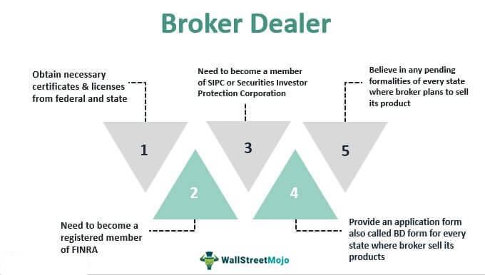

## Table of Contents

## What is a dealer in the context of trading?

A dealer in the context of trading is someone who buys and sells things like stocks, bonds, or other financial products. They work for big companies called financial institutions. Their main job is to help people trade these financial products by making sure there is always someone to buy or sell from. This helps keep the market running smoothly.

Dealers make money by charging a small fee, called a spread, which is the difference between the price they buy at and the price they sell at. For example, if a dealer buys a stock for $10 and sells it for $10.05, the $0.05 is their profit. They need to be good at understanding the market and making quick decisions to be successful.

## How does a dealer differ from a broker?

A dealer and a broker both work in the trading world, but they have different jobs. A dealer is someone who buys and sells financial products like stocks or bonds directly. They work for big companies and make money by charging a small fee, called a spread, on the difference between the buying and selling prices. Dealers are important because they help keep the market running smoothly by always being ready to buy or sell.

On the other hand, a broker acts as a middleman. They don't buy or sell things themselves. Instead, they help people find dealers or other people to trade with. Brokers make money by charging a fee or commission for each trade they help with. So, while dealers are directly involved in the buying and selling, brokers are more like helpers who connect people in the market.

## What are the primary functions of dealers in the trading market?

Dealers play a crucial role in the trading market by providing [liquidity](/wiki/liquidity-risk-premium). This means they always have stocks, bonds, or other financial products ready to buy or sell. When someone wants to trade, dealers are there to make sure the trade can happen quickly and easily. This helps keep the market running smoothly because there is always someone to trade with, no matter if the market is going up or down.

Another important function of dealers is to set prices. They do this by deciding how much they will buy or sell a financial product for. The difference between these prices, called the spread, is how dealers make their money. By setting these prices, dealers help create a clear and organized market where everyone knows what things are worth. This makes trading easier and more predictable for everyone involved.

## Can dealers also act as brokers, and if so, how?

Yes, dealers can also act as brokers. This means they can help people find others to trade with, just like a regular broker. They do this by using their knowledge of the market and their connections to match buyers and sellers. When acting as a broker, dealers don't buy or sell the financial products themselves. Instead, they help their clients make trades and earn money by charging a fee or commission for each trade they help with.

However, when dealers act as brokers, they need to be careful to keep these two roles separate. They must make sure they are clear about whether they are acting as a dealer, buying and selling directly, or as a broker, helping others to trade. This is important because the rules and responsibilities for dealers and brokers can be different. By keeping these roles clear, dealers can provide the best service to their clients while following the rules of the market.

## What are the regulatory differences between dealers and brokers?

Dealers and brokers have different rules they need to follow because they do different jobs in the trading world. Dealers buy and sell financial products themselves, so they need to follow strict rules about how they handle their own money and how much risk they can take. They also have to be careful about how they set prices and make sure they don't do anything that could trick people into trading with them. For example, in the United States, dealers need to register with the Securities and Exchange Commission (SEC) and follow rules about how they trade and report their activities.

Brokers, on the other hand, help people find others to trade with but don't buy or sell things themselves. Because of this, their rules focus more on making sure they treat their clients fairly and give them good advice. Brokers need to make sure they don't mix their own money with their clients' money and that they always act in the best interest of their clients. In the U.S., brokers also need to register with the Financial Industry Regulatory Authority (FINRA) and follow rules about how they handle client orders and give investment advice.

Even though dealers can sometimes act as brokers, they need to keep these roles separate and follow the right rules for each job. This helps make sure the market stays fair and everyone knows what to expect from dealers and brokers.

## How do dealers make money in trading?

Dealers make money in trading by buying and selling financial products like stocks or bonds. They buy these products at one price and then sell them at a higher price. The difference between the price they buy at and the price they sell at is called the spread. This spread is how dealers earn their profit. For example, if a dealer buys a stock for $10 and sells it for $10.05, the $0.05 is their profit from that trade.

Besides the spread, dealers can also make money by acting as brokers. When they act as brokers, they help other people find someone to trade with. They charge a fee or commission for each trade they help with. This fee is usually a small percentage of the total trade value. So, dealers can earn money in two ways: by buying and selling themselves and by helping others to trade.

## What are the advantages of using a dealer compared to a broker for trading?

Using a dealer for trading can be faster and easier than using a broker. Dealers buy and sell financial products themselves, so when you want to trade, you can do it right away with them. This means you don't have to wait for a dealer to find someone else to trade with, like you might with a broker. This speed can be really helpful if you need to make a trade quickly because of changes in the market.

Another advantage of using a dealer is that they help keep the market stable. Because dealers always have financial products ready to buy or sell, they make sure there's always someone to trade with. This is called providing liquidity. When the market is stable, it's easier for everyone to trade without big price swings. This can make trading feel safer and more predictable for you.

## What are the potential risks or disadvantages of trading through dealers?

Trading through dealers can sometimes be more expensive than using a broker. Dealers make money by charging a spread, which is the difference between the price they buy at and the price they sell at. This spread can be higher than the fees a broker might charge, so you might end up paying more for each trade. If you trade a lot, these extra costs can add up and make a big difference in your overall profits.

Another risk of trading through dealers is that they might not always give you the best price. Because dealers set the prices themselves, they might offer you a price that's not as good as what you could get from another trader. This can happen if there's not a lot of competition or if the market is moving quickly. It's important to check the prices from different dealers to make sure you're getting a fair deal.

## How do dealers impact market liquidity and price discovery?

Dealers help keep the market liquid by always being ready to buy or sell financial products like stocks or bonds. This means that if you want to trade, you can do it quickly because dealers are there to help. They have a lot of these products ready, so the market stays smooth and easy to use. When dealers are around, it's easier for everyone to trade because there's always someone to trade with, no matter if the market is going up or down.

Dealers also help with price discovery. This means they help figure out how much things are worth. They do this by setting the prices they will buy or sell at. The difference between these prices, called the spread, is how dealers make their money. By setting these prices, dealers give everyone in the market a good idea of what things are worth. This makes trading easier because everyone knows what prices to expect.

## What advanced trading strategies can dealers employ that brokers cannot?

Dealers can use a strategy called [market making](/wiki/market-making) to make money. Market making means they always have stocks or bonds ready to buy or sell. This helps keep the market running smoothly because there's always someone to trade with. Dealers can adjust their buying and selling prices quickly based on what's happening in the market. This is something brokers can't do because they don't buy or sell things themselves. By changing their prices, dealers can make more money when the market is moving a lot.

Another strategy dealers can use is called proprietary trading. This means they use their own money to buy and sell financial products, hoping to make a profit. Dealers can take advantage of short-term price changes in the market to make money. Brokers can't do this because they are supposed to help their clients trade, not trade for themselves. Proprietary trading can be risky, but it can also be very profitable if dealers make good decisions.

## How do technological advancements affect the operations of dealers versus brokers?

Technological advancements have made a big difference in how dealers work. Dealers use computers and special software to keep track of prices and make trades quickly. This helps them set prices that are fair and make sure they can buy or sell things fast when the market changes. With new technology, dealers can handle more trades at the same time and make more money. They can also use tools like algorithms to help them decide when to buy or sell, which can make their job easier and more accurate.

For brokers, technology has changed things too, but in different ways. Brokers use technology to connect with more people and find better deals for their clients. They use apps and websites to help their clients trade from anywhere. This makes it easier for brokers to help more people and do their job from any place. But, unlike dealers, brokers don't use technology to buy or sell things themselves. Instead, they use it to help their clients make better trades and get good advice.

## What are the future trends for dealers and brokers in the trading industry?

In the future, dealers will probably use more and more technology to do their jobs. They might use things like [artificial intelligence](/wiki/ai-artificial-intelligence) and [machine learning](/wiki/machine-learning) to help them set prices and make trades. This could make their job faster and more accurate. Dealers might also start using new kinds of financial products, like cryptocurrencies, to buy and sell. This could help them reach more people and make more money. But, they will need to be careful because these new products can be risky.

Brokers will also see changes because of technology. They might use new apps and websites to help their clients trade from anywhere. This could make it easier for brokers to help more people and do their job from any place. Brokers might also start giving advice on new kinds of investments, like sustainable or green investments. This could help their clients make money and do good for the world at the same time. But, brokers will need to keep learning about new rules and technologies to stay good at their job.

## References & Further Reading

[1]: "Handbook of Financial Markets: Dynamics and Evolution" by Thorsten Hens, Klaus Reiner Schenk-Hoppe

[2]: "Algorithmic Trading: Winning Strategies and Their Rationale" by Ernest P. Chan

[3]: "Market Liquidity: Theory, Evidence, and Policy" by Thierry Foucault, Marco Pagano, Ailsa Roell

[4]: "Trading and Exchanges: Market Microstructure for Practitioners" by Larry Harris

[5]: US Securities and Exchange Commission (SEC) [website](https://www.sec.gov/) 

[6]: Financial Conduct Authority (FCA) [website](https://www.fca.org.uk/)

[7]: "The Economics of High-Frequency Trading" by Albert J. Menkveld, Annual Review of Financial Economics

[8]: "Algorithmic and High-Frequency Trading" by Álvaro Cartea, Sebastian Jaimungal, and José Penalva