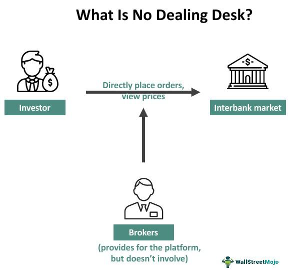

Forex trading, or foreign exchange trading, is a market characterized by its high liquidity and the continuous operation across global time zones. As it evolves, the integration of advanced technologies and sophisticated trading strategies has profoundly transformed how traders engage with the market. Among these advancements, dealing desk brokers and algorithmic trading stand out as pivotal concepts, each playing a significant role in shaping the trading landscape.

Dealing desk brokers, often known as market makers, facilitate transactions by setting their own bid and ask prices and acting as the counterparty to trades. They provide liquidity to the market, ensuring that trades can be executed even if no direct buyer or seller is present. This capability is essential for maintaining a fluid market, reducing slippage, and offering traders stable spreads. However, this setup also introduces potential conflicts of interest, as these brokers may profit from the spread or trade against their clients.



On the other hand, algorithmic trading utilizes predetermined criteria and automated processes to execute trades, leading to an increase in speed and efficiency. It enables traders to take advantage of market movements rapidly and consistently, without the limitations of human biases or fatigue. By leveraging complex mathematical models and historical data, algorithmic trading systems can analyze market conditions and execute trades with precision at a scale unattainable through manual trading methods.

The intersection of dealing desk operations with algorithmic trading provides a fertile ground for innovation in forex trading. By understanding the operational dynamics of dealing desks and the transformative impact of algorithmic trading, traders can harness these tools to make informed decisions and achieve improved outcomes. Whether a trader prefers the human element of dealing desks or the precision of algorithmic strategies, familiarity with these topics is crucial for navigating the complexities of modern forex markets.

## Table of Contents

## What is a Dealing Desk in Forex Trading?

A dealing desk is a financial entity within a brokerage firm that facilitates transactions in the forex market by acting as an intermediary between traders and the interbank market. Dealing desks are primarily operated by market makers, which are brokers that provide liquidity by taking the opposite side of a client’s trade.

The primary function of a dealing desk is to manage and execute orders. This setup allows market makers to set their own bid and ask prices, distinct from the rates clients see on the open market. The difference between these prices, known as the spread, is where the broker typically makes a profit. By filling client orders internally, dealing desks can offer fixed spreads, which can be advantageous for traders seeking predictable trading costs.

Market makers with dealing desks essentially create a market within the brokerage, allowing them to offer [liquidity](/wiki/liquidity-risk-premium) irrespective of external market conditions. However, this also means that the broker can potentially trade against the client, as they may take the opposite position to that of the trader. This attribute can lead to potential conflicts of interest but ensures that transactions are always met with sufficient liquidity.

Contrastingly, non-dealing desk models such as Electronic Communication Networks (ECN) and Straight Through Processing (STP) operate differently. These models connect clients directly to the interbank market, or other liquidity providers, without the intervention of a dealing desk. In an ECN model, for instance, brokers organize trades between third parties while charging a commission for this service. They do not take a position against the client, often resulting in variable spreads that fluctuate with market conditions. Similarly, STP brokers route client orders directly to their liquidity providers, removing any intermediary roles that might exist with dealing desks, thereby offering greater transparency.

In summary, dealing desks are critical components of [market making](/wiki/market-making) in [forex](/wiki/forex-system) trading, providing liquidity and order execution, but with inherent differences and potential conflicts not present in non-dealing desk models like ECN and STP. Understanding these distinctions is vital for traders when choosing a brokerage model that aligns with their trading strategies and risk management preferences.

## How Dealing Desks Operate

Dealing desks in forex trading function by establishing their own bid and ask prices, thereby profiting from the spread—the difference between these prices. This model allows the broker to act as a counterparty to traders' transactions. When a trader initiates a buy or sell order, the dealing desk broker may either match the order internally, using their inventory of assets, or decide to place the order in the broader market to hedge their risk.

By setting their own prices, dealing desk brokers can offer fixed spreads, which provide traders with the advantage of knowing the cost of each trade upfront regardless of market conditions. This can be particularly beneficial during times of high [volatility](/wiki/volatility-trading-strategies), where spreads with non-dealing desk brokers may widen significantly.

However, this model also presents distinct disadvantages. The main concern is the lack of transparency. Since the broker is essentially taking the opposite side of the client's trade, there can be conflicts of interest. The broker may be incentivized to trade against the client, potentially leading to a price manipulation where the execution price is less favorable to the trader compared to the market price.

Moreover, dealing desks have the flexibility to manage their internal order [books](/wiki/algo-trading-books) in a manner that maximizes their own profitability. If a broker can efficiently match buy and sell orders internally, they can avoid the costs associated with passing trades onto external markets. However, this can lead to questions about the fair pricing of trades, as the internal [order book](/wiki/order-book-trading-strategies) operations are not visible to traders.

In summary, while dealing desks offer fixed pricing and the potential for stable trading costs, the model inherently carries a risk of reduced transparency and potential conflicts of interest, which must be carefully considered by traders when selecting a brokerage service.

## Algorithmic Trading in Forex

Algorithmic trading, commonly referred to as algo trading, encompasses the use of computer algorithms to execute trades in financial markets, including forex, based on established criteria. These algorithms are designed to monitor market conditions and execute trades at optimal times, thereby removing human emotion and error from the trading process.

The history of [algorithmic trading](/wiki/algorithmic-trading) dates back to the late 20th century when technological advancements allowed for the automation of order execution. Initially adopted by institutional traders for its efficiency and speed, algo trading has since proliferated across retail trading as computing power became more accessible. The integration of technology has considerably transformed the forex market, where the sheer [volume](/wiki/volume-trading-strategy) and speed of transactions demand rapid and precise decision-making.

**Mechanics of Algorithmic Trading**

At its core, algorithmic trading involves creating rules that dictate the conditions for initiating trades. These algorithms continuously analyze market data to identify opportunities without the need for manual intervention. A simplified version of such an algorithm might be:

```python
def execute_trade(market_data, buy_threshold, sell_threshold):
    current_price = market_data['current_price']

    if current_price < buy_threshold:
        return 'Buy'
    elif current_price > sell_threshold:
        return 'Sell'
    return 'Hold'
```

**Types of Strategy**

Several strategies are employed in algorithmic forex trading, including but not limited to:

1. **Trend Following Strategies**: These rely on technical indicators to identify market trends and aim to capitalize on sustained movements in currency prices.
2. **Arbitrage**: Exploits price differentials of the same currency pairs across different markets or platforms.
3. **Market Making**: Involves placing both buy and sell orders to profit from the bid-ask spread.
4. **Scalping**: Focuses on making numerous small profits on small price changes throughout the trading day.

**Benefits and Challenges**

One of the significant advantages of algo trading is its ability to process vast amounts of data and execute trades far quicker than a human trader could. This speed allows traders to capitalize on fleeting opportunities that arise in the forex markets. Algorithms also minimize the influence of psychological factors, ensuring consistency in trade execution.

Despite these advantages, algo trading is not without its challenges. Market conditions can change quickly, and algorithms based on historical data may struggle to adapt to new market climates. This can lead to unexpected losses if not closely monitored and adjusted. Furthermore, the reliance on technology introduces the potential for technical failures, such as network outages or software bugs, which can have significant financial repercussions. 

In conclusion, algorithmic trading represents a significant evolution in forex trading, offering high efficiency and the potential for increased profitability. However, it necessitates a deep understanding of both the market and the technology involved to manage the inherent risks and reap its full benefits.

## Integrating Algo Trading with Dealing Desks

Integrating algorithmic trading with dealing desks presents a strategic advancement in the forex market. By merging the precision and speed of algorithmic systems with the liquidity provisioning of dealing desks, trading operations can achieve superior execution speeds and potentially heightened profitability. This synthesis allows brokers to automate order executions while ensuring adequate market liquidity, thus optimizing trade management.

Algorithmic trading systems utilize complex algorithms to make trading decisions based on predefined criteria such as price, timing, and volume. These systems can analyze vast datasets at astonishing speeds to identify trading opportunities, minimizing human error and emotional bias. By applying these algorithms within a dealing desk environment, brokers can effectively manage order flows and mitigate risks associated with market volatility.

A notable example of successful integration is the application of statistical [arbitrage](/wiki/arbitrage) algorithms by dealing desk brokers. These algorithms are designed to exploit price discrepancies between correlated currency pairs or across different trading platforms. By executing high-frequency trades that capitalize on minimal price differences, brokers can enhance profitability while providing liquidity to forex markets.

Moreover, integrating [machine learning](/wiki/machine-learning) algorithms extends the capabilities of dealing desks by enabling adaptive trading strategies. These algorithms can learn from historical data, refining decision-making processes over time. This adaptability is particularly beneficial in dynamic market conditions, where traditional strategies may fall short.

Case studies illustrate the positive outcomes of algorithmic integration. For instance, a prominent international broker implemented algorithmic systems within their dealing desk operations, resulting in a 30% increase in trade execution speed and a significant reduction in slippage costs. This initiative not only improved client satisfaction but also enhanced the broker's competitive edge in the market.

Overall, the integration of algorithmic trading with dealing desks signifies a forward-thinking approach that harmonizes technology with traditional brokerage functions. By leveraging the strengths of both domains, brokers can deliver faster and more efficient trading services, ultimately benefiting both the market and the traders they serve.

## Pros and Cons of Dealing Desks and Algo Trading

In forex trading, choosing between dealing desks and algorithmic trading involves weighing their unique advantages and drawbacks. Each model offers distinct mechanisms that can significantly influence trading outcomes, and understanding these differences is key for traders aiming to align their strategies with their ultimate goals.

Dealing desks, often associated with market-making brokers, provide the benefit of fixed spreads, which ensures that traders face consistent transaction costs regardless of market volatility. This can provide a sense of stability and predictability, which is particularly advantageous in turbulent market conditions. Furthermore, dealing desks often ensure liquidity by taking the opposite position to a trader's order, which can result in quick execution times.

However, one major downside of dealing desks is the potential lack of transparency. Since the broker has the ability to set their own bid and ask prices, there may be a conflict of interest as the broker profits from the spread. Traders might face issues of slippage, where the execution price deviates from the intended trading price, particularly during periods of high market volatility. Additionally, since dealing desks can operate on a conflict of interest, traders may feel disadvantaged if they believe their broker is trading against them.

Algorithmic trading, or algo trading, offers a different set of advantages by leveraging computational power to execute trades with speed and precision. Algos can swiftly analyze large datasets, identify trading opportunities, and execute orders across multiple platforms faster than any human trader. This capability is beneficial, as it allows traders to capitalize on minute market inefficiencies and adhere strictly to a trading strategy without the interference of emotional bias.

Nevertheless, algorithmic trading is not without its pitfalls. The dependency on technology introduces the risk of technical failures or glitches, which might lead to significant trading losses if the system fails to execute orders as intended. Additionally, the complexity of developing and maintaining trading algorithms can be a barrier for many traders without advanced technical skills. Finally, despite the automation aspect, market conditions can shift rapidly, rendering a previously successful algorithm ineffective if not continually updated and optimized.

In conclusion, the choice between dealing desks and algorithmic trading depends on individual trading preferences and goals. While dealing desks offer stability and liquidity, their operations might lack transparency. Meanwhile, algorithmic trading provides speed and precision but requires a robust technological infrastructure and a vigilant approach to software management. Traders are encouraged to assess these factors in conjunction with their trading strategy to determine the most suitable option for their needs.

## Choosing the Right Broker for Your Needs

Selecting the right forex broker is vital to aligning with your trading goals, as it directly affects your trading experience and potential success. One primary consideration in this selection process is choosing between a dealing desk broker and a non-dealing desk broker. 

**Dealing Desk vs. Non-Dealing Desk Brokers**

Dealing desk brokers, also known as market makers, create a marketplace for clients by taking the opposite position of their trades. This structure provides traders with fixed spreads and stable pricing, which can be advantageous during volatile market conditions. However, the potential conflict of interest might arise as the broker profits from client losses and might not always provide the best market prices.

In contrast, non-dealing desk brokers, including Electronic Communication Network (ECN) and Straight Through Processing (STP) models, pass orders directly to the interbank market or liquidity providers. As intermediaries, they typically offer variable spreads that reflect real market conditions. This model often enhances transparency and reduces conflicts of interest, as these brokers profit from trading volume rather than client losses. However, variable spreads can be less predictable, particularly during high volatility.

**Evaluating Algo Trading Capabilities**

When assessing a broker's algorithmic trading capabilities, consider the following factors:

1. **Technological Infrastructure**: A broker with robust technological infrastructure can provide a reliable and fast platform for algo trading, essential for executing trades efficiently and effectively.

2. **API Access**: Check if the broker offers API (Application Programming Interface) access, which is crucial for integrating and customizing your trading algorithms.

3. **Platform Compatibility**: Ensure that the broker’s trading platform supports your preferred algorithmic trading software or programming languages, such as Python, which is commonly used in algo development due to its versatility and extensive libraries.

4. **Latency and Execution Speed**: Algorithmic trading thrives on low latency and high execution speed. Evaluate the broker's ability to provide these attributes, as they can dramatically influence trading outcomes.

5. **Customization and Support**: The ability to tailor algorithms to specific strategies and the availability of customer support for technical issues are significant factors in choosing a broker suited for algorithmic trading.

By weighing these factors and assessing how they align with your trading strategies and preferences, you can make a well-informed decision, selecting a broker that enhances your trading efficiency and aligns with your financial objectives.

## Conclusion

Mastering the operations of dealing desks and the judicious use of algorithmic trading is crucial in enhancing one's experience in forex trading. Understanding the strategic role of dealing desks enables traders to appreciate how market liquidity and pricing are managed, addressing potential concerns regarding transparency and costs. By acknowledging these mechanics, traders can align their strategies with market realities, fostering more informed decision-making.

Algorithmic trading, on the other hand, has introduced unprecedented speed and efficiency to the trading landscape. By leveraging complex algorithms to process vast amounts of data, traders can execute orders swiftly, encapsulating a systematic approach that mitigates emotional biases. As technology continues to evolve, the integration of sophisticated algorithms can offer a competitive edge, facilitating strategies that adapt to market fluctuations in real-time.

Traders are encouraged to invest time in continuous education to keep pace with these advancements. Whether through professional courses, webinars, or workshops, ongoing learning equips traders with knowledge to effectively navigate the evolving market dynamics. By mastering these tools, traders can optimize their strategies, potentially improving trading outcomes.

The merger of technology with traditional trading approaches is reshaping future possibilities in the forex market. As both dealing desks and algorithmic trading systems evolve, their convergence is likely to offer innovative trading models and opportunities. This evolution empowers traders, providing them with an expanded toolkit to harness market opportunities more efficiently.

Successful forex trading increasingly demands a proactive approach to leveraging technology alongside deepening market understanding. As the forex landscape transforms, these dual aspects serve as essential components for traders aiming to excel in a competitive environment.

## Further Resources

For those interested in expanding their knowledge further, several valuable resources can help deepen your understanding of dealing desks, algorithmic trading, and the complexities of the forex market:

1. **Books:**
   - *"Forex Trading: The Basics Explained in Simple Terms"* by Jim Brown provides a solid foundation for novice traders.
   - *"Algorithmic Trading: Winning Strategies and Their Rationale"* by Ernie Chan offers insights into developing and implementing algorithmic trading strategies.

2. **Online Courses:**
   - Coursera offers courses such as *"Financial Markets"* by Yale University, which covers the fundamentals of market operations.
   - The *Algorithmic Trading and Finance Models with Python, R, and Stata Essential Training* available on platforms like LinkedIn Learning teaches practical skills in programming and strategy development.

3. **Websites and Forums:**
   - *BabyPips* is a well-known educational site dedicated to forex trading, offering a comprehensive 'School of Pipsology'.
   - The *Forex Factory* forum provides a platform for traders to discuss strategies, news, and market trends.

4. **Research Papers and Articles:**
   - The Journal of Trading often publishes research articles on innovative trading strategies and market analysis.
   - Articles on platforms like *Investopedia* offer detailed explanations on both dealing desks and algorithmic trading mechanisms.

5. **Software and Tools:**
   - Use *MetaTrader 4* or *MetaTrader 5* for simulating trading strategies and backtesting.
   - *QuantConnect* and *Quantopian* (now part of Interactive Brokers) offer tools for implementing and testing algorithmic trading models in Python.

6. **Podcasts and Webinars:**
   - *Chat With Traders* is a podcast series that interviews seasoned traders and offers insights into trading psychology and strategies.
   - Many brokerage firms offer free webinars that provide updates on market trends and insights into advanced trading techniques.

These resources encompass a range of educational formats, catering to different learning styles, and can significantly aid in developing a comprehensive understanding of the forex market.

## References & Further Reading

[1]: Bergstra, J., Bardenet, R., Bengio, Y., & Kégl, B. (2011). ["Algorithms for Hyper-Parameter Optimization."](https://dl.acm.org/doi/10.5555/2986459.2986743) Advances in Neural Information Processing Systems 24.

[2]: ["Advances in Financial Machine Learning"](https://www.amazon.com/Advances-Financial-Machine-Learning-Marcos/dp/1119482089) by Marcos Lopez de Prado

[3]: ["Evidence-Based Technical Analysis: Applying the Scientific Method and Statistical Inference to Trading Signals"](https://www.amazon.com/Evidence-Based-Technical-Analysis-Scientific-Statistical/dp/0470008741) by David Aronson

[4]: ["Machine Learning for Algorithmic Trading"](https://github.com/stefan-jansen/machine-learning-for-trading) by Stefan Jansen

[5]: ["Quantitative Trading: How to Build Your Own Algorithmic Trading Business"](https://www.amazon.com/Quantitative-Trading-Build-Algorithmic-Business/dp/1119800064) by Ernest P. Chan