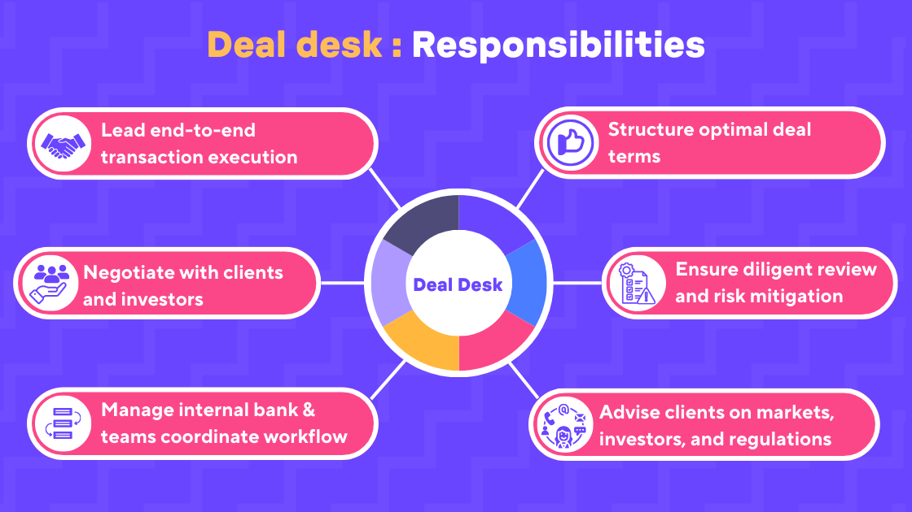

## Table of Contents

## What is a dealing desk?

A dealing desk is a place where people buy and sell things like stocks, currencies, or other financial products. It's usually part of a bank or a big financial company. People who work at the dealing desk are called dealers or traders. They use phones and computers to talk to other buyers and sellers around the world. Their job is to make sure that trades happen quickly and at the right price.

The dealing desk is important because it helps keep the market running smoothly. When someone wants to buy or sell something, the dealers at the desk help find someone on the other side of the trade. This means they connect buyers with sellers. Sometimes, the dealing desk might even buy or sell things themselves to keep the market balanced. This helps make sure that there's always someone to trade with, which is good for everyone in the market.

## How does a dealing desk function in financial markets?

A dealing desk in financial markets acts like a middleman that helps people buy and sell things like stocks, currencies, and other financial products. It's usually part of a big bank or financial company. When someone wants to trade, they contact the dealing desk. The people working there, called dealers or traders, use phones and computers to find someone else who wants to make the opposite trade. For example, if someone wants to sell dollars for euros, the dealing desk finds someone who wants to buy dollars with euros.

The dealing desk is important because it keeps the market running smoothly. If there aren't enough buyers or sellers, the dealers might step in and trade themselves to balance things out. This helps make sure that trades can happen quickly and at fair prices. By connecting buyers and sellers and sometimes trading themselves, the dealing desk helps keep the market active and stable, which is good for everyone involved in trading.

## What is the difference between a dealing desk and a no-dealing desk?

A dealing desk and a no-dealing desk are two different ways that companies handle trades in financial markets. A dealing desk acts as a middleman. When you want to buy or sell something like stocks or currencies, you go through the dealing desk. The people there, called dealers, find someone who wants to make the opposite trade. They might even trade themselves to keep the market balanced. This means they can influence the price and the speed of your trade.

On the other hand, a no-dealing desk, also called an electronic communication network (ECN), works differently. With a no-dealing desk, your trade goes straight to the market without any middleman. The computer system matches your trade with someone else's automatically. This usually means faster trades and prices that are more in line with the market. No-dealing desks are often used by companies that want to offer their customers the best possible prices without any interference.

## Who typically uses a dealing desk?

A dealing desk is usually used by big banks and financial companies. These places have lots of money and need to trade things like stocks, currencies, and bonds all the time. The people who work at these companies, like traders and dealers, use the dealing desk to make sure their trades happen quickly and at good prices. They also use it to keep the market running smoothly by stepping in to buy or sell when there aren't enough other people trading.

Sometimes, big companies that aren't in the financial business also use dealing desks. These companies might need to trade currencies to do business in different countries or to protect themselves from changes in currency values. By using a dealing desk, they can get help from experts who know how to make the best trades. This can save them time and help them make better financial decisions.

## What are the main advantages of using a dealing desk?

Using a dealing desk has some big advantages. One main advantage is that it helps make sure your trades happen quickly. When you want to buy or sell something, the people at the dealing desk can find someone to trade with you right away. This means you don't have to wait around for your trade to go through. Another advantage is that the dealing desk can help you get a good price. The dealers are experts and they know how to find the best deals for you. They might even step in and trade themselves to make sure you get a fair price.

Another big plus is that the dealing desk keeps the market running smoothly. Sometimes, there aren't enough buyers or sellers, which can make it hard to trade. The dealing desk can fix this by stepping in and trading themselves. This helps keep the market balanced and makes it easier for everyone to trade. This is good for big banks and companies that need to trade a lot. It's also good for regular people who want to trade because it means there's always someone to trade with.

## What are the potential disadvantages of using a dealing desk?

One potential disadvantage of using a dealing desk is that it might not always give you the best price. Since the dealers at the desk can influence the trade, they might set a price that is good for them but not as good for you. This means you could end up paying more or getting less than if you went straight to the market. Another issue is that dealing desks can sometimes slow down your trade. Even though they often make trades happen quickly, there might be times when it takes longer because the dealers have to find someone to trade with you or decide to trade themselves.

Another disadvantage is that using a dealing desk can be more expensive. The bank or financial company that runs the dealing desk might charge you extra fees for their services. These fees can add up and make your trading more costly. Also, because dealing desks act as middlemen, you might feel like you have less control over your trades. You have to trust the dealers to make the right decisions for you, which can be risky if you don't fully understand how they work or if you think they might not always have your best interests at heart.

## How does a dealing desk affect the spread in forex trading?

In [forex](/wiki/forex-system) trading, the spread is the difference between the price at which you can buy a currency and the price at which you can sell it. When you use a dealing desk, the dealers can influence this spread. They might make the spread wider, which means you have to pay more to buy a currency or get less when you sell it. This is because the dealing desk wants to make a profit from the trades they help with. So, using a dealing desk can make your trading more expensive because of the wider spread.

However, dealing desks can also help keep the spread stable. If there aren't enough buyers or sellers, the spread can get very wide. But the dealers at the dealing desk can step in and trade themselves to keep the spread smaller. This makes it easier for you to trade because the cost of buying and selling stays more predictable. So, while dealing desks can make the spread wider to earn more money, they can also help keep it in check when the market is not very active.

## What role does a dealing desk play in order execution?

A dealing desk helps make sure that orders to buy or sell things like stocks or currencies get done quickly and at good prices. When someone wants to trade, they tell the dealing desk what they want. The dealers at the desk then look for someone who wants to make the opposite trade. For example, if someone wants to sell dollars for euros, the dealing desk finds someone who wants to buy dollars with euros. This way, the trade happens fast and the person gets a fair price.

Sometimes, there aren't enough people wanting to trade. That's when the dealing desk can step in and trade themselves. This helps keep the market running smoothly and makes sure there's always someone to trade with. By doing this, the dealing desk helps make sure that orders get executed even when the market is not very active. This is important because it helps everyone who wants to trade, from big banks to regular people, get their orders done without too much trouble.

## Can a dealing desk influence market prices?

A dealing desk can indeed influence market prices. When people want to buy or sell things like stocks or currencies, they go through the dealing desk. The people at the desk, called dealers, can decide the price at which these trades happen. They might make the price a bit higher when someone wants to buy or a bit lower when someone wants to sell. This way, the dealing desk can make a small profit from each trade, and this can affect the overall market price.

Also, dealing desks can step in and trade themselves when there aren't enough buyers or sellers. This helps keep the market balanced and can stop prices from going up or down too fast. By doing this, the dealing desk can make sure that prices stay more stable, but it also means they have some control over where the market prices go. So, while dealing desks help keep the market running smoothly, they can also move prices in ways that might not always be best for everyone trading.

## How do regulations impact the operations of a dealing desk?

Regulations have a big effect on how a dealing desk works. They are rules that banks and financial companies have to follow when they help people buy and sell things like stocks and currencies. These rules are made by governments and special groups to make sure that everyone is treated fairly and that the market works well. For example, regulations might say that dealing desks have to show the prices they use and explain how they make their money. This helps keep things open and honest.

Regulations also tell dealing desks what they can and can't do. They might have to follow strict rules about how much they can trade themselves or how they can set prices. If they break these rules, they could get in big trouble, like paying fines or even being shut down. So, dealing desks have to be very careful to follow all the regulations. This can make their work more complicated, but it's important for keeping the market safe and fair for everyone.

## What advanced technologies are used in modern dealing desks?

Modern dealing desks use a lot of advanced technology to help them do their job better. One big technology they use is called [algorithmic trading](/wiki/algorithmic-trading). This means they use computers to make trades very quickly, following special rules that the dealers set up. These rules can look at lots of information, like prices and news, to decide when to buy or sell. Another important technology is electronic trading platforms. These platforms let dealers connect to lots of different markets all over the world. This makes it easier for them to find someone to trade with, no matter where they are.

Also, dealing desks use something called high-frequency trading. This is when computers make lots and lots of trades in just a few seconds. It helps the dealing desk make small profits on each trade, and it can help keep the market moving smoothly. Another technology they use is data analytics. This means they use computers to look at lots of information and find patterns that can help them make better trading decisions. All these technologies help dealing desks work faster and smarter, making sure trades happen quickly and at good prices.

## How can one evaluate the performance of a dealing desk?

To evaluate the performance of a dealing desk, you need to look at a few key things. One important thing is how quickly they can make trades happen. If the dealing desk can find someone to trade with you fast, that's a good sign. Another thing to check is the prices they give you. If the dealing desk helps you get good prices, it means they're doing a good job. You can also look at how much money the dealing desk makes or loses. If they're making more money than they're losing, that's a good sign that they're doing well.

Another way to evaluate the performance of a dealing desk is by looking at how well they follow the rules. If they always follow the regulations and keep everything open and honest, that's a good sign. You can also see how happy their customers are. If people who use the dealing desk are happy with the service and keep coming back, that means the dealing desk is doing a good job. Overall, a good dealing desk should be fast, fair, and help you get the best prices for your trades.

## References & Further Reading

[1]: Bergstra, J., Bardenet, R., Bengio, Y., & Kégl, B. (2011). ["Algorithms for Hyper-Parameter Optimization."](https://dl.acm.org/doi/10.5555/2986459.2986743) Advances in Neural Information Processing Systems 24.

[2]: ["Advances in Financial Machine Learning"](https://www.amazon.com/Advances-Financial-Machine-Learning-Marcos/dp/1119482089) by Marcos Lopez de Prado

[3]: ["Evidence-Based Technical Analysis: Applying the Scientific Method and Statistical Inference to Trading Signals"](https://www.amazon.com/Evidence-Based-Technical-Analysis-Scientific-Statistical/dp/0470008741) by David Aronson

[4]: ["Machine Learning for Algorithmic Trading"](https://github.com/stefan-jansen/machine-learning-for-trading) by Stefan Jansen

[5]: ["Quantitative Trading: How to Build Your Own Algorithmic Trading Business"](https://www.amazon.com/Quantitative-Trading-Build-Algorithmic-Business/dp/1119800064) by Ernest P. Chan