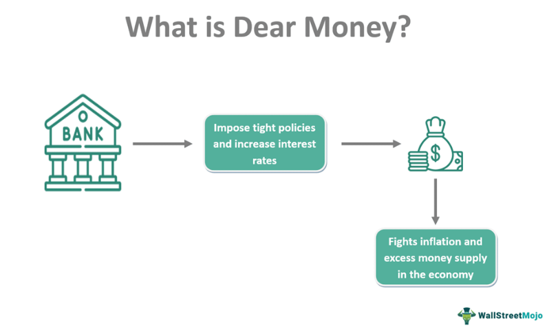

In this article, we explore the interconnected terms 'real interest rate', 'dear money', 'economics', and 'algorithmic trading'. Each of these elements plays a critical role in shaping modern financial markets. The real interest rate is a key indicator of economic health, impacting borrowing costs and investment decisions. It is calculated by adjusting the nominal interest rate for inflation, usually represented in the formula:

$$
\text{Real Interest Rate} = \text{Nominal Interest Rate} - \text{Inflation Rate}
$$



Dear money, characterized by high-interest rates, often signifies tight monetary policies aimed at controlling inflation. In such an environment, borrowing money becomes more expensive, influencing consumer spending and business investments. Economics provides the framework for understanding these market dynamics, guiding both monetary and fiscal policies to stabilize economies and promote growth. Central banks play a crucial role in this through interest rate adjustments and managing the money supply.

Algorithmic trading leverages technology for enhanced precision and speed in trade execution, influenced by economic indicators and interest rates. This involves the use of sophisticated algorithms to automate trading processes, allowing for high-frequency trading and rapid responses to market changes. Algorithmic trading strategies are often influenced by key economic indicators, including interest rates, which affect the value of financial assets and the strategies employed by investors. As technology advances, algorithmic trading continues to adapt to integrate vast amounts of economic data, enabling traders to predict market trends more accurately and make informed decisions.

## Table of Contents

## Understanding Dear Money and Real Interest Rates

Dear money is a financial environment characterized by high-interest rates, which makes borrowing more expensive. This scenario is typically implemented as part of a monetary strategy to curb inflation and prevent an economy from overheating. When inflation rates rise, the purchasing power of money diminishes, prompting central banks to increase interest rates. By doing so, central banks aim to reduce the money supply in the economy, thereby controlling inflation and stabilizing growth.

Real interest rates offer a more accurate measure of the cost of borrowing by adjusting nominal rates to account for inflation. The formula to calculate the real [interest rate](/wiki/interest-rate-trading-strategies) is:

$$
\text{Real Interest Rate} = \text{Nominal Interest Rate} - \text{Inflation Rate}
$$

This calculation is pivotal because it reflects the true cost of borrowing and saving, enabling consumers and businesses to make informed financial decisions. High real interest rates signal expensive borrowing conditions, often leading to reduced consumer spending and lower levels of business investment. This tight financial environment can slow economic growth as corporations defer expansion plans and consumers cut back on spending due to higher loan costs.

Central banks wield dear money policies as tools for achieving economic stability. By manipulating interest rates, they can influence borrowing, spending, and saving behaviors in the economy. During periods of high inflation, increasing interest rates discourages excessive borrowing and spending, helping to moderate economic activity to sustainable levels. Conversely, when inflation is low, central banks may lower interest rates to stimulate borrowing and spending, thereby boosting economic growth.

Overall, dear money and real interest rates are integral components of monetary policy that significantly affect the economic landscape. By understanding and adjusting these elements, central banks strive to maintain a balance between inflation control and healthy economic growth.

## Monetary Policy and Economics

Monetary policy is a critical tool used by central banks to influence economic activity and maintain stability. It primarily operates through the manipulation of interest rates and the money supply, influencing borrowing costs, consumer spending, and overall economic growth.

Central banks, such as the Federal Reserve in the United States or the European Central Bank in the Eurozone, adjust interest rates to achieve macroeconomic targets like inflation control and sustainable economic growth. By lowering interest rates, central banks aim to stimulate economic activity by making borrowing cheaper, thus encouraging investment and spending. Conversely, raising interest rates can help cool down an overheating economy by making borrowing more expensive, thereby reducing consumption and investment—a process often used to combat high inflation.

The execution of monetary policy is heavily reliant on economic indicators. Key indicators include Gross Domestic Product (GDP), unemployment rates, and inflation levels. GDP reflects the total economic output and health of an economy. Central banks monitor GDP growth to decide whether to stimulate or restrain economic activity. High unemployment rates may prompt central banks to implement expansionary policies to spur job creation, while low unemployment might lead to tightening to prevent overheating.

Inflation is a crucial variable in monetary policy. Central banks strive to keep inflation at a target level, often around 2% in developed economies. When inflation is high, purchasing power erodes, and central banks may increase interest rates to reduce spending and bring down prices. Conversely, when inflation is too low, indicating weak demand, interest rates may be lowered to encourage spending and investment.

The dynamic interaction between these economic indicators and central bank interventions can be complex. An example of a common challenge is the trade-off between controlling inflation and encouraging growth. For instance, the Phillips curve posits an inverse relationship between unemployment and inflation, suggesting that policies aimed at reducing unemployment could potentially trigger higher inflation, and vice versa.

In summary, the role of monetary policy in economics is multifaceted, requiring central banks to constantly analyze economic conditions and adjust their strategies to maintain balance and achieve targets of stable growth and controlled inflation.

## Algorithmic Trading and its Economic Implications

Algorithmic trading employs sophisticated algorithms to automate financial trading processes, ensuring trades are executed with heightened speed and accuracy. This computational approach analyzes vast datasets to identify trading opportunities, thereby reducing human intervention and emotional bias. The algorithms scrutinize market data and economic indicators, such as interest rates and employment figures, to craft optimal trading strategies.

Economic indicators play a pivotal role in influencing [algorithmic trading](/wiki/algorithmic-trading) strategies. Changes in interest rates, for instance, directly impact asset prices, offering potential trading signals for algorithms to exploit. When central banks adjust interest rates, they influence the cost of borrowing and returns on savings, affecting consumer spending and corporate investment. Algorithmic traders integrate this information to predict price movements and adjust their strategies accordingly. For instance, a rise in interest rates might prompt algorithms to short stocks in consumer-dependent sectors due to anticipated reduced spending.

Case studies highlight algorithmic trading success stories, showcasing the integration of economic data. Renaissance Technologies, a prominent quantitative [hedge fund](/wiki/hedge-fund-trading-strategies), epitomizes the effective use of algorithmic trading. The firm employs mathematical models that sift through wide-ranging economic data to forecast market trends accurately, delivering consistent returns for decades. Similarly, Two Sigma, another notable hedge fund, employs algorithms that analyze global economic data, enabling it to outperform traditional investment strategies.

In summary, the strategic integration of economic indicators into algorithmic trading not only enhances precision and efficiency but also provides a competitive edge through the rapid assimilation and application of financial data. This dynamic relationship underscores the importance of continuously adapting trading algorithms to evolving economic landscapes, ensuring optimal market engagement.

## Integrating Economics and Algorithmic Trading

In modern financial markets, the integration of economics and algorithmic trading has become increasingly vital for optimizing trading strategies. The synergy between these fields leverages the analytical power of algorithmic trading technologies alongside the foundational principles of economics. This integration enables traders to make more informed and strategic decisions, enhancing their ability to respond to market changes swiftly and effectively.

A key component of this integration is the utilization of big data and [machine learning](/wiki/machine-learning). The vast amount of economic data generated daily includes variables such as inflation rates, gross domestic product (GDP) figures, unemployment rates, and interest rates. Machine learning algorithms analyze these data points to identify patterns and predict market trends. For example, supervised learning models, such as regression analysis or neural networks, can be employed to forecast future asset prices based on historical economic indicators.

Here is an example of using Python to implement a basic linear regression model to predict stock prices based on interest rates:

```python
import numpy as np
from sklearn.model_selection import train_test_split
from sklearn.linear_model import LinearRegression
import matplotlib.pyplot as plt

# Sample data representing interest rates and corresponding stock prices
interest_rates = np.array([1.5, 2.0, 2.5, 3.0, 3.5]).reshape(-1, 1)
stock_prices = np.array([110, 105, 100, 95, 90])

# Split the data into training and testing sets
X_train, X_test, y_train, y_test = train_test_split(interest_rates, stock_prices, test_size=0.2, random_state=42)

# Create and train the linear regression model
model = LinearRegression()
model.fit(X_train, y_train)

# Predict stock prices
predictions = model.predict(X_test)

# Plot the results
plt.scatter(X_test, y_test, color='black', label='Actual')
plt.plot(X_test, predictions, color='blue', linewidth=3, label='Predicted')
plt.xlabel('Interest Rate (%)')
plt.ylabel('Stock Price ($)')
plt.title('Interest Rate vs. Stock Price')
plt.legend()
plt.show()
```

Big data technologies enable the processing and analysis of information from multiple sources in real-time. This capability is crucial for algorithmic trading, where the timely and accurate interpretation of economic data can provide a competitive edge. Machine learning algorithms are not only used for prediction but also for clustering, classification, and anomaly detection—all of which are essential in understanding market behavior.

The integration of interest rate trends into algorithmic models further exemplifies the symbiosis between economics and algorithmic trading. Interest rates are a fundamental economic indicator that influences investment and consumption decisions. By incorporating real-time interest rate data into trading algorithms, traders can better anticipate market movements. For example, a change in interest rate policy by a central bank might trigger a reassessment of asset valuations and prompt algorithm-driven trades to optimize portfolio positions.

Algorithms can be designed to automatically adjust trading strategies based on pre-defined economic signals or thresholds. This adaptability is particularly important in volatile markets where quick decision-making is necessary. Overall, the fusion of economics and algorithmic trading through advanced technologies positions market participants to better navigate the complexities of financial markets and capitalize on emerging opportunities.

## Challenges and Opportunities in Modern Trading

Modern trading, particularly in the context of algorithmic processes, is significantly influenced by regulatory environments. Regulations are designed to maintain market integrity and protect investors, but they can also impose constraints on trading strategies. High-frequency trading ([HFT](/wiki/high-frequency-trading-strategies)), a subset of algorithmic trading characterized by rapid execution speeds, often faces scrutiny from regulatory bodies. These regulations may include requirements for transparency, limitations on order types, and restrictions on certain trading practices like spoofing and layering. Compliance with such regulations is crucial for firms to avoid penalties and maintain their operational license.

Technological advancements, especially in [artificial intelligence](/wiki/ai-artificial-intelligence) (AI) and machine learning (ML), present numerous opportunities to enhance trading precision. These technologies enable traders to analyze large datasets efficiently, uncover patterns, and make predictions about market movements with greater accuracy. For example, ML algorithms can be used to develop predictive models that forecast future stock prices based on historical data and current market conditions. By automating the process of pattern recognition and prediction, trading can be executed with improved timing and reduced error rates.

```python
# Example of using machine learning to predict stock prices
import pandas as pd
from sklearn.model_selection import train_test_split
from sklearn.ensemble import RandomForestRegressor

# Load dataset
data = pd.read_csv('historical_stock_prices.csv')
features = data[['feature1', 'feature2', 'feature3']]
target = data['stock_price']

# Split the data
X_train, X_test, y_train, y_test = train_test_split(features, target, test_size=0.2, random_state=42)

# Train the model
model = RandomForestRegressor(n_estimators=100, random_state=42)
model.fit(X_train, y_train)

# Predict
predictions = model.predict(X_test)
```

However, the integration of advanced technologies into trading introduces several challenges. Technological dependencies are a primary concern, as trading operations become increasingly reliant on sophisticated software and hardware systems, which can be vulnerable to system failures and cyber-attacks. Additionally, the fast-paced development of AI and ML technologies requires constant adaptation and upskilling of personnel to keep up with the latest tools and methodologies.

The demand for robust compliance frameworks is another significant challenge. Trading firms must implement systems to ensure their operations are consistently aligned with regulatory requirements. This includes maintaining detailed records of trades, monitoring for unusual activity, and ensuring adequate risk management procedures are in place. As regulatory landscapes continue to evolve, especially concerning AI and automatic trading strategies, firms are compelled to adapt quickly to new standards and guidelines.

Despite these challenges, the opportunity for innovation in trading strategies through the use of AI and ML remains vast. Firms that successfully navigate the regulatory environment while leveraging cutting-edge technologies can achieve substantial competitive advantages, setting higher benchmarks for performance and efficiency in the financial markets.

## Conclusion

In summary, the relationship between real interest rates and dear money critically influences economic contexts and trading environments. Real interest rates, which account for inflation and represent the true cost of borrowing, are pivotal in determining the ease or costliness of accessing capital. Dear money, typified by high-interest rates, is a strategy often employed to temper inflationary pressures and stabilize economies. These factors underpin economic decision-making, influencing both consumer behavior and business investments.

Economics provides the framework to understand and forecast these elements, shaping effective monetary policies. Central banks modify interest rates to stabilize economic conditions, and these changes ripple through financial markets, affecting trading strategies.

Algorithmic trading, on the other hand, epitomizes the application of advanced technology to finance, enabling rapid and precise trade executions. It factors in economic indicators like inflation rates and monetary policies to optimize strategy and improve trading outcomes. By integrating complex algorithms with current economic data, such trading systems can proactively adapt to market shifts.

As the financial landscape continues to evolve, the ability to interpret economic signals and harness technological resources is crucial for achieving trading success. With advancements in big data analytics and machine learning, market participants are better equipped to forecast trends and identify opportunities. However, it is imperative to continually learn and adapt to maintain a competitive edge. Engaging with new technologies and understanding their implications on markets will be vital strategies in navigating the complexities of modern financial systems.

## References & Further Reading

[1]: Modigliani, Franco & Miller, Merton H. (1958). ["The Cost of Capital, Corporation Finance and the Theory of Investment."](https://www.semanticscholar.org/paper/The-Cost-of-Capital%2C-Corporation-Finance-and-the-of-Miller/81c84afa78c3445b783db0b9dbec3b70f2cb3a19) The American Economic Review, Vol. 48, No. 3, pp. 261-297.

[2]: Taylor, John B. (1993). ["Discretion versus Policy Rules in Practice."](https://web.stanford.edu/~johntayl/Onlinepaperscombinedbyyear/1993/Discretion_versus_Policy_Rules_in_Practice.pdf) Carnegie-Rochester Conference Series on Public Policy, Vol. 39, pp. 195-214.

[3]: Jegadeesh, Narasimhan & Titman, Sheridan (1993). ["Returns to Buying Winners and Selling Losers: Implications for Stock Market Efficiency."](https://www.bauer.uh.edu/rsusmel/phd/jegadeesh-titman93.pdf) The Journal of Finance, Vol. 48, No. 1, pp. 65-91.

[4]: Aldridge, Irene (2013). ["High-Frequency Trading: A Practical Guide to Algorithmic Strategies and Trading Systems."](https://www.amazon.com/High-Frequency-Trading-Practical-Algorithmic-Strategies/dp/1118343506) Wiley Finance.

[5]: Hull, John C. (2017). ["Options, Futures, and Other Derivatives."](https://elibrary.pearson.de/book/99.150005/9781292212920) Pearson Education, 9th Edition.