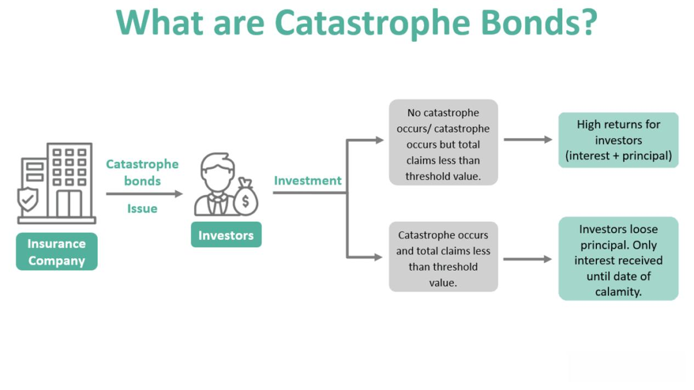

## Table of Contents

## What are death bonds and how do they work?

Death bonds, also known as mortality bonds or life settlement-backed securities, are financial instruments that investors buy to earn money based on how long people live. These bonds are created when insurance policies are sold by people who no longer need them, usually older people. Investors buy these policies in a group and then turn them into bonds. They pay the premiums on the policies and wait for the policyholders to pass away. When someone dies, the investors get the money from the insurance company.

The way death bonds work is that investors hope to make a profit if the people whose policies they own die sooner than expected. If the policyholders live longer, the investors have to keep paying the premiums, which can reduce their profits or even lead to losses. This makes death bonds a bit risky, but they can also be profitable if the investors guess right about how long people will live. It's a way for investors to bet on life expectancy, and it can help people sell their unwanted insurance policies for money they can use right away.

## Who typically invests in death bonds?

Death bonds are usually bought by big investors like hedge funds, pension funds, and some rich people. These investors have a lot of money and can handle the risks that come with death bonds. They are looking for ways to make money that are different from regular investments like stocks or bonds.

These investors are often okay with taking chances because they think they can make a good profit if they guess right about how long people will live. They use special math and data to try to predict this. But, they know it's not easy to predict, so they are ready for the possibility of losing money too.

## How are death bonds structured financially?

Death bonds are made from life insurance policies that older people sell because they don't need them anymore. A company buys a bunch of these policies and puts them together into a big group. Then, they turn this group into bonds that investors can buy. The money from selling the bonds is used to pay the premiums on the life insurance policies. When someone in the group dies, the company gets the money from the insurance and shares it with the investors who bought the bonds.

The financial structure of death bonds is about balancing the money coming in and going out. Investors hope that the people in the group will die sooner than expected, so they can get the insurance money faster and make a profit. But if the people live longer, the investors have to keep paying the premiums, which can eat into their profits or even cause them to lose money. It's a bit like a bet on how long people will live, and the investors use special math to try to guess right and make money.

## What is the role of life insurance policies in death bonds?

Life insurance policies are the key part of death bonds. When older people don't need their life insurance anymore, they can sell it to a company. This company collects a lot of these policies together into a big group. Then, they turn this group into bonds that investors can buy. The money from selling the bonds is used to keep paying the premiums on the life insurance policies.

The investors hope that the people in the group will die sooner than they expect. If that happens, the company gets the money from the insurance when someone dies, and they share it with the investors. But if the people live longer, the investors have to keep paying the premiums, which can make them lose money. So, life insurance policies are what make death bonds work, and they help investors try to make a profit by guessing how long people will live.

## What are the potential returns on investing in death bonds?

The potential returns on investing in death bonds can be pretty good if everything goes as planned. Investors buy these bonds hoping that the people whose life insurance policies are part of the bond will die sooner than expected. If that happens, the investors get the insurance money quickly and can make a nice profit. For example, if they bought the bond for a certain amount and the insurance payout is much bigger, they keep the difference as their return.

But, there's also a risk that the returns might not be as good or could even be negative. If the people live longer than expected, the investors have to keep paying the premiums on the life insurance policies. This can eat into their profits or even cause them to lose money if they have to pay for a long time. So, the returns on death bonds depend a lot on guessing how long people will live, which is not easy to do.

## What are the risks associated with investing in death bonds?

Investing in death bonds comes with some big risks. One main risk is that the people whose life insurance policies are in the bond might live longer than expected. If that happens, investors have to keep paying the premiums on those policies. This can use up a lot of their money and might even make them lose money if they have to pay for a long time. It's hard to guess how long people will live, so this is a big risk.

Another risk is that the market for death bonds might change. If a lot of people start living longer because of better healthcare, it could make death bonds less profitable. Also, if there are new laws or rules about life insurance or investing, it could change how death bonds work and affect the returns. So, investors need to be ready for these kinds of changes and know that the rules of the game might shift.

Lastly, there's also the risk that the company managing the death bonds might not do a good job. If they make bad choices or don't handle the money well, it could hurt the investors. So, it's important for investors to check out the company carefully before they put their money into death bonds. All these risks mean that investing in death bonds can be tricky and not everyone's cup of tea.

## How do death bonds impact the life insurance industry?

Death bonds have a big effect on the life insurance industry. They give people who don't need their life insurance anymore a way to get money right away by selling their policies. This can be good for the insurance companies because it means they don't have to keep track of these policies anymore. But it also means they have to pay out money when the people die, which they might not have expected.

At the same time, death bonds can make the life insurance industry more complicated. When investors buy a lot of policies and turn them into bonds, it can change how the insurance companies plan for the future. They have to think about how many policies might be sold and how that will affect their money. This can make it harder for them to predict things and might lead to changes in how they sell insurance or how much they charge for it.

## What ethical considerations should be taken into account with death bonds?

Death bonds bring up some big ethical questions. One main worry is that they turn people's lives into something investors can bet on. It can feel wrong to make money off of when someone will die. It might make people feel like their lives are just numbers in a business deal, which can be upsetting.

Another ethical issue is how death bonds might affect the people who sell their life insurance policies. These are often older people who might not fully understand what they're getting into. They might need money fast and not think about the long-term effects of selling their policy. It's important to make sure they are treated fairly and know all the facts before they decide.

Lastly, there's the question of how death bonds might change the life insurance industry. If a lot of people start selling their policies, it could make insurance companies change how they work. This might mean higher costs or different rules for everyone buying insurance. It's important to think about how these changes could affect people who just want to protect their families with life insurance.

## How are death bonds regulated and what are the legal implications?

Death bonds are regulated by different rules depending on where you are. In the United States, they are watched by the Securities and Exchange Commission (SEC) because they are seen as securities. The SEC makes sure that the people selling death bonds tell the truth about what they are selling and that they follow the rules. There are also state laws that look after how life insurance policies are sold and turned into death bonds. These laws try to make sure that older people selling their policies are treated fairly and know what they are doing.

The legal implications of death bonds can be tricky. If someone doesn't follow the rules, they could get in big trouble. For example, if a company lies about how the death bonds work or doesn't treat the people selling their policies right, they could be sued or fined. Also, if the laws about life insurance or securities change, it could affect how death bonds work. This means that everyone involved needs to keep up with the rules and make sure they are doing things the right way.

## What are the historical performance trends of death bonds?

Death bonds have been around for a while, and their performance has gone up and down. When they first started, a lot of investors were excited about them because they thought they could make a lot of money. In the early 2000s, some death bond funds did really well, giving investors good returns. But then, people started living longer than expected, and this made it harder for investors to make money. The longer people lived, the more premiums the investors had to pay, which ate into their profits.

Over time, the performance of death bonds has been mixed. Some funds have done okay, making steady but not huge returns. Others have struggled, especially during times when life expectancy kept going up. It's hard to predict how death bonds will do because it depends so much on how long people live. But overall, the historical trend shows that death bonds can be profitable, but they also come with a lot of risk and uncertainty.

## How do death bonds compare to other investment vehicles in terms of risk and return?

Death bonds are different from other investments like stocks, bonds, or real estate because they depend on how long people live. They can be riskier than regular bonds because if people live longer than expected, investors have to keep paying premiums, which can eat into their profits or even cause them to lose money. On the other hand, if people die sooner than expected, investors can make a big profit from the insurance payouts. This makes death bonds a bit like a bet on life expectancy, which adds a lot of uncertainty.

Compared to stocks, death bonds might seem less risky because they are backed by life insurance policies, but they can still be unpredictable. Stocks can go up and down based on the economy and company performance, but with death bonds, it's all about guessing how long people will live. This makes them a unique kind of investment that might attract investors who are okay with taking chances and want to diversify their portfolio. But because of the high risk and the ethical questions they raise, death bonds are not for everyone.

## What future trends might affect the viability and popularity of death bonds?

Future trends in healthcare and life expectancy could really change how death bonds work. If people start living longer because of new medicines or better ways to stay healthy, it might make death bonds less popular. Investors might not want to take the risk of having to pay premiums for a long time without getting their money back. On the other hand, if there are big jumps in technology that help predict how long people will live, it could make death bonds more attractive. Investors might feel more confident about guessing right and making a profit.

Changes in laws and rules about life insurance and investments could also affect death bonds. If new laws make it harder to turn life insurance policies into bonds, or if they add more rules to protect older people selling their policies, it could slow down the death bond market. But if the rules become easier or if more people learn about death bonds and see them as a good way to invest, they might become more popular. It's hard to say exactly what will happen, but these trends will play a big role in whether death bonds keep being a thing or not.

## References & Further Reading

[1]: O'Connell, A. J., & Yadav, P. K. (2002). ["Do Life Insurance Settlements Offer Value to Policyholders?"](https://pubmed.ncbi.nlm.nih.gov/21148579/) Journal of Risk and Insurance.

[2]: Cowley, A., & Cummins, J. D. (2005). ["Securitization of Life Insurance Assets and Liabilities."](https://www.jstor.org/stable/3519948) Journal of Risk and Insurance.

[3]: ["Handbook of Mortality Data: Analysis, Risk, and Models."](http://actuaries.org/afir/colloquia/rome2/cairns_blake_dowd.pdf) by Victor C. M. Leung and Kevin Lai So

[4]: Kumar, S., Sarangi, S., & Pandey, A. C. (2017). ["Algorithmic Trading: A Literature Review."](https://www.nature.com/articles/s41598-024-81754-8) Pacific Asia Conference on Information Systems (PACIS) 2017 Proceedings.

[5]: Bertsimas, D., & Lo, A. W. (1998). ["Optimal Control of Execution Costs."](http://web.mit.edu/dbertsim/www/papers/Finance/Optimal%20control%20of%20execution%20costs.pdf) Journal of Financial Markets.

[6]: ["Advances in Financial Machine Learning"](https://www.amazon.com/Advances-Financial-Machine-Learning-Marcos/dp/1119482089) by Marcos Lopez de Prado

[7]: Meyricke, R., & Sherris, M. (2014). ["The Determinants of Mortality in Life Settlements."](https://www.scirp.org/reference/referencespapers?referenceid=3052898) ASTIN Bulletin: The Journal of the IAA.