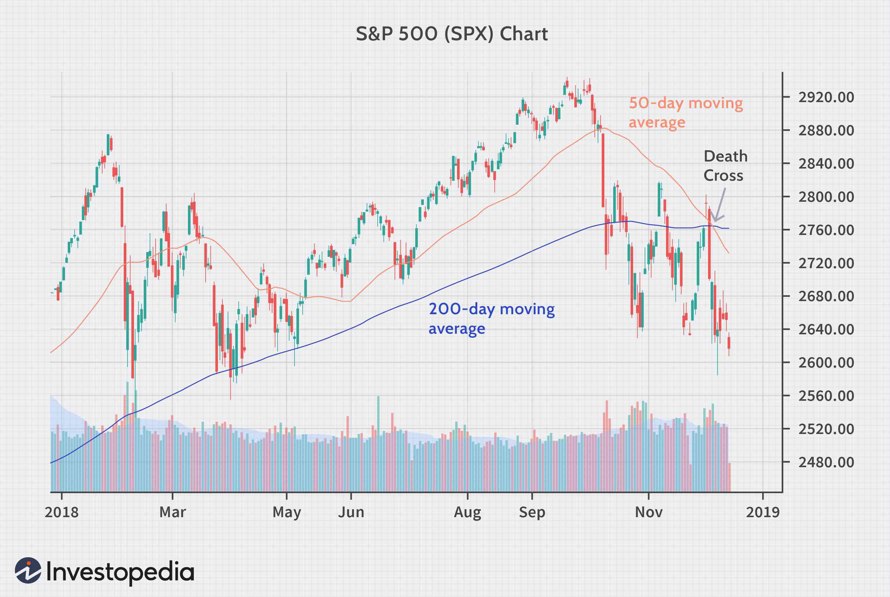

Financial markets embody the complex and dynamic systems through which capital, goods, and services are exchanged, playing a pivotal role in the functioning and stability of global economies. They facilitate the allocation of resources, provide liquidity, and enable investors to earn returns on their investments. A robust understanding of financial markets is crucial for stakeholders, as these markets influence economic growth, dictate monetary policies, and affect everyday financial decisions.

Stock analysis, a core component of financial markets, involves the evaluation of publicly traded companies to ascertain their future price movements and the intrinsic value of their stocks. It serves as a pivotal tool for investors seeking to make informed decisions by understanding a company's financial health, growth potential, and market positioning. This analysis can be categorized into two main types: fundamental analysis, which examines economic indicators, financial statements, and company management, and technical analysis, which leverages statistical trends from past market activity to predict future price movements.



In recent years, algorithmic trading has emerged as a transformative force in financial markets, enabling the automatic execution of trading orders at speeds and frequencies impossible for human traders. By utilizing algorithms, which are sets of rules or instructions coded into computers, traders can conduct numerous transactions efficiently while minimizing the cognitive and emotional biases associated with manual trading. This growth underscores the significance of technological advancements and data science in modern trading practices.

The 'death cross' is a well-known term in technical analysis, representing a bearish signal that occurs when a short-term moving average crosses below a long-term moving average. Typically observed between the 50-day and 200-day moving averages, the death cross is interpreted by analysts as a potential onset of a bear market or a prolonged downturn in stock prices. While not infallible, this indicator contributes to the toolkit of technical analysts aiming to anticipate market trends.

This article aims to explore the intersection of stock analysis, the death cross indicator, and the advancements in algorithmic trading. By understanding how these elements interact, traders and investors can leverage innovative strategies to navigate the complexities of financial markets with more precision and confidence.

## Table of Contents

## Understanding Financial Markets

Financial markets are central to the economic framework, providing a structured environment where financial assets such as stocks, bonds, currencies, and derivatives are created, traded, or settled. These markets enable the transfer of funds from savers to borrowers, optimally allocating resources and promoting investments and economic growth. They consist of several key components: capital markets, money markets, commodity markets, and derivative markets.

Capital markets, which encompass stock and bond markets, facilitate the buying and selling of equity and debt instruments. Stock markets allow investors to purchase shares in publicly traded companies, providing a platform for companies to raise capital. Bond markets involve the issuance of debt securities, allowing corporations, municipalities, and governments to borrow funds. Money markets deal with short-term debt securities with high [liquidity](/wiki/liquidity-risk-premium), such as treasury bills and certificates of deposit, providing quick and secure financing options for governments and financial institutions.

Foremost among financial market types are [forex](/wiki/forex-system) markets, also known as foreign exchange markets, where currencies are traded. This market is crucial for international trade and investments, influencing exchange rates and impacting national economies. Meanwhile, commodity markets deal with raw materials and agricultural products, offering a venue for trading physical goods like oil, gold, and wheat, often as futures contracts.

The participants in these markets are diverse and include individual investors, institutional investors like mutual funds and pension funds, intermediaries such as banks and brokers, regulatory bodies enforcing legal frameworks, and market makers providing liquidity. Each participant plays distinct roles: investors provide capital, intermediaries facilitate transactions, and regulators ensure orderly market conduct.

Financial markets are powerful economic indicators, reflecting trends and influencing macroeconomic policies. For instance, stock market performance is often seen as a barometer of economic confidence and health. Bond yields can affect interest rates, which in turn influence inflation and investment levels. Currency exchange rates can affect a country's trade balance and monetary policy. Consequently, changes within financial markets can herald shifts in economic conditions, influencing policymakers' strategies.

## Stock Analysis: Fundamental vs. Technical

Stock analysis is a critical process for investors aiming to make informed decisions in financial markets. It primarily revolves around two main approaches: [fundamental analysis](/wiki/fundamental-analysis) and technical analysis, each serving unique purposes and employing distinct methodologies.

**Fundamental Analysis**

Fundamental analysis is a method used to evaluate a stock's intrinsic value by examining related economic, financial, and other qualitative and quantitative factors. The primary objective is to assess a stock’s underlying worth based on the health and performance of the company's business. This analysis often includes a review of financial statements, such as the income statement, balance sheet, and cash flow statement. Key metrics include earnings per share (EPS), price-to-earnings (P/E) ratio, return on equity (ROE), and debt-to-equity ratio, among others.

For example, the calculation of EPS is given by:
$$
\text{EPS} = \frac{\text{Net Income} - \text{Dividends on Preferred Stock}}{\text{Average Outstanding Shares}}
$$

Investors apply fundamental analysis to identify undervalued stocks or to determine whether a stock is overvalued. It is widely used for long-term investment decisions, providing insights into the economic fundamentals, competitive advantages, and managerial efficacy of a company.

**Technical Analysis**

Technical analysis, on the other hand, involves studying statistical trends from trading activity, such as price movement and [volume](/wiki/volume-trading-strategy), over time. This approach is centered on the idea that historical trading activity and price changes can indicate future price movements. Rather than evaluating a stock's value, technical analysis focuses on identifying patterns and trends that can forecast future stock price movements.

Key techniques in technical analysis include the use of charts and indicators. Chart patterns such as head and shoulders, double tops and bottoms, and support and resistance levels are widely analyzed. Technical indicators include moving averages, the Relative Strength Index (RSI), and the Moving Average Convergence Divergence (MACD).

A simple moving average is calculated as:
$$
\text{SMA} = \frac{\sum_{i=1}^{N} \text{Price}_i}{N}
$$

where $\text{Price}_i$ is the stock price at day $i$, and $N$ is the number of total periods considered.

**Comparison and Usage**

The decision to use fundamental or technical analysis depends largely on the investor's strategy and objectives. Fundamental analysis is optimal for investors focused on long-term growth, as it assesses the company’s overall health and potential for future success. It is preferred when evaluating the long-term viability of a company.

Conversely, technical analysis is suitable for short-term trading strategies, such as [day trading](/wiki/day-trading-spy) or swing trading, as it allows investors to capitalize on market trends and fluctuations. Traders using this approach aim to exploit short-term price movements.

Many investors choose to integrate both forms of analysis to enhance their decision-making process. This holistic strategy allows for a comprehensive understanding of both the intrinsic value and market trends of a stock, optimizing the timing and nature of investment choices.

## The Death Cross: A Technical Analysis Indicator

The "death cross" is a technical analysis indicator that holds significant historical relevance in financial markets. It occurs when a short-term moving average crosses below a long-term moving average, signaling a potential reversal from a bullish to a bearish trend. Typically, the 50-day moving average is used as the short-term average, and the 200-day moving average is used as the long-term average. The death cross is perceived as a bearish signal, often associated with substantial market corrections.

Mathematically, moving averages are calculated as follows:

$$
\text{Moving Average} = \frac{\sum_{t=n-k+1}^{n} P_t}{k}
$$

Where:
- $P_t$ is the price at time $t$
- $k$ is the number of periods

The death cross gains its significance from the historical trends it has been associated with. Historically, its occurrence has preceded some major market downturns, thus [earning](/wiki/earning-announcement) a reputation as a warning sign for investors. For instance, the death cross appeared before the financial crises in 2008 and also emerged during the market turmoil caused by the COVID-19 pandemic in early 2020.

The interpretation of a death cross as a bearish signal often stems from its reflection of declining market [momentum](/wiki/momentum). The crossover indicates a shift in investor sentiment, suggesting that the market is experiencing a downward trajectory. In this context, the death cross may lead to further selling as traders anticipate prolonged declines.

While the historical occurrences of the death cross can serve as anecdotal evidence for market corrections, it is crucial to understand that it does not guarantee a market decline. Instead, it is one of many tools that traders use to assess potential market directions. Its effectiveness can be enhanced when combined with other technical indicators and broader market analysis to improve the accuracy of predictions regarding stock price movements.

In conclusion, recognizing the significance of the death cross within technical analysis emphasizes the importance of historical patterns and moving average signals in predicting market trends. Despite its limitations, it remains a fundamental indicator for many traders seeking to navigate the complexities of financial markets.

## Algorithmic Trading: The Future of Stock Analysis

Algorithmic trading, often referred to as algo trading, represents a significant shift in the landscape of financial markets. It involves the use of computer algorithms to automate and execute trading decisions at speeds and frequencies that are impossible for human traders alone. The technologies driving this transformation encompass advanced computing power, sophisticated algorithms, and big data analytics. At its core, [algorithmic trading](/wiki/algorithmic-trading) leverages mathematical models and statistical analyses to identify trading opportunities, optimizing the decision-making process in milliseconds or less.

One of the primary advantages of algorithmic trading is its ability to process vast amounts of market data more quickly and accurately than traditional trading methods. This speed not only increases the potential for profit by executing trades at the best possible prices, but it also minimizes human errors that can occur in manual trading. Additionally, algo trading allows for [backtesting](/wiki/backtesting), a process where historical data is used to test and refine trading strategies, thereby improving their effectiveness before real capital is deployed.

Despite its advantages, algorithmic trading is not without challenges and risks. The reliance on complex algorithms means that a programming error or a flawed assumption in the model can lead to substantial financial losses. Events like the 2010 Flash Crash, where the U.S. stock market experienced a sharp decline and recovery within minutes, highlight the potential for systemic risks associated with high-frequency trading practices. Moreover, the need for continuous monitoring and updates to algorithms and strategies can be resource-intensive, requiring significant investment in technology and expertise.

The alignment of algorithmic trading with modern market analysis techniques lies in its ability to integrate diverse data sources and indicators, including technical analysis tools such as the "death cross". By automating the detection of such patterns, algorithms can swiftly adapt to market conditions and execute trades based on pre-defined criteria. This integration facilitates a more responsive and dynamic approach to trading, allowing for the simultaneous monitoring and execution of multiple strategies across different markets.

In conclusion, algorithmic trading embodies the future of stock analysis, marrying precision and speed with the predictive power of modern analytics. As financial markets continue to evolve, the adoption and refinement of algo trading will likely become increasingly critical for maintaining competitive advantage.

## Integrating Death Cross in Algo Trading Strategies

Developing algorithms to detect and respond to the death cross involves programming trading systems to recognize this bearish technical analysis pattern and execute predefined strategies. The death cross, characterized by the 50-day moving average crossing below the 200-day moving average, signals potential market downturns and is therefore pivotal in algorithmic trading setups designed to capitalize on market corrections.

The integration of the death cross into algorithmic trading strategies can potentially enhance decision-making by providing automated responses to market signals. The algorithms track moving averages and automatically execute trades when specific conditions are satisfied, reducing reaction times and minimizing emotional biases typical in human trading.

To illustrate, consider the following simplified Python strategy using the `pandas` and `numpy` libraries for calculating moving averages and detecting the death cross:

```python
import pandas as pd
import numpy as np

# Example stock price data
data = pd.DataFrame({
    'Date': pd.date_range(start='1/1/2020', periods=365),
    'Close': np.random.rand(365) * 100
})

# Calculate moving averages
data['50_MA'] = data['Close'].rolling(window=50).mean()
data['200_MA'] = data['Close'].rolling(window=200).mean()

# Detect death cross
data['Signal'] = np.where(data['50_MA'] < data['200_MA'], 'Sell', np.nan)

# Execute a signal
def execute_trade(signal, price):
    if signal == 'Sell':
        print(f"Executing sell order at price: {price}")

# Apply the strategy
for index, row in data.iterrows():
    if row['Signal'] == 'Sell':
        execute_trade(row['Signal'], row['Close'])
```

The potential impact of integrating the death cross in algorithmic trading is significant. Historical analysis shows that recognizing such trend reversals early can protect portfolios from downturns or leverage bearish market conditions for short-selling opportunities. For example, during significant market corrections in the past, death cross signals have been precursors to prolonged bearish trends, thus supporting their utility within trading algorithms.

Several tools and platforms facilitate the implementation of death cross strategies in algorithmic trading. Popular platforms include MetaTrader, QuantConnect, and TradeStation, each offering robust API support, backtesting capabilities, and integration with market data providers. These platforms empower traders to design customized algorithms incorporating the death cross and backtest them against historical data to refine and optimize trading strategies before deploying them live.

Case studies have demonstrated successful integration, such as adapting strategies during high [volatility](/wiki/volatility-trading-strategies) periods. In such scenarios, traders can adjust moving average parameters or combine the death cross with other indicators like the Relative Strength Index (RSI) to improve accuracy and performance, thereby showcasing the adaptive potential of algorithmic systems when enhanced with traditional technical patterns.

Overall, the inclusion of the death cross in algo trading strategies enables traders to systematically address market dynamics, enhancing both proactive and reactive market engagement through timely, automated trade execution.

## Conclusion

In summary, stock analysis holds a central role in understanding and navigating financial markets. Both fundamental and technical analysis offer insights into stock valuation and market trends, respectively. Among technical indicators, the death cross—a signal derived from the intersection of moving averages—has gained notoriety for its bearish implications, often suggesting potential market downturns. This indicator, along with others, is instrumental in guiding investors and traders through market uncertainties.

Algorithmic trading represents a significant advancement in trading strategies, leveraging data and computational power to execute trades with precision and speed. By integrating technical indicators like the death cross, algorithmic strategies can enhance decision-making and potentially improve market outcomes. The evolution of financial markets continues to be shaped by advancements in technology, prompting a shift towards more sophisticated and algorithmically-driven strategies.

As financial markets evolve, it is crucial for investors and traders to remain informed and adaptable. Embracing modern technologies and analytical methods can provide a competitive edge, allowing market participants to navigate complex environments with greater confidence. The intersection of traditional analysis and innovative technologies like algorithmic trading offers a promising avenue for enhancing market analysis and improving trading outcomes.

## References & Further Reading

[1]: Bergstra, J., Bardenet, R., Bengio, Y., & Kégl, B. (2011). ["Algorithms for Hyper-Parameter Optimization."](https://papers.nips.cc/paper/4443-algorithms-for-hyper-parameter-optimization) Advances in Neural Information Processing Systems 24.

[2]: ["Advances in Financial Machine Learning"](https://www.amazon.com/Advances-Financial-Machine-Learning-Marcos/dp/1119482089) by Marcos Lopez de Prado

[3]: ["Evidence-Based Technical Analysis: Applying the Scientific Method and Statistical Inference to Trading Signals"](https://www.amazon.com/Evidence-Based-Technical-Analysis-Scientific-Statistical/dp/0470008741) by David Aronson

[4]: ["Machine Learning for Algorithmic Trading"](https://github.com/PacktPublishing/Machine-Learning-for-Algorithmic-Trading-Second-Edition) by Stefan Jansen

[5]: ["Quantitative Trading: How to Build Your Own Algorithmic Trading Business"](https://www.amazon.com/Quantitative-Trading-Build-Algorithmic-Business/dp/0470284889) by Ernest P. Chan