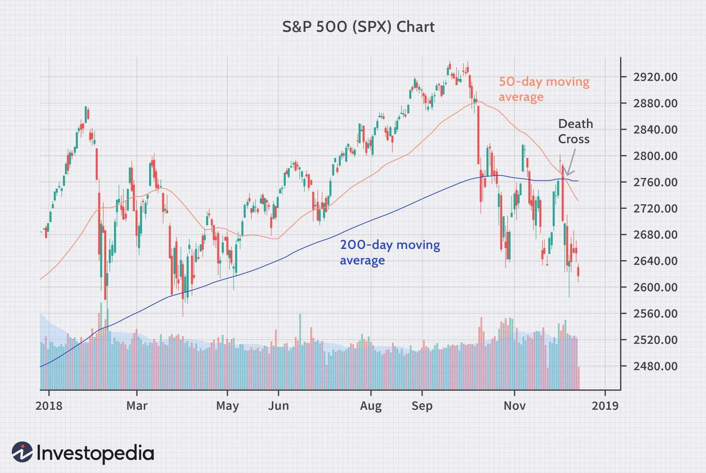

## Table of Contents

## What is a Death Cross in trading?

A Death Cross is a term used in trading and technical analysis. It happens when a short-term moving average, usually the 50-day moving average, crosses below a long-term moving average, often the 200-day moving average. This crossover is seen as a signal that a bearish trend, or a downward trend, might be starting.

Traders and investors watch for a Death Cross because it can suggest that it's time to sell or be cautious about buying stocks. However, it's not a perfect signal. Sometimes, a Death Cross can give a false alarm, and the market might not go down as expected. That's why it's important to use the Death Cross along with other tools and information to make better trading decisions.

## How is a Death Cross identified on a chart?

A Death Cross is easy to spot on a chart. You just need to look for two lines: the 50-day moving average and the 200-day moving average. The 50-day moving average is the average price of the stock over the last 50 days, and the 200-day moving average is the average price over the last 200 days. When the 50-day line crosses below the 200-day line, that's a Death Cross. It looks like the short-term average is diving under the long-term average.

Charts usually show these moving averages as smooth lines that help traders see trends. When you see the 50-day line, which is usually the quicker moving one, dip below the slower 200-day line, it's a sign that the stock might start going down. But remember, this signal isn't always right, so it's good to check other things on the chart too before deciding what to do.

## What is the significance of a Death Cross in technical analysis?

In technical analysis, a Death Cross is a big signal that traders watch out for. It happens when the 50-day moving average, which is a short-term trend line, goes below the 200-day moving average, which is a long-term trend line. This crossing is seen as a warning that the price of a stock or an index might start to go down. Traders and investors use this signal to decide if they should sell their stocks or be careful about buying new ones.

However, a Death Cross isn't always right. Sometimes, it can give a false alarm, and the market might not go down like expected. That's why smart traders don't just look at the Death Cross alone. They use it along with other signs and tools to make better choices. So, while a Death Cross can be helpful, it's just one piece of the puzzle in understanding what the market might do next.

## Can you explain the components of a Death Cross, such as the moving averages involved?

A Death Cross has two main parts: the 50-day moving average and the 200-day moving average. The 50-day moving average is like a short-term trend line that shows the average price of a stock over the last 50 days. The 200-day moving average is a long-term trend line that shows the average price over the last 200 days. These two lines help traders see how the stock is doing over different time periods.

When the 50-day moving average crosses below the 200-day moving average, that's what we call a Death Cross. It's a signal that the stock might start going down. Traders use this to decide if they should sell their stocks or be careful about buying new ones. But remember, this signal isn't always right, so it's good to look at other things too before making a decision.

## How does a Death Cross differ from a Golden Cross?

A Death Cross and a Golden Cross are two opposite signals that traders watch in the stock market. A Death Cross happens when the 50-day moving average, which is a short-term trend line, goes below the 200-day moving average, which is a long-term trend line. This crossing suggests that the price of a stock or an index might start to go down, so it's a warning for traders to maybe sell their stocks or be careful about buying new ones.

On the other hand, a Golden Cross is the opposite. It happens when the 50-day moving average crosses above the 200-day moving average. This crossing is seen as a good sign that the price might start to go up. Traders might see this as a signal to buy stocks or feel more confident about holding onto what they already have. Both signals help traders make decisions, but they mean different things about where the market might be headed.

## What are the potential impacts of a Death Cross on market sentiment?

A Death Cross can make people feel worried about the stock market. When traders see the 50-day moving average cross below the 200-day moving average, it's like a warning sign that the market might start going down. This can make people think it's a good time to sell their stocks or be careful about buying new ones. Because a lot of people watch for this signal, it can make the overall mood in the market turn more negative. People might start to think that the good times are over and that it's time to get ready for a downturn.

But, the impact of a Death Cross isn't always the same. Sometimes, it can make the market go down because people start selling their stocks out of fear. Other times, it might not have a big effect if people don't believe the signal or if other things in the market are going well. It's important to remember that a Death Cross is just one piece of information. Smart traders look at other signs too before deciding what to do. So, while it can make people feel nervous, it doesn't always mean the market will definitely go down.

## How reliable is a Death Cross as a predictor of market downturns?

A Death Cross is not always a reliable predictor of market downturns. It happens when the 50-day moving average crosses below the 200-day moving average, and it can suggest that the market might start going down. But, this signal doesn't always get it right. Sometimes, the market keeps going up even after a Death Cross, which means it gave a false alarm. Traders and investors need to be careful and not just rely on this one signal when making decisions about buying or selling stocks.

The reliability of a Death Cross can change depending on other things happening in the market. If there are other signs that the market is weak, like bad economic news or other technical indicators, a Death Cross might be more likely to predict a downturn. But if the market is strong and other signs are positive, the Death Cross might not mean much. That's why it's important to look at a lot of different information and not just focus on one signal like the Death Cross.

## What are some historical examples of Death Crosses and their outcomes?

One famous example of a Death Cross happened in the stock market in early 2008. The 50-day moving average crossed below the 200-day moving average in January, and soon after, the market started to go down a lot. This Death Cross came before the big financial crisis that hit later that year. A lot of people saw the Death Cross as a warning and started selling their stocks, which made the market go down even more. This shows how a Death Cross can sometimes be a good signal of a coming downturn, especially when other things in the market are not looking good.

Another example was in March 2020, right when the world was dealing with the start of the COVID-19 pandemic. The Death Cross appeared, and the market fell a lot because of the fear and uncertainty caused by the virus. Many people sold their stocks because they were worried, and the market dropped quickly. But, this time, the market started to go back up after a few months, showing that even though the Death Cross can signal a downturn, it doesn't always mean the market will stay down for a long time. It's important to look at other signs too, not just the Death Cross, to understand what might happen next in the market.

## How should a trader respond to a Death Cross signal?

When a trader sees a Death Cross, it's a signal that the stock market might start going down. This happens when the 50-day moving average goes below the 200-day moving average. It's like a warning sign that things could get worse. Some traders might decide to sell their stocks to avoid losing money if the market really does go down. But it's important not to panic and sell everything right away. A Death Cross doesn't always mean the market will go down for sure, so it's good to think carefully before making a move.

Traders should look at other things in the market too, not just the Death Cross. They can check other signs like economic news, other technical indicators, and what's happening in the world. If other signs also say the market might go down, then the Death Cross might be more important. But if other things look good, the Death Cross might not mean much. So, a smart trader will use the Death Cross as one piece of information and not make quick decisions based on it alone. They'll think about everything before choosing to sell, buy, or do nothing.

## What are the limitations and criticisms of using a Death Cross for trading decisions?

A Death Cross is not always a good signal for traders to use when making choices about buying or selling stocks. One big problem is that it can give false alarms. Sometimes, the market doesn't go down even after a Death Cross appears. This means traders who sold their stocks because of the Death Cross might miss out on gains if the market keeps going up. Also, a Death Cross happens after prices have already started to go down, so it might be too late to sell by the time the signal shows up. Traders might have already lost money before they get the warning.

Another criticism is that a Death Cross only looks at moving averages and doesn't consider other important things happening in the market. For example, it doesn't take into account economic news, company earnings, or world events that can affect stock prices. If traders just focus on the Death Cross without looking at these other factors, they might make bad decisions. It's better to use the Death Cross along with other tools and information to get a fuller picture of what's happening in the market.

## How can a Death Cross be used in conjunction with other technical indicators?

A Death Cross can be a useful signal, but it works better when used with other technical indicators. For example, traders might look at the Relative Strength Index (RSI) to see if a stock is overbought or oversold. If the RSI shows that a stock is overbought and a Death Cross appears, it might be a stronger sign that the stock price could go down. Another helpful indicator is the Moving Average Convergence Divergence (MACD). If the MACD line crosses below the signal line at the same time as a Death Cross, it can confirm that a bearish trend might be starting.

Also, traders can use [volume](/wiki/volume-trading-strategy) indicators to check if the Death Cross is more reliable. If the trading volume is high when the Death Cross happens, it means more people are selling, which can make the signal more important. Looking at support and resistance levels can also help. If a Death Cross happens near a key support level, it might mean the stock price could break through that support and keep going down. By combining the Death Cross with these other indicators, traders can make better decisions and not just rely on one signal.

## What advanced strategies can traders employ when a Death Cross occurs in different market conditions?

When a Death Cross happens in a strong bull market, traders might not want to sell all their stocks right away. They can wait and see if other signs like the RSI or MACD also show that the market might go down. If these other indicators don't agree with the Death Cross, the market might just keep going up. Traders can use this time to set stop-loss orders, which automatically sell their stocks if the price drops to a certain level. This way, they can protect their gains without missing out if the market stays strong.

In a bear market, a Death Cross can be a stronger sign that things will get worse. Traders might decide to sell some of their stocks to avoid losing more money. They can also look at other indicators like volume and support levels to see if the Death Cross is a good warning. If the volume is high and the price is near a key support level, it might be a good time to sell. But traders should also think about buying stocks that are less affected by the market downturn, like defensive stocks, to keep their money safe until the market gets better.

In a sideways market, where the stock price doesn't go up or down much, a Death Cross might not mean much. Traders can use this time to look at other signals like the Bollinger Bands to see if the market might start moving again. If the price is near the lower Bollinger Band and a Death Cross happens, it might mean the price could go down more. But if other signs show the market might stay the same, traders can hold onto their stocks and wait for a clearer signal before making a move.

## References & Further Reading

[1]: ["Quantitative Trading: How to Build Your Own Algorithmic Trading Business"](https://www.amazon.com/Quantitative-Trading-Build-Algorithmic-Business/dp/0470284889) by Ernest P. Chan

[2]: ["Advances in Financial Machine Learning"](https://www.amazon.com/Advances-Financial-Machine-Learning-Marcos/dp/1119482089) by Marcos Lopez de Prado

[3]: ["Evidence-Based Technical Analysis: Applying the Scientific Method and Statistical Inference to Trading Signals"](https://www.amazon.com/Evidence-Based-Technical-Analysis-Scientific-Statistical/dp/0470008741) by David Aronson

[4]: ["Machine Learning for Algorithmic Trading"](https://github.com/stefan-jansen/machine-learning-for-trading) by Stefan Jansen

[5]: Elder, A. (1993). ["Trading for a Living: Psychology, Trading Tactics, Money Management"](https://www.amazon.com/Trading-Living-Psychology-Tactics-Management/dp/0471592242). John Wiley & Sons.

[6]: Murphy, J. J. (1999). ["Technical Analysis of the Financial Markets: A Comprehensive Guide to Trading Methods and Applications"](https://www.amazon.com/Technical-Analysis-Financial-Markets-Comprehensive/dp/0735200661). New York Institute of Finance.