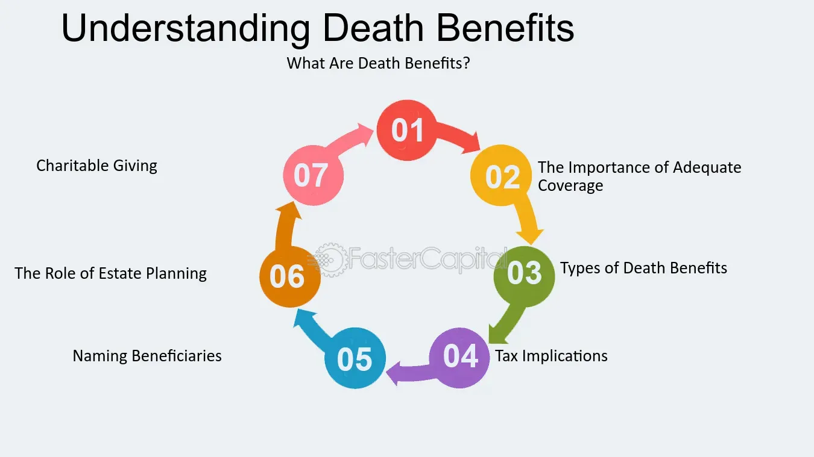

## Table of Contents

## What is a death put?

A death put is a special feature in some life insurance policies or financial agreements. It allows the beneficiaries to sell back the investment or policy to the issuer if the person who owns the policy or investment dies. This helps make sure that the people who receive the money after someone dies don't have to keep managing the investment if they don't want to.

In simpler terms, if someone has a life insurance policy with a death put, their family can choose to get the money right away instead of waiting for the investment to grow or dealing with it themselves. This can be very helpful because it gives the family quick access to money when they might need it the most, right after losing a loved one.

## How does a death put work in financial terms?

A death put is a feature in some financial products, like bonds or life insurance policies, that lets the person who gets the money after someone dies sell the investment back to the company that issued it. This happens if the person who owned the investment dies. The idea is to help the family or beneficiaries get money quickly without having to manage the investment themselves. 

For example, if someone owns a bond with a death put and they pass away, their family can choose to sell that bond back to the issuer at a set price. This price is usually the bond's face value or a predetermined amount. This way, the family gets the money right away, which can be really important during a tough time when they might need funds to cover expenses or other needs.

## In which types of financial instruments is a death put commonly found?

A death put is commonly found in certain types of bonds, especially municipal bonds and corporate bonds. These bonds might have a death put option to make them more attractive to investors. If the bondholder dies, their family can choose to sell the bond back to the issuer at a set price, which is often the bond's face value. This feature helps the family get money quickly without having to wait for the bond to mature or deal with selling it on the market.

Life insurance policies can also include a death put feature. In this case, if the policyholder dies, the beneficiaries can choose to sell the policy back to the insurance company instead of keeping it active. This can be helpful because it gives the family immediate access to funds, which can be important during a difficult time. The death put in life insurance works similarly to bonds, providing a way for the family to get money without managing the investment further.

In some cases, you might also find a death put in other investment vehicles like certain types of annuities or structured notes. These financial products might offer a death put to give investors peace of mind, knowing their family can easily access funds if they pass away. The key idea is to provide liquidity and ease of management for the beneficiaries, making these investments more appealing to people who want to protect their loved ones financially.

## What are the basic eligibility criteria for a death put?

To be eligible for a death put, the person who owns the investment or policy must die. This is the main rule. The death put is a special feature that lets the family or the people who get the money after someone dies choose to sell the investment back to the company that issued it. This can be helpful because it gives the family money right away when they might need it the most.

The investment or policy must also have a death put feature written into its terms. Not all investments or policies have this option, so it's important to check the details of the investment or policy to see if it includes a death put. If it does, then the family can use it when the owner passes away. This feature is often found in bonds, life insurance policies, and sometimes in other financial products like annuities or structured notes.

## What are the advantages of a death put for the bondholder?

A death put gives peace of mind to the person who owns the bond. They know that if they pass away, their family can get the money from the bond quickly and easily. This can be a big help because it means the family doesn't have to wait for the bond to mature or try to sell it on the market, which can be hard and take a long time.

For the family, a death put can be really important. When someone dies, the family might need money right away for things like funeral costs or other bills. With a death put, they can get the money they need without having to deal with the bond themselves. This can make a tough time a little bit easier for them.

## How can a death put benefit the issuer of the bond?

A death put can make a bond more attractive to people who want to buy it. When people know that their family can get money quickly and easily if they die, they might be more likely to buy the bond. This can help the issuer sell the bonds faster and maybe even at a better price. More people wanting to buy the bonds means the issuer can raise money more easily.

Also, a death put can help the issuer manage their money better. If someone dies and their family uses the death put, the issuer gets the bond back. They can then sell it again to someone else. This keeps the money flowing and helps the issuer keep their finances in good shape. So, even though the issuer has to pay out money when someone dies, it can also help them in the long run.

## What are the potential disadvantages of a death put for investors?

A death put might seem like a good thing for investors, but it can have some downsides. One problem is that bonds with a death put might have a lower interest rate. This is because the issuer knows they might have to pay back the money early if the bondholder dies. So, they offer a lower rate to make up for that risk. This means investors might not earn as much money over time compared to bonds without a death put.

Another disadvantage is that the family might not get as much money as they could if they kept the bond until it matured. If the bond's value goes up over time, selling it back early means missing out on that extra money. Also, using the death put can mean the family doesn't get any future interest payments that the bond would have paid out. So, while a death put can help get money quickly, it might not be the best choice if the family can wait and possibly get more money later.

## How might a death put affect the pricing of a bond?

A death put can make a bond cost less to buy. When a bond has a death put, it means the issuer might have to give the money back early if the person who owns the bond dies. Because of this, the issuer might set a lower price for the bond or offer a lower interest rate. They do this to make up for the chance that they'll have to pay back the money sooner than they planned.

This can be good for people buying the bond because they might get it cheaper. But it also means they might not make as much money over time. If the bond's value goes up a lot, the family might miss out on that extra money by using the death put. So, while a death put can help the family get money quickly, it might also mean they get less money overall.

## Can you explain the tax implications of exercising a death put?

When a family uses a death put, they might have to pay taxes on the money they get. It depends on how the bond or investment was set up and the rules in their country. If the bond was bought for less than what the family gets back, they might have to pay tax on the difference. This is called capital gains tax. But if the bond was bought for more than what they get back, they might be able to use the loss to lower their taxes on other money they made.

The tax rules can be different for life insurance policies with a death put. Usually, the money from life insurance is not taxed if it's paid out because someone died. But if the family chooses to use the death put and sell the policy back, they might have to pay taxes on any money that's more than what was paid in premiums. It's a good idea for families to talk to a tax expert to understand exactly how much tax they might have to pay and how to handle it the best way.

## What are the legal and regulatory considerations surrounding death puts?

Death puts come with some legal and regulatory rules that people need to know about. The rules can be different depending on where you live and the type of investment. For example, in the United States, the Securities and Exchange Commission (SEC) has rules about how bonds with death puts need to be described to people buying them. This is to make sure everyone knows exactly what they're getting into. Also, life insurance policies with death puts have to follow the rules set by insurance regulators. These rules make sure the policies are fair and that people understand how they work.

Using a death put can also involve some legal steps. When someone dies, their family might need to show proof of death and go through a legal process to use the death put. This could mean dealing with probate, which is the legal way of handling someone's money and things after they die. The rules for this can be different in each place, so it's important for families to know the local laws. If they don't follow the right steps, they might have trouble getting the money from the death put.

## How do death puts compare to other types of put options in terms of strategy and risk?

Death puts are different from other types of put options because they are used when someone dies. A regular put option lets you sell an investment at a set price before it runs out, which can help you if the investment's value goes down. But a death put is only used after the person who owns the investment dies, and it helps their family get money quickly without having to manage the investment. So, death puts are more about helping families after a loss, while regular put options are more about protecting against losing money on an investment.

In terms of risk, death puts can be less risky for the person who buys the bond or investment because they know their family will get money if they die. But for the issuer, death puts can be riskier because they might have to pay back the money earlier than planned. This is different from regular put options, where the risk depends more on how the investment's value changes over time. With death puts, the risk is more about when someone might die, which is harder to predict. So, while death puts give peace of mind to the person buying the investment, they can make things more complicated for the issuer.

## What are some real-world examples or case studies of death puts being exercised?

In one real-world example, a family in the United States used a death put after their loved one passed away. The person had bought a municipal bond that included a death put option. When the bondholder died, the family chose to use the death put to get the money back from the bond issuer. This helped them cover funeral costs and other expenses without having to wait for the bond to mature or sell it on the market. The process was straightforward, and the family appreciated the quick access to funds during a difficult time.

Another case involved a life insurance policy with a death put feature. A policyholder in Canada had this type of policy, and when they died, their beneficiaries decided to exercise the death put. Instead of keeping the policy active, they sold it back to the insurance company. This allowed them to receive a lump sum payment right away, which was helpful for managing immediate financial needs. The beneficiaries found the process easy to navigate and were grateful for the option to get money quickly without the hassle of managing the policy themselves.

## References & Further Reading

[1]: Bergstra, J., Bardenet, R., Bengio, Y., & Kégl, B. (2011). ["Algorithms for Hyper-Parameter Optimization."](https://dl.acm.org/doi/10.5555/2986459.2986743) Advances in Neural Information Processing Systems 24.

[2]: ["Advances in Financial Machine Learning"](https://www.amazon.com/Advances-Financial-Machine-Learning-Marcos/dp/1119482089) by Marcos Lopez de Prado

[3]: ["Evidence-Based Technical Analysis: Applying the Scientific Method and Statistical Inference to Trading Signals"](https://www.amazon.com/Evidence-Based-Technical-Analysis-Scientific-Statistical/dp/0470008741) by David Aronson

[4]: ["Machine Learning for Algorithmic Trading"](https://github.com/stefan-jansen/machine-learning-for-trading) by Stefan Jansen

[5]: ["Quantitative Trading: How to Build Your Own Algorithmic Trading Business"](https://www.amazon.com/Quantitative-Trading-Build-Algorithmic-Business/dp/1119800064) by Ernest P. Chan