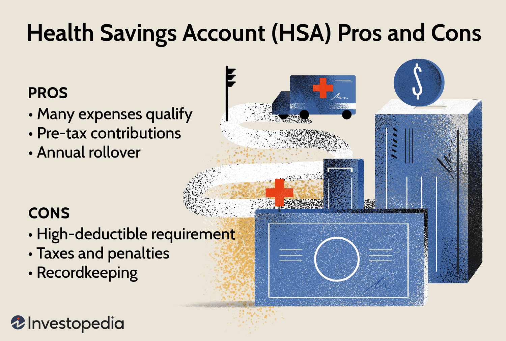

Investment finance presents a complex and expansive field, characterized by a myriad of financial instruments and strategies designed to enhance returns and manage risks. Due to the dynamic nature of financial markets, staying informed about various investment tools is vital for investors aiming to make judicious financial decisions. Among the array of tools available, the concepts of death puts and algorithmic trading stand out due to their sophisticated features and significant implications for portfolio management.

Death puts, often embedded in bonds, offer a unique feature known as a survivor's option. This allows the heirs of a bondholder to redeem the bond prior to its maturity at par value upon the bondholder's death, thereby providing protection against interest rate fluctuations and ensuring the preservation of the estate's value. Such features are particularly appealing to long-term investors who prioritize security and predictable returns.



Algorithmic trading, on the other hand, utilizes computer algorithms to automate the trading process, ensuring high speed and precision. By executing trades based on pre-set instructions, algorithmic trading can effectively outperform manual trading strategies, enabling investors to deploy complex strategies with efficiency. The adoption of such technological advancements in trading has revolutionized financial markets, showcasing the potential of leveraging computational power to gain a competitive advantage.

Understanding these concepts, whether one is a seasoned investor or new to the financial markets, is essential for optimizing investment portfolios. Utilizing death puts and algorithmic trading together can create strategies that not only enhance portfolio performance but also mitigate risks inherent in volatile markets. This article aims to shed light on the strategic integration of death puts and algorithmic trading, underscoring their importance in maintaining an edge in competitive markets. By comprehending these advanced financial tools, investors can better navigate their investments, ultimately achieving a refined balance between risk management and return optimization.

## Table of Contents

## Understanding Death Puts

A death put, or survivor’s option, is an attribute embedded in certain fixed-income securities, such as bonds. This feature allows the issuer to repurchase the bond from the heirs or estate of a deceased bondholder at its par value prior to the bond reaching its natural maturity. This option can be particularly advantageous during periods of rising interest rates, which generally cause bond prices to fall, enabling the heirs to avoid selling the bond at a loss in the open market.

**Mechanics:** The mechanics of a death put are relatively straightforward. Upon the bondholder's death, the heirs must notify the bond issuer within a specified period, usually by providing necessary documentation such as a death certificate. Once verified, the issuer redeems the bond at par value, transferring the amount to the heirs. It is important for investors and estate planners to understand the specific terms and conditions related to the use of the death put feature, as these can vary by issuer and bond issue.

**Benefits:** The primary benefit of a death put is its ability to protect the estate value from interest rate volatility. By enabling redemption at par value, heirs are shielded from adverse market conditions that could depreciate the bond's market value. This feature is particularly attractive to long-term investors looking to preserve wealth through stable assets. Additionally, death puts add a layer of flexibility to estate planning, ensuring that the bond’s value remains intact regardless of market fluctuations.

**Potential Limitations:** Despite their advantages, death puts do have limitations. The redemption process can be cumbersome and often requires timely documentation and verification processes, which might not suit all investors, especially those seeking liquidity. Moreover, bonds with death put features may have lower yields compared to those without, reflecting the added value of this redemption option. Another consideration is the liquidity of these bonds in secondary markets, as not all bonds with death put features are actively traded.

Understanding how death puts function is essential for integrating them into a comprehensive investment strategy, particularly in the context of managing [interest rate](/wiki/interest-rate-trading-strategies) risks. By mitigating the risks associated with bond price fluctuations due to changing interest rates, the death put serves as a valuable tool for estate protection. This feature complements broader financial strategies by aligning with long-term goals of wealth preservation and risk management.

## Algorithmic Trading: An Overview

Algorithmic trading, commonly known as algo trading, utilizes computer algorithms to automate the trading of financial instruments. These algorithms follow predefined instructions regarding timing, price, quantity, and other criteria, enabling traders to execute orders with speed and precision unattainable by manual trading. This technology has become increasingly significant, largely due to its capacity to handle vast volumes of data and execute high-frequency trades.

## How Algorithmic Trading Works

At its core, [algorithmic trading](/wiki/algorithmic-trading) is defined by the use of mathematical models and computational power to make decisions about buying or selling securities. These algorithms can be simple, based on basic rules such as moving averages, or complex, incorporating multiple data streams, including technical analysis, market sentiment, and economic indicators.

For instance, a basic algorithm might buy stock if the 50-day moving average exceeds the 200-day moving average, signaling an upward trend. More sophisticated systems might analyze high-frequency data to identify minuscule price advantages in brief market inefficiencies, a practice known as high-frequency trading ([HFT](/wiki/high-frequency-trading-strategies)).

### Example of a Simple Trading Algorithm in Python

A basic moving average crossover strategy can be implemented using the Python programming language. Consider the following script:

```python
import numpy as np
import pandas as pd

def moving_average_crossover_strategy(data, short_window, long_window):
    signals = pd.DataFrame(index=data.index)
    signals['price'] = data['close']
    signals['short_mavg'] = data['close'].rolling(window=short_window, min_periods=1, center=False).mean()
    signals['long_mavg'] = data['close'].rolling(window=long_window, min_periods=1, center=False).mean()
    signals['signal'] = 0.0
    signals['signal'][short_window:] = np.where(signals['short_mavg'][short_window:] > signals['long_mavg'][short_window:], 1.0, 0.0)
    signals['positions'] = signals['signal'].diff()
    return signals

# Example usage with a time series data
# timestamps and closing prices of a stock
historical_data = {'close': [150, 152, 153, 154, 156, 158, 157, 159, 160, 161]}
data = pd.DataFrame(historical_data)
strategy_signals = moving_average_crossover_strategy(data, short_window=2, long_window=5)
print(strategy_signals)
```

## Advantages of Algorithmic Trading

1. **Speed and Efficiency**: Algorithms process and analyze data across different markets faster than human traders. They can execute transactions within fractions of a second, capturing price discrepancies that might vanish in that time frame.

2. **Cost Reduction**: Automation in trading reduces transaction costs. Having algorithms trade on behalf of traders allows for reduced human error and lowers the impact of emotional decision-making.

3. **Scalability**: An algorithm can monitor and trade multiple markets simultaneously, achieving diversification without additional manpower or resources.

## Challenges Faced by Algorithmic Trading

Despite its benefits, algorithmic trading is not without challenges. 

1. **Market Impact and Liquidity Risks**: Large orders processed through algorithms can impact market prices, potentially leading to negative feedback loops. Moreover, in less liquid markets, the execution of algorithmic trades can cause significant price swings.

2. **Technical Failures**: Reliance on technology comes with risks. System glitches or failures can lead to significant financial losses, as algorithms may execute unintended trades or fail to respond appropriately to rapid market changes.

3. **Regulatory Concerns**: The rapid nature of algorithmic trading raises regulatory issues, with concerns about market manipulation, fairness, and financial stability. Regulators worldwide have been scrutinizing the impact of such trading on market dynamics.

Understanding algorithmic trading is essential for investors and traders seeking to stay competitive in the ever-evolving financial market landscape. It represents a fusion of advanced technology and financial acumen, fundamentally transforming how transactions are conducted and strategies are implemented.

## Integrating Death Puts with Algorithmic Trading

Integrating the features of death puts with the technological precision of algorithmic trading offers investors a sophisticated means of managing bond portfolios. The primary advantage is the possibility of optimizing bond sales timing to maximize returns and minimize risks, particularly interest rate risks.

Death puts, or survivor's options, grant bondholders the ability to redeem bonds at par value upon the death of the investor, regardless of prevailing market conditions. This feature offers significant protection against unfavorable interest rate movements, which can devalue bonds before maturity. For investors utilizing algorithmic trading, integrating death put options into their strategies allows for optimized portfolio management by taking both market [volatility](/wiki/volatility-trading-strategies) and investor-specific scenarios into account.

To effectively combine death puts with algorithmic trading, investors can develop algorithms capable of monitoring and responding to market conditions in real-time. Such algorithms can be designed to execute predefined trading strategies that incorporate the potential activation of death puts. For instance, the algorithm could be set to trigger a bond redemption based on a certain threshold of interest rate changes, or adapt trading strategies in anticipation of the bondholder's death, ensuring the best possible financial outcome.

The integration process may involve:

1. **Data Analysis and Monitoring**: Algorithms can continuously analyze a wide array of market data, including interest rates, economic indicators, and potential shifts in fiscal policies. By doing so, they can predict the optimal time to activate a death put feature, effectively balancing market conditions with the financial needs of the investor or their heirs.

2. **Predictive Algorithms**: Using machine learning models, these algorithms can be trained to identify patterns that may suggest optimal trigger points for activating death puts. This could involve simulating various scenarios and gauging the effect of interest rate changes on bond prices.

3. **Automated Execution**: By setting parameters for specific market triggers, algorithms can execute transactions at high speed, ensuring that bonds are redeemed promptly when an advantageous condition arises. The automation inherent in these systems can eliminate delays and emotional biases from trading decisions.

Example case studies include larger financial institutions that have successfully adopted algorithmic strategies to manage large bond portfolios with embedded death puts. These institutions frequently use algorithms to simulate various economic scenarios, adjusting their portfolio strategies accordingly to minimize risk and maximize returns.

While the combination of death puts and algorithmic trading presents opportunities for enhanced investment strategies, potential challenges must be considered. Market [liquidity](/wiki/liquidity-risk-premium), the complexity of algorithm development, and the legal considerations surrounding the execution of death puts necessitate careful planning and risk management.

In conclusion, merging the protective features of death puts with the efficiency of algorithmic trading can significantly improve portfolio resilience and performance. It enables investors to leverage technological advances while ensuring that investments remain insulated from adverse market conditions and are tailored to personal or estate planning objectives. As financial markets evolve, the strategic use of these tools will be crucial for maintaining a competitive advantage.

## Pros and Cons: Evaluating the Strategies

Integrating death puts and algorithmic trading presents a mixed bag of advantages and possible drawbacks for investors seeking to optimize their strategies. Understanding these aspects is crucial for making informed decisions in portfolio management.

One of the primary benefits of combining death puts and algorithmic trading is the enhanced ability to protect investments against adverse market movements. Death puts offer a safety net by allowing bond redemption at par value upon the death of the holder, safeguarding against potential interest rate spikes that could otherwise devalue the bond. When this feature is married with the precision-driven capabilities of algorithmic trading, investors can efficiently manage their portfolios by executing timely trades based on predefined conditions and market signals. This simultaneous protection and precision can lead to more stable and predictable investment outcomes.

Algorithmic trading also empowers investors to capitalize on market opportunities with speed and accuracy that far surpass human capabilities. Algorithms can be programmed to recognize complex patterns and execute trades in fractions of a second, enabling investors to take advantage of [arbitrage](/wiki/arbitrage) opportunities and trends that may be imperceptible to manual traders. This automation reduces emotional decision-making and enhances the consistency of investment strategies.

However, the integration of death puts and algorithmic trading is not without its challenges. One major concern is the potential market liquidity issues associated with death puts. Bonds carrying a death put provision may suffer from reduced liquidity because they are typically redeemed under specific circumstances, deterring some investors from participating. This can lead to wider bid-ask spreads and increased difficulty in executing large trades without affecting market prices.

The complexity of developing effective algorithms also poses a significant challenge. Crafting algorithms that can successfully navigate volatile markets requires not only advanced programming skills but also a deep understanding of market dynamics and risk management principles. Poorly designed algorithms may lead to premature trade executions, missed opportunities, and unintended financial losses.

To provide a balanced view, it is essential for investors to weigh these strengths and weaknesses carefully. While the combined strategy of using death puts and algorithmic trading offers robust tools for managing risk and enhancing returns, potential pitfalls such as liquidity issues and algorithmic failures must be conscientiously addressed. By recognizing these factors, investors can better plan and execute their strategies, ensuring that they are aligned with their financial goals and risk tolerance.

## Conclusion: Strategic Insights for Informed Investing

In the rapidly evolving world of finance, staying informed about advanced financial instruments like death puts and leveraging technology with algorithmic trading is essential for maintaining and enhancing investment portfolios. These tools, when strategically integrated, offer a sophisticated approach to tackling modern investment challenges, enabling investors to optimize their financial outcomes effectively.

Investors aiming to enhance their portfolios must consider how these strategies align with their specific financial goals and risk tolerance. Death puts offer a means of protecting investments against interest rate fluctuations by allowing bondholders, or their heirs, to redeem bonds at par value prior to maturity. This feature can be particularly valuable in safeguarding the value of an estate, especially in volatile markets. On the other hand, algorithmic trading provides automation and precision, allowing for the rapid execution of trades based on predefined criteria, which can significantly improve the efficiency of implementing complex strategies.

The strategic integration of death puts with algorithmic trading can be seen as a method to capitalize on market conditions while simultaneously mitigating risks. For instance, investors could program algorithms to monitor market interest rates and execute bond sales in alignment with these fluctuations, thereby optimizing the timing and conditions under which death puts are activated. Such automation not only facilitates quick responses to changing markets but also supports data-driven decisions, enhancing the robustness of investment strategies.

As the financial landscape continuously evolves, so too must the strategies employed by investors. Continuous learning and adaptation remain crucial for gaining and maintaining an edge in competitive markets. By keeping abreast of technological advancements and financial innovations, investors are better positioned to adopt new approaches that can lead to more informed and strategic investment decisions.

Ultimately, the value of integrating death puts with algorithmic trading lies in their combined ability to navigate the complexities of today’s financial markets, delivering both protective features and precision in execution. By leveraging these tools effectively, investors can not only safeguard their current investments but also pursue opportunities for growth and profitability, maintaining a well-balanced and forward-looking investment portfolio.

## References & Further Reading

[1]: Bergstra, J., Bardenet, R., Bengio, Y., & Kégl, B. (2011). ["Algorithms for Hyper-Parameter Optimization."](https://dl.acm.org/doi/10.5555/2986459.2986743) Advances in Neural Information Processing Systems 24.

[2]: ["Advances in Financial Machine Learning"](https://www.amazon.com/Advances-Financial-Machine-Learning-Marcos/dp/1119482089) by Marcos Lopez de Prado

[3]: ["Evidence-Based Technical Analysis: Applying the Scientific Method and Statistical Inference to Trading Signals"](https://www.amazon.com/Evidence-Based-Technical-Analysis-Scientific-Statistical/dp/0470008741) by David Aronson

[4]: ["Machine Learning for Algorithmic Trading"](https://github.com/stefan-jansen/machine-learning-for-trading) by Stefan Jansen

[5]: ["Quantitative Trading: How to Build Your Own Algorithmic Trading Business"](https://www.amazon.com/Quantitative-Trading-Build-Algorithmic-Business/dp/1119800064) by Ernest P. Chan