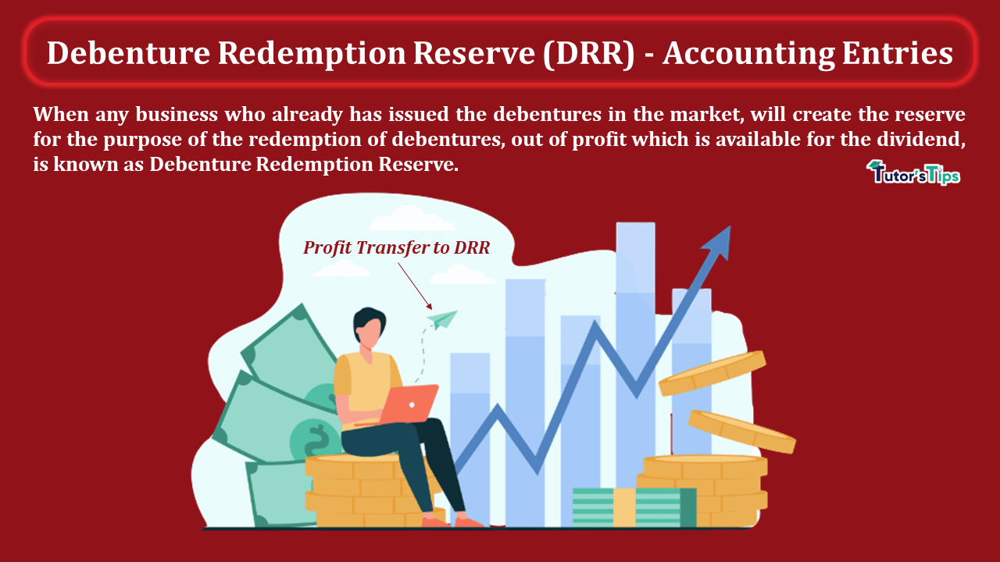

## Table of Contents

## What is a Debenture Redemption Reserve (DRR)?

A Debenture Redemption Reserve (DRR) is a type of reserve fund that companies set aside to ensure they can repay the principal amount of debentures when they mature. Debentures are a type of long-term debt instrument issued by companies to raise capital. The DRR acts as a safety net, helping to protect investors by ensuring that the company has enough money to pay back the debenture holders at the end of the term.

Companies create the DRR by transferring a portion of their profits into this reserve each year. The specific amount to be transferred is usually determined by regulations set by financial authorities, which can vary from one country to another. By maintaining a DRR, companies demonstrate their commitment to financial stability and their ability to meet their debt obligations, which can enhance their credibility and attractiveness to investors.

## Why is a Debenture Redemption Reserve necessary?

A Debenture Redemption Reserve is necessary because it helps companies make sure they can pay back the money they borrowed through debentures. When a company issues debentures, it promises to return the principal amount to investors when the debentures mature. The DRR acts like a savings account where the company puts aside some of its profits every year. This way, when it's time to pay back the investors, the company has the money ready.

Having a DRR also builds trust with investors. It shows that the company is serious about managing its debts responsibly. If investors see that a company has a DRR, they feel more confident that their investment is safe. This can make the company more attractive to people who want to invest their money, helping the company raise funds more easily in the future.

## How does a Debenture Redemption Reserve protect investors?

A Debenture Redemption Reserve (DRR) protects investors by making sure that the company has enough money saved up to pay them back when their debentures come due. It's like a safety net. When a company sets aside money in a DRR each year, it builds up a fund that can be used to return the principal amount to investors at the end of the debenture term. This means that investors are more likely to get their money back because the company has been planning ahead.

Having a DRR also shows that the company is responsible and committed to paying back its debts. This makes investors feel more secure about their investment. When investors see that a company has a DRR, they trust the company more and feel safer putting their money into it. This trust can make the company more attractive to new investors, helping it raise money more easily in the future.

## What are the legal requirements for creating a Debenture Redemption Reserve?

The legal requirements for creating a Debenture Redemption Reserve can vary from country to country. In many places, companies are required by law to set aside a certain amount of their profits every year into a DRR if they have issued debentures. The exact amount that needs to be transferred to the DRR is often set by financial regulators and can be a percentage of the outstanding debenture value. For example, in India, companies are required to transfer at least 25% of the value of the debentures issued to the DRR before the debentures mature.

The purpose of these legal requirements is to make sure that companies can pay back the money they borrowed through debentures. By having a DRR, the company shows that it is taking steps to be ready to return the investors' money when the debentures come due. This helps protect investors and builds trust in the company. If a company does not follow these rules, it could face penalties or legal action, which could harm its reputation and ability to raise funds in the future.

## How is the amount to be set aside in a DRR calculated?

The amount to be set aside in a Debenture Redemption Reserve (DRR) is usually calculated as a percentage of the total value of the debentures that a company has issued. This percentage can vary depending on the rules set by the financial authorities in different countries. For example, in India, companies are required to transfer at least 25% of the value of the outstanding debentures to the DRR before the debentures mature.

To calculate this, you take the total amount of debentures that are still owed and multiply it by the required percentage. So, if a company has issued debentures worth $100 million and the legal requirement is to set aside 25% of that amount, the company would need to put $25 million into the DRR. This calculation helps make sure that the company has enough money saved up to pay back the investors when the debentures come due.

## Can the funds in a Debenture Redemption Reserve be used for other purposes?

The funds in a Debenture Redemption Reserve are set aside specifically to pay back the money that a company borrowed through debentures. This means that the company should not use these funds for other purposes. The main goal of the DRR is to make sure there's enough money to return to investors when the debentures mature.

However, there might be some strict rules or special situations where a company could use the DRR money for something else. But this would usually need permission from the financial regulators or the investors themselves. If a company uses the DRR for other things without following the rules, it could get into trouble and harm its reputation and ability to raise money in the future.

## What are the implications of not maintaining a Debenture Redemption Reserve?

If a company doesn't keep up a Debenture Redemption Reserve, it can get into big trouble. The main problem is that the company might not have enough money to pay back the people who bought its debentures when they are due. This can make investors very upset and worried about their money. If the company can't pay back the investors, it could lead to legal action against the company. This would be bad for the company's reputation and could make it hard for them to borrow money in the future.

Not having a DRR can also make investors lose trust in the company. When people see that a company is not following the rules about saving money to pay back debts, they might think the company is not being responsible. This can make it harder for the company to find new investors. If investors don't trust the company, they will be less likely to buy its debentures or other financial products. This can hurt the company's ability to raise money and grow.

## How does the process of redeeming debentures relate to the DRR?

When it's time to pay back the money that investors gave through debentures, the company uses the money in the Debenture Redemption Reserve (DRR) to do this. The DRR is like a savings account where the company has been putting aside some of its profits every year. When the debentures come due, the company can use the money in the DRR to return the principal amount to the investors. This makes sure that the company has the money ready when it's needed, which is important for keeping the investors happy and trusting the company.

If the company didn't have a DRR, it might not have enough money to pay back the investors when the debentures mature. This could cause big problems, like legal action from investors or damage to the company's reputation. By having a DRR, the company shows that it is responsible and prepared to meet its debt obligations. This not only helps in smoothly redeeming the debentures but also builds trust with current and future investors.

## What are the differences in DRR requirements between various countries?

The rules for setting up a Debenture Redemption Reserve (DRR) can be different in different countries. For example, in India, companies have to put at least 25% of the value of their debentures into a DRR before the debentures come due. This helps make sure they have enough money to pay back the investors. But in other countries, like the United Kingdom, there might not be a strict rule about having a DRR. Instead, companies might just need to show that they can pay back the debentures when they are due.

In the United States, the requirements for a DRR can vary depending on the state and the type of debenture. Some states might have specific rules, while others might not. The idea is still the same: to make sure the company can pay back the investors. But the exact rules and how much money needs to be set aside can be different. This shows that while the goal of a DRR is to protect investors, the way it's done can change from one place to another.

## How does a company account for a Debenture Redemption Reserve in its financial statements?

A company accounts for a Debenture Redemption Reserve (DRR) in its financial statements by showing it on the balance sheet under the section called "Reserves and Surplus." This section lists all the money the company has set aside for different purposes, and the DRR is one of them. Every year, the company transfers a part of its profits into the DRR. This transfer is recorded as a deduction from the profit and loss account, reducing the company's net profit for that year. On the balance sheet, the DRR grows over time as more money is added to it.

The DRR helps show investors that the company is ready to pay back the money it borrowed through debentures. When the debentures come due, the company uses the money in the DRR to return the principal amount to the investors. This makes sure that the company has the money ready when it's needed. By including the DRR in its financial statements, the company can show that it is being responsible and planning ahead to meet its debt obligations.

## What strategies can a company use to manage its Debenture Redemption Reserve effectively?

A company can manage its Debenture Redemption Reserve effectively by setting aside money regularly into the DRR, just like putting money into a savings account every month. This means the company should transfer a portion of its profits into the DRR every year, following the rules set by the financial regulators. By doing this, the company builds up enough money to pay back the debenture holders when the debentures mature. It's also important for the company to keep a close eye on how much money is in the DRR and make sure it's on track to meet the legal requirements.

Another strategy is to invest the money in the DRR wisely. While the main purpose of the DRR is to have money ready to pay back investors, the company can sometimes invest the DRR funds in safe and liquid investments. This can help the money in the DRR grow a bit, making sure there's enough to cover the debentures when they come due. But the company needs to be careful and follow the rules about what kinds of investments are allowed. By managing the DRR carefully, the company can show investors that it's responsible and ready to meet its debt obligations.

## How have recent regulatory changes affected the requirements for Debenture Redemption Reserves?

Recent regulatory changes have made the rules about Debenture Redemption Reserves different in some places. For example, in India, the rules used to say that companies had to put at least 25% of their debenture value into a DRR. But now, some companies, like listed companies and certain types of non-banking financial companies, don't have to do this anymore. Instead, they need to keep enough money in other ways to make sure they can pay back their debentures when they come due. These changes are meant to make things easier for companies while still making sure investors are protected.

In other countries, the changes might be different. For instance, in the United States, the rules can vary from state to state, and some places might have new rules about how companies should manage their DRRs. The main idea behind these changes is to keep a balance between letting companies have more freedom and making sure they can still pay back their investors. By keeping an eye on these changes, companies can make sure they are following the new rules and managing their DRRs in the best way possible.

## References & Further Reading

[1]: Bergstra, J., Bardenet, R., Bengio, Y., & Kégl, B. (2011). ["Algorithms for Hyper-Parameter Optimization."](https://dl.acm.org/doi/10.5555/2986459.2986743) Advances in Neural Information Processing Systems 24.

[2]: ["Advances in Financial Machine Learning"](https://www.amazon.com/Advances-Financial-Machine-Learning-Marcos/dp/1119482089) by Marcos Lopez de Prado

[3]: ["Evidence-Based Technical Analysis: Applying the Scientific Method and Statistical Inference to Trading Signals"](https://www.amazon.com/Evidence-Based-Technical-Analysis-Scientific-Statistical/dp/0470008741) by David Aronson

[4]: ["Machine Learning for Algorithmic Trading"](https://github.com/stefan-jansen/machine-learning-for-trading) by Stefan Jansen

[5]: ["Quantitative Trading: How to Build Your Own Algorithmic Trading Business"](https://www.amazon.com/Quantitative-Trading-Build-Algorithmic-Business/dp/1119800064) by Ernest P. Chan