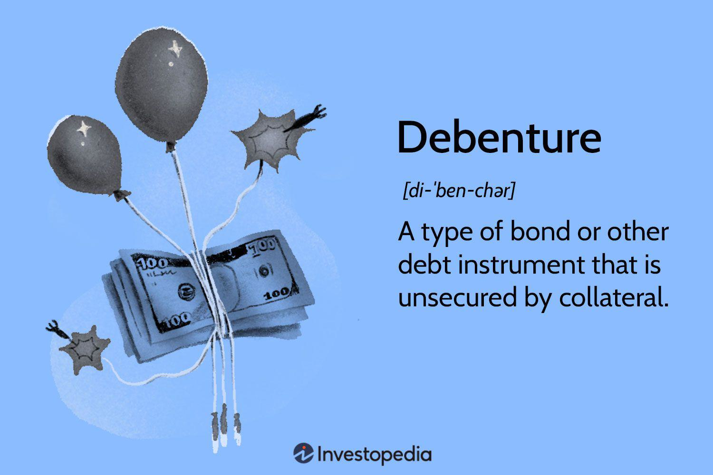

Debentures are a distinct category of debt instruments extensively utilized by both corporations and governments as a means to secure funding. Unlike traditional bonds, debentures do not require backing by physical assets or collateral; instead, they depend on the creditworthiness and reputation of the issuer. This reliance on issuer reliability marks a key differentiator in the realm of financial instruments. As such, debentures hold a significant place in the strategy of financial management, offering unique opportunities and challenges in portfolio diversification.

The examination of debentures in this article addresses fundamental characteristics and variations of this instrument, exploring the strategic advantages they provide to investors. A clear understanding of debentures enables investors to make informed decisions, especially when considering the sophisticated capabilities of modern algorithmic trading. Such trading methodologies optimize buying and selling practices through automated systems, leveraging vast quantities of data to discern patterns and market conditions. This intersection of debentures and algorithmic trading can offer precision and efficiency in investment decisions, positioning debentures as a critical component of diversified financial strategies.



Furthermore, the potential for integrating debentures with advanced trading techniques presents intriguing opportunities for SEO strategy enhancement. By understanding how algorithmic trading influences debenture markets, stakeholders can develop SEO strategies that tap into relevant trends and data analyses, potentially amplifying the reach and impact of financial content. In the context of fast-paced and dynamic financial markets, the relevance and strategic application of debentures cannot be overlooked, demonstrating their role as an essential tool for risk-averse investors seeking stable returns without the associated volatility of equities.

## Table of Contents

## What is a Debenture?

A debenture refers to a type of debt instrument that does not require backing by physical assets or collateral. Unlike secured loans where tangible assets are pledged as security, debentures are supported primarily by the creditworthiness and reputation of the issuer, which may be a corporation or a government entity. The credibility and financial reliability of the issuer are paramount, influencing the investor's trust in the security.

Debentures are often characterized by long-term maturities, typically exceeding ten years, making them suitable for organizations seeking to garner long-term funding for expansive projects or operational strategies. This long-term nature aligns well with strategic financial planning and resource allocation over extended periods.

Investors who purchase debentures are compensated through regular interest payments known as coupon payments. These payments are predefined and fixed, providing investors with a predictable return on investment that can be particularly appealing in turbulent market conditions where other securities may exhibit higher volatility. The coupon payments continue throughout the life of the debenture, culminating in the return of the principal amount at maturity.

The structure of debentures provides an appealing financing option for issuers seeking to leverage their credit ratings without the need to liquidate or leverage physical assets. Simultaneously, it offers investors a relatively stable investment vehicle, promising steady returns derived from the issuer's promise rather than tangible security.

## Features of Debentures

Debentures generally exhibit a fixed [interest rate](/wiki/interest-rate-trading-strategies), which is a notable characteristic distinguishing them from other types of securities. This interest rate remains stable throughout the life of the debenture, providing predictable income for investors. Additionally, certain debentures contain provisions allowing their conversion into equity shares. This convertibility feature can be advantageous, as it provides investors with the potential for capital appreciation in addition to fixed interest income if the issuer's equity performs well.

The framework governing debentures is encapsulated within an indenture, a legal and binding contract that outlines the rights and obligations of both the issuer and the investors. The indenture specifies crucial details such as interest rates, maturity dates, and any special features, including conversion rights.

Credit ratings significantly influence debentures, as agencies evaluate the issuer's creditworthiness. High credit ratings denote lower risk for investors, which can lead to reduced interest rates on the debenture. Conversely, lower credit ratings indicate higher risk, necessitating higher interest rates to attract investors. These ratings are therefore critical in determining both the market's trust in the debenture and its subsequent interest rate.

Maturity dates are pivotal in debenture agreements, dictating the repayment timeline for principal amounts to holders. Depending on the terms outlined in the indenture, these dates can vary, but they often provide options for repayment, which may include early redemption clauses. Such flexibility is advantageous, offering issuers the ability to manage their financial obligations effectively while granting investors the potential for early return of capital.

## Types of Debentures

Debentures are a versatile and significant category of debt instruments, offering multiple variations to cater to diverse investor needs and issuer requirements. This section explores the primary types of debentures, focusing on their distinct characteristics and implications for investors.

**Convertible and Non-Convertible Debentures**: Convertible debentures provide the option to convert into equity shares of the issuing company after a predetermined period or upon reaching specific conditions. This feature offers investors potential capital appreciation through equity participation, blending the security of fixed income with equity investment opportunities. On the other hand, non-convertible debentures (NCDs) do not offer this conversion privilege, ensuring that the debentures remain a fixed-income investment until maturity.

**Secured vs. Unsecured Debentures**: Secured debentures are backed by specific assets, such as real estate or machinery, providing an additional layer of safety for investors in the event of issuer default. Such security reduces the risk exposure, potentially resulting in lower interest rates. Unsecured debentures, however, are not supported by collateral and rely solely on the issuer’s creditworthiness. While potentially offering higher yields due to increased risk, unsecured debentures require a robust credit assessment by investors.

**Redeemable vs. Irredeemable Debentures**: Redeemable debentures have a specified maturity date upon which the principal amount is to be repaid to investors. This characteristic provides certainty regarding the investment period and cash flow expectations. Conversely, irredeemable or perpetual debentures do not have a maturity date, and the principal remains outstanding indefinitely. Investors benefit from continuous interest payments but must assess the long-term credit risk associated with the issuer's capacity to maintain these payments over time.

**Bearer or Registered Debentures**: Bearer debentures are negotiable and can be transferred by mere delivery, as they are not registered to a specific owner. Interest payments are made to the holder of the physical debenture certificate. In contrast, registered debentures are recorded in the name of the investor by the issuing entity, and interest payments require identification verification. The choice between bearer and registered debentures hinges on factors such as ease of transfer and security of ownership.

The variety in debenture types reflects the diverse investment strategies and risk appetites of investors, alongside the various financial strategies employed by issuers to optimize their capital structure.

## Advantages of Debentures

Debentures offer several advantages that make them an appealing fixed-income investment option, especially for risk-averse individuals. One of the primary benefits is the provision of a reliable income stream through fixed interest payments. These payments are made regularly over the life of the debenture, ensuring that investors receive consistent returns on their investment.

In comparison to company stocks, debentures [carry](/wiki/carry-trading) less risk. This reduced risk profile arises from the fact that debenture holders receive preferential treatment over equity shareholders in the event of the issuer's liquidation. In such scenarios, debenture holders are prioritized in receiving payouts from the company's remaining assets, thereby providing a safety net that is not available to stockholders.

Convertible debentures present an additional advantage by offering the potential for capital gains. These financial instruments can be converted into equity shares of the issuing company at a later date, usually at the investor's discretion and under specified conditions. This convertibility feature allows investors to benefit from any increase in the company's stock price, enhancing the value of their initial investment.

For those seeking stable returns without the complexities and risks associated with stock ownership, debentures are an ideal choice. They provide a way to secure predictable income without diluting ownership stakes, making them a favorite among conservative investors who prioritize capital preservation and steady income over high-risk, high-reward opportunities.

## Risks Associated with Debentures

Debentures, as unsecured debt instruments, carry inherent risks that potential investors must consider. One significant risk is credit risk. This refers to the possibility that the issuer might fail to meet its financial obligations, either by missing interest payments or by not repaying the principal at maturity. Such failures can occur due to the issuer's financial deterioration, leading to default, which directly affects the investor's expected returns.

Another crucial consideration is interest rate risk. Fixed-rate debentures are particularly vulnerable to fluctuations in market interest rates. When these market rates rise, the fixed interest returns from debentures become less attractive, causing the market value of existing debentures to decline. This inverse relationship can be expressed as:

$$
\Delta P \approx -D \times \Delta y
$$

where $\Delta P$ is the change in the debenture's price, $D$ is the duration, and $\Delta y$ represents the change in interest rates. This formula is indicative, showing that price decreases as interest rates increase.

Liquidity risk is also a pertinent [factor](/wiki/factor-investing) affecting debentures. It pertains to the potential difficulty investors may encounter when trying to sell their debentures in secondary markets. Less liquid debentures can lead to longer holding periods than initially desired, impacting investors' ability to free up capital or adjust investment strategies in response to changing market conditions.

Lastly, debentures are susceptible to inflation risk. If the inflation rate surpasses the debenture's nominal coupon rate, the real purchasing power of the interest earned declines. This erosion of purchasing power means the fixed interest payments will buy less over time, ultimately diminishing the value of returns in real terms. Investors need to anticipate these risks carefully to manage their portfolios effectively.

## Algo Trading and Debentures

Algorithmic trading, often referred to as algo trading, is a method of executing orders using automated pre-programmed trading instructions. This approach leverages large data sets and mathematical models to evaluate market conditions, enabling informed, rapid trading decisions. In the context of debentures, this technology optimizes the buying and selling processes, enhancing investment strategies for both individual and institutional investors.

One of the primary advantages of using [algorithmic trading](/wiki/algorithmic-trading) in the debenture market is its capacity to efficiently analyze vast amounts of data. Algorithms can swiftly identify patterns and trends, assessing factors such as interest rate fluctuations, issuer credit ratings, and market sentiment. This comprehensive analysis allows traders to ascertain the intrinsic value of debentures, adjusting their strategies accordingly. For instance, when interest rates rise, the value of existing fixed-rate debentures may decrease. An algorithm can detect this shift and prompt timely trading actions to mitigate potential losses.

High-frequency trading ([HFT](/wiki/high-frequency-trading-strategies)), a subset of algorithmic trading, further enhances the efficiency of debenture markets. HFT utilizes powerful computers to execute multiple trades in milliseconds, adapting to market opportunities almost instantaneously. This speed offers a significant advantage in capturing favorable price points, providing [liquidity](/wiki/liquidity-risk-premium) to the market, and reducing the bid-ask spread. However, it's important to note that while HFT can enhance market dynamics, it also introduces complexities such as increased [volatility](/wiki/volatility-trading-strategies) and the potential for flash crashes.

By integrating algorithmic trading with debenture investments, traders gain a platform for precise, data-driven decisions. The algorithms can incorporate a variety of metrics, such as yield spreads, historical volatility, and economic indicators, to formulate strategies that align with an investor's risk tolerance and return expectations. For example, a Python script could be employed to process real-time data and execute trades based on predefined criteria. An example of such a script might look like this:

```python
import numpy as np
import pandas as pd

# Fetch and process market data
data = pd.read_csv("debenture_market_data.csv")
signals = np.where(data['interest_rate'] < data['historical_mean'], 1, 0)

# Execute trades based on signals
def execute_trade(signal):
    if signal == 1:
        print("Buy debentures")
    else:
        print("Sell debentures")

# Apply trading strategy
for signal in signals:
    execute_trade(signal)
```

In conclusion, the synergy between debenture investments and algorithmic trading presents a significant advantage in today's fast-paced markets. By automating the trading process and leveraging sophisticated analysis, investors can optimize their portfolios, balancing risk and reward with heightened precision and adaptability. This approach not only minimizes human error but also ensures a level of consistency and efficiency that is difficult to achieve through traditional trading methods.

## Conclusion

Debentures continue to serve as a vital component of diversified investment portfolios due to their appealing characteristics. They offer a predictable stream of income through fixed interest payments, thereby attracting risk-averse investors. By understanding the various types of debentures—such as convertible, non-convertible, secured, and unsecured—and their associated risks, investors can make informed decisions that align with their financial objectives. 

One critical advancement in financial markets is the rise of algorithmic trading, which provides innovative methods to enhance debenture investment strategies. Algorithms can efficiently process vast amounts of data to assess market conditions, predict price movements, and execute trades at optimal times. Such precision and speed enable investors to capitalize on market volatility and changes in interest rates more effectively.

Investors must carefully evaluate the risks and rewards associated with debentures. While debentures offer advantages over other investment vehicles, such as stocks, they are not without risk, including credit, interest rate, liquidity, and inflation risks. The diversification of debenture types within a portfolio can mitigate some of these risks, but it's crucial for investors to consider their personal risk tolerance and investment goals.

In conclusion, as financial markets continue to evolve, the interplay between traditional debt instruments like debentures and modern trading strategies offers new avenues for maximizing returns. Balancing the inherent risks and leveraging technological advancements in trading can enhance the strategic value of debentures in achieving a well-rounded financial portfolio.

## References & Further Reading

[1]: Mian, S.L. & Smith, C.W. (1990). ["Incentives for Unsophisticated Investors to Provide Bonds Relative to Insurance Contracts."](https://www.sciencedirect.com/science/article/pii/0165410190900456) The Journal of Finance, 45(5), 1651-1687.

[2]: ["Fixed Income Analysis"](https://en.wikipedia.org/wiki/Fixed_income_analysis) by Barbara S. Petitt, Jerald E. Pinto, and Wendy L. Pirie

[3]: ["Algorithmic Trading and DMA: An Introduction to Direct Access Trading Strategies"](https://www.amazon.com/Algorithmic-Trading-DMA-introduction-strategies/dp/0956399207) by Barry Johnson

[4]: Shah, A., Thomas, S. & Gorham, M. (2016). ["Algorithmic Trading: The Future of SEBI Regulation in India."](https://www.amazon.com/Indias-Financial-Markets-Insiders-Elsevier/dp/012374251X) Journal of Financial Regulation and Compliance.

[5]: ["Bond and Money Markets: Strategy, Trading, Analysis"](https://books.google.com/books/about/Bond_and_Money_Markets.html?id=c1N36C7LxU4C) by Moorad Choudhry.