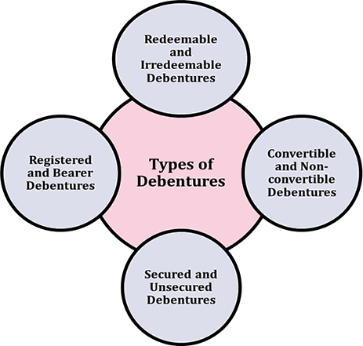

## Table of Contents

## What is a debenture?

A debenture is a type of bond or loan that a company issues to raise money. It's like a promise that the company will pay back the money it borrowed, plus interest, at a certain time. People or other companies who buy debentures are called debenture holders. They are lending money to the company and, in return, they get regular interest payments until the debenture matures, which is when the company pays back the full amount.

Debentures are different from other types of bonds because they are not backed by any specific assets of the company. This means that if the company can't pay back the money, debenture holders don't have a claim on any particular assets. Instead, they are considered general creditors. Because of this higher risk, debentures usually offer a higher interest rate to attract investors. Companies use debentures to finance big projects or expand their business without giving up ownership.

## How does a debenture differ from a bond?

A debenture and a bond are both ways for a company to borrow money, but they have some key differences. A bond is usually backed by specific assets of the company. This means if the company can't pay back the money, bondholders can claim those assets. On the other hand, a debenture is not backed by any specific assets. If a company fails to repay a debenture, the holders are considered general creditors and don't have a direct claim on any particular assets.

Because debentures are riskier for investors, they often offer higher interest rates to attract people to buy them. This higher interest rate is a way to compensate for the increased risk that comes with not having specific assets backing the loan. Both debentures and bonds help companies raise money, but the main difference lies in the security and the level of risk involved for the investor.

## What are the main types of debentures?

There are several types of debentures that companies can issue. One type is called a secured debenture. This is a bit confusing because even though debentures are usually not backed by specific assets, a secured debenture is an exception. It means the company promises certain assets as security for the loan. If the company can't pay back the money, the people who bought the debentures can claim those assets. Another type is an unsecured debenture, which is what people usually think of when they talk about debentures. This type is not backed by any specific assets, so it's riskier for the people buying them.

Another important type is a convertible debenture. This kind of debenture gives the holder the option to convert it into shares of the company's stock instead of getting their money back with interest. It's like having a choice between getting paid back in cash or becoming part-owner of the company. Lastly, there are redeemable and irredeemable debentures. Redeemable debentures have a set date when the company will pay back the money. Irredeemable debentures, on the other hand, don't have a fixed date for repayment. Instead, the company can choose when to pay back the money, which can be riskier for the people who bought the debentures.

## What are secured debentures and how do they work?

Secured debentures are a type of debenture that is backed by specific assets of the company. This means that if the company can't pay back the money it borrowed, the people who bought the debentures can claim those specific assets. It's like having a safety net for the investors because they have a guarantee that they can get something valuable if the company can't pay them back.

These debentures work by the company promising certain assets as security for the loan. For example, a company might use its buildings, equipment, or other valuable property as collateral. If the company does well and can pay back the money, everything goes smoothly, and the investors get their interest payments and their money back when the debenture matures. But if the company fails, the investors can take the assets that were promised to them, which makes secured debentures less risky than unsecured ones.

## What are unsecured debentures and what are the risks involved?

Unsecured debentures are a type of loan that a company takes without promising any specific assets as security. If the company can't pay back the money, the people who bought these debentures don't have any particular assets they can claim. They are considered general creditors, which means they have to wait in line with other people who are owed money by the company.

The main risk with unsecured debentures is that they are riskier for the investors. Since there's no specific asset backing the loan, if the company goes bankrupt, the investors might not get their money back. To make up for this higher risk, companies usually offer higher interest rates on unsecured debentures to attract people to buy them. But even with the higher interest, there's still a chance that investors could lose their money if the company can't pay back what it owes.

## Can you explain convertible debentures and their benefits?

Convertible debentures are special kinds of loans that a company can offer. They work like regular debentures where the company borrows money and promises to pay it back with interest. But what makes them different is that the people who buy these debentures can choose to turn them into shares of the company's stock instead of getting their money back with interest. This choice is like having a special ticket that lets you decide if you want to get paid back in cash or become part-owner of the company.

The main benefit of convertible debentures for the people who buy them is that they get to choose between getting their money back with interest or owning part of the company. If the company does well and its stock price goes up, turning the debenture into stock could be a good deal. It's like betting on the company's success. For the company, offering convertible debentures can be a good way to borrow money without having to pay back as much interest right away, because people might choose to convert their debentures into stock instead of taking the cash.

## What are non-convertible debentures and how are they used?

Non-convertible debentures are a type of loan that companies can take from people or other companies. Unlike convertible debentures, these cannot be turned into shares of the company's stock. When you buy a non-convertible debenture, you are lending money to the company, and they promise to pay you back the money you lent them plus interest at a certain time. These debentures are like a regular loan where you expect to get your money back with interest, but you don't have the option to become part-owner of the company.

Companies use non-convertible debentures to raise money for their business. They might need this money to start new projects, expand their business, or pay for other big expenses. Since these debentures don't offer the chance to convert into stock, they usually have to offer a higher interest rate to attract people to buy them. This makes them a bit riskier for the company because they have to pay more in interest, but it can be a good way to get the money they need without giving up any ownership in their company.

## What are the key features of redeemable debentures?

Redeemable debentures are a type of loan that a company takes with a promise to pay back the money at a specific time. This means if you buy a redeemable debenture, you know exactly when you will get your money back, plus the interest that the company owes you. The company sets a date, called the redemption date, when they will repay the full amount of the loan. This makes redeemable debentures more predictable for people who buy them because they can plan for when they will get their money back.

These debentures are useful for companies because they can borrow money knowing they have a set time to pay it back. It helps them plan their finances better. For the people who buy redeemable debentures, it's a bit safer because they have a clear date for when they will be paid back. However, if the company can't pay back the money on the redemption date, it can cause problems for both the company and the people who lent the money.

## How do perpetual debentures function and who typically issues them?

Perpetual debentures are a type of loan that companies can take without ever having to pay back the actual money they borrowed. Instead, the company promises to keep paying interest on the loan forever. People who buy perpetual debentures get regular interest payments, but they never get their original money back. It's like getting a never-ending stream of interest payments. Because the company doesn't have to pay back the money, these debentures can be riskier for the people who buy them, but they might offer higher interest rates to make up for that risk.

Usually, big and stable companies, like banks or financial institutions, issue perpetual debentures. These companies are seen as more reliable, so people might feel safer lending them money without expecting to get it back. Governments might also use perpetual debentures, known as consols, to raise money. These companies or governments use the money they raise from perpetual debentures for long-term projects or to keep their operations running smoothly, knowing they only have to worry about paying the interest and not the principal amount.

## What are the interest payment options available with debentures?

Debentures can have different ways of paying interest. One common way is fixed interest, where the company pays a set amount of interest regularly, like every year or every six months. This is like getting a steady paycheck from the company for lending them money. Another way is floating interest, where the interest rate changes based on something like a bank's rate. This means the amount of interest you get can go up or down, depending on what's happening with that rate.

Some debentures also offer zero-coupon interest. With these, the company doesn't pay any interest during the time you hold the debenture. Instead, they pay you back more than what you lent them when the debenture matures. It's like getting all your interest at once at the end. Lastly, there are debentures with variable or step-up interest rates. These can change over time, maybe going up after a certain number of years. This gives you the chance to get more interest as time goes on, but it can also make things a bit less predictable.

## How do debentures impact a company's financial structure and credit rating?

When a company issues debentures, it's like taking out a loan. This loan becomes part of the company's financial structure, which is like a big picture of how the company is paying for things. Debentures add to the company's debt, which means the company has to pay back the money it borrowed plus interest. This can make the company's financial structure more complicated because it has more things to pay for. If the company is doing well and can handle the extra debt, it might not be a big problem. But if the company is struggling, adding more debt with debentures can make things harder.

Debentures can also affect a company's credit rating, which is like a score that tells people how safe it is to lend money to the company. If a company issues a lot of debentures and its debt goes up, credit rating agencies might think the company is riskier. They might lower the company's credit rating, which makes it harder and more expensive for the company to borrow more money in the future. On the other hand, if the company is seen as strong and can easily pay back the debentures, its credit rating might stay the same or even go up. So, debentures can change how people see the company's financial health and its ability to handle debt.

## What are the tax implications of investing in debentures for both issuers and investors?

For companies that issue debentures, the interest they pay to investors is usually a business expense. This means they can subtract this interest from their income before they calculate how much tax they owe. This can help lower the company's tax bill. But, if the company can't pay back the money it borrowed, it might have to deal with other tax problems, like not being able to use certain tax benefits because it's in financial trouble.

For people who invest in debentures, the interest they get is usually counted as income. This means they have to pay tax on it, just like they would on money they earn from a job. The tax rate they pay depends on how much money they make overall. Sometimes, if the debentures are held in special accounts like retirement funds, the tax rules can be different, and the investor might not have to pay tax on the interest right away.

## What are the risks associated with debentures?

Debentures, as unsecured debt instruments, carry inherent risks that potential investors must consider. One significant risk is credit risk. This refers to the possibility that the issuer might fail to meet its financial obligations, either by missing interest payments or by not repaying the principal at maturity. Such failures can occur due to the issuer's financial deterioration, leading to default, which directly affects the investor's expected returns.

Another crucial consideration is interest rate risk. Fixed-rate debentures are particularly vulnerable to fluctuations in market interest rates. When these market rates rise, the fixed interest returns from debentures become less attractive, causing the market value of existing debentures to decline. This inverse relationship can be expressed as:

$$
\Delta P \approx -D \times \Delta y
$$

where $\Delta P$ is the change in the debenture's price, $D$ is the duration, and $\Delta y$ represents the change in interest rates. This formula is indicative, showing that price decreases as interest rates increase.

Liquidity risk is also a pertinent [factor](/wiki/factor-investing) affecting debentures. It pertains to the potential difficulty investors may encounter when trying to sell their debentures in secondary markets. Less liquid debentures can lead to longer holding periods than initially desired, impacting investors' ability to free up capital or adjust investment strategies in response to changing market conditions.

Lastly, debentures are susceptible to inflation risk. If the inflation rate surpasses the debenture's nominal coupon rate, the real purchasing power of the interest earned declines. This erosion of purchasing power means the fixed interest payments will buy less over time, ultimately diminishing the value of returns in real terms. Investors need to anticipate these risks carefully to manage their portfolios effectively.

## References & Further Reading

[1]: Mian, S.L. & Smith, C.W. (1990). ["Incentives for Unsophisticated Investors to Provide Bonds Relative to Insurance Contracts."](https://www.sciencedirect.com/science/article/pii/0165410190900456) The Journal of Finance, 45(5), 1651-1687.

[2]: ["Fixed Income Analysis"](https://en.wikipedia.org/wiki/Fixed_income_analysis) by Barbara S. Petitt, Jerald E. Pinto, and Wendy L. Pirie

[3]: ["Algorithmic Trading and DMA: An Introduction to Direct Access Trading Strategies"](https://www.amazon.com/Algorithmic-Trading-DMA-introduction-strategies/dp/0956399207) by Barry Johnson

[4]: Shah, A., Thomas, S. & Gorham, M. (2016). ["Algorithmic Trading: The Future of SEBI Regulation in India."](https://www.amazon.com/Indias-Financial-Markets-Insiders-Elsevier/dp/012374251X) Journal of Financial Regulation and Compliance.

[5]: ["Bond and Money Markets: Strategy, Trading, Analysis"](https://books.google.com/books/about/Bond_and_Money_Markets.html?id=c1N36C7LxU4C) by Moorad Choudhry.