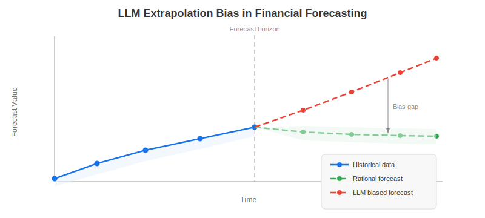
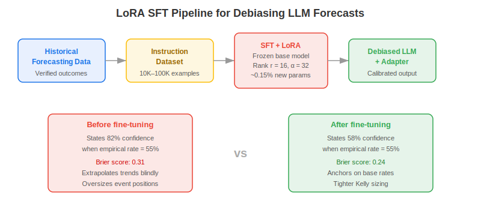
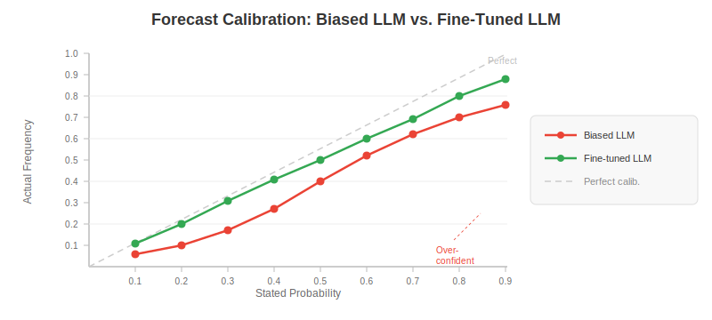

**Debiasing LLM forecasts** through supervised fine-tuning (SFT) with Low-Rank Adaptation (LoRA) is an emerging technique that corrects the systematic extrapolation errors large language models make when predicting economic and financial outcomes. Pretrained LLMs inherit a tendency to over-extend recent trends into their forecasts — a bias encoded in transformer weights through exposure to trend-following narrative in training data. For quantitative traders, this miscalibration translates into inflated confidence in momentum plays and underweighted probability of mean reversion. By training a lightweight adapter layer on instruction datasets built from historically verified rational forecasts, practitioners can shift the model's internal probability mapping without retraining billions of parameters.

## Table of Contents

## What Is LLM Extrapolation Bias?

**LLM extrapolation bias** is the tendency of large language models to forecast future values by over-fitting to recent directional trends rather than anchoring on long-run base rates, structural priors, or mean-reverting dynamics. In financial forecasting, the bias manifests in two economically costly ways. First, LLMs over-predict trend continuation: when asked to forecast earnings growth after three strong consecutive quarters, they assign too much probability to a fourth positive outcome without discounting the historical base rate of earnings reversals — which runs at roughly 35–40% in S&P 500 constituents. Second, they under-predict mean reversion in macro series: after a spike in CPI, LLMs typically assign too low a probability to a rapid decline even when central bank policy is actively tightening.



Prompt-based corrections — instructing the model to "be calibrated" or to "consider base rates" — appear largely ineffective at the parameter level. The bias is structural, not superficial: it reflects how the attention mechanism responds to local context, making recency-weighted extrapolation the path of least resistance regardless of how the prompt is phrased. Hu et al. (2021) demonstrated that parameter-level interventions via LoRA are far more durable than prompt engineering for aligning model behaviour to specific statistical properties.

## How Fine-Tuning with LoRA Addresses the Bias

**Low-Rank Adaptation** (LoRA) injects a pair of small trainable matrices into each transformer attention layer while freezing the original model weights. If the pretrained weight matrix is $W \in \mathbb{R}^{d \times k}$, LoRA replaces the update $\Delta W$ with a low-rank decomposition:

$$\Delta W = B A, \quad B \in \mathbb{R}^{d \times r},\; A \in \mathbb{R}^{r \times k}, \quad r \ll \min(d, k)$$

At rank $r = 16$, a 7B-parameter model gains roughly 4–8 million new trainable parameters — under 0.15% of total model size. The base model remains frozen throughout, so inference with or without the adapter requires no architectural changes and the adapter can be swapped at runtime.



The debiasing approach, studied in "Debiasing LLMs by Fine-tuning" (2025), proceeds in three steps:

**Step 1 — Build a rational benchmark dataset.** Historical forecasting challenges with verifiable outcomes are collected: economic indicator predictions from central bank surveys, earnings estimate consensus data, and prediction market resolutions. Each example is formatted as an instruction prompt (`Given [historical context], what is the probability that [outcome] occurs?`) with the ground-truth label derived from actual outcomes, not from any LLM's prior prediction. Datasets of 10,000–100,000 examples are sufficient for stable adapter convergence.

**Step 2 — SFT with LoRA.** The instruction dataset is used to fine-tune the LLM with standard cross-entropy loss on the target probability tokens. LoRA rank $r = 16$ with scaling factor $\alpha = 32$ is a common starting point. A single A100 GPU completes the adapter training in 2–8 hours for a 7B model, making this feasible for well-resourced quant teams and accessible via cloud infrastructure for others.

**Step 3 — Evaluate with proper scoring rules.** Accuracy alone is insufficient. The correct metric is a proper scoring rule: Brier score for binary outcomes, continuous ranked probability score (CRPS) for distributional forecasts, and the reliability component of the Brier score decomposition — which measures the gap between stated probability and empirical outcome frequency across probability bins.

## Calibration Before and After Fine-Tuning

The calibration improvement is best visualised as a reliability diagram: a plot of stated probability bins (x-axis) against observed outcome frequency (y-axis). A perfectly calibrated forecaster lies on the diagonal. Pretrained LLMs without debiasing typically bow away from the diagonal: they are over-confident at high probabilities (stating 80% when the empirical frequency is 60%) and under-confident at low probabilities.



Fine-tuned adapters substantially close this gap. The debiasing effect is strongest in the 0.6–0.9 probability range, where overconfidence is most pronounced in untuned models — and also where a systematic trader would most aggressively size positions using [Kelly criterion](https://paperswithbacktest.com/wiki/kelly-criterion-position-sizing) or similar frameworks. An overconfident LLM in this range leads to systematic over-sizing and elevated drawdowns in event-driven strategies.

## Practical Architecture for Quant Forecasting

The most useful deployment pattern integrates a debiased LLM into an [LLM trading agent](https://paperswithbacktest.com/wiki/llm-trading-agents) as the probability-estimation module, while keeping signal generation and execution deterministic. Below is a minimal inference skeleton using HuggingFace PEFT:

```python
from transformers import AutoModelForCausalLM, AutoTokenizer
from peft import PeftModel
import torch, re

base = AutoModelForCausalLM.from_pretrained("mistralai/Mistral-7B-v0.1")
tokenizer = AutoTokenizer.from_pretrained("mistralai/Mistral-7B-v0.1")

# Swap in the debiasing LoRA adapter
model = PeftModel.from_pretrained(base, "path/to/debiasing-lora-adapter")
model.eval()

def forecast_probability(context: str, question: str) -> float:
    prompt = (
        f"Historical context:\n{context}\n\n"
        f"Question: {question}\n"
        "Output a calibrated probability between 0 and 1:"
    )
    inputs = tokenizer(prompt, return_tensors="pt")
    with torch.no_grad():
        out = model.generate(**inputs, max_new_tokens=8, temperature=0.05)
    text = tokenizer.decode(out[0], skip_special_tokens=True)
    m = re.search(r"0\.\d+|1\.0\b", text.split("probability")[-1])
    return float(m.group()) if m else 0.5
```

The debiased model is invoked for event-probability inputs — the probability that next month's CPI exceeds consensus, that a company beats earnings by more than 5%, or that a central bank surprises with a 50 bps cut. These calibrated probabilities feed position sizing rather than being used as raw signals.

## Debiased Fine-Tuning vs. Classic Calibration Methods

Calibration post-processing — isotonic regression, Platt scaling, temperature scaling — has been used for decades to correct classifier outputs. The question is whether LoRA fine-tuning adds value beyond these simpler approaches.

| Method | Mechanism | Requires retraining | Generalises to new domains |
|---|---|---|---|
| Isotonic regression | Monotone post-hoc calibration | No | Limited |
| Platt scaling | Sigmoid post-hoc scaling | No | Limited |
| Temperature scaling | Single-parameter softmax adjustment | No | Limited |
| LoRA SFT | Parameter-level adapter | Yes (adapter only) | Strong |

The key advantage of LoRA fine-tuning is that calibration is learned at the representation level, not as a post-hoc patch on the output distribution. This means the debiasing generalises to novel forecasting tasks in the same domain — new economic indicators, new earnings regimes, new policy environments — because the model's underlying reasoning process has been adjusted. Post-hoc methods are learned on a fixed dataset and fail silently when the input distribution shifts, which in financial markets is the rule, not the exception. This is analogous to how [foundation models for financial time series](https://paperswithbacktest.com/wiki/foundation-models-financial-time-series) generalise better than models trained on a single asset or regime.

## Practical Considerations in Algo Trading

**Data quality dominates.** The instruction dataset determines the quality of the debiasing. Using analyst consensus forecasts as labels is tempting but introduces its own correlated bias — the crowd is systematically wrong in certain regimes. Better labels come from prediction market resolutions (Metaculus, Kalshi), retrospective Bayesian analysis, or expert survey panels with documented track records spanning multiple cycles.

**Adapter versioning.** A LoRA adapter trained on 2015–2023 economic forecasting data should be retrained annually. Financial base rates shift with structural regime changes — post-GFC, post-COVID, post-rate-normalisation — and an adapter calibrated on one era can underperform in another. Treat adapters as model artefacts with the same governance as strategy code.

**Evaluation requires proper scoring rules.** Accuracy ("did the model pick the right outcome?") is insufficient and can be gamed by predicting the base rate mechanically. Brier score decomposition — separating reliability, resolution, and uncertainty components — reveals whether the model is well-calibrated across the full probability range or only at the extremes.

**Model size effects.** Smaller models (7B parameters) show larger calibration improvements from LoRA fine-tuning than larger models (70B+), which are somewhat more self-calibrating out of the box due to richer in-context learning. For resource-constrained trading infrastructure, a 7B debiased model can outperform a naive 70B model on calibration benchmarks at a fraction of the inference cost.

**Look-ahead discipline.** Building instruction datasets from historical forecasting challenges requires strict temporal discipline — a risk documented in detail in the [look-ahead bias in LLM trading](https://paperswithbacktest.com/wiki/look-ahead-bias-llm-trading) literature. Any future-dated outcome used as a training label must be excluded from the context provided to the model, and dataset construction should enforce point-in-time availability of all inputs.

**Integration with NLP pipelines.** Debiased LLMs pair naturally with [NLP sentiment analysis](https://paperswithbacktest.com/wiki/nlp-sentiment-analysis-trading) pipelines: the sentiment model extracts a directional signal from text, and the debiased LLM converts that signal into a calibrated probability that the market will respond in a given direction. Separating extraction from estimation keeps each component testable in isolation.

## Conclusion

Debiasing LLM forecasts with LoRA fine-tuning addresses a specific and economically meaningful failure mode: the tendency of pretrained language models to extrapolate trends rather than reason from base rates. For systematic traders who use LLMs as probability-estimation engines within event-driven or news-driven pipelines, a calibrated adapter produces better position sizing and more realistic expected-value calculations than either raw LLM output or simple post-hoc scaling. As larger instruction datasets from prediction markets and structured forecasting tournaments become available, adapter-based debiasing will likely become standard practice for any LLM-powered quant application that depends on probability rather than direction alone.

## References & Further Reading

[1]: [Debiasing LLMs by Fine-tuning (2025)](https://arxiv.org/abs/2604.02921v1)
[2]: [LoRA: Low-Rank Adaptation of Large Language Models (Hu et al., 2021)](https://arxiv.org/abs/2106.09685)
[3]: [Strictly Proper Scoring Rules, Prediction, and Estimation (Gneiting & Raftery, 2007)](https://doi.org/10.1198/016214506000001437)
[4]: [Zero-Shot LLM Forecasting for the Stock Market](https://paperswithbacktest.com/wiki/zero-shot-forecasting-stock-market)
[5]: [Foundation Models for Financial Time Series](https://paperswithbacktest.com/wiki/foundation-models-financial-time-series)
[6]: [LLM Trading Agents Explained](https://paperswithbacktest.com/wiki/llm-trading-agents)
