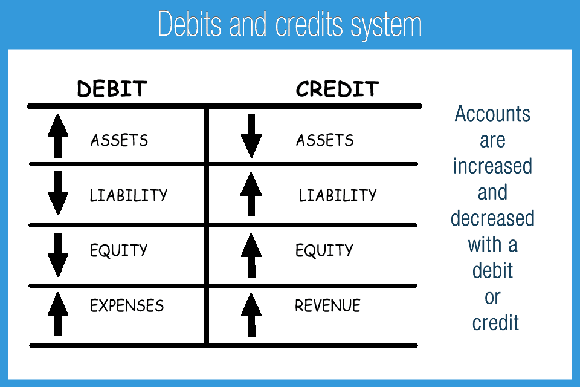

## Table of Contents

## What is the basic definition of debit and credit in accounting?

In accounting, debit and credit are terms used to describe the two sides of a financial transaction. A debit is an entry on the left side of an account, and it represents an increase in assets or expenses, or a decrease in liabilities, equity, or revenue. For example, when you buy office supplies, you debit the office supplies expense account because it increases your expenses.

On the other hand, a credit is an entry on the right side of an account. It represents an increase in liabilities, equity, or revenue, or a decrease in assets or expenses. Using the same example, when you buy office supplies, you credit the cash account because it decreases your assets. Understanding debits and credits is essential for keeping accurate financial records and ensuring that the accounting equation (Assets = Liabilities + Equity) remains balanced.

## How do debits and credits affect different types of accounts (assets, liabilities, equity)?

Debits and credits work differently depending on the type of account. For asset accounts, like cash or inventory, a debit increases the account balance while a credit decreases it. This makes sense because when you buy something, you debit the asset account to show you have more of that asset. When you sell or use it, you credit the account to show you have less.

For liability accounts, like loans or accounts payable, and equity accounts, like owner's equity, the opposite is true. A credit increases these accounts, while a debit decreases them. So, when you take out a loan, you credit the loan account to show you owe more money. When you pay it back, you debit the account to show you owe less. The same goes for equity; when you invest more money into your business, you credit the equity account, and when you take money out, you debit it.

This system helps keep the accounting equation balanced. Every transaction has a debit and a credit, and they must equal each other. This way, if you increase one account with a debit, you must decrease another with a credit, or vice versa, ensuring that the total of what you own (assets) always equals the total of what you owe (liabilities) plus what you've invested (equity).

## Can you explain the double-entry system in relation to debits and credits?

The double-entry system is a way of recording financial transactions where every transaction affects at least two accounts. This means for every debit entry, there must be a corresponding credit entry, and the total amount of debits must equal the total amount of credits. This system helps keep the accounting equation balanced, making sure that the [books](/wiki/algo-trading-books) are always correct. For example, if you buy a new computer for your business, you would debit the computer equipment account (an asset) because you're adding a new asset. At the same time, you would credit the cash account (also an asset) because you're using cash to buy the computer.

This system is important because it helps prevent errors and fraud. If the total debits don't match the total credits, it's a sign that something is wrong and needs to be fixed. It also gives a clear picture of where money is coming from and where it's going. So, if you take out a loan, you would credit the loan account (a liability) because you owe more money, and debit the cash account (an asset) because you have more cash. This way, the increase in your liabilities is balanced by the increase in your assets, keeping everything in line.

## What are some common examples of transactions that involve debits and credits?

When you buy something for your business, like office supplies, you record it with a debit and a credit. You debit the office supplies expense account because you're spending money on supplies, which increases your expenses. At the same time, you credit the cash account because you're using cash to pay for the supplies, which decreases your cash. This keeps your books balanced because the increase in expenses is matched by the decrease in cash.

Another common transaction is when you sell a product. If you sell a product for cash, you debit the cash account because you're getting more cash, which increases your assets. You credit the sales revenue account because you're making money from the sale, which increases your revenue. If you sell on credit, you debit accounts receivable instead of cash because someone owes you money, and you still credit the sales revenue account. Both ways, the increase in assets or receivables is balanced by the increase in revenue.

Paying off a loan is another example. When you pay back part of a loan, you debit the loan account because you're reducing what you owe, which decreases your liabilities. You credit the cash account because you're using cash to pay off the loan, which decreases your assets. This way, the decrease in liabilities is balanced by the decrease in assets, keeping your accounting equation in balance.

## How do debits and credits work in the context of a trial balance?

A trial balance is a report that lists all the accounts in your books and their balances at a certain time. It helps you check if your debits and credits are correct. You list all the accounts on the report, with debit balances on one side and credit balances on the other. The total of the debit side should equal the total of the credit side. If they don't match, it means there's a mistake somewhere in your books that you need to fix.

For example, if your cash account has a balance of $5,000, you put that on the debit side of the trial balance because cash is an asset and assets have debit balances. If your accounts payable has a balance of $3,000, you put that on the credit side because accounts payable is a liability and liabilities have credit balances. If all your debits and credits are correct, the total debits will equal the total credits, showing your books are balanced.

## What is the impact of debits and credits on the income statement and balance sheet?

Debits and credits affect the income statement by showing how much money your business makes and spends. On the income statement, revenues have credit balances, so when you make a sale, you credit the sales revenue account. This increases your revenue. Expenses, on the other hand, have debit balances. So, when you spend money on things like rent or supplies, you debit the expense accounts. This increases your expenses. The goal is to have more revenue than expenses, which gives you a net profit. If your expenses are higher, you have a net loss. The income statement helps you see if your business is making money or losing money over a period of time.

Debits and credits also affect the balance sheet, which shows what your business owns and owes at a specific point in time. Assets, like cash and inventory, have debit balances. So, when you buy something, you debit the asset account, increasing your assets. Liabilities, like loans and accounts payable, and equity, like owner's investment, have credit balances. When you take out a loan or get more investment, you credit the liability or equity account, increasing what you owe or what you've invested. The balance sheet must always balance, so the total of your assets should equal the total of your liabilities plus equity. This ensures that your books are correct and that you have a clear picture of your financial position.

## How do you handle errors in debit and credit entries?

If you find an error in your debit and credit entries, the first step is to figure out what went wrong. Common mistakes include entering the wrong amount, putting a debit where there should be a credit, or forgetting to record a transaction altogether. Once you know what the error is, you can fix it by making a correcting entry. This means you make another entry that undoes the mistake. For example, if you accidentally debited an account instead of crediting it, you would credit the account to fix it and debit the right account to keep everything balanced.

After you fix the error, it's important to check your work. You can do this by running a trial balance again to make sure your debits and credits match up. If they don't, you might need to look for more errors. Keeping good records and double-checking your entries can help prevent mistakes in the first place. If you're still having trouble, talking to an accountant or using accounting software can help you catch and fix errors more easily.

## What are the differences between debit and credit in banking versus accounting?

In banking, the terms "debit" and "credit" can be confusing because they are used differently than in accounting. When you go to the bank, a debit means money is taken out of your account. For example, if you use your debit card to buy something, money is debited from your account, which means your balance goes down. On the other hand, a credit in banking means money is added to your account. If you deposit a check, the bank credits your account, and your balance goes up. So, in banking, debit means a decrease in your account balance, and credit means an increase.

In accounting, the meanings of debit and credit are different and depend on the type of account. A debit in accounting is an entry on the left side of an account that increases assets or expenses but decreases liabilities, equity, or revenue. For example, when a business buys supplies, it debits the supplies expense account. A credit in accounting is an entry on the right side of an account that increases liabilities, equity, or revenue but decreases assets or expenses. Using the same example, the business would credit the cash account when buying supplies. The key thing to remember is that in accounting, every transaction has both a debit and a credit to keep the books balanced.

## How do debits and credits apply to more complex accounting scenarios like accruals and deferrals?

In accounting, accruals and deferrals are used to match revenues and expenses to the time periods they affect, even if the cash hasn't been received or paid yet. When you have an accrual, like an expense you've incurred but haven't paid for yet, you record it by making a debit to the expense account and a credit to a liability account, like accounts payable. This shows that you owe money for something you've already used or benefited from. For example, if you receive a utility bill at the end of the month but don't pay it until the next month, you would debit utilities expense and credit accounts payable. This way, the expense is recorded in the right period, even though the cash hasn't left your account yet.

Deferrals work the other way around. They involve recording revenues or expenses before the cash is received or paid. If you pay for something in advance, like insurance for the next year, you would debit an asset account, like prepaid insurance, and credit the cash account. As time goes by, you would then debit an expense account, like insurance expense, and credit the prepaid insurance account to move the cost from an asset to an expense over the period the insurance covers. This keeps your financial statements accurate by showing the expense in the periods it affects, not just when you paid for it. Both accruals and deferrals help make sure your financial statements give a true picture of your business's financial health.

## Can you discuss the role of debits and credits in financial analysis and decision-making?

Debits and credits play a big role in financial analysis because they help you understand where your money is coming from and where it's going. When you look at your financial statements, like the income statement and balance sheet, you can see how debits and credits affect your revenues, expenses, assets, liabilities, and equity. This information is important for figuring out if your business is making money or losing money, and if it's growing or shrinking. By analyzing these numbers, you can see trends and patterns that help you make better decisions about how to run your business. For example, if you notice that your expenses are going up faster than your revenues, you might decide to cut costs or find ways to increase sales.

In decision-making, knowing how debits and credits work can help you plan for the future. For instance, if you're thinking about taking out a loan to buy new equipment, you can use debits and credits to see how this will affect your financial statements. You would credit the loan account to show you owe more money, and debit the equipment account to show you have more assets. This helps you see how the loan will change your financial position and whether it's a good idea. By understanding the impact of debits and credits, you can make smarter choices about investments, expenses, and other financial moves that will help your business succeed.

## What are some advanced techniques for using debits and credits in forensic accounting?

In forensic accounting, debits and credits are used to look closely at financial records to find signs of fraud or mistakes. Forensic accountants might use a technique called "journal entry testing," where they check the debits and credits in the journal entries to see if they make sense. They look for strange patterns, like lots of entries made at odd times or entries that don't match up with what the business usually does. By carefully going through the debits and credits, they can spot things that might be hidden, like someone moving money around to cover up fraud.

Another technique is "reconstructing financial statements." Forensic accountants might take all the debits and credits and put them back together in a new way to see the real picture of what's going on. They can use this to find out if someone has been changing the numbers to make the business look better than it is. By looking at the debits and credits in different ways, they can find out if money is missing or if someone has been lying about the financial health of the business. This helps them figure out what really happened and if any laws were broken.

## How do international accounting standards affect the use of debits and credits?

International accounting standards, like those set by the International Financial Reporting Standards (IFRS), make sure that businesses around the world use the same rules for recording their financial information. Even though these standards don't change the basic idea of debits and credits, they can affect how transactions are recorded. For example, under IFRS, businesses might need to use different ways to figure out how much something is worth or when to record a sale, which can change the timing and amount of debits and credits.

These standards also mean that businesses have to be careful about how they use debits and credits to make sure they follow the rules. For instance, IFRS might require businesses to record some expenses in a different way than they used to, which means they need to adjust their debits and credits. By following these standards, businesses can make sure their financial statements are clear and easy to understand for people all over the world, helping them make better decisions and trust the numbers they see.

## References & Further Reading

[1]: ["Accounting: Tools for Business Decision Making"](https://www.amazon.com/Accounting-Tools-Business-Decision-Making/dp/1119494788) by Paul D. Kimmel, Jerry J. Weygandt, and Donald E. Kieso

[2]: Hull, J. C. (2018). ["Options, Futures, and Other Derivatives"](https://www.semanticscholar.org/paper/Options%2C-Futures%2C-and-Other-Derivatives-Hull/89bdee500c8623864fc9eb7a471546aa713acc44) (10th ed.). Pearson.

[3]: ["Algorithmic Trading and DMA: An Introduction to Direct Access Trading Strategies"](https://archive.org/details/algorithmictradi0000john) by Barry Johnson

[4]: ["Financial Statement Analysis and Security Valuation"](https://www.amazon.com/Financial-Statement-Analysis-Security-Valuation/dp/0073379662) by Stephen H. Penman

[5]: ["Python for Finance: Mastering Data-Driven Finance"](https://www.amazon.com/Python-Finance-Mastering-Data-Driven/dp/1492024333) by Yves Hilpisch