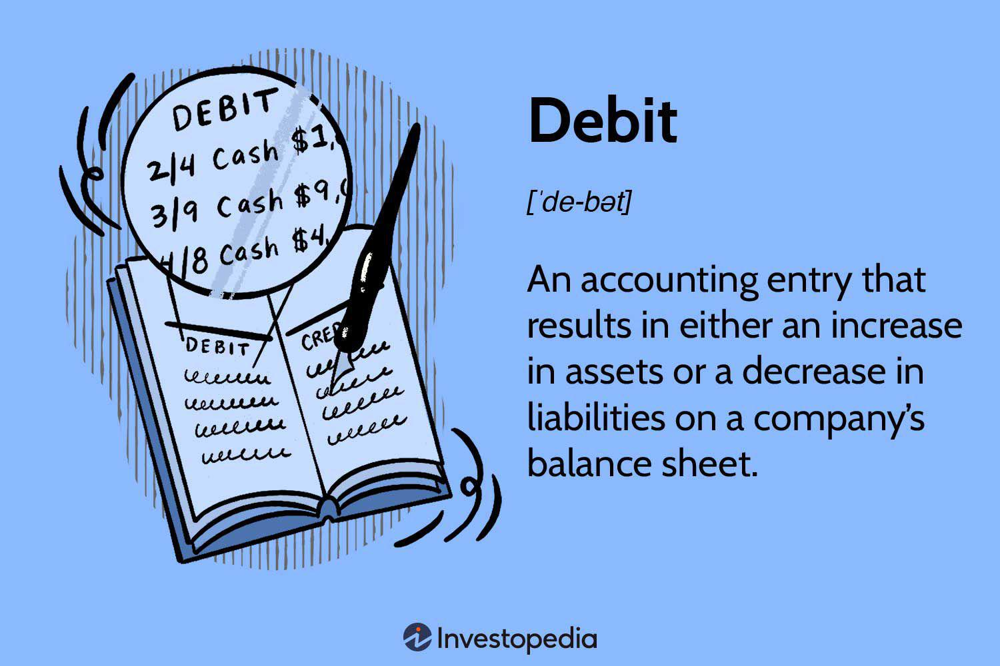

In today's fast-evolving financial landscape, a comprehensive understanding of both accounting principles and advanced trading techniques is essential for financial decision-making. The integration of these disciplines has become particularly relevant with the rise of algorithmic trading, which leverages computer programs to make rapid and data-driven trading decisions. At the core of this intersection lies the fundamental accounting concept of debits and credits, a dual-entry bookkeeping system that helps maintain balanced and accurate financial statements.

Debits and credits serve as the backbone of financial accounting, ensuring that every financial transaction is accurately recorded by affecting at least two accounts in contrasting ways. In this bilateral system, debits increase assets or expenses, while credits decrease them. Conversely, credits increase liabilities, equity, or revenue, while debits have the opposite effect. This balance is crucial for creating reliable financial records, which are integral to informed investing strategies.



Algorithmic trading utilizes these precise financial records to execute predefined trading strategies at speeds and efficiencies beyond human capabilities. A robust understanding of how accounting principles, particularly debits and credits, integrate with algorithmic trading strategies is crucial for optimizing automated investment decisions and ensuring the accuracy of transaction records. By merging traditional accounting frameworks with innovative trading technologies, investors can achieve more rigorous financial analysis and forecasting, crucial for navigating today's complex financial markets.

## Table of Contents

## Understanding Debits and Credits in Accounting

Debits and credits constitute the core of double-entry bookkeeping, a method integral to maintaining the accuracy and balance of financial statements. This system operates on a simple but powerful principle: for every financial transaction, there are two corresponding entries—a debit and a credit—that maintain the accounting equation, Assets = Liabilities + Equity.

Debits, on one hand, are entries on the left side of an account ledger and are associated with increases in asset or expense accounts. They also correspondingly reduce liability, equity, or revenue accounts. For example, when a business purchases office supplies for cash, the office supplies (an asset) account is debited, indicating an increase, while the cash (also an asset) account is credited, reflecting a decrease in available funds. In terms of a simple balance sheet representation, the formula impacts are often noted as:

- $\Delta \text{Assets} = +\Delta$
- $\Delta \text{Expenses} = +\Delta$

Conversely, credits are recorded on the right side of an account. These entries denote increases in liability, equity, or revenue accounts but decrease assets or expenses. For instance, when a company earns revenue, the bank account (an asset) is debited, while the revenue account is credited, representing an increase in income. Such transactions can be expressed as:

- $\Delta \text{Liabilities} = +\Delta$
- $\Delta \text{Equity} = +\Delta$
- $\Delta \text{Revenue} = +\Delta$

The dual approach of debits and credits ensures that the accounting equation remains balanced after every transaction. This mechanism provides a system of checks and balances that helps prevent errors and fraud. Properly managing these entries is essential for compiling accurate financial statements, such as the balance sheet, income statement, and statement of cash flows.

In practice, accounting systems often utilize software to automate the recording of debits and credits, thereby improving efficiency and reducing errors. Understanding the flow of debits and credits is critical for accountants, financial analysts, and businesses at large to ensure precise financial documentation and reporting.

In summary, the interplay of debits and credits is fundamental to the preparation and interpretation of financial records, facilitating clear and accurate financial reporting as required under generally accepted accounting principles (GAAP) or International Financial Reporting Standards (IFRS). As companies grow in complexity, maintaining expertise in the application of debits and credits continues to be essential for financial integrity and operational success.

## Algorithmic Trading: An Overview

Algorithmic trading, often referred to as algo trading, involves the use of computer algorithms to automate trading decisions. These computer programs are designed to follow a defined set of instructions for placing trades with the goal of generating profits at a frequency and speed that is impossible for human traders. The core advantage of [algorithmic trading](/wiki/algorithmic-trading) lies in its ability to capitalize on market opportunities that are available only for extremely brief time periods. These opportunities can be exploited effectively because algorithms can operate on millisecond-level timescales, which are far too rapid for human cognition and reaction.

The basis of algorithmic trading involves identifying and executing trading opportunities through meticulously crafted strategies. These strategies can be based on a variety of criteria, including price movements, timing, quantity, or any mathematical model pre-defined in the algorithm. For instance, algorithms can be programmed to buy a stock when its 50-day moving average surpasses the 200-day average, a common trading signal known as a moving average crossover. 

Algorithmic trading also reduces the emotional component of trading. Human traders are susceptible to emotions such as fear and greed, which can impede their decision-making. Algorithms, on the other hand, are emotionless; their decisions are based solely on data and established criteria. As a result, they enforce consistency in trading behavior, allowing for more systematic and disciplined trading processes.

Furthermore, how algorithms make trading decisions can be illustrated with Python, a preferred programming language for many algorithmic traders due to its simplicity and powerful libraries. The following Python code sketch demonstrates a simple moving average crossover strategy:

```python
def moving_average(data, window):
    return data.rolling(window=window).mean()

def trading_strategy(data, short_window=50, long_window=200):
    short_ma = moving_average(data['Close'], short_window)
    long_ma = moving_average(data['Close'], long_window)

    # Signal for buying/selling
    data['Signal'] = 0
    data['Signal'][short_window:] = np.where(short_ma[short_window:] > long_ma[short_window:], 1, -1)
    data['Position'] = data['Signal'].diff()

    return data
```

In simple terms, this code computes moving averages of a stock's closing prices over two different window periods and generates trading signals based on their crossover. This showcases the elementary yet powerful nature of algorithmic strategies, capable of executing trades at a speed and accuracy that humans could not match.

Understanding and developing algorithmic trading models demand a sound grasp of both trading principles and technological aptitude. As financial markets become increasingly complex and fast-paced, the importance and usage of algorithmic trading continue to grow, offering traders a unique edge in seizing fleeting market opportunities.

## Interconnecting Accounting with Algorithmic Trading

The convergence of accounting principles with algorithmic trading underscores the significance of maintaining precise financial records. Accurate bookkeeping, grounded in the principles of debits and credits, remains indispensable for developing reliable and efficient trading algorithms. The fundamental accounting equation—Assets = Liabilities + Equity—ensures that all financial transactions reflect an accurate and balanced relationship, a concept that is robustly applied in algorithmic trading.

In algorithmic trading, this balance is crucial for the integrity of automated systems. For example, a trading algorithm needs to accurately record transactions in real-time to eliminate errors that may lead to significant losses. To achieve this, the algorithm must incorporate mechanisms for maintaining balanced ledgers, akin to traditional accounting practices. This forms the foundation for developing financial algorithms that sustain the dynamic and volatile trading environment.

An integral part of this process is understanding the flow of debits and credits within trading systems. For example, when an algorithm executes a buy order, it must debit the cash account and credit the inventory or investment account, reflecting an increase in assets equivalent to the resources expended. Conversely, when a sell order occurs, the inventory or investment account is debited while the cash account is credited, maintaining the balance of accounts.

The reliability of algorithmic trading systems also depends on the adherence to these accounting principles during the design and execution phases. Here is a simplistic Python example illustrating a transaction recording in an algorithmic trading system:

```python
class TradingLedger:
    def __init__(self):
        self.accounts = {"cash": 10000, "inventory": 0}

    def buy(self, amount):
        self.accounts["cash"] -= amount
        self.accounts["inventory"] += amount

    def sell(self, amount):
        self.accounts["inventory"] -= amount
        self.accounts["cash"] += amount

    def balance(self):
        return self.accounts

ledger = TradingLedger()
ledger.buy(1500)
print(ledger.balance())  # Output: {'cash': 8500, 'inventory': 1500}

ledger.sell(500)
print(ledger.balance())  # Output: {'cash': 9000, 'inventory': 1000}
```

In this example, transactions are recorded to ensure the consistency of the accounts. A robust system should handle more complex transactions and ensure that financial forecasting aligns with the ledger's accuracy. 

Moreover, understanding these debit and credit flows permits the automation of financial forecasting models that necessitate an accurate prediction of market trends based on balanced accounts. Incorporating accounting principles into algorithmic trading algorithms aids in generating trustworthy data analytics and risk assessments, leading to enhanced decision-making in trading strategies. By utilizing these foundational concepts, algorithmic trading can achieve higher precision and reliability, thus enhancing performance and reducing error margins in financial markets.

## Advantages and Challenges of Algo Trading

Algorithmic trading, commonly referred to as algo trading, leverages advanced technological platforms to facilitate rapid and precise execution of trades. The rise of algo trading can be attributed to its capability to offer a range of benefits, as well as its own set of challenges.

### Advantages of Algorithmic Trading

1. **Speed and Efficiency**: One of the primary advantages of algorithmic trading is its speed. Computers can process and execute orders far quicker than human traders, often within milliseconds. This swift execution is crucial in markets where price fluctuations can occur rapidly, allowing traders to capitalize on fleeting opportunities. The speed ensures that orders are placed at the best possible price, thereby maximizing profits.

2. **Accuracy**: By eliminating manual interventions, algo trading minimizes the likelihood of human error in terms of order placement (e.g., buying instead of selling). Algorithms are written with precise instructions that ensure the trade is executed exactly as planned. This accuracy is vital in high-frequency trading scenarios, where even minor errors can result in significant financial losses.

3. **Reduced Transaction Costs**: Automated trading systems can split large orders into smaller parts, executing them over time to reduce market impact. This technique helps in optimizing the average execution price and minimizing transaction costs. Furthermore, the need for fewer human interventions reduces labor costs associated with trade execution.

4. **Emotion-Free Trading**: Algorithmic trading eliminates emotional decision-making from trading. Fear, greed, and other emotions that can cloud judgment in manual trading scenarios are absent, ensuring trades are executed based on predefined criteria without hesitation.

### Challenges of Algorithmic Trading

1. **Technical Failures**: Algo trading systems rely heavily on technology, which means they are susceptible to technical glitches or failures. Network issues, power outages, and software bugs could disrupt the smooth functioning of trading algorithms. Such failures can lead to financial losses if trades are not executed as intended.

2. **Complexity of Algorithm Development**: The development of effective trading algorithms requires a deep understanding of both financial markets and programming. Crafting an algorithm that accurately foresees market movements while adapting to unforeseen variables is complex and resource-intensive. The process often involves extensive backtesting and analysis to ensure the strategy is robust.

3. **Market Risk**: While algorithms can respond quickly to market changes, they are also limited by the quality of the input data and the assumptions underlying their models. In volatile or unforeseen market conditions, algorithms might react in unexpected ways, leading to increased risk or losses.

4. **Regulatory Challenges**: The increasing prevalence of algo trading has prompted regulatory scrutiny. Traders must ensure that their algorithms comply with financial regulations, which can vary between jurisdictions. Adapting to changing regulatory environments can pose significant challenges for algo traders.

In summary, while algorithmic trading provides enhanced speed, accuracy, and cost efficiency, it also demands vigilant management of technical and strategic risks. Balancing these factors is essential for traders seeking to harness the full potential of algorithmic trading systems.

## Conclusion

In the integration of accounting insights with algorithmic trading strategies, traders and investors can enhance their capabilities to make informed financial decisions. A deep understanding of debits and credits is critical—these fundamental accounting principles ensure the financial statements accurately reflect all transactions. In algorithmic trading, this understanding supports the development of robust trading algorithms, which require precise input data to function effectively. Algorithms rely on correct transaction recordings, usually managed by automated systems implementing double-entry bookkeeping principles.

As technology evolves, the synergy between traditional accounting and advanced trading methods is becoming increasingly integral. Algorithmic trading systems benefit from the systematic and meticulous approach provided by accounting principles, ensuring accurate forecasting and financial analysis. The maintenance of balanced accounts within trading algorithms helps avoid transaction errors, optimizing the decision-making process.

As the landscape of finance continues to change, the integration of accounting and algorithmic trading represents a promising frontier. These fields, once considered distinct, are becoming more intertwined, necessitating a comprehensive understanding of both to maximize efficiency and accuracy in automated financial strategies. Recognizing and integrating these principles is essential not only to prevent technical malfunctions but also to harness the full potential of algorithmic trading systems. Through this integration, market participants can ensure more reliable and effective trading, enabling a more consistent and controlled financial environment.

## References & Further Reading

[1]: ["Accounting: Tools for Business Decision Making"](https://www.amazon.com/Accounting-Tools-Business-Decision-Making/dp/1119494788) by Paul D. Kimmel, Jerry J. Weygandt, and Donald E. Kieso

[2]: Hull, J. C. (2018). ["Options, Futures, and Other Derivatives"](https://www.semanticscholar.org/paper/Options%2C-Futures%2C-and-Other-Derivatives-Hull/89bdee500c8623864fc9eb7a471546aa713acc44) (10th ed.). Pearson.

[3]: ["Algorithmic Trading and DMA: An Introduction to Direct Access Trading Strategies"](https://archive.org/details/algorithmictradi0000john) by Barry Johnson

[4]: ["Financial Statement Analysis and Security Valuation"](https://www.amazon.com/Financial-Statement-Analysis-Security-Valuation/dp/0073379662) by Stephen H. Penman

[5]: ["Python for Finance: Mastering Data-Driven Finance"](https://www.amazon.com/Python-Finance-Mastering-Data-Driven/dp/1492024333) by Yves Hilpisch