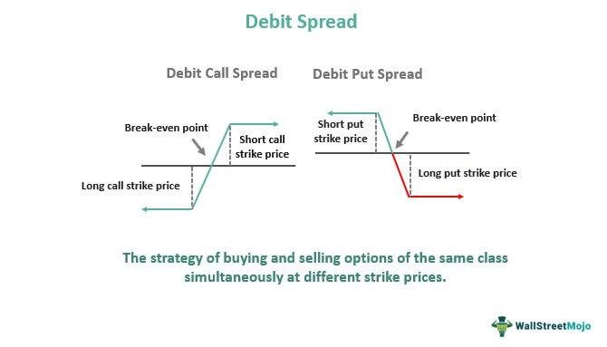

In today's financial markets, options trading is a dynamic approach that offers investors the chance to leverage their positions through a variety of strategies. Credit spreads, debit spreads, and algorithmic trading represent key tactical methods within this domain that have garnered significant attention. Credit spreads involve selling an option with a higher premium while simultaneously buying an option with a lower premium, providing a net credit to the trader's account. This strategy is particularly useful for generating income in stable or bearish market conditions. Conversely, debit spreads are constructed by purchasing an option with a higher premium and selling one with a lower premium, resulting in a net debit. Profitability in debit spreads hinges on significant market movements in the anticipated direction.

Algorithmic trading further enhances these strategies by employing sophisticated computer programs to execute trades based on pre-defined criteria. These algorithms can analyze market conditions rapidly, execute trades at optimal prices, and reduce the potential for human error. As such, algorithmic trading not only improves the efficiency of executing credit and debit spreads but also allows traders to capitalize on fleeting market opportunities.



The fusion of these trading strategies with advanced technology provides investors with a robust toolkit to manage risk and optimize returns. Understanding the intricacies of credit and debit spreads, as well as the potential of algorithmic trading, is crucial for both seasoned traders and burgeoning investors aiming to maximize their trading potential and navigate complex market dynamics effectively. Through these strategies, traders can strategically position themselves in a highly competitive and volatile market landscape.

## Table of Contents

## Understanding Options Trading

Options trading encompasses the buying and selling of options contracts, which grant investors the right, but not the obligation, to buy or sell an underlying asset at a specific price prior to a predetermined expiration date. This characteristic distinguishes options from other financial instruments, as it provides flexibility and strategic opportunities for traders and investors.

The inherent versatility of options makes them particularly attractive for crafting a variety of trading strategies. Among these strategies are credit spreads and debit spreads, which allow traders to tailor their positions according to market projections and their own risk appetite. For example, credit spreads can be employed in neutral to bearish markets to generate income, while debit spreads offer potential in bullish market scenarios where the trader anticipates significant price movements in the underlying asset.

One of the primary reasons options are favored in volatile markets is their ability to provide a controlled approach to risk management while enabling speculation. Investors can use options to hedge against adverse price movements of other investments or to leverage positions in anticipation of favorable market conditions. For instance, a put option can serve as insurance against a drop in the price of a stock that an investor owns, while a call option might be purchased to gain exposure to potential upside without committing the full capital required to purchase the stock outright.

Options trading involves various complexities, including the need to understand concepts such as intrinsic value, time value, and implied [volatility](/wiki/volatility-trading-strategies). The intrinsic value of an option is determined by the difference between the current price of the underlying asset and the option's strike price. Meanwhile, time value refers to the premium that traders are willing to pay for the possibility that an option's intrinsic value will increase before expiration. Implied volatility is a measure of the market's forecast for the option's future volatility and plays a crucial role in determining an option's pricing.

The adaptability of options trading to different market scenarios highlights its significance for investors aiming to maximize the potential of their portfolio while navigating the uncertainties presented by the financial markets.

## What is a Credit Spread?

A credit spread is an options trading strategy that involves the simultaneous sale of an option with a higher premium and the purchase of an option with a lower premium. This results in a net credit to the trader's account, which essentially represents the maximum profit potential of the trade. Credit spreads are primarily used to generate income in stable or bearish market conditions, where the likelihood of significant price movements in the underlying asset is perceived to be low.

The structure of a credit spread can be exemplified through its most common forms, such as the bull put spread and the bear call spread. Both involve establishing a position that benefits if the price of the underlying asset remains within a specified range or moves in a direction favorable to the trader.

For example, consider a bull put spread, which is constructed by selling a put option with a higher strike price and simultaneously buying a put option with a lower strike price. This configuration is employed when the trader has a neutral to mildly bullish outlook on the underlying asset. The net credit received from the spread is calculated as follows:

$$
\text{Net Credit} = \text{Premium Received} - \text{Premium Paid}
$$

The maximum loss for a credit spread is defined and limited to the difference between the strike prices of the options minus the net premium collected. Mathematically, it can be represented as:

$$
\text{Maximum Loss} = (\text{Higher Strike Price} - \text{Lower Strike Price}) - \text{Net Credit}
$$

This defined risk is a significant advantage of credit spreads, as it provides traders with a clear understanding of their potential financial exposure before entering the trade. The defined risk also implies that margin requirements for credit spreads are often lower compared to naked options strategies, making them accessible to a broader range of investors.

Credit spreads capitalize on the effect of time decay, which gradually erodes the extrinsic value of options as they approach expiration. In stable or slightly bearish markets, the chances of the underlying asset breaching the range set by the strike prices is minimized, allowing the credit spread to expire worthlessly, enabling the trader to retain the entire net credit as profit.

## What is a Debit Spread?

A debit spread is a trading strategy in options that involves purchasing an option with a higher premium while concurrently selling an option with a lower premium. This action results in a net debit, as the initial cash outflow (the premium paid for the bought option) is greater than the inflow received from selling the second option. The structure of a debit spread is designed to capitalize on anticipated directional movements in the underlying asset, enabling investors to benefit if the market shifts as foreseen.

When implementing a debit spread, an investor's maximum potential loss is confined to the initial premium paid, effectively controlling the financial risk involved in the trade. This characteristic makes debit spreads a viable strategy for traders who are optimistic about a significant price movement but wish to limit their potential downside. 

Debit spreads can be constructed in various forms, such as bull call spreads and bear put spreads, depending on whether the trader expects the market to rise or fall, respectively. 

- **Bull Call Spread:** This structure is used when a trader expects an upward movement. It involves purchasing a call option with a lower strike price and selling another call option with a higher strike price. 

- **Bear Put Spread:** This setup is employed when anticipating a downward movement. It involves buying a put option with a higher strike price and selling a put option with a lower strike price.

The payoff of a debit spread, $P$, can be mathematically defined by considering the difference between the strike prices and the premiums involved:

$$
P = \max(0, S_T - K_1) - \max(0, S_T - K_2) - (\text{Premium Bought} - \text{Premium Sold})
$$

Here, $S_T$ is the asset price at expiration, $K_1$ and $K_2$ are the respective strike prices for the options bought and sold, and the net cost or initial debit defines the maximum loss. The effectiveness of debit spreads is contingent on the market moving sufficiently in the expected direction to render the spread profitable, beyond breakeven points derived from the initial premiums.

## Key Differences Between Credit and Debit Spreads

Credit spreads and debit spreads represent two distinct strategies in options trading, each with unique benefits and considerations influenced primarily by market volatility and directional expectations.

Credit spreads gain an advantage from time decay, also known as theta, because they tend to profit as the expiration date of the options approaches, reducing the overall option premium. This makes them more profitable in high volatility environments where premium erosion becomes significant. Traders selling credit spreads receive a net premium upfront, and as long as the underlying asset remains stable or moves slightly against the sold position, these spreads can yield predictable returns.

In contrast, debit spreads require substantial movements in the underlying asset to become profitable. This strategy is best utilized when the trader anticipates a specific directional change in the asset's price. In periods of low implied volatility, options premiums are generally cheaper, making debit spreads more attractive to traders who expect significant price movement. Here, the maximum loss is limited to the net premium paid, providing a controlled risk profile.

The choice between credit and debit spreads depends on multiple factors. Market volatility plays a crucial role; while credit spreads align with stable or decreasing volatility, debit spreads are structured for active price movements. Moreover, risk tolerance is essential—credit spreads can incur substantial losses if the market moves significantly against the position, while debit spreads are limited by their initial cost.

Traders must also consider their directional bias. If a trader expects the underlying asset to move significantly, a debit spread might be more appropriate. Conversely, if the outlook is sideways or moderately bearish, a credit spread could be more suitable.

In summary, determining whether to employ a credit or debit spread requires careful assessment of volatility, risk tolerance, and expected market direction to align with the trader's strategic goals.

## Integrating Algorithmic Trading with Spreads

Algorithmic trading, also known as algo trading, employs computer algorithms to automate trading processes, relying on pre-set criteria to trigger trade executions. This approach enhances the efficiency of options trading strategies, such as credit and debit spreads, by leveraging computational power to process vast amounts of market data in real-time. 

The integration of [algorithmic trading](/wiki/algorithmic-trading) into spread strategies provides several advantages. Firstly, algorithms can swiftly analyze market conditions by processing historical data, live market feeds, and technical indicators, thus identifying optimal entry and [exit](/wiki/exit-strategy) points with precision. This is particularly beneficial in high-frequency environments where market opportunities can be transient. 

To execute trades at optimal prices, algorithms may use techniques such as limit and market orders, or more advanced tactics like iceberg orders, to minimize market impact and reduce slippage. For example, Python, a popular programming language in the trading community, can be utilized to develop algorithms that monitor moving averages, relative strength indices, or Bollinger bands to make trading decisions:

```python
import numpy as np
import pandas as pd

# Example strategy: Moving Average Crossover
def moving_average_crossover(data, short_window=40, long_window=100):
    signals = pd.DataFrame(index=data.index)
    signals['signal'] = 0.0

    signals['short_mavg'] = data['Close'].rolling(window=short_window, min_periods=1).mean()
    signals['long_mavg'] = data['Close'].rolling(window=long_window, min_periods=1).mean()

    signals['signal'][short_window:] = np.where(signals['short_mavg'][short_window:] 
                                                 > signals['long_mavg'][short_window:], 1.0, 0.0)

    signals['positions'] = signals['signal'].diff()
    return signals
```

Moreover, by minimizing human errors, algo trading can reduce the emotional bias that often affects manual trading, thereby adhering more strictly to predefined strategies. The automation of repetitive tasks further allows traders to allocate resources to strategic planning rather than execution.

For traders, integrating algo trading with spreads not only streamlines operations but also enhances the ability to capitalize on fleeting opportunities that require rapid response times. As technology continues to advance, those who effectively combine algorithmic approaches with options spreads can optimize their trading performance, navigating complex market environments with increased agility and precision.

## Conclusion

Credit and debit spreads are essential strategies in options trading, providing traders with the ability to manage risk and adapt to varying market conditions. Credit spreads allow traders to profit from time decay and stable market environments, offering a limited-risk approach with defined profit potential. On the other hand, debit spreads enable traders to benefit from directional market movements, with controlled risk limited to the initial premium paid.

The integration of algorithmic trading has revolutionized the execution of these strategies. Algorithmic trading, characterized by utilizing computer programs to make trading decisions based on quantitative data, enhances the precision and efficiency of implementing credit and debit spreads. Through algorithmic trading, traders can analyze vast datasets quickly, execute trades at optimal prices, and reduce human error, thereby maximizing potential returns and minimizing risks.

By mastering credit and debit spreads, as well as utilizing algorithmic trading, traders can significantly boost their portfolio performance. The strategic combination of these tools allows them to capitalize on fleeting market opportunities and manage complex market dynamics with greater confidence. As financial markets continue to evolve, staying informed about these strategies and advancements provides traders with a competitive edge in achieving their investment goals.

## References & Further Reading

[1]: Bergstra, J., Bardenet, R., Bengio, Y., & Kégl, B. (2011). ["Algorithms for Hyper-Parameter Optimization."](https://dl.acm.org/doi/10.5555/2986459.2986743) Advances in Neural Information Processing Systems 24.

[2]: ["Advances in Financial Machine Learning"](https://www.amazon.com/Advances-Financial-Machine-Learning-Marcos/dp/1119482089) by Marcos Lopez de Prado

[3]: ["Evidence-Based Technical Analysis: Applying the Scientific Method and Statistical Inference to Trading Signals"](https://www.amazon.com/Evidence-Based-Technical-Analysis-Scientific-Statistical/dp/0470008741) by David Aronson

[4]: ["Machine Learning for Algorithmic Trading"](https://github.com/stefan-jansen/machine-learning-for-trading) by Stefan Jansen

[5]: ["Quantitative Trading: How to Build Your Own Algorithmic Trading Business"](https://www.amazon.com/Quantitative-Trading-Build-Algorithmic-Business/dp/1119800064) by Ernest P. Chan