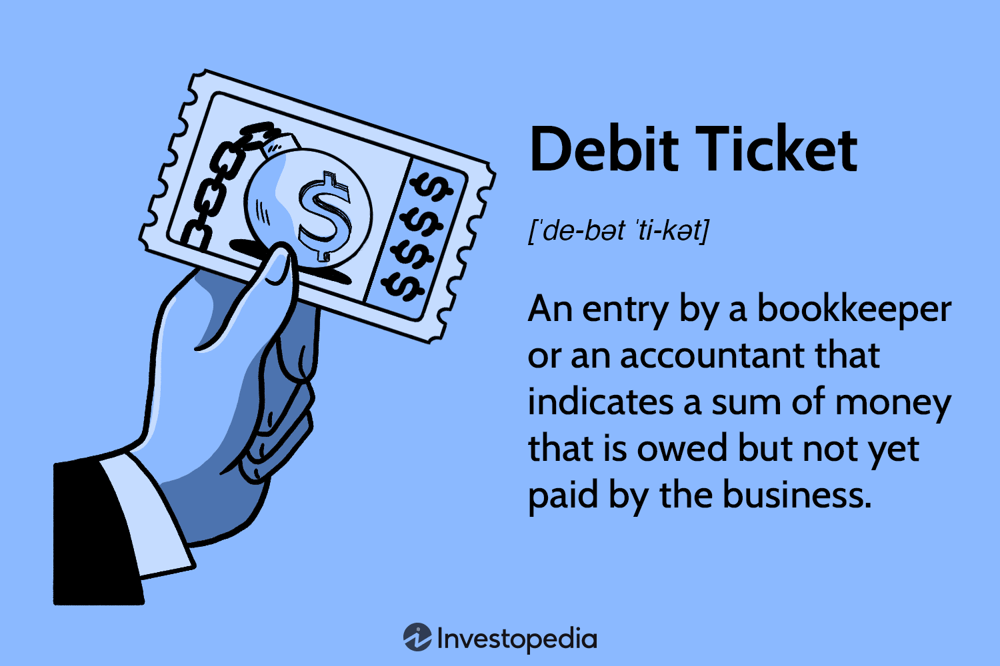

## Table of Contents

## What is a debit ticket?

A debit ticket is a document used by banks and financial institutions to record a withdrawal or a decrease in an account's balance. When someone takes money out of their account, the bank uses a debit ticket to keep track of this transaction. It shows how much money was taken out and helps make sure the account balance is updated correctly.

Debit tickets are important for keeping accurate records. They help banks and customers know exactly what is happening with their money. If there is ever a question about a transaction, the debit ticket can be checked to see what happened. This makes it easier to solve problems and keep everyone's accounts correct.

## How does a debit ticket function in financial transactions?

A debit ticket is like a note that a bank writes when someone takes money out of their account. It shows how much money was taken and helps the bank keep track of what is happening in the account. When you go to the bank and ask for money, the bank worker will write a debit ticket to record that you took money out. This ticket makes sure the bank knows to take that amount away from your account balance.

Debit tickets are important because they help keep everything correct. If there is ever a problem or a question about where the money went, the bank can look at the debit ticket to find out. It's like a little piece of paper that tells the story of what happened with your money. This way, both the bank and you can be sure that the account balance is right and that all the transactions are recorded properly.

## What are the common uses of debit tickets in businesses?

In businesses, debit tickets are often used to keep track of money going out. When a business pays for something, like buying supplies or paying bills, they might use a debit ticket to record that payment. This helps the business know exactly how much money is being spent and keeps their financial records accurate. It's important for businesses to have a clear record of their expenses, and debit tickets help them do that.

Debit tickets can also be used when a business makes a sale and the customer wants to return something. If a customer brings back a product and gets their money back, the business uses a debit ticket to show that money is being taken out of their account to give back to the customer. This helps the business keep track of returns and makes sure their financial records stay correct. By using debit tickets, businesses can manage their money better and avoid mistakes in their accounts.

## Can you explain the process of issuing a debit ticket?

When a business or a bank needs to issue a debit ticket, it starts when someone wants to take money out of an account. For example, if a customer wants to withdraw money from their bank account, they tell the bank worker how much they want. The bank worker then writes down the amount on a debit ticket. This ticket includes important information like the date, the account number, and the amount of money being taken out. The worker makes sure all the details are correct before they finish the ticket.

Once the debit ticket is filled out, the bank worker gives it to another part of the bank, usually the accounting department. This department uses the debit ticket to update the account balance. They take away the amount of money written on the ticket from the customer's account. The debit ticket is then kept as a record of the transaction. This way, if there is ever a question about where the money went, the bank can look at the debit ticket to find out. It helps keep everything clear and correct.

## What information is typically included on a debit ticket?

A debit ticket usually has some important information written on it. It includes the date when the money was taken out, the account number of the person taking the money, and the amount of money being taken. This helps the bank keep track of exactly when and how much money was withdrawn.

The debit ticket might also have the name of the person taking the money and a short note about why the money was taken out. This extra information can be helpful if there are any questions later about the transaction. Keeping all this information on the debit ticket makes it easier for the bank to manage the account and keep everything correct.

## How do debit tickets differ from credit tickets?

Debit tickets and credit tickets are used by banks to keep track of money moving in and out of accounts, but they work in opposite ways. A debit ticket is used when money is taken out of an account. For example, if you go to the bank and take out $100, the bank will use a debit ticket to show that $100 was taken from your account. This helps the bank know to lower your account balance by that amount.

On the other hand, a credit ticket is used when money is added to an account. If you deposit $100 into your account, the bank will use a credit ticket to show that $100 was added. This tells the bank to increase your account balance by that amount. So, while debit tickets are about taking money away, credit tickets are about adding money to the account. Both types of tickets help keep the bank's records accurate and clear.

## What are the accounting implications of using debit tickets?

When a business uses debit tickets, it means they are taking money out of their accounts. This is important in accounting because it helps keep track of where the money is going. For example, if a business pays for supplies, they use a debit ticket to show that money was taken out to pay for those supplies. This helps the business know exactly how much they are spending and makes sure their records are correct. It's like writing down every time you spend money so you know where it all went.

In accounting, using debit tickets also helps with keeping the [books](/wiki/algo-trading-books) balanced. Every time money goes out, it needs to be recorded properly to make sure the business's financial statements are accurate. If there's ever a question about a transaction, the business can look at the debit ticket to see what happened. This way, they can fix any mistakes and make sure their financial reports are right. It's all about keeping clear and correct records of what's happening with the money.

## In what scenarios might a debit ticket be used to correct an error?

A debit ticket might be used to correct an error when there's a mistake in the account balance. For example, if the bank accidentally adds too much money to someone's account, they would use a debit ticket to take the extra money out. This helps fix the mistake and make sure the account balance is correct again. It's like if you accidentally added too much money to your piggy bank and needed to take some out to get it right.

Another scenario is when a business makes a wrong payment. If they pay a bill twice by mistake, they would use a debit ticket to show that they are taking the extra payment back. This helps the business keep their financial records straight and ensures they don't lose money because of the error. By using a debit ticket, they can correct the mistake and keep everything in order.

## How can debit tickets be integrated into an electronic accounting system?

In an electronic accounting system, debit tickets can be integrated by using digital forms instead of paper. When someone takes money out of their account, the bank or business can enter the details into a computer system. This includes the date, account number, the amount of money taken out, and any other important information. The system then automatically updates the account balance and keeps a record of the transaction. This makes it easy to keep track of where the money goes and helps keep everything correct.

Using electronic debit tickets also makes it easier to fix mistakes. If there's an error, like too much money being taken out or a wrong payment, the system can create a digital debit ticket to correct it. The accountant can enter the details into the system, and it will adjust the account balance to fix the mistake. This way, businesses and banks can keep their records accurate without using paper, making it faster and more efficient to manage their money.

## What are the best practices for managing debit tickets to ensure accuracy and compliance?

To manage debit tickets well and keep everything correct, it's important to always double-check the information before entering it. When someone takes money out, make sure the date, account number, and amount are right. It's also good to have someone else look over the debit ticket to catch any mistakes. Keeping good records is key, so save all the debit tickets in a clear and organized way, whether they are on paper or in a computer system. This helps if you need to check something later or if there's a question about a transaction.

Following rules and laws is also important when managing debit tickets. Make sure to follow any rules from the bank or the government about how to record transactions. Using a computer system can help because it can automatically check for errors and make sure everything is done the right way. Regularly checking the accounts and making sure they match up with the debit tickets helps keep everything accurate. By doing these things, you can make sure the debit tickets are managed well and that everything stays correct and follows the rules.

## How do regulations and standards affect the use of debit tickets in different industries?

Regulations and standards are like rules that businesses and banks have to follow when they use debit tickets. In the banking industry, there are strict rules about how to record money going in and out of accounts. These rules make sure that banks keep correct records and protect customers' money. For example, banks might have to keep debit tickets for a certain amount of time and follow specific ways of writing them down. This helps make sure everything is done right and that if there's a problem, they can fix it.

In other industries, like retail or manufacturing, regulations might be different but still important. A business might have to follow rules about how they handle returns and refunds, which often involve using debit tickets. These rules make sure the business keeps good records of money going out when they give money back to customers. By following these standards, businesses can avoid mistakes and make sure they are doing things the right way. This helps keep their financial records clear and correct.

## Can you provide advanced examples of how debit tickets are used in complex financial operations?

In complex financial operations, debit tickets can be used in mergers and acquisitions. When one company buys another, there are many payments that need to be tracked carefully. Debit tickets help record the money going out for things like buying the other company's assets or paying fees to lawyers and accountants. For example, if Company A is buying Company B, they might use debit tickets to show payments for each part of the deal. This makes sure all the money going out is recorded correctly and helps keep the financial records clear during the complicated process of merging two businesses.

Another advanced use of debit tickets is in managing large-scale investment portfolios. When a financial institution manages a big portfolio, they might need to move money around to buy or sell different investments. Debit tickets are used to record when money is taken out of the portfolio to buy new investments or to pay for fees and taxes. For instance, if an investment manager decides to sell some stocks and buy bonds, they would use debit tickets to show the money being taken out to buy the bonds. This helps keep track of all the transactions and makes sure the portfolio's records are accurate and up-to-date.

## What is a Debit Ticket?

A debit ticket is a crucial tool in accounting and finance, representing an accounting entry that denotes a financial obligation owed by either a company or an individual but not yet fulfilled through payment. Within a business's general ledger, a debit ticket signifies a reduction in the account balance. This is because it serves as a temporary placeholder for payments that are anticipated, pending their actual realization.

In a banking environment, debit tickets play a pivotal role by automatically reducing the balance of the general ledger by the conveyed amount. When a financial event occurs, such as a withdrawal or an expense, the debit ticket is used to document this transaction. This meticulous recording is essential in ensuring that financial records are accurate and reflective of real-time financial standings. This level of precision is vital not only for businesses that need to maintain clear and transparent records for stakeholders and regulatory purposes but also for individuals managing personal finances.

To illustrate, consider a scenario where a company makes a purchase worth $5,000 on credit. This transaction would be recorded through a debit ticket, decreasing the company's cash account while simultaneously creating a credit in accounts payable to signify that the payment is pending. The dual entry system, integral to accounting, ensures that the values on the debit side and the credit side balance, as per the fundamental accounting equation:

$$
\text{Assets} = \text{Liabilities} + \text{Equity}
$$

Using a coding perspective, the process of maintaining financial records with debit tickets can also be illustrated. Below is a basic example using Python that shows how a debit transaction might be recorded in a simplified accounting system:

```python
class Ledger:
    def __init__(self):
        self.entries = []

    def add_debit_ticket(self, description, amount):
        entry = {
            'description': description,
            'amount': -amount  # Negative amount to reduce balance
        }
        self.entries.append(entry)

    def get_balance(self):
        return sum(entry['amount'] for entry in self.entries)

ledger = Ledger()
ledger.add_debit_ticket("Equipment Purchase", 5000)

print("Current Ledger Balance:", ledger.get_balance())
```

In this example, a simple ledger is created, and a debit ticket for an equipment purchase reduces the balance by $5,000, reflecting the obligation that the account has taken on but has yet to discharge through actual payment.

Debit tickets, through their systematic function, are vital in both personal and corporate finance for maintaining clarity and ensuring that financial transactions are consistently and accurately recorded.

## References & Further Reading

[1]: Bergstra, J., Bardenet, R., Bengio, Y., & Kégl, B. (2011). ["Algorithms for Hyper-Parameter Optimization."](https://dl.acm.org/doi/10.5555/2986459.2986743) Advances in Neural Information Processing Systems 24.

[2]: ["Advances in Financial Machine Learning"](https://www.amazon.com/Advances-Financial-Machine-Learning-Marcos/dp/1119482089) by Marcos Lopez de Prado.

[3]: ["Evidence-Based Technical Analysis: Applying the Scientific Method and Statistical Inference to Trading Signals"](https://www.amazon.com/Evidence-Based-Technical-Analysis-Scientific-Statistical/dp/0470008741) by David Aronson.

[4]: ["Machine Learning for Algorithmic Trading"](https://github.com/stefan-jansen/machine-learning-for-trading) by Stefan Jansen.

[5]: ["Quantitative Trading: How to Build Your Own Algorithmic Trading Business"](https://www.amazon.com/Quantitative-Trading-Build-Algorithmic-Business/dp/1119800064) by Ernest P. Chan.