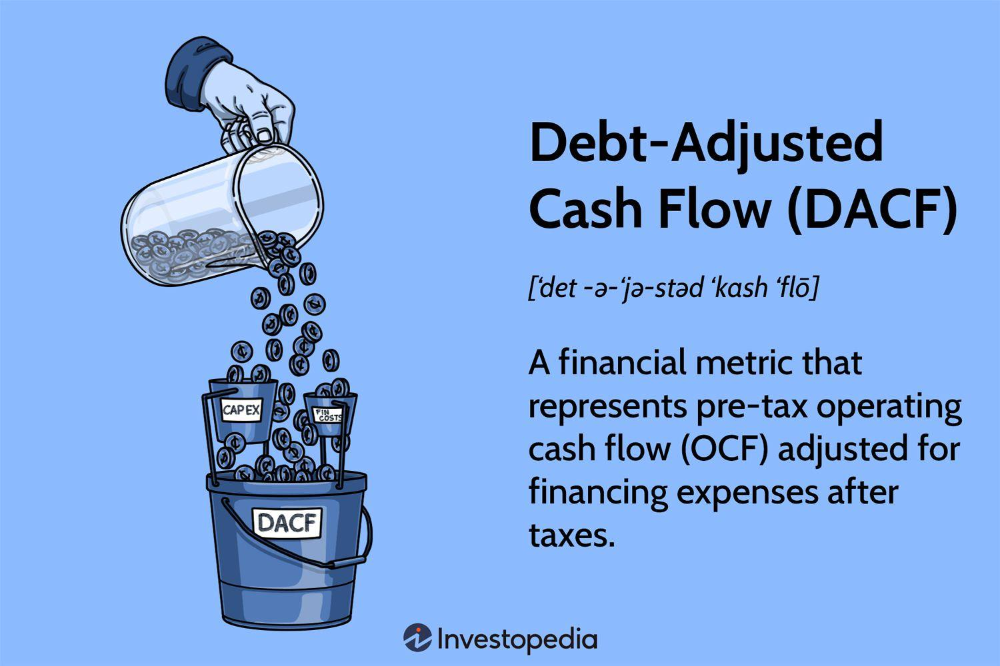

## Table of Contents

## What is Debt-Adjusted Cash Flow (DACF)?

Debt-Adjusted Cash Flow (DACF) is a financial metric that helps investors and analysts understand how much cash a company generates after accounting for its debt obligations. It is calculated by taking the company's cash flow from operations and subtracting its interest expenses and any principal repayments on its debt. This gives a clearer picture of the cash available to the company for reinvestment, expansion, or distribution to shareholders.

DACF is particularly useful for comparing the financial health of companies with different levels of debt. By adjusting for debt, it provides a more accurate measure of a company's ability to generate cash from its core operations. This can be especially important for industries like oil and gas, where companies often have significant debt loads. By using DACF, investors can better assess whether a company's cash flow is sufficient to cover its debt and still have money left over for other uses.

## How is Debt-Adjusted Cash Flow calculated?

Debt-Adjusted Cash Flow (DACF) is figured out by starting with the cash a company makes from its regular business activities, which is called cash flow from operations. Then, you take away the money the company has to pay for interest on its loans and any money it needs to pay back on those loans. This gives you the cash the company has left after paying its debts.

This number is helpful because it shows how much money a company really has to use for things like growing the business or giving money back to people who own its stock. It's especially useful when comparing companies that have different amounts of debt. By looking at DACF, you can see if a company is making enough money from its main business to cover its debts and still have money left over.

## Why is Debt-Adjusted Cash Flow important for businesses?

Debt-Adjusted Cash Flow (DACF) is important for businesses because it shows how much money a company has left after paying off its debts. This is useful for business owners and investors to see if the company is making enough money from its main work to cover what it owes. By knowing this, they can decide if the company is in a good financial spot or if it might have trouble paying its bills in the future.

DACF also helps when comparing different companies, especially if they have different amounts of debt. For example, in industries like oil and gas where companies often borrow a lot of money, DACF can show which companies are doing better at making money from their business after paying their debts. This makes it easier for investors to pick the best companies to invest in and for business leaders to make smart choices about growing their company or managing their money.

## What are the key components of Debt-Adjusted Cash Flow?

Debt-Adjusted Cash Flow (DACF) is made up of three main parts: cash flow from operations, interest expenses, and principal repayments on debt. Cash flow from operations is the money a company makes from its main business activities. It's what's left after paying for things like making products, paying employees, and other regular costs. This part shows how well the company is doing at making money from its core work.

The other two parts, interest expenses and principal repayments, are what the company has to pay because of its debts. Interest expenses are the cost of borrowing money, and principal repayments are the actual money the company has to pay back on its loans. When you take these away from the cash flow from operations, you get DACF. This number tells you how much money the company has left after paying its debts, which is important for seeing if the company is in a good financial spot.

## How does Debt-Adjusted Cash Flow differ from Free Cash Flow?

Debt-Adjusted Cash Flow (DACF) and Free Cash Flow (FCF) are both important numbers that help us understand how much money a company has left after paying for its regular business costs. But they look at things a bit differently. DACF starts with the cash a company makes from its main work, called cash flow from operations. Then it takes away the money the company has to pay for interest on its debts and any money it needs to pay back on those debts. This shows how much money the company has after paying its debts, which is useful for seeing if the company can handle its loans and still have money left over.

Free Cash Flow (FCF), on the other hand, looks at how much money a company has left after paying for its regular business costs and the money it spends on things like new equipment or buildings. FCF starts with cash flow from operations, just like DACF, but instead of taking away debt payments, it takes away capital expenditures. This number shows how much money the company has to do things like grow the business, pay dividends to shareholders, or pay down debt. So while DACF focuses on the company's ability to manage its debts, FCF focuses on the money available for other uses after considering both regular costs and investments in the business.

## Can Debt-Adjusted Cash Flow be used to assess a company's financial health?

Debt-Adjusted Cash Flow (DACF) is a helpful way to check a company's financial health. It shows how much money a company has left after paying its debts. By looking at DACF, you can see if the company is making enough money from its main work to cover what it owes. This is important because if a company can't pay its debts, it might have big problems in the future.

DACF is also useful when comparing different companies, especially if they have different amounts of debt. For example, in industries like oil and gas where companies often borrow a lot of money, DACF can show which companies are doing better at making money from their business after paying their debts. This helps investors and business leaders make smart choices about where to put their money or how to manage the company's finances.

## What are common misconceptions about Debt-Adjusted Cash Flow?

One common misconception about Debt-Adjusted Cash Flow (DACF) is that it's the same as Free Cash Flow (FCF). While both numbers help us understand how much money a company has left after paying its bills, they look at different things. DACF takes away the money a company has to pay for interest and debt, while FCF takes away the money spent on new equipment or buildings. So, DACF focuses more on how well a company can handle its debts, while FCF looks at the money left for other uses like growing the business or paying shareholders.

Another misconception is that a high DACF always means a company is in good financial health. While a high DACF can show that a company is making enough money to cover its debts, it doesn't tell the whole story. Other things like how much debt the company has overall, how it's growing, and what's happening in its industry can also affect its financial health. So, while DACF is a helpful tool, it's important to look at other numbers and information too to get a full picture of a company's financial situation.

## How can Debt-Adjusted Cash Flow influence investment decisions?

Debt-Adjusted Cash Flow (DACF) can help people decide where to invest their money. It shows how much money a company has left after paying its debts. If a company has a high DACF, it means it's making enough money from its main work to cover what it owes. This can make investors feel more confident about putting their money into that company because it seems less likely to have trouble paying its bills in the future.

But DACF is just one piece of the puzzle. Investors should also look at other things like how much debt the company has overall, how it's growing, and what's happening in its industry. A high DACF might look good, but if the company has a lot of debt or is in an industry that's struggling, it might still be a risky investment. So, while DACF can guide investment decisions, it's important to consider the whole picture before making a choice.

## What industries benefit most from analyzing Debt-Adjusted Cash Flow?

Industries with a lot of debt, like oil and gas, really benefit from looking at Debt-Adjusted Cash Flow (DACF). These companies often borrow a lot of money to explore for new oil and gas, so they need to make sure they can pay back what they owe. By using DACF, they can see if they're making enough money from their main work to cover their debts. This helps them decide if they can keep borrowing or if they need to cut back.

Another industry that finds DACF useful is real estate. Real estate companies often take out big loans to buy properties, and they need to know if they can pay those loans back while still making money. DACF helps them understand their cash situation after paying their debts, which is important for deciding on new projects or investments. It's a key tool for making sure they stay financially healthy.

## How do changes in debt levels affect Debt-Adjusted Cash Flow?

When a company's debt levels change, it directly impacts its Debt-Adjusted Cash Flow (DACF). If a company takes on more debt, it will have to pay more in interest and principal repayments. This means the company's DACF will go down because it has less money left after paying its debts. On the other hand, if a company pays off some of its debt, its interest and principal payments will go down, which can make its DACF go up. This shows that the company has more money left after paying what it owes.

Understanding how changes in debt levels affect DACF is important for businesses and investors. For example, if a company is thinking about borrowing more money to grow, it needs to think about how that will change its DACF. If the new debt makes the DACF too low, it might not be a good idea because the company could have trouble paying its bills. Investors also watch DACF to see if a company is managing its debt well. A company that can keep its DACF high even with more debt might be a safer investment.

## What advanced techniques can be used to optimize Debt-Adjusted Cash Flow?

To optimize Debt-Adjusted Cash Flow (DACF), companies can use a few advanced techniques. One way is to manage their debt better. This means looking at their loans and trying to pay them off faster or refinancing them to get lower interest rates. By doing this, they can lower their interest and principal payments, which makes their DACF go up. Another technique is to improve their cash flow from operations. Companies can do this by cutting costs, making their business more efficient, or finding new ways to make money. When they make more money from their main work, they have more cash left after paying their debts.

Another advanced technique is to use financial modeling to predict how different decisions will affect DACF. Companies can create models that show what will happen to their DACF if they take on more debt, pay off debt, or change their business operations. This helps them make smart choices about how to manage their money. By using these models, they can find the best ways to keep their DACF high, which is important for staying financially healthy and making good investment decisions.

## How can Debt-Adjusted Cash Flow be integrated into a broader financial analysis framework?

Debt-Adjusted Cash Flow (DACF) is a useful tool that can be part of a bigger picture when looking at a company's money situation. It shows how much cash a company has left after paying its debts, which is important for understanding if the company can handle what it owes. To use DACF in a broader financial analysis, you can compare it with other numbers like Free Cash Flow (FCF), which shows how much money is left for other uses after paying for regular costs and investments. By looking at both DACF and FCF, you get a better idea of how well the company is doing at making money and managing its debts.

Another way to use DACF in a bigger financial analysis is to look at it over time and compare it with other companies in the same industry. This helps you see if a company is getting better or worse at managing its debts compared to others. You can also use DACF along with other financial ratios like debt-to-equity and interest coverage ratios to get a full picture of the company's financial health. By putting DACF into this larger framework, you can make smarter decisions about investing in the company or managing its finances.

## How do you calculate debt-adjusted cash flow?

Debt-Adjusted Cash Flow (DACF) is calculated using the formula:

$$
\text{DACF} = \text{Cash Flow from Operations} + \text{Financing Costs (After Tax)}
$$

This formula succinctly captures the essence of a company's cash-generating efficiency once financing expenses are taken into account. Let's break down the components to gain a clearer understanding:

1. **Cash Flow from Operations (CFO)**: This is a measure of the cash generated by a company’s regular business operations. Cash Flow from Operations is derived from the company's income statement and adjusted for changes in working capital. It reflects the company's ability to generate cash from its core business activities and serves as a crucial indicator of financial health. A strong CFO suggests that the company can maintain its operations and potentially reinvest in growth activities without resorting to additional financing.

2. **Financing Costs (After Tax)**: These are the net costs associated with a company’s borrowing. They include interest expenses incurred from debt obligations, adjusted for tax effects, as interest is typically tax-deductible. By considering these costs, DACF provides a more realistic picture of a company's cash position by acknowledging the burden of debt servicing. The adjustment for taxes ensures that the net impact on cash flow is accurately reflected, given the tax shield provided by interest expenses.

Adjustments for exploration costs are particularly relevant for industries like oil and gas, where such expenses are substantial. Companies in this sector may use different accounting practices related to exploration (e.g., full cost vs. successful efforts), which can significantly affect financial statements. By incorporating exploration costs into DACF calculations, analysts can neutralize discrepancies in accounting treatments, allowing for a more standardized assessment of financial performance across companies.

Understanding DACF calculations aids stakeholders in evaluating a company's financial strategy and performance. By linking operational cash inflow with debt-related cash outflow, DACF enables investors and analysts to assess not only the company's operational efficiency but also its capability to handle its financial obligations. This insight is pivotal for stakeholders aiming to gauge a company's sustainability, growth potential, and financial robustness, especially those with significant debt reliance.

## What is the role of DACF in Financial Analysis and Valuation?

Debt-Adjusted Cash Flow (DACF) is critical in financial analysis and valuation as it takes into account a company's financing structure. Traditional metrics, such as the Price/Cash Flow (P/CF) ratio, tend to overlook the impact of debt, potentially providing an incomplete picture of a company's financial health. In contrast, DACF provides a more comprehensive view by incorporating debt-related financial dynamics.

For valuation purposes, DACF is utilized primarily in the calculation of the EV/DACF ratio. This ratio, which combines enterprise value (EV) and DACF, facilitates more precise comparisons among companies, especially those with differing capital structures. Enterprise value, which accounts for a company's entire capital—including equity and debt—offers a holistic measure when used alongside DACF. The formula is expressed as:

$$
\text{EV/DACF} = \frac{\text{Enterprise Value}}{\text{Debt-Adjusted Cash Flow}}
$$

This metric is beneficial for analysts as it enables 'apples-to-apples' comparisons across firms, irrespective of their differing levels of debt financing. By including the effects of debt, the EV/DACF ratio addresses the limitations seen in traditional valuation methods, which may not fully reflect the impact of financial leverage on company operations and valuation.

In practice, utilizing DACF for financial analysis requires meticulous attention to data accuracy and consistency, particularly for firms in sectors that frequently rely on debt financing. By conveying a more detailed picture of a firm's financial strategy, DACF enhances traditional valuation techniques, offering a robust tool for assessing a company's true economic performance. This comprehensive perspective aids investors and financial analysts in making more informed decisions, thereby optimizing investment strategies and outcomes.

## How can DACF be implemented in algorithmic trading?

Algorithmic trading strategies can greatly enhance their decision-making frameworks by incorporating Debt-Adjusted Cash Flow (DACF) as a central metric. DACF plays a crucial role in evaluating investment opportunities by helping algorithms assess a company's valuation with enhanced accuracy, particularly by factoring in the debt structure and post-tax financing position of the entity.

One of the primary benefits of using DACF in [algorithmic trading](/wiki/algorithmic-trading) is its ability to highlight undervalued stocks. By integrating DACF, trading algorithms can adjust for the impacts of a company's debt, offering a nuanced view of financial performance that traditional cash flow metrics may overlook. This adjustment allows algorithms to better identify discrepancies in market valuations, thereby pinpointing potential investment opportunities that merit further consideration.

Incorporating DACF into algorithmic trading strategies requires meticulous data collection and accurate calculations to ensure successful trade execution. The formula for DACF, given by:

$$
\text{DACF} = \text{cash flow from operations} + \text{financing costs (after tax)}
$$

forms the foundation for these calculations. Performing precise adjustments for debt and associated costs permits the development of algorithms that can reliably interpret financial statements and infer a company's true cash-generating abilities.

Python, a widely used language in financial analysis, can be effectively leveraged to execute DACF calculations as part of a trading algorithm. Here's a simplified Python snippet that demonstrates the calculation of DACF:

```python
def calculate_dacf(cash_flow_from_operations, financing_costs, tax_rate):
    financing_costs_after_tax = financing_costs * (1 - tax_rate)
    dacf = cash_flow_from_operations + financing_costs_after_tax
    return dacf

# Example usage
cash_flow_from_operations = 1000000  # Example value
financing_costs = 200000  # Example value
tax_rate = 0.3  # Example value

dacflow = calculate_dacf(cash_flow_from_operations, financing_costs, tax_rate)
print(f"DACF: {dacflow}")
```

This template can be expanded to integrate additional functionalities, such as real-time data fetching and automatic decision-making processes based on computed DACF values.

With its comprehensive view of financial health, DACF is an invaluable tool for enhancing trading algorithms to make them more responsive and effective. By factoring in financial subtleties like debt and taxes, it supports the construction of sophisticated models that deliver more accurate predictions and improved investment performance. As the financial sector continues to prioritize precision and depth in data analysis, DACF’s value in crafting algorithmic trading strategies becomes increasingly indispensable.

## References & Further Reading

[1]: Damodaran, A. (2012). ["Investment Valuation: Tools and Techniques for Determining the Value of Any Asset."](https://books.google.com/books/about/Investment_Valuation.html?id=5SRHAAAAQBAJ) John Wiley & Sons.

[2]: Farrell, J. L. (1985). "Analyzing Debt Financing." Financial Analysts Journal, 41(4), 33-46. DOI: [10.2469/faj.v41.n4.33](https://www.tandfonline.com/doi/abs/10.2469/faj.v41.n6.16)

[3]: Rappaport, A. (1986). ["Creating Shareholder Value: The New Standard for Business Performance."](https://archive.org/details/creatingsharehol00rapp) Free Press.

[4]: Fabozzi, F. J. (2007). ["Fixed Income Analysis."](https://www.amazon.com/Fixed-Income-Analysis-Frank-Fabozzi/dp/047005221X) John Wiley & Sons.

[5]: Johnston, D. A., & Johnston, D. J. (2006). "Oil Company Financial Analysis in Nontechnical Language." PennWell Corporation.