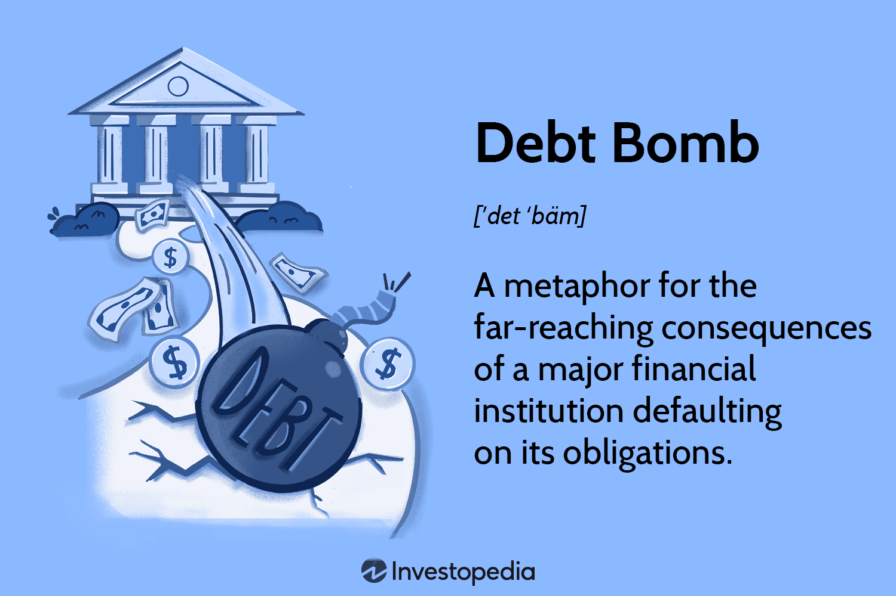

## Table of Contents

## What is a debt bomb?

A debt bomb is a situation where a country or a company has so much debt that it becomes very hard to pay it back. It's like a big problem that can explode and cause a lot of trouble. When a country or company has a lot of debt, it might struggle to pay for important things like schools, hospitals, or keeping the business running.

If the debt gets too big, it can scare people and make them think the country or company might not be able to pay back what they owe. This can lead to a crisis where people stop lending money, and the economy can get very shaky. It's important for countries and companies to manage their debt carefully to avoid setting off a debt bomb.

## How does a debt bomb affect an economy?

When a debt bomb goes off, it can cause big problems for an economy. If a country or a company has too much debt, it might not be able to pay back what it owes. This can make people worried and stop lending money. When lenders get scared, they might ask for their money back all at once, which can lead to a financial crisis. Businesses might find it hard to borrow money to grow or even keep running, which can slow down the whole economy.

In a country, a debt bomb can mean less money for important things like schools, hospitals, and roads. If the government spends a lot of money paying back debt, there might not be enough left for these services. This can make life harder for people and slow down the economy even more. If things get really bad, the value of the country's money might go down, making everything more expensive and causing inflation.

## What are the common causes of a debt bomb?

A debt bomb can happen when a country or company keeps borrowing more and more money without a plan to pay it back. Sometimes, they borrow to pay for things right away, like building new roads or starting a new business. But if they don't make enough money to pay back the loans, the debt can grow bigger and bigger. If they keep borrowing to pay off old debts, it's like trying to fill a bucket with a hole in it. Eventually, the debt can get so big that it's hard to manage.

Another reason for a debt bomb is when the economy is not doing well. If people are not buying things or if businesses are struggling, the government might borrow money to help out. But if the economy doesn't get better, the government might need to borrow even more. This can lead to a cycle where the debt keeps growing. Also, if interest rates go up, it can make the debt even harder to pay back because the cost of borrowing money goes up. All these things together can create a big debt problem that can explode into a debt bomb.

## Can you explain the mechanism behind a debt bomb?

A debt bomb happens when a country or company borrows too much money and can't pay it back. Imagine borrowing money from your friends to buy things you need. If you keep borrowing without paying back, your friends might get worried. They might stop lending you money or ask for it back all at once. This is like what happens with a debt bomb. When a country or company owes too much, people who lent them money might want their money back. If everyone wants their money back at the same time, it can cause a big problem.

This big problem can make the economy slow down. If a country has a debt bomb, it might not have enough money for important things like schools and hospitals. The government might have to use all its money to pay back the debt instead. This can make life harder for people. Also, if businesses can't borrow money to grow, they might have to stop or slow down, which can hurt the whole economy. When a debt bomb goes off, it can scare everyone and make the economy shaky, like a big explosion that affects everything around it.

## What are the signs that a country might be approaching a debt bomb situation?

When a country is getting close to a debt bomb, one of the first signs is that it keeps borrowing more and more money. The country might be using this money to pay for things like new roads or helping people who are out of work. But if the country is borrowing to pay back old loans, that's a big warning sign. It means the country might not be making enough money to pay back what it owes, and the debt is just getting bigger.

Another sign is when people start to worry about the country's debt. If lenders think the country might not be able to pay back its loans, they might ask for higher interest rates. This makes it even harder for the country to pay back what it owes because borrowing money becomes more expensive. If the economy is not doing well, and the country is still borrowing a lot, it can lead to a cycle where the debt keeps growing until it's too big to handle. These signs show that a debt bomb might be coming, and it's important for the country to take action to avoid it.

## How do governments typically respond to a looming debt bomb?

When a government sees a debt bomb coming, it usually tries to do things to stop it from happening. One thing they might do is cut back on spending. This means they might spend less money on things like building new roads or helping people who are out of work. They do this so they can use more money to pay back the debt. Another thing they might do is raise taxes. By getting more money from taxes, they can pay back more of what they owe. Governments might also try to make their economy grow faster by helping businesses and encouraging people to spend more money.

Sometimes, a government might ask other countries or big organizations for help. They might get loans with lower interest rates or even get some of their debt forgiven. This can make it easier for them to pay back what they owe. But if the debt bomb is really close, the government might have to do something big, like changing their money or making big changes to how they run the country. All these things are done to try and stop the debt bomb from going off and causing a big problem for everyone.

## What historical examples illustrate the concept of a debt bomb?

One example of a debt bomb is what happened in Greece in the early 2010s. Greece had borrowed a lot of money, and it was hard for them to pay it back. People who had lent money to Greece got worried and wanted their money back. This made it even harder for Greece to pay everyone. The government had to cut spending on things like schools and hospitals, and they had to raise taxes. This made life harder for people in Greece. Other countries and big organizations had to step in and help, but it took a long time for Greece to get better.

Another example is Argentina's debt crisis in 2001. Argentina had been borrowing a lot of money for many years. When the economy started to do badly, it was even harder for them to pay back their loans. People got scared and started taking their money out of banks. The government tried to stop this by limiting how much money people could take out, but it didn't work. Argentina ended up not being able to pay back what it owed, which is called defaulting on its debt. This caused a big economic crisis in the country, and it took many years for Argentina to recover.

## What are the differences between a debt bomb and a debt crisis?

A debt bomb and a debt crisis are similar because they both involve a country or company having too much debt. A debt bomb is when the debt gets so big that it could cause a big problem or "explode" at any time. It's like a warning that a big crisis might be coming if nothing is done. A debt crisis, on the other hand, is when the big problem has already happened. It's when a country or company can't pay back what it owes, and this causes a lot of trouble right away.

The main difference is that a debt bomb is a situation that could turn into a crisis, while a debt crisis is the actual crisis itself. When a country or company is close to a debt bomb, people might be worried, but they might still be able to do things to stop the crisis from happening. But once a debt crisis starts, it's already too late to stop it, and everyone has to deal with the problems it causes. Both situations can make the economy shaky and life harder for people, but a debt bomb is a warning, and a debt crisis is the real problem.

## How can fiscal policies be used to prevent or mitigate a debt bomb?

Fiscal policies are like tools that governments use to manage money and stop a debt bomb from happening. One way they do this is by being careful about how much they spend. If a government sees that it's borrowing too much money, it can cut back on spending. This means they might spend less on things like building new roads or helping people who are out of work. By spending less, the government can use more money to pay back the debt. They might also raise taxes to get more money from people and businesses. This extra money can help them pay back what they owe and stop the debt from getting too big.

Another way governments use fiscal policies is by trying to make the economy grow faster. If the economy is doing well, the government can make more money from taxes. They might help businesses by giving them money or making it easier for them to borrow. They can also encourage people to spend more by giving them tax breaks or other benefits. When people and businesses are doing well, the government can use the extra money to pay back its debt. By using these fiscal policies, governments can try to stop a debt bomb from happening and keep the economy strong.

## What role do international financial institutions play in managing debt bombs?

International financial institutions like the International Monetary Fund (IMF) and the World Bank play a big role in helping countries that are close to a debt bomb. When a country has too much debt and can't pay it back, these organizations can step in to help. They might give the country loans with lower interest rates, which makes it easier for the country to pay back what it owes. They can also give advice on how to manage money better and help the country make a plan to get out of debt. This can stop the debt bomb from going off and causing a big problem.

Sometimes, these international institutions work with other countries to help out. They might organize a group of countries to give money or forgive some of the debt. This can give the country more time to fix its problems and get its economy back on track. By working together, these organizations can help stop a debt bomb from causing a big crisis and help the country get better.

## How do debt bombs impact global financial markets?

When a country faces a debt bomb, it can shake up global financial markets. If people think a country might not be able to pay back its debt, they might start selling off that country's bonds and other investments. This can make the value of those investments go down, and it can make other countries and investors worried. If everyone starts selling at the same time, it can cause a big drop in the stock market and make it harder for other countries to borrow money. This can lead to a chain reaction where problems in one country spread to others, making the whole world's economy shaky.

On top of that, a debt bomb can make banks and other financial institutions nervous. If they have lent a lot of money to the country in trouble, they might lose money if the country can't pay back its loans. This can make banks more careful about lending money to anyone, which can slow down the economy everywhere. When banks stop lending, businesses find it harder to grow and people might have a harder time getting loans for things like houses or cars. All these things together can make the global financial markets unstable and cause problems for everyone.

## What advanced strategies can be employed to predict and manage potential debt bombs?

To predict a debt bomb, experts use special computer programs and models that look at a lot of information about a country's economy. These programs can see patterns and warning signs, like if a country is borrowing more money than it can pay back or if its economy is not doing well. By watching these signs closely, experts can guess when a debt bomb might happen. They also look at things like how much money the country is making from taxes and how much it is spending. If they see that the country is spending too much and not making enough money, they can warn the government to be careful.

Once a potential debt bomb is spotted, there are smart ways to manage it. One way is for the government to make a plan to cut spending and raise taxes slowly over time. This can help them pay back the debt without causing too much trouble for people. Another way is to work with other countries and big organizations like the IMF to get help. They might get loans with lower interest rates or even have some of their debt forgiven. By doing these things early, the government can stop the debt bomb from going off and keep the economy strong.

## References & Further Reading

[1]: Reinhart, C. M., & Rogoff, K. S. (2009). ["This Time is Different: Eight Centuries of Financial Folly."](https://www.nber.org/system/files/working_papers/w13882/w13882.pdf) Princeton University Press.

[2]: Haldane, A. G., & May, R. M. (2011). ["Systemic Risk in Banking Ecosystems."](https://www.nature.com/articles/nature09659) Nature, 469(7330), 351-355.

[3]: Hull, J. C. (2015). ["Risk Management and Financial Institutions."](https://archive.org/download/quant_books/Risk%20Management%20_%20Financial%20Institutions%20-%20J.%20C.%20Hull.pdf) Wiley.

[4]: Lopez de Prado, M. (2018). ["Advances in Financial Machine Learning."](https://www.amazon.com/Advances-Financial-Machine-Learning-Marcos/dp/1119482089) Wiley.

[5]: Jones, C. (2013). ["The Age of Algorithm: Financial Markets and Computing in Historical Perspective."](https://human.libretexts.org/Bookshelves/Research_and_Information_Literacy/Information_Literacy_in_the_Age_of_Algorithms_(Project_Information_Literacy)/01%3A_The_Age_of_Algorithms) Journal of Economic Geography, 14(5).

[6]: Kregel, J. (2008). ["Minsky’s Cushions of Safety: Systemic Risk and the Crisis in the U.S. Subprime Mortgage Market."](https://www.levyinstitute.org/publications/minskys-cushions-of-safety-systemic-risk-and-the-crisis-in-the-us-subprime-mortgage-market) The Levy Economics Institute of Bard College.

[7]: Hsieh, D. A., & Miller, G. P. (1990). ["Margin Regulation and Stock Market Volatility."](https://www.jstor.org/stable/2328807) Review of Financial Studies, 3(4), 637-671.

[8]: Chan, E. P. (2013). ["Algorithmic Trading: Winning Strategies and Their Rationale."](https://github.com/ftvision/quant_trading_echan_book) Wiley.