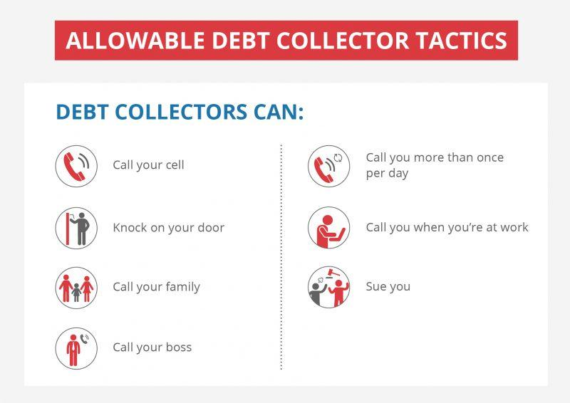

Debt collection plays a pivotal role in the financial system by enabling creditors to recover the funds owed to them. This process ensures liquidity within financial markets and aids in maintaining financial stability. However, for many consumers, encounters with debt collectors can be distressing, often exacerbated by aggressive collection practices. Understanding the regulations that govern debt collection is crucial for both consumers and collectors, as it helps to protect consumer rights while ensuring that legitimate collection efforts can proceed within legal boundaries.

The landscape of debt collection is governed by a set of regulations designed to protect consumers from abusive practices. The effectiveness of these regulations not only influences consumer experiences but also impacts the operational procedures of debt collection agencies. Consumers need to be aware of their rights to defend themselves against potential harassment and unfair practices, such as misleading representations of the debt amount or status.

Moreover, the debt collection industry is undergoing a transformation driven by technology, leading to the emergence of automated debt collection strategies. While automation can enhance the efficiency of debt recovery processes, it also poses significant privacy and ethical considerations. The integration of algorithms and machine learning in debt collection introduces new challenges and opportunities, necessitating updated regulatory frameworks to ensure consumer protection in this digital era.

This article will examine the critical components of debt collection, including an overview of consumer rights and debt collector regulations, and an analysis of how technological advances are reshaping this industry. By gaining an understanding of these elements, individuals can better navigate the challenges associated with debt collection, ensuring compliance, fair treatment, and the safeguarding of personal rights.

## Table of Contents

## Understanding Debt Collector Regulations

The Fair Debt Collection Practices Act (FDCPA) serves as the fundamental legal framework governing debt collection practices in the United States. Enacted in 1977, the FDCPA was designed to eliminate abusive, unfair, and deceptive practices by debt collectors. It seeks to protect consumers by laying out clear standards for debt collection activities. The act applies to personal, family, and household debts, encompassing transactions such as mortgage loans, credit cards, and medical bills.

Under the FDCPA, certain practices are explicitly prohibited to safeguard consumers from harassment and abuse. Debt collectors are barred from using threats of violence, obscene language, or repeatedly calling with the intent to annoy or harass. Misrepresentation is another area the FDCPA addresses, prohibiting debt collectors from misrepresenting the amount owed or falsely implying they are attorneys or government representatives.

In addition to federal regulations, amendments and state-specific laws provide an additional layer of consumer protection. These enhancements ensure that collectors adhere to higher standards and adapt to evolving consumer expectations. For instance, many states have implemented stricter rules on communication, requiring debt collectors to provide consumers with an initial written notice of their debt, including the amount owed and the name of the creditor.

State laws often impose more stringent statutes of limitations on debt collection actions, beyond the federal requirements. This restricts the time frame within which collectors can initiate legal action to recover debts. Moreover, some states have taken steps to regulate digital communication methods, ensuring that electronic correspondence maintains the same level of consumer protection as traditional methods.

Amendments to the FDCPA and related state mandates continue to reflect the dynamic nature of debt collection, acknowledging technological advances and changing societal norms. Collectors are required to stay informed about these regulatory changes to maintain compliance and avoid potential penalties. By aligning federal and state regulations, the intention remains to create a balanced environment where consumer rights are prioritized and respected throughout the debt collection process.

## Consumer Rights in Debt Collection

Consumers are entitled to specific rights designed to protect them from harassment, misrepresentation, and unfair practices by debt collectors under existing regulations. Key among these rights is the ability to request validation of the debt, which impels collectors to verify and substantiate the legitimacy and amount of the debt being pursued. Upon receiving a written request from a consumer within 30 days of receiving the initial communication, the debt collector must provide documentation affirming the debt's validity. Failure to provide such validation halts further collection efforts.

Consumers also have the right to limitations on contact. Debt collectors must adhere to regulations that restrict the times and places at which they can contact consumers, typically confining such communications to between 8 a.m. and 9 p.m. Consumers can also request cessation of communication, except to confirm the cessation or inform about specific legal actions.

In terms of privacy protection, debt collectors are prohibited from engaging in practices that would compromise an individual's confidentiality. They are barred from discussing a consumer's debt with third parties, with exceptions made for the consumer's attorney, spouse, or, in limited circumstances, co-debtors.

Moreover, consumers hold the right to dispute inaccuracies present in the debt information. Debt collectors must cease collection efforts until they have verified and rectified any errors reported. This process ensures that consumers are not wrongfully burdened and are only held accountable for accurate debts.

In instances where collectors violate these regulations, consumers are encouraged to report such actions to regulatory authorities like the Federal Trade Commission (FTC). This step not only helps protect the individual consumer but also aids in broader enforcement efforts to uphold fair debt collection practices. Reporting violations enables authorities to collect critical data that can lead to regulatory actions, including lawsuits and penalties against offending parties.

Maintaining awareness of these consumer rights is paramount. It empowers individuals to better manage their financial challenges and ensures that debt collectors uphold the standards set forth to protect consumers from unfair, abusive, or deceptive practices.

## The Role and Responsibilities of Debt Collectors

Debt collectors function as intermediaries between creditors, who are owed money, and debtors, who owe the money. Their primary role is to recover outstanding debts on behalf of the creditors. The effectiveness and fairness of debt recovery depend significantly on the collectors’ adherence to a comprehensive legal framework designed to regulate their activities.

Debt collectors are bound by the Fair Debt Collection Practices Act (FDCPA), which is the key federal regulation governing their actions in the United States. The FDCPA prohibits debt collectors from engaging in practices that are considered abusive, deceptive, or unfair. For instance, they must identify themselves honestly, avoid making false statements about the debt, and refrain from using threats or harassment. Any deviation from these legal requirements can result in significant legal consequences, including consumer lawsuits and monetary penalties imposed by regulatory authorities.

Collectors must maintain transparency and respect debtor rights during their interactions. This includes clearly communicating the debt details and providing proof of the debt upon request from the consumer. They are also required to respect specific communication boundaries, such as the preferred contact times and methods indicated by the consumer, ensuring that they do not intrude upon a debtor's privacy unfairly.

A failure to conform to these legal stipulations not only damages the debt collector’s reputation but can also lead to legal action from the consumers affected. Consumers have the right to take legal action if they believe the debt collector has violated their rights under the FDCPA. Regulatory bodies, such as the Federal Trade Commission (FTC) and the Consumer Financial Protection Bureau (CFPB), have the authority to penalize non-compliant collectors, thus reinforcing the importance of adherence to the law.

Therefore, debt collectors must operate within the legal boundaries established to protect both themselves and the rights of consumers, ensuring a fair and transparent debt recovery process.

## Algorithmic Trading and Debt Collection

Algorithmic trading, a staple in modern financial markets, utilizes computational logic to automate and optimize the trading process. Similarly, automated debt collection strategies leverage algorithms and [machine learning](/wiki/machine-learning) to enhance the efficiency and effectiveness of recovering outstanding debts. By automating routine tasks, such as identifying delinquent accounts, prioritizing collection activities, and even predicting borrower behavior, organizations can potentially streamline operations significantly.

However, automation in debt collection also introduces privacy and ethical concerns. Algorithms, if not designed and monitored appropriately, can lead to biases, privacy invasions, or non-compliance with regulatory standards. For instance, the use of algorithms to profile consumers could inadvertently result in discriminatory practices if biased data or flawed logic is applied. This can lead to unfair treatment of certain consumer groups, raising substantial ethical concerns.

Regulators and industry bodies are increasingly scrutinizing the use of such technologies in debt collection. They aim to ensure that these practices align with consumer protection laws, such as the Fair Debt Collection Practices Act (FDCPA) in the United States, which prohibits abusive, deceptive, or unfair practices. The regulatory focus is on maintaining consumer rights and ensuring that technology does not circumvent existing legal frameworks designed to protect consumers.

The impact of automated debt collection technologies on consumer rights and collection practices remains a crucial area for ongoing evaluation. As these systems evolve, stakeholders must maintain a balance between technological innovation and consumer protection. This involves regular audits of algorithms, transparency in automated processes, and establishing clear guidelines that govern the use of automation in debt collection efforts. By addressing these concerns, both efficiency and fairness can be achieved, benefiting both creditors and consumers alike.

## Protecting Personal Information During Debt Collection

Safeguarding personal information during debt collection is essential to prevent identity theft and protect consumer privacy. In debt collection processes, sensitive data, including Social Security numbers, financial details, and personal identification information, must be handled with utmost care to prevent unauthorized access and misuse.

Consumers play a pivotal role in protecting their own personal information. They should verify the legitimacy of any debt collector before sharing personal details. This verification can be achieved by asking for official identification or credentials from the collector, referencing any correspondence received from the original creditor, or confirming the collector's affiliation with a legitimate debt collection agency. Consumers are advised to keep records of all communications and to ensure that any information shared is pertinent and necessary for resolving the debt inquiry.

Debt collectors are legally bound to follow strict regulations regarding the handling of personal information. The Fair Debt Collection Practices Act (FDCPA) prohibits collectors from engaging in deceptive methods to obtain personal information. This includes misleading consumers about the nature or amount of the debt, using false pretenses to elicit information, or representing themselves as someone other than a debt collector. Collectors must maintain transparency about their intentions and provide clear and accurate information to consumers.

To further enhance data protection, collectors should implement robust security measures such as encryption and secure data storage solutions. Collectors should also undergo regular training on privacy laws to ensure compliance with data protection standards. This reduces the risk of data breaches and protects consumers from potential identity theft.

In summary, protecting personal information during debt collection is a shared responsibility between consumers and collectors. Through vigilance, adherence to legal frameworks, and the utilization of secure practices, the risks associated with data breaches and identity theft can be minimized, fostering a safer environment for all parties involved.

## Reporting Violations and Seeking Redress

Consumers have the right to report non-compliant debt collectors to authorities such as the Federal Trade Commission (FTC) when they encounter practices that violate established regulations. The FTC plays a crucial role in enforcing the Fair Debt Collection Practices Act (FDCPA), which was enacted to protect consumers from unfair, deceptive, or abusive collection practices. By reporting violations, consumers not only seek individual redress but also contribute to broader regulatory enforcement efforts that can lead to penalties or corrective actions against offending collectors.

Legal avenues available to consumers for claiming damages resulting from such violations include filing complaints with the Consumer Financial Protection Bureau (CFPB) or pursuing legal action in court. Under the FDCPA, consumers may be entitled to statutory damages, attorney fees, and compensation for any actual damages suffered due to the collector's misconduct. The act provides a systematic framework for consumers to assert their rights and seek justice.

Prompt reporting of violations is essential to ensure timely corrective measures. By swiftly documenting incidents of harassment, misrepresentation, or any other non-compliant actions by debt collectors, consumers strengthen their cases and enhance the likelihood of successful outcomes. Ensuring accurate and comprehensive documentation is crucial, as it forms the basis of any complaint or legal action.

Holding violators accountable is a vital aspect of consumer protection, serving both as a remedy for affected individuals and as a deterrent to prevent future violations. Increased accountability fosters a more ethical and fair collection environment, encouraging debt collectors to adhere strictly to legal standards. Regulatory bodies like the FTC and CFPB rely on consumer reports to identify problematic trends and enact policies that reinforce compliance within the industry.

In summary, consumers have several mechanisms at their disposal to report violations and seek redress when debt collectors engage in prohibited practices. Leveraging resources provided by regulatory authorities and the legal framework of the FDCPA, individuals can effectively challenge misconduct and maintain their rights against aggressive or unethical debt collection tactics.

## Future Trends in Debt Collection Regulations

The regulatory landscape for debt collection is undergoing significant changes as it adapts to the challenges and opportunities presented by emerging technologies. This evolution is particularly evident in the area of digital communication, where debt collectors increasingly leverage electronic methods to reach consumers. Anticipated changes in regulations aim to establish stricter guidelines for digital communication to ensure that consumer rights are protected. This includes setting clear boundaries on the frequency and timing of electronic communications, such as emails and text messages, to prevent harassment or abuse.

In addition to communication guidelines, there is a growing emphasis on enhancing consumer data protections. As debt collectors collect and utilize considerable amounts of personal data, the risk of misuse or unauthorized access becomes a concern. Regulatory bodies are expected to implement more robust data protection standards to safeguard consumer information against breaches and identity theft. These standards may involve stringent data encryption protocols and regular audits of data handling practices by collection agencies.

Furthermore, the integration of [artificial intelligence](/wiki/ai-artificial-intelligence) (AI) and machine learning (ML) in debt collection practices has prompted regulatory scrutiny. While these technologies can improve efficiency and recovery rates, they also raise ethical questions regarding transparency and decision-making processes. Regulators are likely to issue guidelines that ensure AI-driven debt collection tools operate within ethical boundaries, preventing discrimination or unfair treatment of consumers.

Stakeholders, including debt collection agencies, creditors, and consumers, must stay informed about these evolving regulations to ensure compliance and protection of individual rights. This involves continuous education and adaptation to new legal requirements as they are enacted. Failure to adapt to regulatory changes can result in legal repercussions and consumer distrust, both of which can have severe implications for debt recovery operations.

Ultimately, the continued evolution of debt collection regulations seeks to balance the efficiency of modern technology with the fundamental rights of consumers. By anticipating and preparing for forthcoming changes, stakeholders can contribute to a fair and transparent debt collection ecosystem that respects consumer protections while meeting the needs of creditors.

## Conclusion

Understanding debt collection regulations and consumer rights is crucial for individuals navigating the often complicated world of debt. These regulations empower consumers by providing a framework within which they can protect themselves from improper debt collection practices. They also guide debt collectors in maintaining ethical and legal standards, ensuring an equitable playing field for all parties involved.

For consumers, awareness of their rights means they can effectively counteract any misuse or aggressive tactics by debt collectors. This knowledge includes understanding how to dispute a debt, knowing the limitations on how often and when a collector can contact them, and recognizing the importance of safeguarding their personal information.

On the other hand, debt collectors must keep themselves updated with the evolving regulations to perform their duties within legal boundaries. Adhering to these regulations not only helps in avoiding legal repercussions but also enhances their credibility and trustworthiness with consumers. Compliance fosters a more transparent and fair debt collection process, reducing the potential for animosity or misunderstanding between parties.

In a dynamically changing regulatory environment, where new technologies and practices continuously reshape how debt collection is conducted, vigilance is key. Stakeholders must monitor and adapt to these changes to prevent any breaches of consumer rights and ensure they remain compliant. This vigilance helps maintain the integrity of the debt collection industry and protects the rights of individuals, thus upholding fair practices.

By staying informed and proactive, both consumers and collectors can contribute to a fair and balanced debt collection system that respects the rights and responsibilities of all parties involved.

## References & Further Reading

[1]: Ramsay, I. (2012). ["Consumer Credit Regulation: Theory and Practice"](https://link.springer.com/content/pdf/10.1007/s10603-019-09436-x.pdf). Cambridge University Press.

[2]: ["The Fair Debt Collection Practices Act (FDCPA)"](https://www.ftc.gov/legal-library/browse/rules/fair-debt-collection-practices-act-text) - Federal Trade Commission.

[3]: Smith, M., & Brown, G. (2007). ["Debt Collection and Technology"](https://www.researchgate.net/publication/284471328_Cooperative_Learning_Improving_university_instruction_by_basing_practice_on_validated_theory) in "Consumer and Social Well-being" (eds. Moore, E. & Lutz, R.).

[4]: ["Machine Learning for Financial Engineering"](https://www.coursera.org/specializations/machine-learning-reinforcement-finance) edited by Agostino Capponi and Cristian-Ioan Vasile.

[5]: "Federal Trade Commission Bureau of Consumer Protection Annual Report" – [Link](https://courts.ca.gov/opinions/publishedcitable-opinions).

[6]: ["Debt Collection Disputes and Compliance"](https://www.consumerfinance.gov/compliance/compliance-resources/other-applicable-requirements/debt-collection/debt-collection-rule-faqs/) in "Journal of Personal Finance".