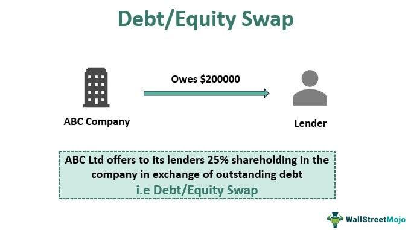

## Table of Contents

## What is a debt-equity swap?

A debt-equity swap is when a company changes its debt into shares of its own stock. Instead of owing money, the company gives the lender part of the company. This can help the company because it reduces the amount of money it has to pay back. It's like trading a future payment for a piece of the company right now.

This kind of swap can be good for the company if it's having trouble paying its debts. By turning debt into equity, the company doesn't have to make regular payments on that debt anymore. However, it means the original owners of the company will own a smaller part of it because they've given some of it to the lender. It's a way to keep the company going without going bankrupt, but it changes who owns what.

## How does a debt-equity swap work?

A debt-equity swap happens when a company that owes money decides to give the lender part of the company instead of paying back the debt. Imagine you borrowed money from a friend, and instead of giving the money back, you give them a piece of your business. That's what a company does in a debt-equity swap. The lender agrees to this because they believe the company might be worth more in the future than the money they're owed right now.

When this swap happens, the company's debt goes down because they don't have to pay back that part of the loan anymore. But, the people who already own the company will own a smaller piece of it because they've given some of it away to the lender. It's like sharing your pie with someone else so you don't have to pay them money. This can help the company stay afloat if it's struggling, but it means the original owners have less control and ownership.

## What are the main reasons companies undertake debt-equity swaps?

Companies often do debt-equity swaps when they're having a hard time paying back their loans. By turning their debt into shares of the company, they don't have to make those loan payments anymore. This can help them avoid going bankrupt and keep the business running. It's like trading a future headache for a smaller piece of the pie right now.

Another reason is to improve the company's balance sheet. When a company swaps debt for equity, it reduces the amount of money it owes, which can make the company look healthier to investors and other lenders. This can be important if the company wants to borrow more money in the future or if it's trying to attract new investors. It's a way to clean up the company's financial picture and make it more appealing to others.

## Who are the typical beneficiaries of a debt-equity swap?

The company that does the debt-equity swap often benefits because it no longer has to pay back the debt. This can help the company avoid going bankrupt and keep running. It's like getting a fresh start by giving up a piece of the business instead of money. This can also make the company's financial situation look better, which might attract new investors or make it easier to get more loans in the future.

The lender can also benefit from a debt-equity swap. Instead of getting their money back, they get part of the company. If the company does well in the future, the value of the shares they received might be worth more than the original debt. It's a gamble, but it can pay off big if the company grows and becomes more valuable.

## What are the potential advantages of a debt-equity swap for a company?

A debt-equity swap can be a big help for a company that's struggling to pay its debts. By turning its debt into shares of the company, the company doesn't have to worry about making those loan payments anymore. This can stop the company from going bankrupt and keep it running. It's like getting a second chance by giving up a piece of the business instead of money.

Another advantage is that a debt-equity swap can make the company's financial situation look better. When a company reduces its debt, it can seem healthier to investors and other lenders. This can be important if the company wants to borrow more money later or if it's trying to attract new investors. It's like cleaning up the company's financial picture to make it more appealing to others.

## What are the risks and drawbacks associated with debt-equity swaps?

One risk of a debt-equity swap for the company is that the original owners will own less of the business. When they give shares to the lender, the pie gets divided into more pieces, so each original piece is smaller. This means the original owners have less control over the company. They might not like having to share their business with someone else, especially if they believe in their company's future.

For the lender, the main risk is that the shares they get might not be worth as much as the money they were owed. If the company doesn't do well, the value of those shares could go down, and the lender could lose money. It's a gamble because they're betting that the company will grow and the shares will be worth more than the debt. If that doesn't happen, the lender might wish they had just gotten their money back instead.

Another drawback is that debt-equity swaps can be complicated and take a lot of time to set up. Both the company and the lender need to agree on the value of the shares and how many shares the debt will be swapped for. This process can involve lawyers and accountants, which can be expensive and time-consuming. Plus, it might make other investors nervous, wondering if the company is in trouble if it needs to do a swap.

## How does a debt-equity swap affect a company's balance sheet?

When a company does a debt-equity swap, it changes the way its balance sheet looks. The company's debt goes down because it no longer has to pay back the part of the loan that was swapped. Instead, the company gives the lender shares, so the equity part of the balance sheet goes up. This makes the company look like it has less debt and more ownership by shareholders, which can make the company seem healthier to people looking at its financials.

However, this swap also means the company's total assets might not change much, but the way those assets are financed does. The company trades one type of financing (debt) for another (equity). This can be good for the company because it doesn't have to make interest payments on the swapped debt anymore. But it also means the original owners own a smaller piece of the company, which can affect how much control they have over the business.

## Can you explain the tax implications of a debt-equity swap?

When a company does a debt-equity swap, it can have different tax effects for both the company and the lender. For the company, turning debt into equity can sometimes help lower its tax bill. This is because interest payments on debt are usually tax-deductible, but when the company swaps debt for equity, it doesn't have to pay interest anymore. However, this also means the company loses the tax benefit of those interest deductions. The tax impact depends on the specific rules in the country where the company operates, so it's important to check with a tax expert.

For the lender, getting shares instead of money can also change their taxes. If the lender gets shares that are worth more than the debt they were owed, they might have to pay taxes on that extra value as income. On the other hand, if the shares are worth less than the debt, the lender might be able to claim a loss on their taxes. The tax rules for this can be complicated and vary by country, so the lender should talk to a tax advisor to understand how the swap will affect their taxes.

## What role do creditors play in a debt-equity swap?

Creditors play a big part in a debt-equity swap. They are the ones who decide if they want to take shares of the company instead of getting their money back. If the company is having trouble paying its debts, the creditors might agree to the swap because they think the company could be worth more in the future. They are taking a risk, hoping that the shares they get will be worth more than the money they were owed.

The creditors also have to agree on how many shares they will get in exchange for the debt. This means they need to work with the company to figure out the value of the shares and make sure the swap is fair. If the creditors don't agree to the swap, it can't happen, so their role is very important. They help decide if the company can use this way to fix its money problems and keep going.

## How do debt-equity swaps impact existing shareholders?

When a company does a debt-equity swap, it gives shares to the lender instead of paying back the debt. This means the existing shareholders will own a smaller piece of the company because there are more shares now. Imagine you own a pizza and you give away a slice to someone else. Your piece of the pizza gets smaller even though the whole pizza is still the same size. This can make existing shareholders unhappy because they have less control over the company and their shares might be worth less.

But, a debt-equity swap can also help the company avoid going bankrupt. If the company can't pay its debts, it might have to close down. By doing the swap, the company can keep running and might even do better in the future. If that happens, the value of the company could go up, which could make the shares worth more. So, while existing shareholders own a smaller piece of the company, that smaller piece might be worth more if the company does well. It's a trade-off where they give up some ownership now for a chance at a healthier company later.

## What are the regulatory considerations and legal frameworks governing debt-equity swaps?

Debt-equity swaps are controlled by different rules and laws depending on where the company is. These rules make sure the swap is fair and legal. For example, companies might need to get the okay from a court or a government group before they can do the swap. This is to protect everyone involved, like the shareholders and the creditors. Also, the rules might say how the company has to tell everyone about the swap, so people know what's happening with their money or shares.

Another important thing is that the laws can affect how the swap is done. For example, some countries have rules about how much debt can be turned into equity, or they might have special tax rules for swaps. Companies need to follow these rules or they could get in trouble. Because of this, companies often work with lawyers and accountants to make sure they do everything right. This helps them avoid problems and make sure the swap is good for the company and the people who own it.

## Can you discuss a real-world example of a successful debt-equity swap and its outcomes?

One real-world example of a successful debt-equity swap happened with General Motors (GM) in 2009. GM was having a lot of money problems because people were buying fewer cars. To keep the company from going bankrupt, the U.S. government stepped in and helped with a debt-equity swap. Instead of paying back all its debt, GM gave shares of the company to the government and some of its lenders. This helped GM lower its debt and keep running.

After the swap, GM was able to start making money again. The company got a fresh start and could focus on making better cars without the heavy weight of debt. Over time, the value of GM's shares went up, which was good for the people who got shares in the swap. The government eventually sold its shares and got most of its money back. This swap helped save GM and showed how a debt-equity swap can work well if the company can turn things around after getting some breathing room.

## What is the impact on shareholders and company valuation?

Debt-equity swaps, an essential tool in financial restructuring, have significant implications for shareholders and company valuation. By converting debt into equity, these swaps influence both the ownership structure and the financial metrics of a company. 

### Shareholder Dilution and Changes in Voting Rights

Debt-equity swaps lead to an increase in the equity base of a company, resulting in the issuance of new shares. This process can dilute the holdings of existing shareholders, which means their ownership percentage decreases because there are more shares outstanding. If the debt being converted is substantial, the dilution can be significant. For example, if a company originally had 1,000 shares and issued another 500 to convert debt into equity, existing shareholders would see their ownership stake reduced by 33%.

$$
\text{New ownership percentage} = \frac{\text{Original shares}}{\text{Original shares} + \text{New shares}}
$$

Additionally, the power dynamics within a company could shift due to changes in voting rights. New equity holders resulting from the conversion of debt may gain substantial voting power, potentially influencing decisions and the overall strategic direction of the company. This recalibration of control must be considered when such swaps are proposed.

### Case Studies on Market Perceptions and Company Valuation

Examining case studies can illustrate how debt-equity swaps affect market perception and company valuation. When analyzing market reactions, investors often focus on the financial viability and strategic rationale behind the swap. For instance, when companies like General Motors undertook debt-equity swaps during the financial crisis, it was perceived as an essential step for survival, improving their balance sheets and restoring market confidence. The immediate result was often a rise in stock prices due to the improved financial outlook, even if accompanied by initial dilution concerns.

Conversely, if the market perceives the swap as a desperate measure by a distressed company, it might lead to a decrease in stock value due to anticipated instability or poor future performance. Therefore, the context and communication surrounding the swap are crucial in shaping market perception.

### Strategies for Effective Communication with Shareholders

Effective communication with shareholders is vital to mitigate potential adverse reactions. Companies should ensure transparency by explaining the rationale behind the debt-equity swap, highlighting benefits such as enhanced financial stability and reduced interest expenses. Regular updates and open channels for questions can help in easing shareholder concerns about dilution or changes in governance.

Critical to this process is a well-defined communication plan that includes meetings, press releases, and detailed reports. Firms should also engage key stakeholders early in the process to obtain any necessary approvals and address concerns proactively. By adopting these strategies, companies can maintain trust and support during restructuring initiatives involving debt-equity swaps. 

In conclusion, while debt-equity swaps offer strategic advantages in financial restructuring, they necessitate careful consideration of their impact on shareholder equity and company valuation. Transparent communication and strategic planning can assist in aligning shareholder interests with the company's financial goals.

## What are the best practices for executing debt-equity swaps?

Executing a successful debt-equity swap requires a strategic approach that ensures regulatory compliance, stakeholder engagement, and effective valuation. Below is a step-by-step guide to conducting such a swap effectively:

### Step-by-Step Guide to Executing a Debt-Equity Swap

1. **Assessment of Financial Position**: 
   - Determine the necessity of a debt-equity swap by analyzing the company's current debt burden and equity structure. This involves examining the company's liquidity ratios, debt-to-equity ratio, and overall financial health.

2. **Engagement with Key Stakeholders**:
   - Initiate consultations with shareholders, creditors, and board members to align interests and gather support. It's crucial to transparently communicate the strategic intent and benefits of the swap.

3. **Regulatory Adherence**:
   - Ensure compliance with relevant legal and regulatory requirements. This may involve obtaining shareholder approvals, meeting securities regulations, and adhering to corporate governance standards.

4. **Valuation Techniques**:
   - Accurately valuing debt and equity is critical. Common valuation methods include the discounted cash flow (DCF) analysis for equity and the market value or book value approach for debt. For example, the DCF formula can be expressed as:
$$
     V = \sum \frac{CF_t}{(1 + r)^t}

$$
     where $V$ is the value of the equity, $CF_t$ is the cash flow in year $t$, and $r$ is the discount rate.

5. **Negotiating Terms**:
   - Define the swap ratio based on the valuation results, reflecting the relative value of debt and equity to be exchanged. Negotiate terms with creditors and shareholders to reach a mutually beneficial agreement.

6. **Timing Considerations**:
   - Timing is essential in executing a swap, given market conditions and internal financial cycles. Understanding market sentiment and shareholder readiness can aid in choosing an optimal time for the swap.

7. **Implementation of the Swap**:
   - Execute the swap, ensuring all legal documents are correctly prepared and filed. This involves issuing new equity to the creditors in exchange for the cancellation or reduction of debt.

8. **Monitoring and Communication**:
   - Post-execution, monitor the impact of the swap on the company's financial performance and market perception. Continue transparent communication with stakeholders to maintain confidence and support.

### Key Considerations

- **Stakeholder Engagement**: Proactively manage stakeholder relations by addressing concerns and ensuring transparent communication throughout the process.

- **Regulatory Compliance**: Detailed attention to legal and regulatory frameworks is essential to prevent potential setbacks and ensure a smooth process.

- **Valuation and Timing**: Using robust valuation models and considering market timing can significantly influence the success of the swap.

By adhering to these best practices, companies can effectively execute debt-equity swaps, stabilizing their financial structure and enhancing value for shareholders.

## References & Further Reading

1. Gennaioli, N., Shleifer, A., & Vishny, R. W. (2012). A Model of Debt and Equity. *The Journal of Finance, 67*(3), 120-124. This article provides foundational insights into debt-equity dynamics, offering a theoretical framework that helps elucidate how these swaps influence corporate financial architecture.

2. Altman, E. I., & Hotchkiss, E. (2005). *Corporate Financial Distress and Bankruptcy: Predict and Avoid Bankruptcy, Analyze and Invest in Distressed Debt*. John Wiley & Sons. This text offers a detailed guide to anticipating and navigating financial distress, underscoring the role of debt-equity swaps as a corrective measure.

3. Scott, J. (1995). The New Financial Corporate Contract in Chapter 11: A Mechanism for Resolving Shareholder-Management Conflict. *Journal of Applied Corporate Finance, 8*(4), 23-31. This paper explores the strategic utility of financial restructuring mechanisms, including swaps, in the context of bankruptcy proceedings.

4. Sundaresan, S., & Wang, N. (2006). Dynamic Investment, Capital Structure, and Debt Overhang. *Review of Financial Studies, 19*(2), 499-523. The authors discuss the implications of capital structure adjustments and swaps, particularly in scenarios of debt overhang.

5. Haugen, R. A., & Senbet, L. W. (1998). Bankruptcy and Agency Costs: Their Significance to the Theory of Optimal Capital Structure. *Journal of Financial and Quantitative Analysis, 23*(1), 27-38. This paper examines how agency costs and bankruptcy risks can be mitigated through capital restructuring strategies such as debt-equity swaps.

6. Hull, J. C. (2014). *Options, Futures, and Other Derivatives*. Prentice Hall. Chapter 27 of this book offers insights into the intersection of derivatives with corporate finance strategies, including the integration of algorithmic trading in executing swaps.

7. Jensen, M. C. (1986). Agency Costs of Free Cash Flow, Corporate Finance, and Takeovers. *American Economic Review, 76*(2), 323-329. The document highlights how swaps can align interests between stakeholders and improve corporate governance.

8. Bamber, M. E., & Cheon, Y. S. (1995). Differential Price Reactions to Accounting Earnings Announcements. *The Accounting Review, 70*(3), 419-441. This study provides empirical evidence on how market perceptions are influenced by financial restructuring including debt-equity swaps.

9. Cumming, D., & Johan, S. (2017). *The Oxford Handbook of IPOs*. Oxford University Press. This handbook gives broad coverage of financial instruments and valuation methods which are relevant to understanding the nuances of executing debt-equity swaps effectively.

10. Paulus, C. G. (2006). Comparative Analysis of International Corporate Insolvency Laws. *OECD Journal: Financial Market Trends, 2006*(2), 104-122. This article assists in navigating the complexities of the legal and regulatory environment central to the execution of debt-equity swaps. 

These references and resources provide a comprehensive understanding of debt-equity swaps, their mechanisms, and implications on corporate finance.

