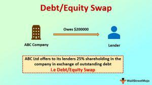

Debt-equity swaps are integral components of corporate finance, offering companies a tool to restructure their balance sheets and address financial challenges. By converting debt into equity, this mechanism allows companies to reduce their debt burden, enhancing their liquidity and improving leverage ratios. Such financial restructuring is crucial in volatile economic landscapes where companies must adapt swiftly to changing market conditions to ensure survival and growth.

The strategic implications of debt-equity swaps are significant as they provide potential recovery pathways for companies facing financial distress. Reducing debt obligations can prevent bankruptcy, allowing firms to realign their operational and financial strategies without the shackles of crippling debt. Consequently, these swaps can stabilize a company's financial structure, laying the foundation for future growth and stability.



The legal considerations surrounding debt-equity swaps are complex, involving compliance with securities regulations, securing shareholder approvals, and understanding tax implications. Navigating these legal frameworks is essential to executing successful swaps that align with both corporate goals and regulatory requirements.

Algorithmic trading, with its ability to analyze and respond to market data rapidly, influences financial restructuring decisions, including debt-equity swaps. Insights generated through algorithmic trading can optimize the timing and execution of swaps, enhancing their effectiveness and impact on stock prices and market confidence.

This article examines the broader impact of debt-equity swaps on corporate finance, exploring not only how they restructure companies' financial positions but also their strategic role in financial restructuring, their interaction with algorithmic trading, and the future prospects of these financial mechanisms. Understanding the complexities and potential benefits of debt-equity swaps is crucial for stakeholders aiming to navigate the challenges of contemporary corporate finance environments successfully.

## Table of Contents

## Understanding Debt-Equity Swaps

A debt-equity swap is a financial mechanism that involves the conversion of a company's debt into equity, thereby altering its capital structure. This financial technique is designed to improve a company's financial position, particularly for those firms experiencing financial difficulties. By converting debt obligations into equity, companies can enhance their liquidity and improve leverage ratios, which are critical indicators of financial health.

### Mechanism of Debt-Equity Swaps

Debt-equity swaps generally operate by forgiving a portion of the company's outstanding debt in exchange for the issuance of new shares. For instance, a creditor holding debt securities, such as bonds, may agree to convert these into equity shares. This conversion alleviates the pressure of recurring interest payments, reducing the likelihood of default or bankruptcy. The basic formula underpinning this conversion is:

$$
\text{Equity Value} = \frac{\text{Debt Value}}{\text{Conversion Price}}
$$

Here, the "Debt Value" denotes the principal amount of debt being converted, and the "Conversion Price" is the predetermined price at which the debt is converted into equity.

### Use Cases and Benefits

Debt-equity swaps are employed in various scenarios, primarily when a company confronts financial distress. They are instrumental in avoiding bankruptcy by lessening the debt burden on a company's balance sheet and enhancing cash flows. The reduction in liabilities and interest payments allows a company to redirect resources towards operational needs and strategic investments.

This mechanism is not solely applicable to distressed companies. Well-performing companies may also utilize debt-equity swaps to rebalance their financial structure, especially if they aim to lower debt levels or deter hostile takeovers by diluting equity ownership.

### Types of Debt-Equity Swaps

Several variations of debt-equity swaps exist, each tailored to specific business needs:

1. **Voluntary Swaps**: These occur when both debtor and creditor mutually agree on the conversion terms. This type is common in consensual restructuring plans where creditors believe in the long-term prospects of the company.

2. **Mandatory Swaps**: Often enforced as part of a bankruptcy or insolvency proceeding, these swaps are imposed to restructure the company's finances as per judicial or regulatory guidelines.

3. **Distressed Debt Exchanges**: This type involves swapping debt for equity under distressed conditions, usually at a discount to the original debt value. It is aimed at emphasizing recovery over short-term interests.

### Importance in Corporate Finance

Understanding the mechanics of debt-equity swaps is essential for businesses and stakeholders involved in corporate finance due to their potential impact on company valuation and control dynamics. By reducing leverage, companies can improve their creditworthiness and market perception, which is crucial for accessing additional capital in the future.

In summary, debt-equity swaps serve as critical tools in financial management, enabling companies to navigate financial challenges effectively. They offer a pragmatic approach to enhance a firm's balance sheet robustness, aligning financial structures with strategic objectives.

## Strategic Role in Financial Restructuring

Debt-equity swaps are crucial instruments in corporate restructuring, especially during periods marked by financial distress. These swaps offer a rapid solution for improving a company's financial health and future growth prospects. By converting debt into equity, a company can enhance its [liquidity](/wiki/liquidity-risk-premium), decrease leverage, and potentially avoid bankruptcy, thereby stabilizing its financial situation.

One of the significant outcomes of executing debt-equity swaps is the potential alteration of control dynamics within a company. As creditors convert their debt holdings into equity, they may acquire substantial control, influencing or even altering corporate governance. This conversion can lead to a realignment of strategic priorities as new or existing stakeholders gain increased influence over company decisions. The redistribution of ownership percentages might change board compositions and affect decision-making processes.

Examples of successful restructuring highlight the long-term strategic benefits of debt-equity swaps. For instance, General Motors' 2009 bankruptcy restructuring involved a debt-equity swap that played a vital role in its recovery. By converting a significant portion of its debt into equity, the company was able to reduce its financial burden and reemerge as a competitive player in the automotive industry. The swap improved GM's balance sheet, allowing it to reinvest in its operations and pursue growth strategies that had previously been untenable due to its debt load.

The impact of debt-equity swaps on corporate governance and shareholder value is complex. On one hand, existing shareholders face the risk of dilution, as the issuance of new equity to creditors reduces their proportionate ownership. However, if the swap successfully stabilizes the company and enhances its prospects for growth, the overall value of the firm may increase, ultimately benefiting all shareholders. Effective communication and negotiation with stakeholders can help mitigate potential conflict and align interests during the execution of swaps.

Debt-equity swaps serve as powerful tools for addressing financial distress, offering both immediate relief and the potential for long-term strategic benefits. By navigating the balance between financial stability and changes in corporate control, companies can use these instruments to enhance their resilience and future performance.

## Algorithmic Trading and Financial Restructuring

Algorithmic trading, characterized by the use of complex algorithms to make trading decisions, plays an influential role in financial restructuring, particularly in debt-equity swaps. The integration of algorithmic strategies allows for real-time analysis of market data, enabling more informed decision-making. This computational approach can mitigate risks and optimize the timing of executing swaps by rapidly identifying favorable market conditions.

Debt-equity swaps can significantly affect stock prices due to the conversion of debt into equity, impacting shareholder structure and market perception. Such changes often result in a volatile stock reaction, which [algorithmic trading](/wiki/algorithmic-trading) systems can exploit for strategic advantage. These algorithms can quickly assess the implications of swaps on liquidity, market trends, and investor sentiment, providing traders with essential insights to anticipate market movements.

Moreover, algorithmic trading enhances the ability to execute swaps efficiently by automating the monitoring of market conditions. Algorithms can run continuous analyses on market sentiment, price fluctuations, and trading volumes, generating actionable insights for optimal swap execution. For instance, if an algorithm detects a downward trend in stock prices due to an anticipated swap, it might suggest delaying the swap execution to a more favorable time, thereby preserving company value.

Algorithm-driven strategies aid in balancing immediate financial relief with strategic long-term growth. By leveraging historical data and predictive analytics, these algorithms can forecast market responses to restructuring initiatives, helping companies align their financial restructuring plans with broader market conditions. This predictive capability is crucial in not only executing swaps effectively but also in setting appropriate shareholder expectations and maintaining investor confidence.

In conclusion, algorithmic trading is a vital component in the effective execution of financial restructuring strategies. Its ability to provide diverse market insights ensures that companies can make calculated, data-driven decisions when considering debt-equity swaps. As these technologies evolve, they will continue to refine the mechanisms of financial restructuring, offering more sophisticated tools for navigating complex economic landscapes.

## Legal Considerations and Regulatory Compliance

Debt-equity swaps necessitate careful navigation of complex legal frameworks to ensure compliance and successful execution. A key concern involves adherence to securities regulations which govern the issuance and exchange of equity for debt. The Securities and Exchange Commission (SEC) requires full disclosure of information related to swaps to ensure transparency and protect investors. This process includes filing registration statements or adhering to exemptions if applicable, such as those provided under Regulation D or Regulation S for private placements.

Shareholder approvals are another significant legal hurdle. Swaps often alter the ownership structure of a company, potentially diluting existing shareholders' equity. Consequently, obtaining explicit consent from shareholders is crucial, and the specific requirements can vary based on a firm's bylaws and the jurisdiction in which it operates. This ensures that shareholders' rights are respected and potential conflicts are managed effectively.

Tax implications also play a critical role in the feasibility of debt-equity swaps. The conversion of debt into equity may trigger tax events, depending on how the transaction is structured. For instance, under U.S. tax law, a gain or loss may need to be recognized if the fair market value of the equity exchanged differs significantly from the debt's adjusted basis. Companies must work closely with tax advisors to manage these implications optimally and understand the potential impact on net operating losses and future taxable income.

Changes in ownership and governance due to swaps can raise legal challenges. Swaps might result in creditors gaining significant equity stakes, thereby influencing corporate governance. This shift may trigger mandatory offers for minority shareholders in some jurisdictions or invoke "change of control" clauses within existing contracts, potentially impacting operations and strategic decisions.

Regulatory trends impacting debt-equity swaps continuously evolve, necessitating a proactive approach to legal compliance. Jurisdiction-specific regulations, like those under the European Union’s Market Abuse Regulation, may impose additional responsibilities, including market manipulation prevention and insider trading restrictions. Companies must monitor these trends to anticipate and adapt to regulatory shifts, ensuring compliance and minimizing legal risks.

In navigating the legal complexities of executing swaps, firms must assemble a robust team of legal, financial, and regulatory experts. This multidisciplinary team should conduct thorough due diligence, assessing potential legal risks and preparing comprehensive documentation to facilitate shareholder engagement and regulatory approvals. The strategic alignment of legal practices with corporate finance goals ensures that debt-equity swaps are not only compliant but also beneficial in achieving long-term financial stability and growth.

## Impact on Shareholders and Company Valuation

Debt-equity swaps, processes where a company's debt is exchanged for equity, can significantly impact shareholders and company valuation. Primarily, these swaps result in dilution for existing shareholders due to the increase in the total number of shares outstanding. However, this dilution can yield benefits if it serves to stabilize or enhance the company's overall value in the long term. The issue of shareholder dilution often leads to changes in voting rights, as the increase in shares may dilute the control that current shareholders have over corporate decisions.

### Impacts on Voting Rights and Market Considerations
When a company undergoes a debt-equity swap, the distribution of voting rights is affected, as creditors receiving equity in exchange for debt can become significant shareholders with substantial influence. This shift can alter the balance of power within the company's governance structure, potentially leading to strategic changes. It is crucial for companies to manage this transition carefully to maintain shareholder confidence and prevent destabilizing governance disputes.

Market confidence, reflected through share price movements, is another critical area impacted by debt-equity swaps. Investors often perceive these swaps as signals of financial distress, potentially leading to initial negative reactions in the stock market. However, if the swap is part of a broader, well-communicated restructuring plan aimed at restoring financial health, investor confidence may eventually improve, leading to stabilization or appreciation in share prices.

### Case Studies and Investor Perception
Historical cases provide insights into how debt-equity swaps can affect investors and market perception. For example, during financial restructurings, successful swaps in corporations such as General Motors and Chrysler played a significant role in their recovery post-2008 financial crisis. These swaps enabled the companies to reduce their debt burden, leading to improved liquidity and financial metrics, ultimately resulting in restored investor confidence and an increase in stock valuation over time.

### Long-term Shareholder Value
The potential for increased long-term shareholder value hinges on the premise that financial health will improve after the debt burden is reduced. As debt levels decrease, companies may see an enhancement in credit ratings, reduced interest expenses, and increased capacity for business reinvestment. These factors contribute to potential increased profitability and shareholder returns in the long run.

### Strategies for Managing Shareholder Communication and Expectations
Effective communication is vital during and after the execution of a debt-equity swap. Companies should ensure transparency in their objectives and provide clear explanations of the potential benefits, while addressing any concerns regarding shareholder dilution and changes in voting influence. Regular updates and strategic outlines help in aligning shareholder expectations with the company's long-term restructuring goals.

In conclusion, while debt-equity swaps can negatively impact existing shareholders through dilution and changes in voting rights, they can ultimately stabilize and potentially enhance company valuation if managed strategically. The efficacy of these swaps depends on the execution of effective communication strategies and transparent corporate governance, aimed at maintaining investor trust and supporting sustained recovery and growth.

## Best Practices for Executing Debt-Equity Swaps

To effectively execute debt-equity swaps, a well-structured approach is essential, encompassing thorough valuation, stakeholder engagement, and adherence to regulatory requirements.

A comprehensive valuation of the company's assets is critical before initiating a swap. This step involves assessing the fair market value of both the debt and the equity to be exchanged. Valuation models, such as the Discounted Cash Flow (DCF) analysis or the comparable company analysis, provide a quantitative basis for setting the exchange terms. Accurate valuation ensures that all parties have a realistic understanding of the company's financial health and potential future performance.

Engaging stakeholders early in the process is crucial for gaining their support and addressing concerns. Transparent communication and negotiation foster trust and cooperation among creditors, shareholders, and management. Stakeholders need to understand the benefits and implications of the swap, such as changes in ownership structure and potential dilution of shares. Regular updates and open forums for discussion can help maintain stakeholder alignment throughout the process.

Regulatory compliance is another fundamental aspect, as debt-equity swaps involve complex legal considerations. Companies must ensure compliance with securities laws, obtain necessary shareholder approvals, and consider tax implications. Legal advisors play a pivotal role in navigating these complexities, helping to avoid legal pitfalls and delays.

Post-swap strategies should focus on operational improvements and value enhancement to cement the benefits of the restructuring. Implementing cost reduction measures, optimizing capital allocation, and driving revenue growth are essential for improving the company's financial performance. Additionally, maintaining a robust corporate governance framework post-swap is critical to handling any changes in control dynamics effectively.

Monitoring market conditions and timing the swap execution are strategic elements that can significantly impact the outcomes. Financial markets are dynamic, and shifts in investor sentiment can influence the company's stock price. Utilizing market analysis and insights can aid in selecting the optimal time for the swap to ensure favorable conditions.

Below is a basic Python example illustrating how companies might simulate potential outcomes of a debt-equity swap using a hypothetical valuation scenario:

```python
# Example Python code for simulating debt-equity swap valuation

def discounted_cash_flow(cash_flows, discount_rate):
    """
    Calculate the present value of future cash flows.

    :param cash_flows: List of future cash flows
    :param discount_rate: Discount rate for DCF
    :return: Present value of cash flows
    """
    return sum([cf / ((1 + discount_rate) ** t) for t, cf in enumerate(cash_flows, start=1)])

def swap_outcome(current_debt, equity_value, discount_rate, future_cash_flows):
    """
    Simulate potential outcome of debt-equity swap.

    :param current_debt: Current value of debt to be swapped
    :param equity_value: Current equity value post-swap
    :param discount_rate: Discount rate for valuation
    :param future_cash_flows: List of projected future cash flows
    :return: New equity value post-swap
    """
    dcf_value = discounted_cash_flow(future_cash_flows, discount_rate)
    new_equity_value = equity_value + (dcf_value - current_debt)
    return new_equity_value

# Example scenario
current_debt = 5000000  # current debt value
equity_value = 3000000  # current equity value
discount_rate = 0.08  # 8% discount rate
future_cash_flows = [200000, 250000, 300000, 350000, 400000]  # projected cash flows

new_equity_value = swap_outcome(current_debt, equity_value, discount_rate, future_cash_flows)
print(f"New equity value post-swap: ${new_equity_value:,.2f}")
```

This script provides a rudimentary framework for assessing potential changes in equity value after a swap, highlighting the importance of financial forecasting and scenario analysis.

## Future Prospects of Debt-Equity Swaps

Debt-equity swaps are poised to remain integral in corporate finance strategy, particularly as companies navigate an increasingly complex economic and regulatory landscape. As businesses face diverse financial challenges, swaps offer a precise mechanism to recalibrate balance sheets, providing a pathway to mitigate debt burdens by converting them into equity. The continued evolution of debt-equity swaps will be shaped by several factors, including economic trends, regulatory developments, and innovations in financial instruments.

Emerging economic trends play a significant role in shaping swap strategies. With global economies experiencing periodic fluctuations, companies often seek adaptable strategies to maintain financial stability. For instance, periods of economic downturn, such as recessions, typically increase demand for debt-equity swaps as liquidity constraints tighten. This responsiveness makes swaps a vital recourse during volatile economic periods, allowing firms to adjust their capital structures when traditional financing options may be less accessible.

Regulatory changes will also crucially influence future swap activities. As financial regulations become tighter and more comprehensive, companies must navigate these complexities to undertake swaps successfully. Regulations concerning shareholder rights, securities, and tax implications can pose hurdles or offer opportunities, depending on their direction. As policymakers strive to protect investor interests and ensure market stability, compliance will be essential in executing debt-equity swaps, potentially requiring more innovative approaches to meet legal expectations.

Innovations in financial instruments may provide flexible alternatives to traditional debt-equity swaps, expanding the tools available for corporate restructuring. For example, the introduction of hybrid financial instruments that combine characteristics of debt and equity might offer alternative routes for companies. Such innovations could render the swap process more adaptable and aligned with specific organizational needs.

In assessing the potential evolution of swaps, their role in sustainable corporate strategies is paramount. As businesses increasingly focus on sustainability and long-term value creation, swaps could be designed to align with these goals. This may involve integrating environmental, social, and governance ([ESG](/wiki/esg-investing)) factors into swap agreements, thereby reinforcing corporate commitments to sustainable practices while restructuring financial obligations.

Cross-border swaps present both opportunities and challenges in a globally integrated financial environment. On one hand, they allow companies to access international markets and diversify risk. On the other hand, different regulatory environments across countries can complicate the execution of swaps. Understanding the legal and market dynamics in various jurisdictions is critical for optimizing the advantages offered by cross-border swaps while minimizing associated risks.

In summary, debt-equity swaps remain a versatile tool in addressing corporate finance challenges. As they adapt to emerging trends and innovative practices, the successful execution of swaps will depend on a careful analysis of economic conditions, regulatory environments, and the potential for new financial instruments to enhance traditional methodologies.

## Conclusion

Debt-equity swaps are a vital mechanism for assisting companies in financial distress, providing a means to restructure their balance sheets while promoting corporate stability. These swaps allow a company to convert its debt obligations into equity, thereby reducing leverage and enhancing liquidity. However, their execution requires a nuanced understanding of complexities, including legal frameworks and potential impacts on market perceptions. Companies must navigate these intricacies with precision to harness the full benefits of such financial instruments effectively.

Understanding the legal and regulatory implications is crucial for corporate success. Debt-equity swaps involve compliance with various securities laws, require shareholder approvals, and often present tax considerations, which can affect their feasibility and execution. Companies must carefully assess the implications of changes in ownership structures and the potential shifts in corporate governance that swaps may entail.

As the financial landscape evolves, future innovations can enhance the strategic use of debt-equity swaps. Advances in financial technology and innovative financial instruments may offer more flexible and efficient alternatives to traditional swaps, allowing companies to better tailor these tools to their specific needs and economic conditions. These innovations could potentially broaden the applicability and increase the efficiency of swaps, contributing to more sustainable corporate finance strategies.

Balancing the need for immediate financial relief with the objective of preserving long-term shareholder value is critical. While debt-equity swaps can dilute existing shareholders' stakes, they also offer the potential for stabilizing a company's valuation and restoring market confidence. It is essential for companies to maintain transparent communication with shareholders, manage expectations effectively, and outline clear post-swap strategies for operational improvements and value enhancement.

Continuous monitoring of regulatory, economic, and market conditions is indispensable for effective swaps management. Companies must stay updated on changes in regulations that could impact the feasibility of swaps, as well as on economic conditions that could influence the timing and implementation of financial restructuring efforts. By staying informed, businesses can optimize the strategic use of debt-equity swaps and enhance their resilience against financial challenges, thus ensuring sustained growth and stability.

## References & Further Reading

[1]: Sundaresan, S. (2000). ["Continuous-Time Methods in Finance: A Review and an Assessment."](https://business.columbia.edu/sites/default/files-efs/pubfiles/458/continuous_time_reviewpaper_jf2000.pdf) The Journal of Finance, 55(4), 1569-1621.

[2]: Davydenko, S. A., & Franks, J. R. (2008). ["Do Bankruptcy Codes Matter? A Study of Defaults in France, Germany, and the U.K."](https://papers.ssrn.com/sol3/papers.cfm?abstract_id=647861) The Journal of Finance, 63(2), 565-608.

[3]: Whitesell, D. (2014). ["Debt-Equity Swap."](https://www.jstor.org/stable/1806855) Investopedia.

[4]: Aghion, P., Hart, O., & Moore, J. (1992). ["The Economics of Bankruptcy Reform."](https://www.nber.org/papers/w4097) Journal of Law, Economics, & Organization, 8, 523-546.

[5]: Baker, M., & Wurgler, J. (2002). ["Market Timing and Capital Structure."](https://onlinelibrary.wiley.com/doi/abs/10.1111/1540-6261.00414) The Journal of Finance, 57(1), 1-32.

[6]: Schwartz, A. (1997). ["Priority Contracts and Priority in Bankruptcy."](https://scholarship.law.cornell.edu/cgi/viewcontent.cgi?article=2692&context=clr) Journal of Law, Economics, & Organization, 43(3), 1019-1060.