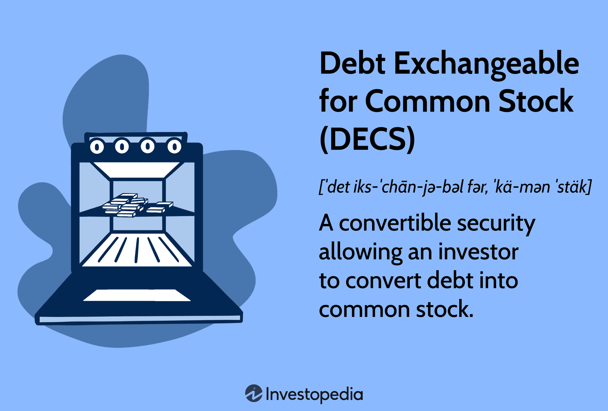

## Table of Contents

## What is debt exchangeable for common stock?

Debt exchangeable for common stock is a type of financial instrument where a company issues debt, like bonds, that can be swapped for shares of the company's stock at a later date. This means that instead of getting their money back with interest when the bond matures, the bondholder can choose to receive shares of the company's stock instead. This can be attractive to investors because if the company's stock price goes up, the value of the shares they get could be worth more than the original bond.

Companies might use this kind of debt to raise money without immediately diluting their stock. If the stock price stays low, the company only has to pay back the bond with interest. But if the stock price goes up, investors might choose to convert their bonds into stock, which can help the company by bringing in new shareholders without having to issue new stock right away. This can be a win-win situation, but it also comes with risks, like if the stock price drops a lot, the investors might not want to convert, leaving the company with a large debt to repay.

## How does debt exchangeable for common stock work?

Debt exchangeable for common stock is a type of bond that a company can issue. When a company needs money, it can borrow from investors by selling these bonds. Instead of just getting their money back with interest at the end, the people who buy these bonds can choose to get shares of the company's stock instead. This choice is usually available at certain times or when the bond reaches its end date. The price at which the bond can be swapped for stock is set when the bond is first issued.

This kind of bond can be good for both the company and the investors. For the company, it's a way to get money without having to give away stock right away. If the company's stock price goes up a lot, the investors might choose to swap their bonds for stock, which can help the company by bringing in new shareholders. For investors, if the stock price goes up, they can end up with stock that's worth more than what they would have gotten from just the bond's interest. But there's a risk too. If the stock price goes down, the investors might not want to swap their bonds for stock, and the company will have to pay back the bond with interest, which could be a lot of money.

## What are the benefits of using debt exchangeable for common stock for a company?

Using debt exchangeable for common stock can be a smart move for a company. It lets the company get money it needs without giving away stock right away. This is good because the company doesn't have to share its ownership immediately. If the company does well and its stock price goes up, the people who bought the bonds might choose to swap them for stock. This can help the company by bringing in new shareholders without having to issue new stock right away, which can keep the value of the stock high.

There's another benefit for the company too. If the stock price doesn't go up much, or even goes down, the people with the bonds might not want to swap them for stock. In that case, the company just has to pay back the bond with interest, which can be easier to manage than if they had to give away stock at a low price. So, this kind of debt can give the company flexibility and help it manage its finances better, depending on how well its stock is doing.

## What are the risks associated with debt exchangeable for common stock?

Debt exchangeable for common stock can be risky for companies. If the stock price goes down a lot, the people who bought the bonds might not want to swap them for stock. This means the company has to pay back the bond with interest, which could be a lot of money. If the company doesn't have enough money to pay back the bond, it could be in big trouble. Also, if a lot of bondholders decide to swap their bonds for stock when the price is low, it can make the stock price go down even more, which is bad for the company.

For the people who buy these bonds, there are risks too. If the stock price doesn't go up, they might end up with stock that's worth less than what they would have gotten from the bond's interest. They have to decide if it's better to take the stock or just get their money back with interest. This can be hard to figure out, and if they guess wrong, they could lose money. So, while this kind of bond can be a good deal if the stock goes up, it can also be risky if things don't go as planned.

## How is debt exchangeable for common stock different from convertible debt?

Debt exchangeable for common stock and convertible debt are similar because they both let you swap bonds for stock. But they work a bit differently. With debt exchangeable for common stock, the bond can be swapped for the stock of the company that issued the bond. This means the company can get money without giving away its own stock right away. If the company's stock price goes up, the people who bought the bonds might choose to swap them for stock, which can help the company by bringing in new shareholders.

Convertible debt is a bit different. With convertible debt, the bond can be swapped for the stock of the company that issued the bond, just like debt exchangeable for common stock. But, convertible debt can also be swapped for the stock of another company that the issuing company owns a lot of. This gives the people who buy these bonds more choices. They can decide to swap their bonds for the stock of the issuing company or the stock of the other company, depending on which one they think will be worth more.

Both types of debt have their own risks and benefits. Debt exchangeable for common stock can be good for a company that wants to raise money without diluting its own stock right away. Convertible debt can be good for a company that owns a lot of another company and wants to give investors more options. But if the stock prices don't go up, both types of debt can be risky because the company might have to pay back a lot of money, and the people who bought the bonds might not get as much as they hoped for.

## What are the key terms and conditions typically included in a debt exchangeable for common stock agreement?

A debt exchangeable for common stock agreement usually includes some important terms and conditions that both the company and the investors need to know. One key term is the conversion price, which is the price at which the bond can be swapped for stock. This price is set when the bond is issued and helps investors decide if they want to swap their bonds for stock later on. Another important term is the conversion ratio, which tells you how many shares of stock you get for each bond you swap. The agreement also often includes a conversion period, which is the time when the bondholders can choose to swap their bonds for stock. This period can be anytime during the life of the bond or only at certain times, like when the bond matures.

The agreement might also have conditions about when the conversion can happen, like if the stock price reaches a certain level. There can be protections for the bondholders too, like if the company does something that might hurt the value of the stock, the bondholders might get to swap their bonds for more stock than they would have otherwise. The agreement will also say what happens if the company can't pay back the bond when it's due, which is called a default. It's important for both the company and the investors to understand all these terms so they know what they're getting into and what could happen in different situations.

## How does the valuation of the common stock affect the terms of the debt exchangeable for common stock?

The valuation of the common stock plays a big role in setting the terms of debt exchangeable for common stock. When a company issues these bonds, they set a conversion price, which is the price at which the bond can be swapped for stock. If the company's stock is valued high when the bond is issued, the conversion price will be set higher too. This means that for the bondholders to want to swap their bonds for stock, the stock price needs to go up even more. On the other hand, if the stock is valued low, the conversion price will be lower, making it easier for bondholders to decide to swap their bonds for stock if the stock price goes up a bit.

The conversion ratio, which tells you how many shares you get for each bond you swap, also depends on the stock's valuation. If the stock is valued high, the company might offer a lower conversion ratio because each share is worth more. But if the stock is valued low, the company might offer a higher conversion ratio to make the deal more attractive to investors. This way, the terms of the debt exchangeable for common stock are adjusted based on the stock's value to balance the risks and rewards for both the company and the investors.

## What are the tax implications of debt exchangeable for common stock for both the issuer and the investor?

For the issuer of debt exchangeable for common stock, the tax implications can be complex. When the company issues the bonds, it can usually deduct the interest payments it makes to bondholders from its taxable income, which can help lower its tax bill. But if bondholders decide to swap their bonds for stock, the company might face different tax rules. The swap itself might not be a taxable event for the company, but it can affect how the company accounts for its finances and taxes in the future. If the stock price goes up a lot and bondholders convert, the company might see a change in its earnings per share, which can influence its tax situation indirectly.

For the investor, the tax implications depend on whether they choose to convert their bonds into stock or hold onto the bonds until they mature. If they keep the bonds and get interest payments, those payments are usually taxed as ordinary income. But if they decide to swap their bonds for stock, the conversion itself is typically not a taxable event. However, if they later sell the stock they received, any profit they make could be taxed as a capital gain. The tax rate on capital gains can be lower than the rate on ordinary income, which might make converting the bonds into stock a more tax-efficient choice if the stock price goes up. It's important for investors to consider these tax implications when deciding what to do with their debt exchangeable for common stock.

## How can debt exchangeable for common stock be used as a strategic financial tool in corporate restructuring?

Debt exchangeable for common stock can be a smart tool for companies going through big changes like mergers, acquisitions, or trying to fix financial problems. When a company is restructuring, it might need money to pay off debts or to fund new projects. By issuing debt that can be swapped for stock, the company can get the money it needs without immediately giving away ownership. This can be really helpful if the company's stock price is low, because it doesn't have to sell new stock at a bad price. If the stock price goes up later, the people who bought the bonds might choose to swap them for stock, which can bring in new shareholders without the company having to do anything extra.

This kind of debt also gives the company more choices during restructuring. If the company's situation gets better and the stock price goes up, the bondholders might want to swap their bonds for stock, which can help the company by reducing its debt and bringing in new investors. But if things don't go well and the stock price stays low, the company just has to pay back the bond with interest, which can be easier to handle than giving away stock at a low price. So, debt exchangeable for common stock can be a flexible way for a company to manage its money and navigate through big changes.

## What are some real-world examples of companies that have successfully used debt exchangeable for common stock?

One real-world example of a company using debt exchangeable for common stock is Tesla. In 2014, Tesla issued $2 billion in convertible bonds that could be swapped for stock. This move helped Tesla raise money without selling new stock right away, which was important because their stock price was pretty high at the time. By using these bonds, Tesla could keep its stock price from going down too much while still getting the money it needed for growth. Later, when the stock price went even higher, many bondholders chose to swap their bonds for stock, which helped Tesla by bringing in new shareholders.

Another example is Netflix. In 2011, Netflix issued convertible bonds to help fund its growth and expansion plans. The company was growing fast but needed more money to keep up with its plans. By issuing these bonds, Netflix could get the money it needed without immediately diluting its stock. Over time, as Netflix's stock price went up, many bondholders decided to convert their bonds into stock, which helped Netflix by reducing its debt and bringing in new investors. This strategy worked well for Netflix and helped it continue to grow.

## How do market conditions influence the attractiveness of debt exchangeable for common stock?

Market conditions play a big role in how attractive debt exchangeable for common stock is to both companies and investors. When the stock market is doing well and stock prices are going up, these kinds of bonds can be very appealing. Companies can issue the bonds to get money without selling new stock right away, which is good if their stock price is high. Investors like them too because if the stock price keeps going up, they can swap their bonds for stock that's worth more than what they would have gotten from the bond's interest. But if the market is shaky or stock prices are going down, these bonds might not be as attractive. Companies might not want to issue them because if the stock price stays low, they'll have to pay back the bond with interest, which could be hard if they're already struggling. Investors might also be worried about swapping their bonds for stock that's worth less.

In times when interest rates are low, debt exchangeable for common stock can be even more appealing. With low interest rates, the interest payments on regular bonds are small, so investors might look for other ways to make more money. Swapping their bonds for stock that could go up in value can be a good choice. But if interest rates go up, the interest payments on regular bonds become more attractive, and investors might not be as interested in swapping their bonds for stock. So, the overall market conditions, like how the stock market is doing and what interest rates are, can really influence whether companies and investors think debt exchangeable for common stock is a good idea.

## What advanced financial modeling techniques are used to evaluate the potential outcomes of debt exchangeable for common stock?

Advanced financial modeling techniques like Monte Carlo simulations and binomial models are often used to evaluate the potential outcomes of debt exchangeable for common stock. These models help companies and investors figure out how likely it is that the stock price will go up enough for bondholders to want to swap their bonds for stock. Monte Carlo simulations use random numbers to run many different scenarios, showing how the stock price might change over time. This can give a good picture of all the possible outcomes, from the best-case to the worst-case scenarios. Binomial models, on the other hand, break down the time until the bond can be swapped into smaller steps and look at what could happen at each step. This helps to understand how the value of the bond and the stock might change over time.

These models also take into account things like interest rates, how much the stock price might move up or down, and how long it will be before the bond can be swapped for stock. By using these models, companies can see how different choices about the conversion price and ratio might affect their finances. For investors, these models help them decide if it's better to keep the bond and get the interest payments or to swap it for stock that might go up in value. Both Monte Carlo simulations and binomial models give a detailed look at the risks and rewards, helping everyone involved make smarter decisions about debt exchangeable for common stock.

## References & Further Reading

[1]: Bergstra, J., Bardenet, R., Bengio, Y., & Kégl, B. (2011). ["Algorithms for Hyper-Parameter Optimization."](https://dl.acm.org/doi/10.5555/2986459.2986743) Advances in Neural Information Processing Systems 24.

[2]: ["Advances in Financial Machine Learning"](https://www.amazon.com/Advances-Financial-Machine-Learning-Marcos/dp/1119482089) by Marcos Lopez de Prado

[3]: ["Evidence-Based Technical Analysis: Applying the Scientific Method and Statistical Inference to Trading Signals"](https://www.amazon.com/Evidence-Based-Technical-Analysis-Scientific-Statistical/dp/0470008741) by David Aronson

[4]: ["Machine Learning for Algorithmic Trading"](https://github.com/stefan-jansen/machine-learning-for-trading) by Stefan Jansen

[5]: ["Quantitative Trading: How to Build Your Own Algorithmic Trading Business"](https://github.com/LucindaYa/quant-resources/blob/master/Quantitative%20Trading%20How%20to%20Build%20Your%20Own%20Algorithmic%20Trading%20Business.pdf) by Ernest P. Chan