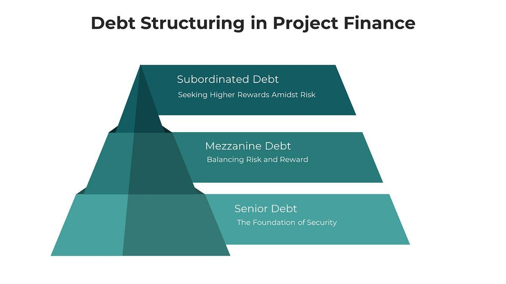

Understanding the intricate world of finance involves exploring various mechanisms of funding and trading that facilitate economic growth and sustainability. This article focuses on critical financial instruments such as business funding and debt financing, while also addressing modern innovations like algorithmic trading. Each of these elements plays a significant role in shaping the financial landscape, providing essential support and growth opportunities for businesses and investors alike.

Business funding is a cornerstone for the establishment and expansion of companies, particularly small and emerging enterprises. By securing the necessary capital, businesses can invest in resources, develop products, and enhance operational capabilities. Different funding avenues, such as debt and equity financing, as well as government-backed loans, offer varied benefits and drawbacks, making it essential to choose the most suitable option based on specific business needs.



Debt financing is a critical aspect of business funding, allowing companies to raise capital without sacrificing ownership. This traditional financing mechanism involves borrowing funds to be repaid with interest, typically through instruments such as bonds, loans, and credit lines. With carefully managed debt, companies can optimize their capital structures and mitigate potential risks associated with excessive leverage.

The financial world is also witnessing a paradigm shift with the advent of algorithmic trading, which employs computer algorithms to execute trades at unprecedented speed and precision. Algorithmic trading revolutionizes investment strategies by enhancing market efficiency, reducing transaction costs, and minimizing human errors. Despite its benefits, it also poses challenges such as increased market volatility and the risk of system failures.

This article aims to provide a comprehensive outlook on leveraging these financial mechanisms effectively. By examining the interplay between traditional funding methods and modern trading technologies, businesses and investors can make informed decisions to drive growth and maximize financial outcomes.

## Table of Contents

## Understanding Business Funding

Business funding serves as a crucial component for the growth and expansion of companies, particularly for small and new enterprises. Access to financial resources can mean the difference between stagnation and progress in the competitive business landscape. Understanding the types of funding available and assessing their suitability is vital for informed decision-making and strategic planning.

Several avenues provide potential sources of business funding, including debt financing, equity financing, and government-backed loans. Each of these funding types comes with distinct characteristics, benefits, and drawbacks:

1. **Debt Financing**: This involves borrowing funds that must be repaid over time, often with interest. Common forms of debt financing include term loans, lines of credit, and bonds. 

   - *Advantages*: Companies retain ownership and control, and interest payments are often tax-deductible.
   - *Disadvantages*: Regular repayments are required, and failure to meet obligations can lead to insolvency. Interest rates can also present cost challenges, particularly in high-rate environments.

2. **Equity Financing**: Companies raise capital by selling shares to investors. This dilutes ownership but injects capital without the obligation of repayment.

   - *Advantages*: No debt obligations reduce financial stress on cash flows, and investors often bring added value with expertise and networks.
   - *Disadvantages*: Dilution of control can be significant, and shareholders expect returns, pressuring companies to perform.

3. **Government-Backed Loans**: These are loans facilitated by government entities or with governmental support, often providing favorable terms for businesses.

   - *Advantages*: Lower interest rates and lenient repayment terms make these attractive to startups and small businesses.
   - *Disadvantages*: The application process can be lengthy and complex, sometimes requiring collateral or guarantees.

When choosing the best funding option, several factors should be considered:

- *Business Stage*: Startups might lean towards equity for risk-sharing, whereas established businesses might opt for debt to maintain control.
- *Cash Flow*: Businesses with steady cash flow may handle debt repayments more comfortably, while those with volatile income may benefit from equity.
- *Expansion Plans*: The scale and timeline of business growth can dictate funding suitability, as some options like equity are better for aggressive growth strategies.

Case studies offer insights into successful business funding strategies. For instance, tech startups often favor equity financing during early stages to leverage investor expertise, as demonstrated by companies like Uber and Airbnb. In contrast, established firms such as Apple and Microsoft have effectively utilized debt instruments to finance large-scale projects and acquisitions without diluting shareholder equity.

Analyzing these components helps businesses in selecting an optimal funding mix, tailoring financial strategies that align with their operational goals and market conditions.

## The Mechanics of Debt Financing

Debt financing represents a pivotal element in the financial landscape, providing businesses with the necessary capital to foster growth and development. It involves borrowing funds from external sources with the commitment to repay the principal amount along with interest within a specified period. This financing method plays a vital role in shaping business capital structures, offering a cost-effective alternative to equity financing by allowing firms to maintain ownership control while benefiting from tax-deductible interest payments.

**Forms of Debt Instruments**

Debt financing can be accessed through various financial instruments, each tailored to meet distinct business needs. **Bonds** are long-term debt securities that companies issue to investors, entitled to receive periodic interest payments, known as coupons, until the bond's maturity date when the principal amount is repaid. **Term loans** involve borrowing a lump sum from financial institutions, typically banks, with a fixed repayment schedule and [interest rate](/wiki/interest-rate-trading-strategies). These loans can cater to both short-term and long-term financial requirements, providing flexibility in capital allocation. **Lines of credit** offer revolving credit facilities, enabling businesses to draw funds up to a predetermined limit as needed, with interest payable only on the utilized amount.

**Impact of Interest Rates**

Interest rates significantly influence the cost and viability of debt financing. Higher interest rates increase borrowing costs, thereby affecting a company's cash flow and profitability. Conversely, lower interest rates make debt an attractive financing option, potentially encouraging investment in growth initiatives. Businesses must remain attentive to interest rate fluctuations and market conditions to optimize their financing strategies and minimize costs.

**Strategies for Managing Debt**

Effective debt management involves a strategic approach to balancing risk and maintaining financial health. Businesses can employ several strategies to manage and mitigate debt-related risks. These include:

1. **Diversification of Debt Portfolio**: Spreading debt across various instruments and lenders reduces dependency on a single source and minimizes exposure to lender-specific risks.

2. **Interest Rate Hedging**: Utilizing financial derivatives, such as interest rate swaps or options, can shield companies from unexpected interest rate increases, preserving cash flow stability.

3. **Regular Monitoring and Restructuring**: Continual assessment of debt obligations enables businesses to identify opportunities for refinancing or restructuring to achieve lower interest rates or more favorable terms, enhancing financial flexibility.

By understanding and leveraging the mechanics of debt financing, businesses can effectively manage their capital requirements, optimize their financial structures, and ultimately secure a pathway to sustainable growth.

## Algorithmic Trading: The Future of Investing

Algorithmic trading, a cornerstone of modern finance, harnesses computational power and mathematical models to automate trading decisions and executions. This sophisticated trading method is gaining prominence due to its ability to process vast amounts of data and execute trades at speeds beyond human capability. By utilizing algorithms, traders can analyze various market variables and indicators to identify opportunities with precision and reduce human errors.

At its core, [algorithmic trading](/wiki/algorithmic-trading) operates on a foundation of key technologies and platforms, including electronic communication networks (ECNs) and application programming interfaces (APIs). These technologies enable the integration of trading algorithms directly with financial markets. Python and C++ are commonly used programming languages to develop these algorithms due to their robust libraries and speed efficiency. An example of a basic Python script for algorithmic trading could look like:

```python
# Simple moving average crossover strategy
import pandas as pd
import numpy as np

# Load historical data
data = pd.read_csv('historical_data.csv')
data['SMA50'] = data['Close'].rolling(window=50).mean()
data['SMA200'] = data['Close'].rolling(window=200).mean()

# Generate buy/sell signals
data['Signal'] = 0
data['Signal'][50:] = np.where(data['SMA50'][50:] > data['SMA200'][50:], 1, -1)

# Execute orders based on signals
for index, row in data.iterrows():
    if row['Signal'] == 1:
        print(f"Buy signal on {row['Date']}")
    elif row['Signal'] == -1:
        print(f"Sell signal on {row['Date']}")
```

The principal benefits of algorithmic trading are its efficiency and the reduced impact on markets. It enables high-frequency trading, which allows for rapid order execution and small profit margins from numerous trades. Algorithmic trading minimizes market impact by breaking down large orders into smaller ones and executing them at advantageous times. 

Despite its advantages, algorithmic trading poses risks, such as system failures and the potential for market anomalies if algorithms behave unpredictably. To mitigate these risks, rigorous testing and back-testing of algorithms is essential, ensuring that they perform optimally under various market conditions. Additionally, continual monitoring and adjustments are necessary to adapt to market changes.

Machine learning and [artificial intelligence](/wiki/ai-artificial-intelligence) are increasingly incorporated into algorithmic trading to enhance the adaptability and accuracy of trading strategies. These technologies allow algorithms to learn from historical data, improve performance over time, and adapt to new market conditions dynamically. Techniques such as [reinforcement learning](/wiki/reinforcement-learning) and neural networks are leveraged to identify complex patterns and optimize trading decisions.

As algorithmic trading continues to evolve, its integration with advanced technologies underscores its critical role in shaping the future of investing. The fusion of swift decision-making and comprehensive data analysis positions algorithmic trading as an invaluable tool in the financial industry.

## Integrating Debt Financing with Algo Trading Strategies

Combining debt financing with algorithmic trading can offer businesses a unique opportunity to enhance capital growth. Debt financing provides the capital needed to engage in investment activities while algorithmic trading harnesses technology to maximize returns through efficient market operations. By leveraging both, businesses can potentially optimize their financial outcomes.

**Using Debt for Algorithmic Trading Operations**

Businesses can use raised funds through debt instruments such as loans, bonds, or credit lines to fuel algorithmic trading activities. The acquired funds are allocated to trading accounts, where algorithms are employed to execute high-frequency trades, [arbitrage](/wiki/arbitrage) opportunities, or strategic [volatility](/wiki/volatility-trading-strategies) plays. This approach requires stringent financial planning and robust risk management to ensure the returns from trading exceed the costs associated with the debt, including interest and principal repayments.

**Case Studies of Successful Integration**

1. **XYZ Hedge Fund**: Known for its algorithmic trading prowess, XYZ Hedge Fund utilized financing through convertible bonds to expand its trading operations. By securing funds cheaply during low-interest periods, the fund amplified its trading volumes and benefited from economies of scale, subsequently increasing returns while maintaining manageable debt levels.

2. **TechTrader LLC**: A tech-focused trading firm, leveraged a revolving credit facility to invest in infrastructure and algorithm development. The increased trading capacity led to higher profits, allowing the firm to pay off debt quickly and reinvest profits into further innovation.

**Risks and Considerations**

While integrating debt financing with algorithmic trading can be lucrative, it carries inherent risks. The volatility of financial markets means that algorithmic strategies may not always yield positive returns, potentially leading to debt servicing issues. Moreover, high leverage ratios increase the risk of insolvency if trading strategies perform poorly.

Interest rate fluctuations directly impact the cost structure of debt-financed trading strategies. Rising rates can increase debt servicing costs, squeezing the profits generated from trading activities. Therefore, businesses should conduct stress testing and scenario analysis to understand the implications of adverse market conditions.

**Best Practices for Balancing Mechanisms**

To optimize outcomes, businesses should adopt several best practices:

1. **Risk Management**: Implementing rigorous risk management procedures, including stop-loss orders and diversification across trading strategies, is essential for mitigating downside risk.

2. **Capital Allocation**: Determining an optimal capital structure that balances debt with equity is vital. Excessive leverage should be avoided to reduce financial fragility.

3. **Interest Rate Hedging**: Utilizing financial derivatives, such as interest rate swaps, can hedge against the risk of rising interest rates, stabilizing debt servicing costs.

4. **Regular Review and Adjustment**: Continuous evaluation of trading algorithms and financing structures ensures alignment with market conditions and business objectives. Adjustments should be made promptly to adapt to evolving financial landscapes.

By strategically integrating debt financing with algorithmic trading, businesses can unlock growth opportunities while placing a premium on financial stability and risk management. This dual approach, when executed carefully, has the potential to significantly enhance a company's competitive edge in the financial markets.

## Conclusion

In modern finance, mechanisms such as debt financing and algorithmic trading play critical roles in enabling businesses to thrive. Debt financing provides companies with access to necessary capital, allowing them to invest in growth opportunities while maintaining ownership control. It facilitates leveraging resources to expand operations, enter new markets, and improve competitiveness. On the other hand, algorithmic trading represents a technological breakthrough in investment strategies, optimizing trade execution and enhancing market efficiency through the use of data-driven algorithms.

Selecting the right combination of financing and trading strategies is paramount for achieving sustainable growth. Each business must assess its unique circumstances, including financial health, market conditions, and growth objectives, to determine the most appropriate mix. Balancing debt levels while harnessing the benefits of cutting-edge trading technologies can provide a competitive edge but requires careful management to minimize risks.

Looking forward, emerging trends in financial mechanisms promise to reshape global markets. Advances in [machine learning](/wiki/machine-learning) and artificial intelligence are expected to further enhance algorithmic trading, offering even more sophisticated prediction models and decision-making capabilities. Additionally, financial innovation will likely lead to more customized debt financing solutions, tailored to the specific needs of businesses and market dynamics.

Companies and investors are encouraged to embrace innovation continuously, adapting to technological advancements and evolving market trends to maintain competitiveness. To effectively leverage these financial tools, accessing expert advice and staying informed through comprehensive resources will be crucial. This strategic approach will ensure businesses harness the full potential of both traditional and modern financial mechanisms, thereby driving future success.

## References & Further Reading

[1]: Bergstra, J., Bardenet, R., Bengio, Y., & Kégl, B. (2011). ["Algorithms for Hyper-Parameter Optimization."](https://papers.nips.cc/paper/4443-algorithms-for-hyper-parameter-optimization) Advances in Neural Information Processing Systems 24.

[2]: ["Advances in Financial Machine Learning"](https://www.amazon.com/Advances-Financial-Machine-Learning-Marcos/dp/1119482089) by Marcos Lopez de Prado

[3]: ["Evidence-Based Technical Analysis: Applying the Scientific Method and Statistical Inference to Trading Signals"](https://www.amazon.com/Evidence-Based-Technical-Analysis-Scientific-Statistical/dp/0470008741) by David Aronson

[4]: ["Machine Learning for Algorithmic Trading"](https://github.com/stefan-jansen/machine-learning-for-trading) by Stefan Jansen

[5]: ["Quantitative Trading: How to Build Your Own Algorithmic Trading Business"](https://www.amazon.com/Quantitative-Trading-Build-Algorithmic-Business/dp/1119800064) by Ernest P. Chan