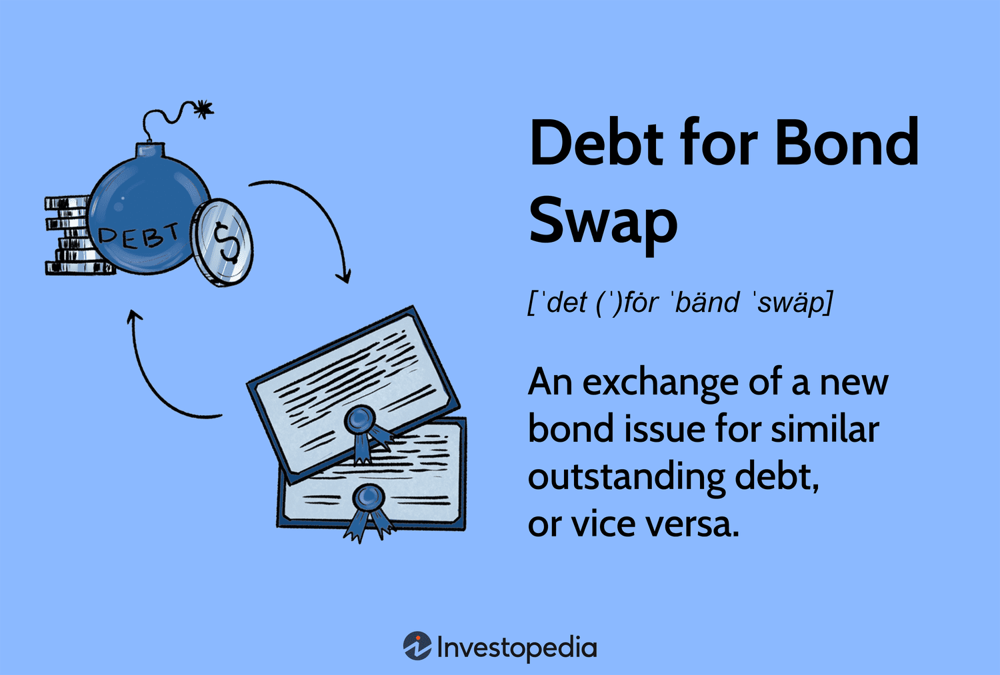

The financial landscape is undergoing significant transformation, and bond markets are at the heart of this evolution. Bond exchanges, financial restructuring, debt swaps, and algorithmic trading are becoming increasingly integral to modern finance. These elements collectively enhance the ability of companies and governments to navigate the complexities of today's economic environment.

Financial restructuring is crucial for adapting to shifting economic conditions. Companies facing financial distress often turn to restructuring to align their financial structures with current market realities. Key strategies for such restructuring include bond exchanges and debt swaps, which provide mechanisms for managing financial distress and optimizing capital structures.



Bond exchanges offer entities the opportunity to refinance their debts under more favorable terms. This can be particularly useful when market conditions change, enabling entities to reduce interest costs or extend maturities to improve financial stability. Callable bonds, with their built-in flexibility, are often utilized in these exchanges, allowing issuers to replace existing bonds with new ones that have better terms.

Debt swaps represent another innovative tool in the financial strategist's arsenal. By exchanging debt instruments for more advantageous terms, companies can achieve reductions in interest expenses and improvements in liquidity. Additionally, debt swaps can yield tax benefits and potentially boost a company's credit rating, thereby enhancing its overall financial health.

Algorithmic trading is revolutionizing the execution of these financial maneuvers. By automating trade processes, it increases the speed and efficiency of bond exchanges and debt swaps. This technological advancement provides traders with a competitive edge, allowing them to capitalize on market opportunities more swiftly than traditional methods permit.

In conclusion, understanding the interplay of these components is vital for anyone looking to navigate and succeed in the current financial landscape. By leveraging these tools wisely, entities can experience substantial improvements in their financial standing. Algorithmic trading, in particular, is poised to further enhance the execution of financial strategies, making it a critical area of focus for future developments in bond markets.

## Table of Contents

## The Dynamics of Bond Exchange

Bond exchanges serve as a strategic financial tool that enables entities to refinance their existing debts, effectively allowing them to capitalize on favorable market conditions. This financial maneuver is particularly significant as it provides firms with an opportunity to adjust their debt structures, reduce interest expenses, and ultimately improve their balance sheet stability.

One of the key instruments utilized in bond exchanges is the callable bond. Callable bonds offer the issuing entity the flexibility to redeem the bond before its maturity date, usually at a premium, if interest rates decline. This feature allows issuers to replace older, higher-interest debt with new debt at a lower cost, thus optimizing their capital structure. The flexibility provided by callable bonds makes them an attractive option in the bond exchange process, as they allow issuers to react swiftly to changes in the [interest rate](/wiki/interest-rate-trading-strategies) environment.

For financial strategists, understanding the intricacies of bond exchanges is essential to leveraging market opportunities. By carefully analyzing current market conditions, interest rate trends, and bond covenants, strategists can identify optimal timing and conditions for initiating exchanges. This requires a comprehensive grasp of both the financial markets and the specific conditions of the entity's existing debt portfolio. 

For instance, if market interest rates have fallen substantially since the original issue, strategists might see significant savings potential through an exchange. The potential cost savings can be evaluated using present value calculations of the expected cash flows with and without the exchange. Employing financial modeling techniques to compare scenarios, strategists can project the impact on the company's financial health, cash flow management, and long-term debt strategy.

In addition, evaluating market sentiment and investor appetite is crucial. A successful bond exchange not only improves an entity's financial conditions but also maintains or enhances investor relations, crucial for future capital market access.

In summary, bond exchanges are a pivotal component within the financial strategist's toolkit, offering a dynamic means to adapt to fluctuating market conditions and enhance financial resilience. Understanding their mechanisms and strategic applications can provide significant advantages in navigating the complex landscape of modern finance.

## Financial Restructuring: A Necessity in Dynamic Markets

Financial restructuring is fundamental for companies navigating financial distress, offering a strategic pathway to stabilize and invigorate their economic foundations. It involves reorganizing a company's financial assets and liabilities, aiming to enhance profitability and address financial challenges. The processes of restructuring often encompass debt-for-equity swaps and bond exchanges, each serving unique roles in transforming a company’s financial standing.

**Debt-for-Equity Swaps**

A debt-for-equity swap is a pivotal restructuring strategy wherein creditors agree to exchange the debt owed to them by the company into equity in the business. This approach reduces the company's debt burden and can significantly improve its balance sheet. By converting debt to equity, companies decrease their interest obligations, fostering better cash flow management. This method is particularly useful for companies facing potential insolvency, as it alleviates pressure from looming debt repayments while simultaneously strengthening the capital structure by increasing equity financing.

From a mathematical perspective, the transformation in a company's financial statements can be described by new equity shares issued in place of existing liabilities:

$$
\text{New Equity} = \frac{\text{Debt Exchanged}}{\text{Market Price per Share}}
$$

The equation represents how much existing debt can be converted into new equity based on the market valuation, offering both the company and creditors a valuation benchmark for negotiations.

**Bond Exchanges**

Bond exchanges are similarly strategic tools in financial restructuring. This approach involves the exchange of old bonds with new debt instruments under terms that are more favorable to the issuer. Such exchanges allow companies to leverage advantageous market conditions to refinance obligations, often with lower interest rates or adjusted repayment schedules. Callable bonds play a significant role in bond exchanges because they provide the issuing company with the ability to repurchase the bond after a specific time, allowing them the flexibility to refinance under improved conditions.

The strategic implementation of bond exchanges can be analyzed through the reduction in debt servicing costs:

$$
\text{Cost Savings} = (\text{Old Interest Rate} - \text{New Interest Rate}) \times \text{Total Debt Issued}
$$

This equation evaluates the immediate cost benefits achieved post-exchange, underlining the financial advantages gained by reducing interest expenses.

**Overall Financial Impact**

The transformative potential of these restructuring mechanisms can profoundly impact a company's financial health. Debt-for-equity swaps, by decreasing interest burdens and enhancing equity, provide businesses with the necessary breathing room to reinvest and stimulate growth. Concurrently, bond exchanges optimize debt profiles, reducing costs, and extending maturities, which are crucial for maintaining [liquidity](/wiki/liquidity-risk-premium) and financial agility.

In summary, financial restructuring via debt-for-equity swaps and bond exchanges is indispensable for firms aiming to correct financial downturns or capitalize on prevailing market conditions. These mechanisms are not only essential for overcoming periods of distress but also provide robust frameworks for companies to emerge more resilient and financially fortified.

## Debt Swap: An Innovative Financial Tool

Debt swaps are a financial instrument that allows entities to exchange existing debt for new debt under more favorable conditions. This innovative tool is pivotal for organizations seeking to optimize their financial strategies, reduce burdensome interest costs, and enhance liquidity, thereby improving their overall financial health.

The mechanics of a debt swap are straightforward. A company or government with outstanding debt negotiates with its creditors to replace the existing debt with a new debt obligation. Typically, the new debt carries a lower interest rate or extended maturity, which can ease the cash flow constraints of the debtor. For instance, if a company holds a bond with a high coupon rate, it might propose a swap for a bond with a lower interest rate, thereby reducing the overall interest payments and improving short-term liquidity.

One of the primary advantages of debt swaps is the potential tax benefits. Companies may be able to structure swaps to take advantage of tax deductions on interest expenses, lowering their taxable income. Additionally, by improving liquidity and reducing debt service costs, a company can enhance its credit rating. A better credit rating can further reduce the cost of borrowing and open up additional financing opportunities in the future.

Moreover, debt swaps can be used strategically in financial restructuring to avoid default or bankruptcy. By renegotiating terms with their creditors, companies can avert immediate financial distress while simultaneously paving the way for long-term financial stability.

In conclusion, debt swaps are a flexible financial tool capable of significantly altering the debt landscape for any responsible entity. They offer a means to manage debt more efficiently, reduce costs, and promote healthier financial profiles, ultimately leading to improved company valuations and attractive opportunities for growth.

## The Role of Algorithmic Trading in Bond Markets

Algorithmic trading, also known as algo trading, is transforming bond markets by automating the buying and selling processes, thereby enhancing efficiency and execution speed. The utilization of algorithms in trading involves using pre-programmed instructions that account for variables such as price, timing, and market conditions. 

One significant advantage of [algorithmic trading](/wiki/algorithmic-trading) in bond markets is its ability to process complex calculations and execute trades faster than human traders. This efficiency reduces the time it takes to capitalize on favorable market conditions, thereby optimizing returns. By leveraging algorithms, traders can analyze large datasets in real-time, swiftly identifying trading opportunities that may be mere seconds in duration.

Moreover, algo trading significantly enhances liquidity in bond markets. Liquidity is crucial for minimizing transaction costs and achieving better pricing for bonds. Algorithms facilitate high-frequency trading ([HFT](/wiki/high-frequency-trading-strategies)), which involves transacting large volumes of orders in rapid succession. This activity contributes to market liquidity, making it easier for traders to enter or [exit](/wiki/exit-strategy) positions without significantly impacting bond prices.

Algorithmic trading also reduces human error by eliminating decisions based on emotions or biases. Automated systems operate based on logic, precision, and set criteria, ensuring consistency in trading strategies. This reliability is particularly beneficial in volatile markets, where human decision-making might falter.

For traders, understanding and employing algorithmic trading can provide a competitive edge. As markets become increasingly efficient, those who harness algorithms for trading are better positioned to exploit price deviations and anomalies. The ability to backtest strategies using historical data allows traders to refine their approaches before applying them in live markets, minimizing risk and enhancing potential gains.

Implementing algorithmic strategies often involves programming knowledge. Python, due to its simplicity and extensive libraries, is a popular choice for developing trading algorithms. For example, the `pandas` library can be used for data manipulation, while `NumPy` supports complex numerical calculations. Algorithms typically incorporate statistical models, which can be implemented using libraries like `statsmodels`. Here is a simple example of how Python can be utilized to compute a moving average, a common algorithmic trading strategy:

```python
import pandas as pd
import numpy as np

# Sample bond data
data = {'Price': [101, 102, 103, 104, 105, 106]}
bond_df = pd.DataFrame(data)

# Calculate the moving average
bond_df['Moving Average'] = bond_df['Price'].rolling(window=3).mean()

print(bond_df)
```

While the adoption of algo trading in bond markets offers numerous benefits, potential challenges remain. Technical glitches or poorly designed algorithms can lead to unintended trading outcomes. Therefore, continuous monitoring and regular updates of algorithmic systems are crucial for maintaining their efficacy and reliability.

Overall, as technology continues to advance, its integration into bond markets through algorithmic trading is set to grow, helping traders navigate the complexities of modern financial systems more effectively.

## Case Studies: Successful Debt Swaps and Bond Exchanges

Successful debt swaps and bond exchanges have significantly influenced corporate health and share performance, serving as strategic tools for financial restructuring. These financial maneuvers are often necessary for companies seeking to optimize their capital structures and improve liquidity amid challenging economic conditions.

One notable example is the debt swap executed by General Motors (GM) prior to its bankruptcy in 2009. Faced with unsustainable debt levels, GM engaged in a debt-for-equity swap that converted a portion of its debt into equity. This strategy reduced GM's debt burden by approximately $27 billion, allowing the company to lower interest expenses and enhance liquidity during a critical period. This restructuring played a crucial role in GM's subsequent rebirth, stabilizing its operations and facilitating a successful initial public offering (IPO) in 2010, significantly enhancing its corporate health and market competitiveness.

Another illustrative case is that of Greece's bond exchange in 2012 during the Eurozone crisis. The Greek government, overwhelmed by a sovereign debt crisis, initiated one of the largest bond swaps in history. It involved a complex debt restructuring that exchanged old debt with new bonds at lower face values, extended maturities, and reduced interest rates. This resulted in a significant reduction in Greece's national debt and marked an essential step in stabilizing its economy. While the immediate share performance did not improve drastically due to the broader economic environment, the restructuring was a pivotal [factor](/wiki/factor-investing) in preventing an outright default and securing subsequent financial assistance from international creditors.

Successful swaps often involve close collaboration with creditors, an essential component in overcoming resistance and aligning interests. For instance, Chrysler’s 2009 bankruptcy featured a strategic exchange involving negotiations with various creditor groups. Chrysler's management achieved consensus through extensive dialogue and compromise, ultimately reducing its debt by $10 billion and paving the way for a partnership with Fiat S.p.A. This restructuring not only enabled Chrysler to recover but also led to improved share performance upon the company’s public re-listing in 2011.

These cases underscore the strategic importance of debt swaps and bond exchanges, highlighting their potential to redefine a company’s financial trajectory. Successful outcomes generally require meticulous planning, transparency, and engagement with all stakeholders to reconcile differing interests and achieve mutually beneficial results. As these examples indicate, with strategic execution, debt swaps and bond exchanges can serve as powerful tools for revitalizing corporate health and enhancing shareholder value.

## Challenges in Bond Exchanges and Debt Swaps

Bond exchanges and debt swaps, while offering valuable avenues for financial restructuring, face several challenges primarily rooted in legal, regulatory, and operational complexities. These challenges can impact the effectiveness and feasibility of executing such financial strategies.

Legal and regulatory frameworks present an intricate landscape that can complicate bond exchanges and debt swaps. Financial transactions of this nature must comply with numerous laws and regulations, which vary by jurisdiction. These regulations are designed to ensure market stability, protect investors, and maintain fair trading practices, but they can also increase the complexity and duration of executing swaps and exchanges. For example, regulatory bodies like the Securities and Exchange Commission (SEC) in the United States or the European Securities and Markets Authority (ESMA) impose reporting and disclosure requirements that can affect the timing and structure of these transactions.

One of the keys to overcoming the challenges presented by legal and regulatory frameworks is effective stakeholder engagement. Successful execution of bond exchanges and debt swaps often requires the alignment of interests among a diverse group of stakeholders, including creditors, investors, and regulatory agencies. Resistance from any party can stall or derail the process. Engaging stakeholders early and effectively can facilitate smoother negotiations and enhance the likelihood of reaching a mutually beneficial agreement. Open communication, transparent processes, and the involvement of experienced legal and financial advisors are critical components in navigating these complexities.

Valuation discrepancies also pose significant hurdles in executing bond exchanges and debt swaps. Determining the fair value of the instruments involved is crucial, as inaccurate valuations can lead to unequal exchanges and the perception of unfairness among stakeholders. These discrepancies can arise due to differences in accounting methods, market [volatility](/wiki/volatility-trading-strategies), or differing expectations of future performance. Addressing valuation issues requires a robust and transparent valuation process, often involving third-party assessments or the use of financial models to ensure accuracy and fairness.

For instance, one common approach to minimizing valuation discrepancies involves the use of discounted cash flow (DCF) models to estimate the present value of future cash flows from debt instruments. Here's a simple Python snippet illustrating the basic concept of DCF:

```python
def discounted_cash_flow(cash_flows, discount_rate):
    """
    Calculates the present value of future cash flows.

    :param cash_flows: List of future cash flows
    :param discount_rate: Discount rate in decimal form
    :return: Present value of cash flows
    """
    return sum(cf / (1 + discount_rate) ** i for i, cf in enumerate(cash_flows))

# Example usage
cash_flows = [1000, 1000, 1000, 1000]  # Quarterly cash flows over one year
discount_rate = 0.05  # Annual discount rate
present_value = discounted_cash_flow(cash_flows, discount_rate)
print(f"Present Value of Cash Flows: ${present_value:.2f}")
```

This valuation technique helps ensure that stakeholders have a common understanding of the financial implications of the exchange or swap.

In summary, the challenges associated with bond exchanges and debt swaps require careful navigation of legal and regulatory landscapes, effective stakeholder management, and accurate valuation methodologies. Addressing these challenges is crucial for companies seeking to optimize their capital structures and improve financial health through these strategic financial tools.

## Future Trends and Predictions

The financial sector is experiencing significant transformations as algorithmic trading becomes more integrated into bond markets, including debt swaps. Algorithmic trading simplifies and accelerates the execution of debt swaps by employing sophisticated algorithms to analyze vast datasets and execute trades at high precision and speed. This trend is expected to continue its upward trajectory as technology advances and market participants increasingly rely on data-driven strategies. 

As regulatory frameworks evolve, they are likely to foster more streamlined and efficient swaps and exchanges. Regulations are being re-examined to accommodate technological advancements, aiming to maintain market integrity while encouraging innovation. For example, there might be a shift towards harmonizing international standards, allowing cross-border transactions to become more frictionless and efficient. 

In response to ongoing economic pressures, companies are anticipated to adopt more creative financial restructuring strategies. This innovation is driven by the need to better manage debt levels, reduce cost burdens, and improve liquidity. Creativity in financial restructuring could include hybrid instruments that incorporate features of both debt and equity or more sophisticated derivatives tailored to specific corporate needs.

These trends suggest a more interconnected and technology-driven financial environment, where success depends on the ability to leverage technology and navigate evolving regulatory landscapes effectively. Understanding these shifts is crucial for financial professionals looking to optimize their strategies in a rapidly changing market.

## Conclusion

In the evolving landscape of modern finance, bond exchanges and debt swaps have emerged as pivotal elements of strategic financial management. These tools are not merely options but have become necessities for entities aiming to optimize their financial health and adapt to dynamic market conditions. By effectively leveraging bond exchanges, organizations can refinance their debts, aligning their capital structure with favorable market terms. Similarly, debt swaps offer immediate benefits such as reduced interest costs, improved liquidity, and potentially enhanced credit ratings, which can collectively lead to substantial financial improvements.

To harness the full potential of these financial instruments, a comprehensive understanding of the latest advancements in trading technology is essential. Algorithmic trading, for instance, enhances the execution speed and efficiency of these transactions, offering a significant edge in the competitive financial markets. Furthermore, staying attuned to regulatory changes is crucial, as these can fundamentally alter the legal and operational landscape of bond exchanges and debt swaps. By maintaining vigilance in these areas, businesses can not only safeguard their financial standing but also position themselves to capitalize on emerging opportunities within the financial markets.

## References & Further Reading

[1]: Duffie, D., & Singleton, K. J. (1999). "Modeling Term Structures of Defaultable Bonds." Review of Financial Studies, 12(4), 687-720. [Link](https://academic.oup.com/rfs/article/12/4/687/1578719)

[2]: Lopez de Prado, M. (2018). ["Advances in Financial Machine Learning."](https://www.amazon.com/Advances-Financial-Machine-Learning-Marcos/dp/1119482089) Wiley.

[3]: IMF. (2012). "Greece: Fourth Review Under the Stand-By Arrangement." International Monetary Fund. [Link](https://www.elibrary.imf.org/view/journals/002/2011/175/article-A003-en.xml)

[4]: Chan, E. P. (2008). ["Quantitative Trading: How to Build Your Own Algorithmic Trading Business."](https://github.com/egorpe/EPChan-QuantitativeTrading/blob/master/example7_6.m) Wiley.

[5]: Aronson, D. R. (2006). ["Evidence-Based Technical Analysis: Applying the Scientific Method and Statistical Inference to Trading Signals."](https://www.amazon.com/Evidence-Based-Technical-Analysis-Scientific-Statistical/dp/0470008741) Wiley.

[6]: Jansen, S. (2020). ["Machine Learning for Algorithmic Trading."](https://github.com/stefan-jansen/machine-learning-for-trading) Packt Publishing. 

[7]: Titman, S., & Tsyplakov, S. (2007). "A Dynamic Model of Optimal Capital Structure." Review of Finance, 11(3), 401-451. [Link](https://academic.oup.com/rof/article-abstract/11/3/401/1597070)