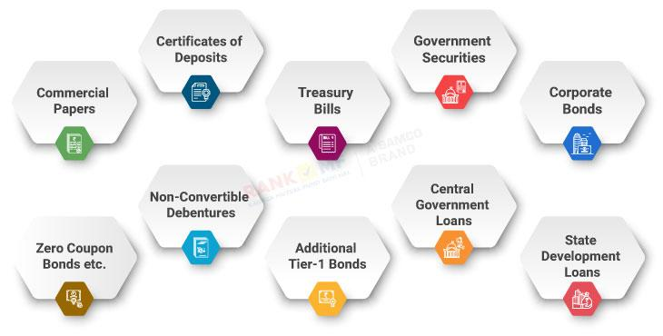

## Table of Contents

## What are debt funds and how do they work?

Debt funds are a type of investment where you put your money into a pool that is used to buy bonds and other fixed-income securities. These funds are managed by professionals who aim to generate steady returns for investors by investing in various debt instruments like government bonds, corporate bonds, and money market instruments. The main goal of debt funds is to provide regular income and preserve capital, making them a safer investment option compared to stocks.

When you invest in a debt fund, you essentially lend your money to the issuers of the bonds the fund holds. In return, these issuers pay interest, which the fund then distributes to its investors as income. The value of the debt fund can go up or down based on changes in interest rates and the creditworthiness of the bond issuers. However, debt funds are generally considered less risky than equity funds because they focus on generating income rather than capital growth, and they tend to have lower volatility.

## What are the different types of debt funds available to investors?

There are several types of debt funds that investors can choose from, each with its own characteristics and risk levels. Some common types include liquid funds, ultra-short duration funds, short duration funds, and long duration funds. Liquid funds invest in securities that mature in up to 91 days, making them very safe and suitable for parking money that you might need soon. Ultra-short and short duration funds invest in securities with slightly longer maturities, typically up to one year and one to three years, respectively. These funds are a bit riskier than liquid funds but still relatively safe.

Long duration funds, on the other hand, invest in securities with maturities that can go beyond seven years. These funds carry more interest rate risk because the value of the bonds they hold can fluctuate more with changes in interest rates. Another type of debt fund is the dynamic bond fund, which adjusts its portfolio based on the fund manager's view of future interest rate movements. This makes them more flexible but also potentially more volatile. Lastly, there are credit risk funds that invest in lower-rated bonds, offering higher returns but with increased risk of default.

Each type of debt fund serves different investment needs and risk appetites. For example, if you want safety and liquidity, you might choose a liquid fund. If you are looking for slightly higher returns and are willing to take on a bit more risk, you might opt for a short duration fund. Understanding the different types of debt funds can help you make a more informed decision based on your financial goals and how much risk you are comfortable with.

## What are the potential risks associated with investing in debt funds?

Investing in debt funds comes with some risks that you should know about. One big risk is interest rate risk. This means that if interest rates go up, the value of the bonds in the fund can go down. This is because new bonds will be issued with higher interest rates, making the older bonds with lower rates less attractive. So, if you need to sell your debt fund units when interest rates have gone up, you might get less money than you expected. Another risk is credit risk, which happens if the companies or governments that issued the bonds can't pay back the money they owe. If a bond issuer defaults, the value of your debt fund can drop.

There's also something called liquidity risk. This is when it's hard to sell your debt fund units quickly without losing money. Some bonds in the fund might not be easy to sell, especially in tough market conditions. This can make it harder for you to get your money out when you need it. Lastly, inflation risk is another thing to think about. If inflation goes up a lot, the returns from your debt fund might not keep up with the rising prices, which means your money won't be worth as much in the future. Understanding these risks can help you decide if debt funds are right for you and how much you should invest.

## How do interest rate changes affect debt funds?

Interest rate changes can have a big impact on debt funds. When interest rates go up, the value of the bonds in the debt fund usually goes down. This happens because new bonds that are issued will have higher interest rates, making the older bonds with lower rates less attractive to investors. So, if you want to sell your debt fund units when interest rates have gone up, you might get less money than you expected. This is called interest rate risk, and it's something to think about when investing in debt funds.

On the other hand, when interest rates go down, the value of the bonds in the debt fund usually goes up. This is because the older bonds with higher interest rates become more attractive compared to the new bonds with lower rates. So, if you sell your debt fund units when interest rates have gone down, you might get more money than you expected. But remember, interest rates can change at any time, so it's important to keep an eye on them if you're investing in debt funds.

## What is credit risk and how does it impact debt fund investments?

Credit risk is the chance that the companies or governments that issued the bonds in your debt fund won't be able to pay back the money they owe. If a bond issuer can't pay, it's called a default. When this happens, the value of your debt fund can go down a lot because the fund might not get all the money back that it was supposed to. Debt funds that invest in bonds with lower credit ratings usually have higher credit risk but also offer higher returns to make up for that risk.

When you invest in a debt fund, you need to think about how much credit risk you're okay with. Funds that focus on high-quality bonds, like those from the government or big, stable companies, have lower credit risk. But if the fund invests in bonds from smaller companies or those with lower credit ratings, the risk goes up. It's important to understand this because if a lot of bonds in the fund default, it can really hurt the value of your investment and the income you were expecting to get from it.

## How can beginners start investing in debt funds?

If you're a beginner and want to start investing in debt funds, the first step is to do some research. Look into different types of debt funds like liquid funds, short duration funds, and long duration funds. Each type has its own risks and rewards, so think about what fits your goals and how much risk you're okay with. You can find this information online, in financial news, or by talking to a financial advisor. Once you know what you want, you can open an account with a mutual fund company or through an investment platform that lets you buy debt funds.

After you've opened your account, you'll need to put money into it. Decide how much you want to invest and choose the specific debt fund you like. You can usually invest a lump sum or set up regular investments, depending on what works best for you. Once your money is in the fund, keep an eye on how it's doing. Remember, debt funds are generally safer than stocks, but they still have risks like interest rate changes and credit risk. By staying informed and maybe talking to a financial advisor, you can make smart choices and grow your investment over time.

## What are some common investment strategies for debt funds?

One common strategy for investing in debt funds is called laddering. This means you spread your money across different debt funds that have bonds which mature at different times. For example, you might invest in one fund with bonds that mature in one year, another in two years, and so on. This way, you get a steady income and can take advantage of different interest rates over time. It also helps reduce the risk if interest rates change because not all your money is tied up in one place.

Another strategy is to focus on the credit quality of the bonds in the fund. Some people choose to invest in funds that only buy high-quality bonds, like those from the government or big, stable companies. These funds have lower credit risk but might offer smaller returns. Others might be okay with taking more risk and invest in funds that buy bonds from smaller companies or those with lower credit ratings. These funds can offer higher returns but come with a bigger chance that the bond issuers might not pay back the money they owe.

A third strategy is to use debt funds as part of a bigger investment plan. Many people mix debt funds with other types of investments like stocks or real estate to balance risk and reward. For example, if you have a lot of money in stocks, you might put some in debt funds to make your overall investment safer. This way, if the stock market goes down, the steady income from the debt funds can help cushion the blow. By thinking about how debt funds fit into your whole investment picture, you can make smarter choices and reach your financial goals.

## How should one assess the performance of a debt fund?

To assess the performance of a debt fund, you should look at a few key things. First, check the fund's returns over different periods like one year, three years, and five years. This will show you how well the fund has done over time. Also, compare the fund's returns to a benchmark, like a bond index, to see if it's doing better or worse than the market. Another important thing to look at is the fund's expense ratio, which is how much it costs to manage the fund. Lower costs can mean more money in your pocket, so a fund with a lower expense ratio might be a better choice.

Another way to assess a debt fund's performance is by looking at its risk-adjusted returns. This means you want to see how much return the fund is giving you for the amount of risk it's taking. A common measure for this is the Sharpe ratio, which shows how well the fund's returns are compared to the risk-free rate, like what you'd get from a savings account. A higher Sharpe ratio means the fund is doing a good job of giving you returns without taking too much risk. Finally, think about the fund's yield to maturity, which tells you the total interest you can expect to earn if you hold the fund until all the bonds in it mature. This can give you a good idea of what to expect from your investment over time.

## What role do debt funds play in a diversified investment portfolio?

Debt funds play an important role in a diversified investment portfolio because they help balance out the risk. When you invest in stocks, you might get big returns, but there's also a lot of risk because stock prices can go up and down a lot. Debt funds are usually safer because they invest in bonds and other fixed-income securities that give you steady income. By putting some of your money in debt funds, you can lower the overall risk of your portfolio. This way, if the stock market goes down, the steady income from your debt funds can help cushion the blow.

Another way debt funds help in a diversified portfolio is by providing regular income. If you need money coming in regularly, like for living expenses or to reinvest, debt funds can be a good choice. They often pay out interest from the bonds they hold, which can be a nice steady stream of cash. Plus, by mixing debt funds with other types of investments like stocks or real estate, you can spread out your money and not put all your eggs in one basket. This can help you reach your financial goals while keeping your investments safer and more balanced.

## Can you provide examples of successful debt fund investments?

One example of a successful debt fund investment is someone who invested in a liquid fund to park their money safely. They needed the money in a few months for a down payment on a house, so they chose a liquid fund because it's very safe and easy to get their money out. The fund invested in short-term government securities and gave them a small return, but it was enough to beat inflation and keep their money safe until they needed it. They were happy because they got their money back when they needed it, and it had grown a little bit.

Another example is an investor who used a laddering strategy with short and medium duration funds. They spread their money across different funds that had bonds maturing at different times. This way, they got a steady income every year from the bonds that matured, and they could reinvest that money at current interest rates. Over time, their investment grew steadily, and they didn't have to worry about big swings in the market. This strategy helped them balance risk and reward, and they were able to use the income for their retirement.

## How do tax considerations affect returns from debt funds?

When you invest in debt funds, taxes can affect how much money you actually get to keep. The income you earn from debt funds, like interest payments, is usually taxed as regular income. This means you'll pay taxes on it at your normal tax rate, which can be pretty high if you're in a higher tax bracket. Also, if you sell your debt fund units for more than you paid for them, you'll have to pay capital gains tax. If you hold the fund for less than three years, the gains are taxed at your regular income tax rate. But if you hold it for more than three years, the gains are taxed at a lower rate of 20% with something called indexation, which helps adjust for inflation and can lower your tax bill.

Because of these taxes, the returns you see on paper might not be what you actually get to keep. For example, if a debt fund gives you a 7% return but you're in a high tax bracket, you might end up with less after taxes. This is why it's important to think about taxes when choosing a debt fund. Some funds might be more tax-efficient than others, depending on how they're structured and what they invest in. Talking to a tax advisor can help you understand how taxes will affect your returns and make smarter investment choices.

## What advanced strategies can expert investors use to optimize their debt fund investments?

Expert investors can use a strategy called duration management to optimize their debt fund investments. This means they keep a close eye on interest rates and adjust the length of time until the bonds in their funds mature. If they think interest rates will go up, they might choose shorter-duration funds to reduce the risk of their bond values dropping. On the other hand, if they expect rates to go down, they might go for longer-duration funds to take advantage of the higher bond values. This active management can help them get better returns and manage risk more effectively.

Another advanced strategy is to use credit analysis to pick debt funds that invest in bonds with the right balance of risk and reward. Expert investors might dive deep into the financial health of bond issuers to find those that offer higher yields without too much risk of default. They might also use sector rotation, moving their money into funds that focus on different sectors of the economy based on where they see the best opportunities. By carefully choosing funds and adjusting their investments based on market conditions, expert investors can fine-tune their portfolios to maximize returns while keeping risk under control.

## What are the investment strategies for debt funds?

Debt fund investment strategies are pivotal in determining the returns and risk levels that investors experience. These strategies are typically categorized into passive and active approaches, each offering distinct advantages and methodologies.

Passive investment strategies are designed to mirror the performance of a market index. By investing in a portfolio of bonds or other fixed-income instruments that closely reflect the composition of an index, these strategies aim to achieve returns commensurate with the market. One of the primary benefits of passive strategies is their cost-effectiveness; they generally incur lower management fees compared to their active counterparts. This is due to the reduced need for frequent trading and complex market analysis. For instance, an investor might choose an exchange-traded fund ([ETF](/wiki/etf-trading-strategies)) or an index fund that tracks a bond index, thereby securing a diversified exposure with minimal expense.

Conversely, active investment strategies involve a more dynamic approach, where fund managers actively select securities with the goal of surpassing the market index's returns. This strategy requires extensive research and analysis to identify undervalued securities and market trends. Fund managers might utilize economic indicators, credit rating changes, or sectoral shifts to inform their decisions. Active management can potentially offer higher returns; however, it also involves increased risks and costs due to more frequent trading and the need for expert fund management.

Both passive and active strategies must carefully balance risk and expected returns. This entails a comprehensive analysis of market conditions, interest rate trends, and credit quality evaluations. Investors often employ tools such as the Sharpe Ratio, which is defined as:

$$
\text{Sharpe Ratio} = \frac{R_p - R_f}{\sigma_p}
$$

where $R_p$ is the return of the portfolio, $R_f$ is the risk-free rate, and $\sigma_p$ is the standard deviation of the portfolio's excess return. A higher Sharpe Ratio indicates a more favorable risk-adjusted return, guiding investors in optimizing their strategy choices.

Ultimately, the selection between passive and active strategies, or a combination of both, should align with the investor's risk tolerance, investment objectives, and market outlook. By leveraging these strategies effectively, investors can enhance their portfolio's performance while managing potential risks.

## References & Further Reading

[1]: ["Advances in Financial Machine Learning"](https://www.amazon.com/Advances-Financial-Machine-Learning-Marcos/dp/1119482089) by Marcos Lopez de Prado

[2]: Bergstra, J., Bardenet, R., Bengio, Y., & Kégl, B. (2011). ["Algorithms for Hyper-Parameter Optimization."](https://dl.acm.org/doi/10.5555/2986459.2986743) Advances in Neural Information Processing Systems 24.

[3]: ["Evidence-Based Technical Analysis: Applying the Scientific Method and Statistical Inference to Trading Signals"](https://www.amazon.com/Evidence-Based-Technical-Analysis-Scientific-Statistical/dp/0470008741) by David Aronson

[4]: ["Machine Learning for Algorithmic Trading"](https://github.com/stefan-jansen/machine-learning-for-trading) by Stefan Jansen

[5]: ["Quantitative Trading: How to Build Your Own Algorithmic Trading Business"](https://www.amazon.com/Quantitative-Trading-Build-Algorithmic-Business/dp/1119800064) by Ernest P. Chan