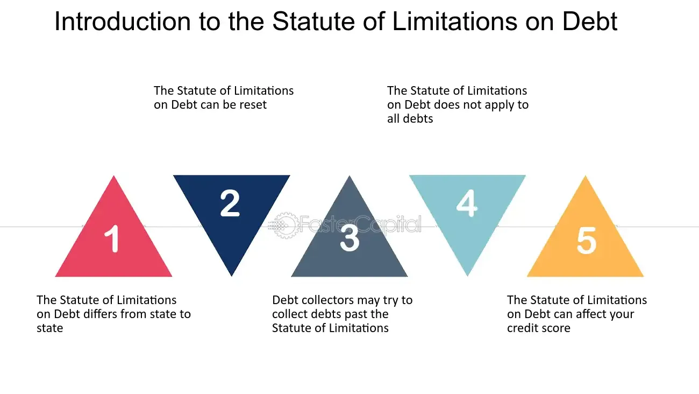

## Table of Contents

## What is debt limitation?

Debt limitation is a rule that sets a maximum amount of money that a person, company, or government can borrow. It's like a cap on how much debt you can have. For example, if a government has a debt limit of $10 trillion, it can't borrow more than that amount until the limit is raised or changed.

This limit is important because it helps control how much debt is taken on. If there's no limit, borrowing could get out of control, leading to financial problems. Governments often set these limits to show they are responsible with money. However, sometimes the limit needs to be raised if more money is needed for important projects or emergencies.

## Why is debt limitation important for governments and organizations?

Debt limitation is important for governments and organizations because it helps them manage their money wisely. Just like how a family might set a budget to avoid spending too much, a debt limit stops a government or organization from borrowing too much money. If there's no limit, they might keep borrowing and end up with a huge amount of debt that's hard to pay back. This can lead to financial problems and make it tough to do important things like building roads or running schools.

Having a debt limit also builds trust with people and investors. When a government or organization shows it can stick to a debt limit, it proves it's responsible with money. This makes people more likely to lend money or invest in the future. If the debt limit is too tight, though, it might stop the government or organization from doing things that are really needed, like helping during emergencies. So, it's a balance - the limit needs to be just right to keep finances in check but still allow for important spending.

## What are the common types of debt limitation mechanisms?

One common type of debt limitation is a statutory debt limit. This is a law that sets a maximum amount of money a government or organization can borrow. For example, the U.S. government has a law that says it can't borrow more than a certain amount of money. If they need to borrow more, they have to change the law first. This helps keep borrowing under control and makes sure the government doesn't take on too much debt.

Another type of debt limitation is a constitutional debt limit. This is a rule written into a country's or state's constitution that limits how much debt can be taken on. It's harder to change than a regular law because it needs a special vote to be changed. This type of limit is used to make sure that future governments don't borrow too much money and leave big debts for the next generation to pay.

Some organizations use internal debt limits, which are rules they set for themselves. These limits help them manage their borrowing and make sure they don't get into too much debt. For example, a company might decide it won't borrow more than a certain amount of money to keep its finances healthy. These internal limits can be changed more easily than statutory or constitutional limits, but they still help keep borrowing in check.

## How do statutory debt limits work?

Statutory debt limits are rules set by a law that say how much money a government or organization can borrow. For example, the U.S. government has a law that says it can't borrow more than a certain amount of money. This limit helps keep the government from borrowing too much and getting into big financial trouble. If the government needs to borrow more money than the limit allows, it has to ask lawmakers to change the law and raise the limit. This process makes sure that borrowing is watched closely and that the government is careful with money.

Sometimes, having a statutory debt limit can be tricky. If the government hits the limit and can't borrow more, it might not be able to pay for important things like schools or roads. This can cause problems and make people worry about the government's ability to manage money. But, if the limit is raised too easily, the government might borrow too much and leave big debts for future generations to pay. So, finding the right balance is important. The limit should be strict enough to keep borrowing under control but flexible enough to allow the government to do what it needs to do.

## What are the differences between hard and soft debt limits?

Hard debt limits are strict rules that cannot be easily changed or broken. They are like a firm cap on how much money a government or organization can borrow. If they hit this limit, they can't borrow any more money until the limit is officially raised or changed. This type of limit is often set by laws or even written into a country's constitution, making it very hard to go over the limit without a special vote or legal change. Hard limits help keep borrowing under tight control and show that the government or organization is serious about managing its debt.

Soft debt limits, on the other hand, are more flexible. They are guidelines that can be bent or adjusted more easily. A government or organization might set a soft limit to guide their borrowing but can go over it if they really need to. These limits might be set internally by the organization or government itself, without needing a change in law. Soft limits help manage debt but also give some room to borrow more if there's an emergency or a big project that needs funding. They are less strict and allow for more flexibility in managing finances.

## Can you explain the concept of a debt ceiling?

A debt ceiling is like a limit on how much money a government can borrow. It's a rule set by law that says the government can't borrow more than a certain amount of money. Think of it like a credit card with a limit - once you hit that limit, you can't borrow any more until you pay some back or the limit is raised. The debt ceiling helps keep the government from borrowing too much and getting into big financial trouble. If the government needs to borrow more money than the ceiling allows, it has to ask lawmakers to raise the limit.

Sometimes, hitting the debt ceiling can cause problems. If the government can't borrow more money, it might not be able to pay for important things like schools, roads, or even Social Security. This can make people worry about the government's ability to manage money. But, if the ceiling is raised too easily, the government might borrow too much and leave big debts for future generations to pay. So, finding the right balance is important. The ceiling should be strict enough to keep borrowing under control but flexible enough to let the government do what it needs to do.

## How do debt limits impact economic policy?

Debt limits can have a big impact on how a government makes economic policy. When there's a strict debt limit, the government might not be able to spend money on things like schools, roads, or helping people who are out of work. This can slow down the economy because the government isn't putting money into things that help it grow. On the other hand, if the debt limit is too loose, the government might borrow too much money and create big debts that are hard to pay back. This can make people and investors worried about the government's money management and might lead to higher interest rates, making it even harder to borrow in the future.

Because of these impacts, governments have to be careful about setting and changing debt limits. If they need to raise the limit to pay for important programs or emergencies, they have to explain to lawmakers and the public why it's needed. This can lead to debates and negotiations about how to spend money wisely. Sometimes, raising the debt limit can be seen as a sign that the government is not managing money well, which can affect how people feel about the economy. Finding the right balance is key - the limit should be tight enough to keep borrowing in check but flexible enough to let the government do what it needs to do to help the economy grow.

## What are the consequences of breaching a debt limit?

If a government or organization goes over its debt limit, it can cause big problems. They might not be able to pay for important things like schools, roads, or even salaries for workers. This can make the economy slow down because less money is being spent. People and businesses might start to worry about whether the government can pay its bills, which can make them less likely to lend money or invest. This can lead to higher interest rates, making it even harder for the government to borrow in the future.

To fix the problem, the government usually needs to ask lawmakers to raise the debt limit. This can lead to big debates and arguments about how to manage money better. If the limit isn't raised quickly, it can cause a lot of stress and uncertainty. In the worst cases, if the government can't borrow more money and can't pay its bills, it might have to shut down some services or even default on its debts. This is very serious and can hurt the economy a lot, making it harder for everyone to get by.

## How do different countries implement debt limitation?

Different countries have different ways of setting debt limits. In the United States, there's a law that says the government can't borrow more than a certain amount of money. This is called the debt ceiling. If the government needs to borrow more, they have to ask Congress to raise the limit. In Germany, the debt limit is written into their constitution. This makes it really hard to change because it needs a special vote. Germany's rule says the government can't borrow more than 0.35% of their GDP each year, except in emergencies.

Some countries, like Switzerland, have both a law and a rule in their constitution about debt limits. Switzerland's constitution says the government has to keep its debt under control, and they also have laws that set specific limits. In the United Kingdom, there isn't a strict debt limit like in the U.S. or Germany. Instead, the government sets its own targets for how much debt it wants to have. These targets can change depending on what the government thinks is best for the economy. Each country's way of handling debt limits shows how they balance the need to borrow money with the need to keep their finances healthy.

## What role do credit rating agencies play in relation to debt limits?

Credit rating agencies, like Moody's, Standard & Poor's, and Fitch, look at how well a government or organization is managing its money. They give a score, called a credit rating, that shows how likely it is that the government or organization will pay back its debts. If a government is close to hitting its debt limit or has already gone over it, these agencies might worry that the government won't be able to pay its bills. This can make them lower the credit rating, which means they think it's riskier to lend money to that government.

When a credit rating goes down, it can cause big problems. It can make it harder for the government to borrow money because lenders might want to charge higher interest rates. This makes borrowing more expensive and can slow down the economy. If the government can't borrow more money because of a strict debt limit, and its credit rating is also low, it might have to cut back on spending or find other ways to get money. This shows how important it is for governments to manage their debt limits carefully to keep their credit ratings high and the economy running smoothly.

## How can debt limitation be used as a tool for fiscal discipline?

Debt limitation can help governments and organizations be more careful with money. It's like setting a rule that says you can't borrow more than a certain amount. This makes them think twice before spending too much because they know they can't just keep borrowing if they run out of money. By having a limit, governments are pushed to make smart choices about where to spend money and how to save. This can stop them from getting into big money problems and help keep the economy stable.

Even though debt limits can be good for keeping spending in check, they can also cause problems if they're too strict. If a government really needs to borrow more money for important things like helping people after a disaster, a tight debt limit might stop them from doing that. So, it's important to find a balance. The limit should be strict enough to make the government think carefully about spending, but flexible enough to let them borrow more when it's really needed. This way, debt limitation can be a useful tool for keeping finances healthy without causing too many problems.

## What are some advanced strategies for managing debt within established limits?

One advanced strategy for managing debt within established limits is to use careful planning and forecasting. Governments and organizations can look ahead to see when they might need to borrow more money and plan their spending so they don't hit the debt limit too soon. They can also set up rules for themselves, like only borrowing for important projects or emergencies, and sticking to a budget that keeps their spending under control. By doing this, they can make sure they stay within the debt limit and avoid problems that come from borrowing too much.

Another strategy is to use financial tools like debt swaps or restructuring. This means changing the terms of the debt they already have, like paying it back over a longer time or at a lower interest rate. This can help lower the total amount of debt and make it easier to stay within the limit. Governments can also work on growing the economy so they earn more money through taxes and other ways. If they have more money coming in, they might not need to borrow as much, which helps them stay under the debt limit. These strategies need careful thinking and planning, but they can help manage debt well and keep finances healthy.

## What are Financial Instruments and how do they relate to Debt Control?

Financial instruments play a crucial role in debt control strategies by providing mechanisms through which corporations and governments can manage and regulate their debt obligations. Bonds, a primary financial instrument, are frequently utilized in these strategies as they offer a way to raise capital while imposing a structured repayment schedule, which aids in maintaining financial stability. Bonds come with specific terms, such as interest rates and maturity dates, which directly influence debt limitation policies by defining the cost and temporal structure of debt repayments.

Key metrics such as the debt-service coverage ratio (DSCR), debt/equity ratio, and debt/EBITDA ratio are integral in evaluating and enforcing debt limitation decisions. The DSCR is a measure of an entity's ability to service its debt given its current income, calculated as:

$$
\text{DSCR} = \frac{\text{Net Operating Income}}{\text{Total Debt Service}}
$$

A DSCR greater than 1 indicates that the entity possesses sufficiently available income to cover its debt service requirements, which is often stipulated in debt covenants to mitigate lender risk.

The debt/equity ratio, which measures the relative proportion of shareholders' equity and debt used to finance a company’s assets, is given by:

$$
\text{Debt/Equity Ratio} = \frac{\text{Total Debt}}{\text{Total Shareholders' Equity}}
$$

A higher debt/equity ratio typically signals a greater risk, affecting the company's borrowing capacity. This metric is crucial for maintaining a balance within capital structure policies and for abiding by regulatory requirements.

The debt/EBITDA ratio is utilized as an indicator of financial leverage and a company’s ability to pay off its incurred debt via operating profits before deductions:

$$
\text{Debt/EBITDA Ratio} = \frac{\text{Total Debt}}{\text{Earnings Before Interest, Taxes, Depreciation, and Amortization}}
$$

Financial instruments not only facilitate debt control but also influence the creation and adjustment of debt limitation policies. By providing a clear picture of the financial health and obligations of an entity, these metrics inform strategic decisions regarding additional borrowing and compliance with existing debt-related covenants. They ensure that both lenders and borrowers maintain financial discipline, thus safeguarding against excessive borrowing and potential insolvency.

## References & Further Reading

[1]: ["Debt Management and Financial Stability"](https://www.imf.org/external/pubs/ft/wp/2010/wp10280.pdf) by International Monetary Fund.

[2]: Lopez de Prado, M. (2018). ["Advances in Financial Machine Learning"](https://www.amazon.com/Advances-Financial-Machine-Learning-Marcos/dp/1119482089). Wiley.

[3]: Chan, E. P. (2009). ["Quantitative Trading: How to Build Your Own Algorithmic Trading Business"](https://github.com/ftvision/quant_trading_echan_book). Wiley.

[4]: Jansen, S. (2020). ["Machine Learning for Algorithmic Trading"](https://github.com/stefan-jansen/machine-learning-for-trading). Packt Publishing.

[5]: Aronson, D. (2007). ["Evidence-Based Technical Analysis: Applying the Scientific Method and Statistical Inference to Trading Signals"](https://www.amazon.com/Evidence-Based-Technical-Analysis-Scientific-Statistical/dp/0470008741). Wiley.

[6]: Hull, J. C. (2014). ["Options, Futures, and Other Derivatives"](https://www.amazon.com/Options-Futures-Other-Derivatives-9th/dp/0133456315). Pearson.