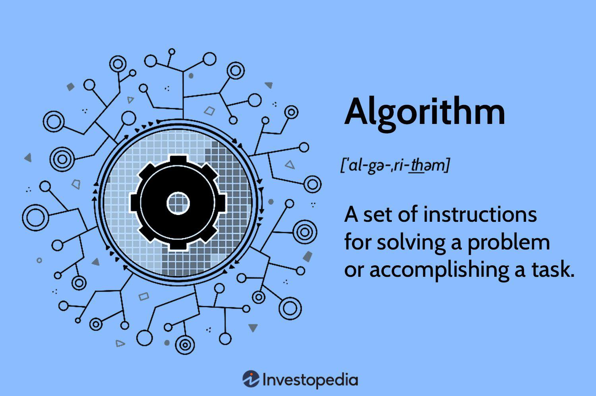

Debt limitation refers to the regulations and control mechanisms aimed at restricting the amount of debt that individuals, corporations, or governments can accrue. These policies play a crucial role in financial management, as they are designed to protect lenders, maintain market stability, and prevent entities from engaging in excessive borrowing that could lead to financial distress or systemic risks. By setting boundaries on leverage, debt limitation helps in safeguarding the economic environment from the volatility that arises from unchecked debt accumulation.

In the context of financial markets, integrating debt control into algorithmic trading is becoming increasingly essential. Algorithmic trading refers to the use of computer algorithms to automatically make trading decisions, execute orders, and manage portfolios based on a set of predefined criteria. With the rapid advancement in technology and the availability of vast amounts of financial data, traders can now incorporate debt limitations into their algorithms to guide trading strategies. By analyzing debt-related metrics, such as leverage ratios and debt covenants, algorithms can assess the financial health and risk profile of companies, thus enabling more informed trading decisions.



This integration is crucial because it enhances the ability of trading algorithms to factor in financial risks associated with the debt levels of companies. For example, an algorithm might use the debt/equity ratio to evaluate a company's leverage and make decisions about buying or selling stocks or bonds. This interaction between debt policies and trading strategies allows for a more sophisticated risk assessment, ultimately leading to more prudent investment decisions and potentially higher returns.

The objective of this article is to explore the intricate relationship between debt policies and trading strategies. By understanding how debt limitation can be woven into the fabric of algorithmic trading, stakeholders can optimize their financial strategies and potentially uncover new opportunities in the market. Through a detailed examination of various debt limitation regulations, their effects on financial instruments, and how they shape trading algorithms, this discourse aims to furnish readers with insights into the dual role of debt limitation in ensuring financial stability and enhancing trading efficacy.

## Table of Contents

## Understanding Debt Limitation Policies

Debt limitation refers to strategies and regulations designed to restrict the amount of debt that an organization or individual can assume, thereby maintaining financial stability and protecting the interests of creditors. These policies are crucial in ensuring that borrowers do not engage in excessive risk-taking which could lead to financial insolvency and systemic economic issues. Debt limitations play an integral role in fostering a stable financial environment by placing constraints on borrowing activities and promoting responsible financial behavior.

Debt covenants and leverage ratios are two prominent forms of debt limitation policies. Debt covenants are contractual obligations included in loan agreements that impose certain financial and operational restrictions on borrowers. These can include performance covenants, which require borrowers to meet specific financial metrics like maintaining a minimum debt-service coverage ratio (DSCR), and restrictive covenants, which limit actions such as additional borrowing or asset sales. By enforcing these covenants, lenders can mitigate risks and ensure that borrowers remain capable of repaying their debts.

Leverage ratios, on the other hand, measure the proportion of debt utilized in a company’s capital structure. Common leverage ratios include the debt-to-equity ratio, which compares total liabilities to shareholders' equity, and the debt-to-EBITDA (Earnings Before Interest, Taxes, Depreciation, and Amortization) ratio. These ratios help to assess the sustainability of a company's debt levels relative to its earnings and equity base. For example, a high debt-to-equity ratio may signal financial risk as it implies heavy reliance on borrowed funds to finance operations.

By imposing limits on these ratios, regulatory bodies and financial institutions can effectively restrict the accumulation of new debt, thus curbing excessive risk exposure. Restrictive debt policies prevent entities from over-leveraging and promote a balanced approach to borrowing, which can deter financial distress and maintain market confidence. These limitations are crucial, especially during volatile market conditions or economic downturns, as they help stabilize financial systems and protect both lenders and broader economic interests.

In summary, debt limitation policies such as debt covenants and leverage ratios are vital mechanisms that safeguard lenders and contribute to financial stability by preventing excessive borrowing and promoting prudent financial management.

## Types of Debt Covenants and Their Impact

Debt covenants are contractual agreements between borrowers and lenders that impose certain conditions on the former to protect the interests of the latter. These covenants are pivotal in maintaining financial discipline and mitigating risks associated with lending. Debt covenants typically manifest in two forms: performance covenants and restrictive covenants. 

Performance covenants require the borrower to meet specific financial metrics or ratios, such as maintaining a minimum level of earnings before interest, taxes, depreciation, and amortization (EBITDA) or a certain debt-service coverage ratio (DSCR). For instance, a performance covenant might stipulate that a company's DSCR remains above 1.5, ensuring the borrower generates sufficient income to cover debt obligations.

Restrictive covenants, on the other hand, set limitations or constraints on certain activities by the borrower. These covenants might restrict issuing additional debt, paying dividends, or making capital expenditures beyond a predetermined threshold. By doing so, restrictive covenants aim to prevent borrowers from engaging in actions that could jeopardize their ability to repay the debt.

Debt covenants enforce financial responsibility by holding borrowers accountable for adhering to agreed-upon financial metrics and operational restrictions. This accountability compels borrowers to maintain prudent financial management and operational practices, reducing the risk of default. The presence of covenants also fosters alignment of interests between borrowers and lenders, as both parties work towards the borrower's financial stability and growth.

For lenders, debt covenants provide a means of control and early warning signals for potential financial distress. By setting specific covenants, lenders can mitigate credit risk and intervene before a borrower's financial situation deteriorates. This protective mechanism can enhance the lender's confidence and potentially lead to more favorable lending terms for the borrower.

However, debt covenants also have drawbacks. For borrowers, these covenants can be seen as restrictive, limiting their operational flexibility and ability to pursue growth opportunities. Failure to comply with covenants, known as covenant breaches, can result in penalties, renegotiation of loan terms, or even loan acceleration, where the lender demands immediate repayment of the debt.

For lenders, while covenants provide a safeguard, they may also require ongoing monitoring and enforcement, which can entail administrative costs. Additionally, overly restrictive covenants may hinder a borrower's performance, ironically increasing the likelihood of financial distress or default.

In summary, while debt covenants are essential tools for enforcing financial discipline and reducing credit risk, they must be carefully crafted to balance the lender's need for security with the borrower's need for operational flexibility.

## Financial Instruments and Debt Control

Financial instruments play a crucial role in debt control strategies by providing mechanisms through which corporations and governments can manage and regulate their debt obligations. Bonds, a primary financial instrument, are frequently utilized in these strategies as they offer a way to raise capital while imposing a structured repayment schedule, which aids in maintaining financial stability. Bonds come with specific terms, such as interest rates and maturity dates, which directly influence debt limitation policies by defining the cost and temporal structure of debt repayments.

Key metrics such as the debt-service coverage ratio (DSCR), debt/equity ratio, and debt/EBITDA ratio are integral in evaluating and enforcing debt limitation decisions. The DSCR is a measure of an entity's ability to service its debt given its current income, calculated as:

$$
\text{DSCR} = \frac{\text{Net Operating Income}}{\text{Total Debt Service}}
$$

A DSCR greater than 1 indicates that the entity possesses sufficiently available income to cover its debt service requirements, which is often stipulated in debt covenants to mitigate lender risk.

The debt/equity ratio, which measures the relative proportion of shareholders' equity and debt used to finance a company’s assets, is given by:

$$
\text{Debt/Equity Ratio} = \frac{\text{Total Debt}}{\text{Total Shareholders' Equity}}
$$

A higher debt/equity ratio typically signals a greater risk, affecting the company's borrowing capacity. This metric is crucial for maintaining a balance within capital structure policies and for abiding by regulatory requirements.

The debt/EBITDA ratio is utilized as an indicator of financial leverage and a company’s ability to pay off its incurred debt via operating profits before deductions:

$$
\text{Debt/EBITDA Ratio} = \frac{\text{Total Debt}}{\text{Earnings Before Interest, Taxes, Depreciation, and Amortization}}
$$

Financial instruments not only facilitate debt control but also influence the creation and adjustment of debt limitation policies. By providing a clear picture of the financial health and obligations of an entity, these metrics inform strategic decisions regarding additional borrowing and compliance with existing debt-related covenants. They ensure that both lenders and borrowers maintain financial discipline, thus safeguarding against excessive borrowing and potential insolvency.

## Integrating Debt Control in Algorithmic Trading

Algorithmic trading involves the use of computer algorithms to automate decision-making in financial markets. These algorithms are designed to analyze vast amounts of market data and execute orders, often with a speed and precision unattainable by human traders. Integrating debt control measures into [algorithmic trading](/wiki/algorithmic-trading) involves incorporating financial metrics related to a company’s debt status, such as debt ratios, which offer insights into the financial health and leverage of the subject entity.

Debt control measures can be integrated into algorithmic trading systems by programming algorithms to monitor and react to specific debt-related ratios. Two common ratios are the debt-to-equity ratio, which measures the extent of a company’s leverage, and the interest coverage ratio, which gauges a company’s ability to meet interest obligations. These metrics provide critical information on risk and can substantially influence trading strategies. For instance, an unusually high debt-to-equity ratio might be interpreted by an algorithm as a signal of high financial risk, prompting a strategy focused on short-selling the company’s stock or buying credit default swaps.

Algorithms analyzing debt ratios are often designed to respond to threshold values, generating buy or sell signals when certain financial conditions are met. For example, an algorithm may be set to initiate a buy order if a firm’s debt-to-equity ratio falls below a defined threshold, suggesting improved creditworthiness and a lower risk profile. Conversely, a high interest coverage ratio, indicating strong earnings relative to interest expenses, might trigger a long position in the corresponding equity, anticipating a positive market reaction.

An example of an algorithmic trading strategy influenced by debt metrics is credit spread trading. This strategy involves taking positions in bonds or credit derivatives based on anticipated changes in credit spreads, which can be influenced by changes in a company’s debt metrics. If an algorithm detects a narrowing credit spread alongside a declining debt-to-equity ratio, it might initiate a position that profits from improving credit conditions.

To implement these strategies effectively, traders often use platforms that allow the coding and [backtesting](/wiki/backtesting) of complex algorithms. Programming languages such as Python are commonly used due to their extensive libraries and ease of integration with trading platforms. For instance, Python's `pandas` library is instrumental in handling time-series data to compute and backtest strategies based on debt metrics.

In the context of debt control integration, algorithms can be further enhanced with [machine learning](/wiki/machine-learning) techniques. Machine learning models can identify patterns in debt-related data, improving the accuracy of predictions regarding a company's financial trajectory. Techniques such as regression or neural networks enable the modeling of complex relationships between debt metrics and market movements, thereby enhancing the effectiveness of algorithmic trading strategies.

```python
import pandas as pd
import numpy as np

# Example: Calculate Debt-to-Equity Ratio and Generate Trading Signal
# Define a mock DataFrame for financial data
data = {
    'Total_Debt': [500, 450, 470, 490, 510],
    'Shareholder_Equity': [250, 260, 265, 255, 250],
}

df = pd.DataFrame(data)

# Calculate Debt-to-Equity Ratio
df['Debt_Equity_Ratio'] = df['Total_Debt'] / df['Shareholder_Equity']

# Define a threshold for trading signal
threshold = 1.8

# Generate trading signal
# Buy if Debt-Equity Ratio < threshold; Sell if >= threshold
df['Signal'] = np.where(df['Debt_Equity_Ratio'] < threshold, 'Buy', 'Sell')

print(df)
```

Overall, integrating debt control into algorithmic trading provides valuable insights, allowing algorithms to make more informed decisions by factoring in a company's debt profile. This integration is essential for managing risk and enhancing profitability in automated trading systems.

## Key Strategies in Debt-Influenced Algorithmic Trading

Algorithmic trading leverages the power of algorithms to execute trading strategies at high speed and [volume](/wiki/volume-trading-strategy), utilizing quantitative data to generate returns. When integrating debt-related metrics, several key strategies can be employed for effective trading, including [arbitrage](/wiki/arbitrage), yield curve analysis, and credit spread trading. Each approach harnesses specific debt metrics to optimize trade decisions, offering unique insights and opportunities.

### Arbitrage

Arbitrage plays a pivotal role by exploiting price differences of financial instruments across markets or time frames. In debt-influenced algorithmic trading, arbitrage strategies use debt-related data, such as [interest rate](/wiki/interest-rate-trading-strategies) discrepancies or bond mispricing, to identify profitable trades. For instance, if a corporate bond is undervalued compared to its debt metrics like credit rating or debt-service coverage ratio (DSCR), an algorithm can execute trades to capitalize on this mispricing, aligning prices across different markets. The efficiency and speed of algorithms enable traders to capture these fleeting opportunities, reducing the risk of manual execution errors.

### Yield Curve Analysis

Yield curve analysis involves examining the relationship between interest rates and the maturity of debt securities. The yield curve, often referred to in terms of its shape (normal, inverted, or flat), provides insights into economic expectations and interest rate environments. By analyzing changes in the yield curve, algorithmic strategies can predict future movements in interest rates, aiding in decisions regarding bond investments, interest rate swaps, or other fixed-income securities. Algorithms can process vast amounts of historical yield data, modeling potential shifts and advising on optimal trade execution based on these projections.

### Credit Spread Trading

Credit spread trading focuses on the difference in yield between corporate bonds and risk-free government securities. Fluctuations in credit spreads offer insights into changing credit risk perceptions of borrowers. Algorithmic trading systems can monitor real-time changes in credit spreads, allowing traders to anticipate adjustments in bond prices relative to their perceived credit risks. By evaluating metrics such as the debt/equity ratio or interest coverage ratio, algorithms facilitate informed decisions on whether to enter or [exit](/wiki/exit-strategy) trades based on expected spread adjustments.

### Tools and Platforms

Effective execution of debt-influenced trading strategies requires sophisticated tools and platforms capable of processing and analyzing debt-related data. Platforms like Bloomberg Terminal and Reuters Eikon offer comprehensive market data and analytical tools essential for evaluating debt metrics. Quantitative trading platforms such as QuantConnect and Alpaca provide robust frameworks for developing, testing, and deploying algorithmic trading strategies with integrated access to financial markets.

Python, due to its extensive libraries like NumPy, pandas, and scikit-learn, is a preferred programming language in developing these strategies. For example, a simple Python algorithm to evaluate credit spreads could be structured as follows:

```python
import pandas as pd

# Hypothetical data for corporate and government bonds
corporate_yields = pd.Series([0.042, 0.043, 0.045], index=['2023-01-01', '2023-02-01', '2023-03-01'])
government_yields = pd.Series([0.02, 0.021, 0.019], index=['2023-01-01', '2023-02-01', '2023-03-01'])

# Calculating credit spreads
credit_spreads = corporate_yields - government_yields

# Analyzing spread data
for date, spread in credit_spreads.items():
    if spread > 0.02:
        print(f"{date}: Buy corporate bonds, spread is {spread:.4f}")
    else:
        print(f"{date}: Hold, spread is {spread:.4f}")
```

This example calculates credit spreads and provides trading signals based on predefined threshold values, demonstrating the utility of automated systems in leveraging debt metrics for informed trading decisions. As algorithms become more sophisticated, the ability to integrate complex debt-related data will further enhance the precision and profitability of trading strategies.

## The Role of Financial Ratios in Trading Decisions

Financial ratios play a critical role in trading decisions by providing insights into a company's financial health, risk profile, and potential investment returns. Ratios such as the debt ratio and leverage ratio are particularly significant in assessing the risk associated with a firm's capital structure. The debt ratio, defined as $\text{Debt Ratio} = \frac{\text{Total Debt}}{\text{Total Assets}}$, measures the proportion of a company’s assets financed by debt. It indicates how much leverage a firm uses and helps investors gauge the risk of insolvency.

The leverage ratio, often expressed as $\text{Leverage Ratio} = \frac{\text{Total Debt}}{\text{Equity}}$, provides insight into the level of debt relative to the equity capital. High leverage ratios indicate that a company is heavily reliant on borrowed funds, which can magnify returns on equity but also increase financial risk, especially in times of economic downturn. Both ratios are crucial for traders in debt markets to evaluate creditworthiness and in equity markets to assess potential returns adjusted for risk.

In decision-making, these ratios enable traders to analyze a company's ability to meet its financial obligations. Higher debt or leverage ratios may imply higher risk, prompting traders to demand higher yields from bonds or adjust their share price valuation models. Conversely, lower ratios suggest a stronger financial position and potentially lower risk, influencing bullish trading strategies or increased equity valuations.

Automation and [artificial intelligence](/wiki/ai-artificial-intelligence) (AI) have transformed how financial ratios are monitored and acted upon. Advanced algorithms can continuously analyze vast datasets in real-time, offering immediate insights into market conditions and company performances based on changes in financial ratios. These systems utilize machine learning techniques to predict trends and make trading decisions, enhancing efficiency and mitigating human error.

For instance, a Python algorithm might monitor streaming financial data to identify changes in a company’s debt ratio. If a significant increase is detected, the algorithm can automatically trigger a sell order for its bonds due to heightened credit risk concerns.

Here is a simplified Python example using a hypothetical AI-based trading system:

```python
def analyze_ratios(financial_data):
    debt_ratio = financial_data['total_debt'] / financial_data['total_assets']
    leverage_ratio = financial_data['total_debt'] / financial_data['equity']
    return debt_ratio, leverage_ratio

def trading_decision(debt_ratio, leverage_ratio, threshold=0.5):
    if debt_ratio > threshold or leverage_ratio > threshold:
        decision = "Sell"
    else:
        decision = "Buy"
    return decision

# Example financial data
financial_data = {
    'total_debt': 500,
    'total_assets': 1000,
    'equity': 800,
}

# Analyzing ratios and making a decision
ratios = analyze_ratios(financial_data)
decision = trading_decision(*ratios)
print(f"Trading decision based on ratios: {decision}")
```

This example reflects how real-time data handling could be embedded within trading platforms to evaluate financial ratios continuously, thus aiding timely and informed trading decisions. Leveraging automation and AI not only enhances the speed of trading decisions but also their accuracy, thus playing a vital role in modern financial markets.

## Risks and Considerations in Debt-Driven Strategies

Debt-laden trading strategies, while potentially lucrative, [carry](/wiki/carry-trading) inherent risks that must be carefully managed. One of the primary risks associated with such strategies is market [volatility](/wiki/volatility-trading-strategies). Fluctuations in market prices can lead to significant variations in the value of underlying assets, which, in turn, can affect the debt-to-equity ratio of a company. These fluctuations may result in margin calls or breaches of debt covenants, forcing traders to liquidate positions at a loss. 

In addition, changes in interest rates represent another significant risk. When interest rates rise, the cost of servicing debt increases, potentially diminishing profit margins or even causing financial distress. This effect is particularly pronounced in strategies that rely on leveraged positions or significant amounts of borrowed capital. Rising interest rates may also lead to a revaluation of assets, impacting the net asset value and potentially triggering covenants based on valuation metrics.

To mitigate these risks, traders should employ risk management strategies that include the use of hedging instruments like options or futures to offset potential losses due to adverse movements in asset prices or interest rates. For example, traders can use interest rate swaps to manage exposure to fluctuating interest rates. A swap agreement allows a trader to exchange a variable interest rate liability for a fixed interest rate, thereby stabilizing debt service costs. Here is a basic Python code example using numpy and pandas to simulate a simple interest rate swap scenario:

```python
import numpy as np
import pandas as pd

# Define the fixed and floating rate terms
fixed_rate = 0.05 # 5% fixed interest rate
floating_rate_initial = 0.03 # 3% initial floating rate

# Simulate potential future floating rates
np.random.seed(42) # for reproducibility
future_floating_rates = np.random.normal(loc=0.03, scale=0.005, size=10) # normal distribution around 3%

# Dates for swap evaluation
dates = pd.date_range('2023-01-01', periods=10, freq='Q')

# Calculate differential payments
fixed_payments = np.full_like(future_floating_rates, fill_value=fixed_rate)
floating_payments = future_floating_rates
interest_differentials = fixed_payments - floating_payments

# Sum differential payments for final settlement (assuming notional of 1)
net_payment = np.sum(interest_differentials)

# Output simulated swap results
swap_results = pd.DataFrame({
    'Date': dates,
    'Fixed Rate': fixed_payments,
    'Floating Rate': floating_payments,
    'Interest Differential': interest_differentials
})

print(swap_results)
print("Net Payment to be received (or paid if negative):", net_payment)
```

Traders should also incorporate stress testing and scenario analysis to understand the impact of extreme market conditions on their trading positions. Stress tests simulate the effects of adverse economic conditions or market shocks on a portfolio, helping identify vulnerabilities and assess the adequacy of capital buffers to withstand financial turbulence. Regularly conducting such analyses aids in adjusting leverage and position sizes accordingly.

Risk diversification and maintaining [liquidity](/wiki/liquidity-risk-premium) reserves are additional measures that can help traders cope with unexpected market movements. Diversification reduces exposure to any single asset or market, while liquidity reserves ensure that traders have sufficient capital to meet obligations and take advantage of buying opportunities during market downturns.

By systematically applying these risk management techniques, traders can enhance the resilience of debt-driven strategies and safeguard against the potential adverse impacts of volatility and interest rate fluctuations.

## Case Studies and Real-World Applications

### Case Studies and Real-World Applications

Debt control policies have increasingly found integration within trading systems across numerous industries. Successful case studies illustrate the profound impact of these policies in facilitating prudent financial strategies and informed trading decisions.

**Case Study 1: Financial Sector - Algorithmic Trading Firm**

An algorithmic trading firm implemented stringent debt limitation policies by incorporating debt covenants and leverage ratios into their trading algorithms. The firm utilized real-time market data to continuously assess and manage their debt exposure, systematically adjusting their trading positions based on the prevailing debt metrics. One of the key outcomes was the reduction in excessive risk-taking, as the firm’s algorithms restricted new debt acquisition when leverage ratios approached set limits. This application ensured the firm maintained financial stability and protected its lenders, demonstrating that debt policies could serve as a buffer against market volatility and financial uncertainty. 

**Lessons Learned:**

1. **Dynamic Debt Monitoring:** Regular assessment of debt metrics can optimize trading decisions, reducing exposure to high-risk positions.
2. **Robust Risk Management:** Integrating debt limitation within trading algorithms enhances financial stability by controlling leverage and mitigating risks.

**Case Study 2: Real Estate Investment Trusts (REITs)**

REITs are famously reliant on debt for financing property acquisitions. A study in this sector involved REITs adopting improved debt service coverage ratios (DSCR) as part of their debt control policies to better manage their capital structure. Through algorithm-driven assessments, these REITs monitored debt-servicing capacity relative to their operational cash flows. The introduction of debt limits helped in maintaining a balance between leveraged growth and operational efficiency, ultimately fostering investor confidence during periods of interest rate fluctuations.

**Lessons Learned:**

1. **Leveraging Debt Metrics:** Attention to DSCR and other debt metrics secures investor trust and ensures sustainable growth for heavily indebted entities.
2. **Interest Rate Management:** Debt control policies designed for REITs highlight the importance of preparing for interest rate changes and preserving liquidity.

**Case Study 3: Manufacturing Sector - Debt-Driven Expansion**

A manufacturing company sought expansion within international markets, heavily dependent on debt financing. By establishing comprehensive debt policies, including performance covenants, they ensured each expansion phase met predetermined financial thresholds before further leveraging was permissible. This approach not only supported timely repayments but also kept operational risks manageable. The debt controls effectively tied expansion to the company's capacity to maintain financial health, balancing growth ambitions with fiscal responsibility.

**Lessons Learned:**

1. **Threshold-Based Expansion:** Performance covenants effectively align expansion activities with financial health indicators, preventing overleveraging.
2. **Sustainability and Growth Coexistence:** Strategic debt control does not inhibit growth but aligns it with market and financial conditions.

These case studies underscore the vital role of integrated debt control policies in guiding and optimizing trading strategies. The lessons learned emphasize the importance of tailoring debt limitations to industry-specific needs while focusing on maintaining fiscal prudence and promoting financial stability across different sectors.

## Conclusion

Debt limitation plays a pivotal role in financial strategies and algorithmic trading by setting boundaries that encourage responsible borrowing and lending. Such limitations are designed to mitigate the risks associated with excessive leverage, ensuring stability and protecting the interests of lenders and investors. When integrated into trading systems, debt control measures guide decisions by constraining risky financial behaviors, which can otherwise lead to market instability.

Algorithmic trading becomes particularly robust when informed by debt metrics, as these metrics provide real-time data that algorithms use to optimize trading strategies. For instance, leveraging ratios, debt-service coverage ratio (DSCR), and other financial indicators allow for precise assessment of a company's financial health. Such assessments enable algorithms to make informed trading decisions that strategically balance risk and opportunity.

Incorporating financial ratios into algorithmic models, traders can execute strategies like arbitrage and credit spread trading with increased precision. This integration underscores the synergy between financial policies and advanced trading technologies. The strategic incorporation of debt limitation ensures that trading activities align with broader financial objectives, thereby enhancing the resilience of financial systems.

It is crucial to maintain a balance between risk and opportunity in debt-influenced trading. While leveraging debt-related data can drive profit, it is equally important to be vigilant about potential risks, such as market volatility and changing interest rates. Implementing effective risk management protocols can mitigate these challenges, ensuring that trading activities remain sustainable.

This evolving interplay between financial policies and trading technologies offers a rich area for further exploration. By understanding and applying debt control mechanisms, traders and financial professionals can unlock new pathways for optimizing trading decisions. As the financial landscape continues to evolve, leveraging sophisticated trading systems informed by sound financial principles will be essential in achieving long-term success.

## References & Further Reading

[1]: ["Debt Management and Financial Stability"](https://www.imf.org/external/pubs/ft/wp/2010/wp10280.pdf) by International Monetary Fund.

[2]: Lopez de Prado, M. (2018). ["Advances in Financial Machine Learning"](https://www.amazon.com/Advances-Financial-Machine-Learning-Marcos/dp/1119482089). Wiley.

[3]: Chan, E. P. (2009). ["Quantitative Trading: How to Build Your Own Algorithmic Trading Business"](https://github.com/ftvision/quant_trading_echan_book). Wiley.

[4]: Jansen, S. (2020). ["Machine Learning for Algorithmic Trading"](https://github.com/stefan-jansen/machine-learning-for-trading). Packt Publishing.

[5]: Aronson, D. (2007). ["Evidence-Based Technical Analysis: Applying the Scientific Method and Statistical Inference to Trading Signals"](https://www.amazon.com/Evidence-Based-Technical-Analysis-Scientific-Statistical/dp/0470008741). Wiley.

[6]: Hull, J. C. (2014). ["Options, Futures, and Other Derivatives"](https://www.amazon.com/Options-Futures-Other-Derivatives-9th/dp/0133456315). Pearson.