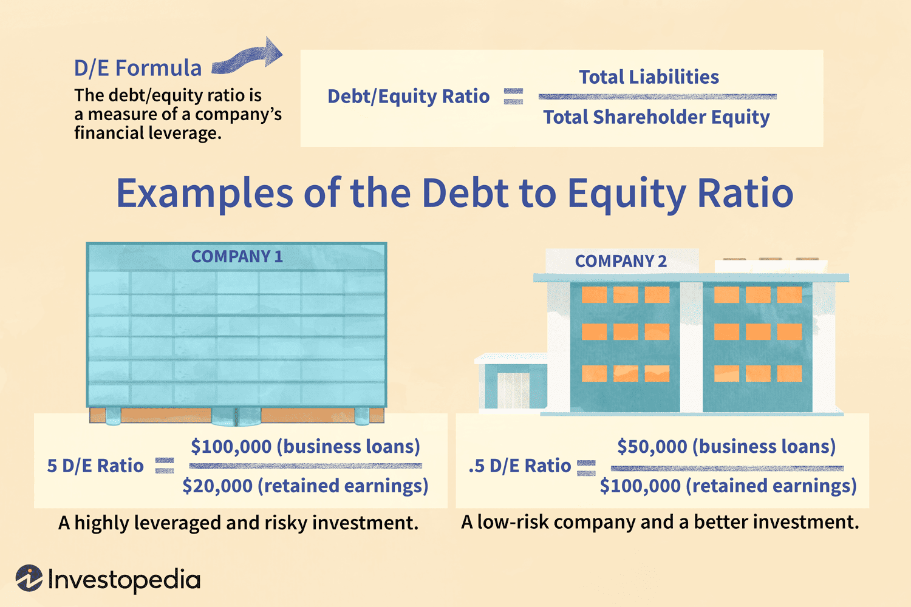

## Table of Contents

## What is debt load?

Debt load refers to the total amount of money that a person, company, or government owes. This includes all types of debt, such as loans, credit card balances, and mortgages. For individuals, a high debt load can make it difficult to manage monthly payments and can affect their credit score. For businesses, a high debt load can impact their ability to invest in growth or even meet operational costs.

Managing debt load is important for financial health. If the debt load becomes too high, it can lead to financial stress and potentially bankruptcy. To manage it, people and businesses often look at their debt-to-income ratio, which compares their debt to their income. Keeping this ratio low helps ensure that they can comfortably handle their debt payments without straining their finances.

## How is debt load calculated?

Debt load is calculated by adding up all the money you owe. This includes everything like credit card debt, student loans, car loans, and mortgages. If you have a credit card balance of $5,000, a student loan of $20,000, and a car loan of $15,000, your total debt load would be $40,000.

To understand if your debt load is too high, you can look at your debt-to-income ratio. This is done by dividing your total monthly debt payments by your monthly income. For example, if your monthly debt payments are $1,000 and your monthly income is $4,000, your debt-to-income ratio is 25%. A lower ratio means you are managing your debt well, while a higher ratio might mean you need to work on reducing your debt.

## What are the common types of debt that contribute to debt load?

There are several common types of debt that add up to make your total debt load. Credit card debt is one of the most common types. This happens when you use your credit card to buy things and then don't pay off the full balance each month. Another big type of debt is student loans. Many people borrow money to pay for college or other education and then have to pay it back over time. Car loans are also common. When you buy a car and can't pay for it all at once, you might take out a loan to cover the cost and pay it back in monthly payments.

Mortgages are another type of debt that can make your debt load bigger. A mortgage is a loan you take out to buy a house, and you pay it back over many years. Personal loans are also common. These are loans you might take out for things like home improvements or unexpected expenses. All these types of debt add up to your total debt load, and it's important to keep track of them to manage your finances well.

## What is the difference between good debt and bad debt?

Good debt is debt that can help you in the long run. It's money you borrow to invest in things that might make your life better or help you earn more money later. For example, taking out a student loan to go to college can be good debt because it might help you get a better job and earn more money. A mortgage to buy a house can also be good debt because owning a home can be a good investment and give you a place to live.

Bad debt is debt that doesn't help you in the long run. It's money you borrow for things that lose value quickly or don't help you earn more money. For example, using a credit card to buy things you don't need, like a fancy TV or a big vacation, can be bad debt. These things don't help you build wealth or improve your life in the long run, and you still have to pay back the money with interest.

## How does debt load affect personal finances?

Debt load can have a big impact on your personal finances. When you have a lot of debt, it means you have to pay back a lot of money, often with interest. This can make it hard to save money or spend on things you need or want. If your debt load is too high, you might struggle to pay your bills on time, which can hurt your credit score. A lower credit score can make it harder to get loans or credit cards in the future, and you might have to pay higher interest rates.

Managing your debt load is important for keeping your finances healthy. If you have too much debt, it can cause a lot of stress and worry. It might even lead to serious problems like bankruptcy if you can't pay back what you owe. To keep your debt load under control, it's a good idea to keep track of how much you owe and make a plan to pay it off. This might mean cutting back on spending or finding ways to earn more money. By managing your debt well, you can feel more secure and have more control over your financial future.

## What are the mechanisms through which debt load can be managed?

Managing your debt load can start with making a budget. A budget helps you see how much money you have coming in and how much you're spending. You can use this to figure out how much money you can put towards paying off your debt each month. Another way to manage debt is by paying more than the minimum payment on your loans and credit cards. This can help you pay off your debt faster and save money on interest. You might also want to talk to your lenders about your situation. Sometimes, they can offer you a lower [interest rate](/wiki/interest-rate-trading-strategies) or a different payment plan that makes it easier to pay off your debt.

Another important mechanism is debt consolidation. This means taking out a new loan to pay off all your other debts. This can make it easier to manage your payments because you only have to pay one loan instead of many. But be careful, because if the new loan has a high interest rate, it might not help you in the long run. You can also try the snowball or avalanche method to pay off your debt. The snowball method means paying off your smallest debts first, while the avalanche method means paying off the debts with the highest interest rates first. Both methods can help you feel like you're making progress and keep you motivated to keep paying off your debt.

Lastly, seeking help from a credit counselor can be a good idea. Credit counselors can give you advice on how to manage your debt and might even help you set up a debt management plan. This plan can help you pay off your debt over time in a way that works for you. Remember, managing your debt load is about making smart choices and sticking to a plan. By doing this, you can reduce your debt and feel more in control of your finances.

## What are the advantages of carrying a manageable debt load?

Carrying a manageable debt load means you have control over your money. When your debt is not too high, you can pay your bills on time and not worry about money all the time. This helps you keep a good credit score, which is important for getting loans or credit cards in the future. A good credit score can also mean you get lower interest rates, which saves you money. Plus, with less debt to worry about, you can save more money for things like emergencies, a vacation, or even buying a house.

Having a manageable debt load also means less stress. When you don't owe too much money, you feel more relaxed and can focus on other parts of your life, like your job or family. It's easier to plan for the future when you're not always thinking about how to pay off big debts. This peace of mind can make a big difference in how you feel every day. So, keeping your debt under control helps you live a happier and more secure life.

## What are the disadvantages of a high debt load?

A high debt load can make life really hard. When you owe a lot of money, it can be tough to pay your bills on time. This can hurt your credit score, which makes it harder to get loans or credit cards later. You might have to pay higher interest rates too, which means you end up paying even more money over time. It can also make it hard to save money for things like emergencies or big purchases, like a house or a car.

Having a lot of debt can also cause a lot of stress. You might worry all the time about how to pay back what you owe. This stress can affect your health and make it hard to focus on other important things in your life, like your job or your family. If your debt gets too high, you might even face serious problems like bankruptcy, which can make your financial situation even worse. So, a high debt load can really mess up your life and make it hard to feel secure and happy.

## How does debt load impact credit scores?

Debt load can really affect your credit score. When you have a lot of debt, it can be hard to pay your bills on time. If you miss payments or only pay the minimum on your credit cards, it can hurt your credit score. Credit scores are important because they show how good you are at paying back money you borrow. A lower credit score can make it harder to get loans or credit cards in the future, and you might have to pay higher interest rates.

Having too much debt can also make your credit utilization rate go up. This is the amount of credit you're using compared to how much credit you have available. If you're using a lot of your available credit, it can make lenders think you're having trouble managing your money. This can lower your credit score too. Keeping your debt load low helps keep your credit utilization rate down, which is good for your credit score.

## What strategies can be used to reduce debt load?

One way to reduce your debt load is by making a budget. A budget helps you see how much money you have coming in and how much you're spending. You can use this to figure out how much money you can put towards paying off your debt each month. Another strategy is to pay more than the minimum payment on your loans and credit cards. This can help you pay off your debt faster and save money on interest. You might also want to talk to your lenders about your situation. Sometimes, they can offer you a lower interest rate or a different payment plan that makes it easier to pay off your debt.

Another important strategy is debt consolidation. This means taking out a new loan to pay off all your other debts. This can make it easier to manage your payments because you only have to pay one loan instead of many. But be careful, because if the new loan has a high interest rate, it might not help you in the long run. You can also try the snowball or avalanche method to pay off your debt. The snowball method means paying off your smallest debts first, while the avalanche method means paying off the debts with the highest interest rates first. Both methods can help you feel like you're making progress and keep you motivated to keep paying off your debt.

Lastly, seeking help from a credit counselor can be a good idea. Credit counselors can give you advice on how to manage your debt and might even help you set up a debt management plan. This plan can help you pay off your debt over time in a way that works for you. Remember, reducing your debt load is about making smart choices and sticking to a plan. By doing this, you can feel more in control of your finances and work towards a debt-free future.

## How do economic conditions influence the management of debt load?

Economic conditions can make it harder or easier to manage your debt load. When the economy is doing well, it's easier to find a job or get a raise, which means you have more money to pay off your debts. Interest rates might also be lower, so borrowing money to pay off other debts can be cheaper. But if the economy is not doing well, it can be tough. You might lose your job or have to take a pay cut, which makes it harder to pay your bills. Interest rates might go up, making your debt more expensive.

During tough economic times, managing your debt load can feel really stressful. You might have to cut back on spending a lot just to keep up with your payments. Sometimes, you might even need to take on more debt just to get by, which can make your debt load even bigger. But if you can stick to a budget and keep talking to your lenders, you might be able to find ways to make your debt more manageable. It's all about being smart with your money and planning ahead, no matter what the economy is doing.

## What are the long-term implications of maintaining a high debt load?

Keeping a high debt load for a long time can cause a lot of problems. It can make it hard to save money for things like emergencies, buying a house, or retiring. When you have a lot of debt, you have to pay back a lot of money, often with high interest. This means you might not have enough money left over to save or spend on things you need or want. It can also hurt your credit score. If you miss payments or only pay the minimum on your credit cards, your credit score can go down. A lower credit score can make it harder to get loans or credit cards in the future, and you might have to pay higher interest rates.

Over time, a high debt load can also cause a lot of stress. You might worry all the time about how to pay back what you owe. This stress can affect your health and make it hard to focus on other important things in your life, like your job or your family. If your debt gets too high, you might even face serious problems like bankruptcy. Bankruptcy can make your financial situation even worse and stay on your credit report for a long time. So, keeping a high debt load for a long time can really mess up your life and make it hard to feel secure and happy.

## What are the advantages and disadvantages of debt load?

Debt load, an important financial concept, plays a dual role in a company's financial strategy, acting as both an enabler and a potential source of vulnerability. Strategically managed debt can be a powerful tool for businesses aiming to scale and invest in new opportunities. By leveraging debt, companies gain access to additional capital without diluting ownership through the issuance of new equity. This financial leverage magnifies returns on investment when deployed prudently, enabling businesses to undertake projects that can lead to significant growth and increased profitability.

Central to this advantage is the concept of capital leverage, where the use of borrowed funds can enhance the return on equity (ROE). The basic formula illustrating this is:

$$
\text{ROE} = \frac{\text{Net Income}}{\text{Shareholder's Equity}}
$$

By increasing the debt component in a firm's capital structure, a company can potentially enhance its ROE, assuming the return on the borrowed capital exceeds the cost of the debt.

However, the flip side of utilizing debt is the associated risk of increased financial instability. High levels of debt can lead to significant financial distress, particularly during economic downturns when revenues may decline but debt obligations remain constant. The fixed nature of debt repayments can strain a company's cash flow and, if not managed properly, may lead to bankruptcy. The debt-to-equity ratio is a key metric used to measure financial leverage and assess risk levels. It is computed as:

$$
\text{Debt-to-Equity Ratio} = \frac{\text{Total Debt}}{\text{Shareholder's Equity}}
$$

A high ratio may indicate excessive leverage, raising red flags for creditors and investors regarding the company's ability to meet its long-term obligations.

Prudent management of debt involves careful analysis of the debt structure and a balanced approach to financing. It is essential to maintain an optimal debt ratio that aligns with the company's risk tolerance and market conditions. This includes considering factors such as interest rates, market [volatility](/wiki/volatility-trading-strategies), and the overall economic environment. Companies often employ financial models and risk assessment tools to evaluate their debt strategies, ensuring they remain adaptable to changing circumstances. 

Effective debt management requires a constant balancing act between leveraging opportunities for growth and maintaining financial stability. Companies that navigate this complex landscape successfully can enjoy the benefits of enhanced investment capacity while mitigating the risks associated with high levels of debt.

## References & Further Reading

[1]: Bergstra, J., Bardenet, R., Bengio, Y., & Kégl, B. (2011). ["Algorithms for Hyper-Parameter Optimization."](https://dl.acm.org/doi/10.5555/2986459.2986743) Advances in Neural Information Processing Systems 24.

[2]: ["Advances in Financial Machine Learning"](https://www.amazon.com/Advances-Financial-Machine-Learning-Marcos/dp/1119482089) by Marcos Lopez de Prado

[3]: ["Evidence-Based Technical Analysis: Applying the Scientific Method and Statistical Inference to Trading Signals"](https://www.amazon.com/Evidence-Based-Technical-Analysis-Scientific-Statistical/dp/0470008741) by David Aronson

[4]: ["Machine Learning for Algorithmic Trading"](https://github.com/stefan-jansen/machine-learning-for-trading) by Stefan Jansen

[5]: ["Quantitative Trading: How to Build Your Own Algorithmic Trading Business"](https://www.amazon.com/Quantitative-Trading-Build-Algorithmic-Business/dp/1119800064) by Ernest P. Chan