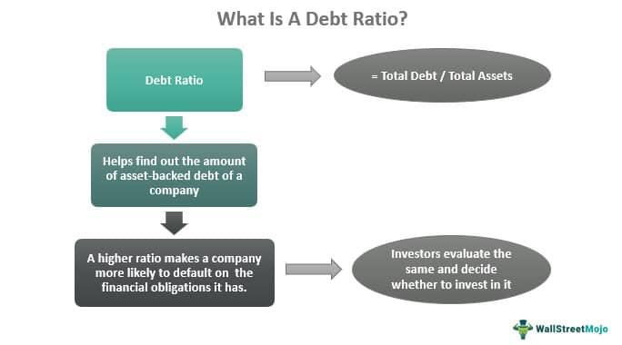

In the financial world, the interplay between debt ratio, credit evaluation, financial health, and algorithmic trading is pivotal for investors and businesses. These elements are fundamental in evaluating a company's financial stability and informing investment decisions.

Debt ratios serve as a measure of a company's financial leverage. By calculating the ratio of a company's total debt to its total assets or equity, investors and analysts can ascertain the degree of leverage a company is employing. This understanding is crucial as it helps gauge the risk of financial distress, particularly in volatile market conditions. A high debt ratio may indicate a greater risk, suggesting that a company might struggle to meet its financial obligations, while a lower ratio could imply a more stable financial foundation.



Credit evaluation plays a critical role in assessing a company's ability to manage its debt. This process involves analyzing credit scores and other financial metrics to determine the likelihood of a company repaying its obligations. Credit evaluations influence a company’s access to financing and the interest rates it is likely to encounter. A favorable credit evaluation reflects positively on a company's financial health, enhancing its investment appeal and supporting growth opportunities.

Algorithmic trading, which involves the use of computer algorithms to execute trades based on predetermined criteria, heavily relies on robust financial health assessments, including debt ratios and credit evaluations. These assessments help develop algorithms that can swiftly react to market conditions and execute trades with precision. In real-time trading environments, understanding a company's financial health provides a tactical advantage, allowing traders to make informed decisions that maximize returns while managing risks effectively.

In summary, the comprehensive assessment of debt ratios, credit evaluations, and financial health plays an integral role in strategic financial management. As algorithmic trading becomes increasingly prevalent, these factors continue to be crucial for crafting informed investment strategies and ensuring successful automated trading outcomes.

## Table of Contents

## Understanding Debt Ratios

Debt ratios are fundamental metrics used to assess a company's financial leverage, providing insight into the proportion of a company's debt relative to its assets or equity. The primary formula used to calculate the debt ratio is:

$$
\text{Debt Ratio} = \frac{\text{Total Liabilities}}{\text{Total Assets}}
$$

A high debt ratio indicates that a significant portion of a company's assets is financed through debt, suggesting higher financial leverage and potentially increased financial risk. Conversely, a lower debt ratio signifies that a company relies less on borrowed funds, implying a more conservative financial strategy.

### Significance of Debt Ratio Levels

The implication of a debt ratio varies significantly across industries and market conditions. In capital-intensive industries, such as utilities or transportation, higher debt ratios might be acceptable due to the steady cash flow and long-term asset-based investments that these sectors typically have. In contrast, high-tech or service-based industries tend to have lower debt ratios because of the volatile nature of their revenue streams and lower initial asset requirements.

Economic conditions also play a crucial role in determining the acceptability of certain debt ratio levels. During periods of economic growth, companies might leverage more debt to finance expansion projects, resulting in higher acceptable debt ratios. Conversely, in economic downturns, lower debt ratios are generally preferable as companies aim to minimize financial risk.

### Usage by Creditors and Investors

Creditors and investors utilize debt ratios to gauge the risk associated with lending to or investing in a company. Creditors look at the debt ratio to determine the likelihood of being repaid, as a high ratio may suggest potential difficulties in meeting debt obligations. Investors use debt ratios to assess financial health and management's effectiveness in using leverage to enhance shareholder value.

For example, a company with a stable and manageable debt ratio might attract more investors, as it signals robust financial health and efficient management of debt levels.

### Acceptable Debt Ratios by Sector

Acceptable debt ratios can vary considerably across different sectors:

- **Utilities**: Ratios in the range of 50% to 70% are often deemed acceptable due to the industry's stable cash flows and asset-backed operations.

- **Manufacturing**: Typically, a debt ratio of 30% to 50% might be considered healthy, reflecting balanced use of debt and equity in financing operations.

- **Tech and Services**: These industries might maintain lower debt ratios, around 10% to 30%, due to the less capital-intensive nature of their businesses and higher potential revenue volatility.

In summary, understanding and evaluating debt ratios offer significant insights into a company's financial leverage and risk profile. These metrics are crucial for stakeholders, including investors, creditors, and company management, as they navigate strategic financial decisions.

## Credit Evaluation and Financial Health

Credit evaluation is a systematic assessment of a company's ability to meet its financial obligations. This process is pivotal in determining the creditworthiness of a business and involves analyzing various financial metrics, historical performance, and qualitative attributes. The primary criteria for credit evaluation include a company's [liquidity](/wiki/liquidity-risk-premium), debt levels, profitability, and business stability, each offering insights into the firm's overall financial health.

Credit scores, numerical expressions based on a level analysis of a company's credit files, significantly influence a company's financing options and the interest rates levied by lenders. Typically, a higher credit score denotes lower risk, thereby granting the company easier access to credit with favorable terms and lower interest rates. Conversely, a lower credit score may restrict a company's access to credit or result in higher interest rates, reflecting increased risk to the lender.

There is a strong relationship between credit evaluations and financial health assessments. A robust credit evaluation often mirrors a company's sound financial health, indicating stability and efficiency in managing debts. Companies with strong financial health typically exhibit favorable credit evaluations, enhancing their capacity to secure investments and funds for expansion. Financial health assessments consider broader metrics, such as cash flow stability, operational efficiency, and asset utilization, which complement credit evaluations by providing a holistic view of the company's financial stability.

Case studies elucidate the influence of credit evaluation on company growth and investment potential. For instance, businesses with exceptional credit ratings often attract more investors due to perceived lower risk, enabling them to raise capital more efficiently. Consider a technology firm with a high credit rating; it can secure low-interest loans to fuel research and development, leading to innovative products and potential market expansion. On the contrary, a manufacturing company with a poor credit rating might face difficulties in securing funds, hindering growth opportunities and limiting its ability to invest in new technologies or infrastructure.

Credit evaluation is a critical component of financial strategy, particularly in tightly interconnected markets where rapid financial decisions can significantly impact a company's trajectory. Understanding the nuances of credit evaluation helps businesses and investors alike gauge potential risks and returns, fostering informed decision-making that drives economic progress.

## Impact of Debt Ratios on Algorithmic Trading

Algorithmic trading, sometimes known as automated or black-box trading, refers to the use of computer algorithms to execute financial trades at speeds and frequencies unattainable by human traders. These algorithms are designed to process vast amounts of financial data, identify trends, and execute trades based on predefined criteria. The efficiency of [algorithmic trading](/wiki/algorithmic-trading) relies heavily on the quality and timeliness of the underlying financial data, including financial health indicators such as debt ratios.

Debt ratios, which measure a company's leverage by comparing its total debt to assets, earnings, or equity, play a significant role in assessing financial health. In algorithmic trading, these ratios provide critical insights into a company’s financial risk and stability. For instance, a high debt ratio may indicate greater financial risk, which could impact a company's stock price [volatility](/wiki/volatility-trading-strategies) and attract traders looking to capitalize on such movements.

Incorporating debt ratios into trading algorithms involves using these metrics to develop models that predict market behavior. For example, an algorithm may be programmed to track companies with a debt ratio that exceeds a certain threshold, indicating potential financial distress. This information can then be used to trigger buy or sell orders, depending on the trading strategy employed.

Traders utilize debt ratios in real-time trading decisions by embedding them into algorithms that continuously monitor market data feeds. For instance, an algorithm could be designed to short-sell stocks of companies with rapidly increasing debt ratios, anticipating a decline in stock value due to deteriorating financial health. Conversely, companies with improving debt ratios may be targeted for acquisition, as these are often indicators of strengthening financial positions.

There are both risks and benefits to incorporating debt ratios into trading algorithms. One potential risk is the reliance on historical financial data, which may not always accurately predict future events, especially in volatile or unpredictable markets. Additionally, algorithms may become less effective if market participants start using similar strategies, weakening the advantage of trading based on debt ratios.

On the other hand, the benefits include the ability to swiftly react to financial reports and adjust trading strategies in real-time, potentially increasing returns by taking advantage of short-term market inefficiencies. Moreover, algorithmic trading that incorporates robust financial health assessments, such as debt ratios, can offer a strategic advantage by enabling more informed decision-making and reducing the emotional biases often associated with manual trading.

In conclusion, the inclusion of debt ratios in algorithmic trading strategies enhances the ability to make data-driven decisions, though it requires a careful balancing of risk management and market analysis to achieve optimal outcomes.

## Strategies for Optimizing Financial Health

To optimize financial health, effectively managing and reducing debt ratios is crucial for ensuring a company's long-term stability and growth. Debt ratios, which measure a company's leverage by comparing its total debt to its total assets or equity, provide key insights into financial risk. Lowering these ratios can mitigate risk and enhance financial flexibility.

A fundamental strategy is maintaining a balance between debt and equity financing. This balance ensures that a company does not overly rely on debt, which could lead to increased financial risk and potential solvency problems during economic downturns. Equity financing, while potentially dilutive to ownership, does not require fixed interest payments, offering more stability and reducing stress on cash flow.

Refinancing existing debt at lower interest rates can substantially decrease interest expenses, thereby improving net income and reducing the debt ratio over time. Additionally, refinancing can extend loan maturities, which improves the company’s liquidity and ability to service debt. For example, a company with a high fixed-rate loan may benefit from refinancing to a lower variable rate if market conditions are favorable.

Cost-cutting measures can also lead to significant improvements in financial health. By analyzing operational efficiencies and reducing unnecessary expenses, companies can increase their profit margins, allowing for accelerated debt repayment. Effective cost management involves scrutinizing both fixed and variable costs to identify savings opportunities without compromising product or service quality.

Revenue enhancement strategies such as diversifying product lines, expanding market reach, and improving sales effectiveness contribute to financial health by increasing cash flows available for debt repayment. Companies should focus on sustainable growth initiatives that align with core competencies and market demands.

Technological tools and analytics are integral for continuous monitoring of financial health. Advanced analytics platforms can provide real-time insights into key financial metrics, facilitating proactive management decisions. For instance, [machine learning](/wiki/machine-learning) algorithms can predict future cash flows and optimize capital structure by dynamically adjusting the balance between debt and equity based on projected financial scenarios.

In Python, financial health monitoring can be facilitated using libraries such as pandas and numpy for data manipulation and analysis, and matplotlib for visualizing trends and making data-driven decisions. Here's a simple example of how one might monitor changes in the debt ratio over time:

```python
import pandas as pd
import matplotlib.pyplot as plt

# Sample data: date, total_debt, and total_assets
data = {
    'date': ['2023-01-01', '2023-04-01', '2023-07-01', '2023-10-01'],
    'total_debt': [500000, 480000, 450000, 420000],
    'total_assets': [1000000, 1050000, 1100000, 1150000]
}

df = pd.DataFrame(data)
df['debt_ratio'] = df['total_debt'] / df['total_assets']

# Plotting the debt ratio over time
plt.plot(df['date'], df['debt_ratio'], marker='o')
plt.title('Debt Ratio Over Time')
plt.xlabel('Date')
plt.ylabel('Debt Ratio')
plt.grid(True)
plt.show()
```

This approach allows companies to maintain ongoing visibility into their financial health, promptly addressing potential issues and capitalizing on opportunities for improvement.

## Conclusion

In strategic financial management, understanding debt ratios, credit evaluation, and overall financial health is crucial for both companies and investors. Debt ratios, calculated as the ratio of a company's total debt to its total assets, serve as a measure of financial leverage and risk. A precise grasp of these ratios allows businesses to assess their leverage levels and investors to gauge the company's stability and risk profile. For example, a higher debt ratio might indicate potential liquidity issues, while an optimal debt ratio suggests balanced financial growth.

Credit evaluation complements this by providing a nuanced view of an entity's creditworthiness. Factors like credit scores influence a company's ability to secure financing at favorable rates, which in turn impacts its financial strategies and growth potential. A company with a high credit score might have more opportunities to attract investments and secure funds at lower interest rates, facilitating expansions and acquisitions that could catalyze growth.

Evaluating financial health through these metrics not only aids in managing current risks but also in formulating future strategies. Companies can make informed decisions on investment, cost management, and financing that align with risk appetites and market dynamics. For instance, algorithmic trading, which relies heavily on financial metrics, can be fine-tuned using insights derived from these evaluations. Investors can optimize strategies by incorporating these indicators into algorithms, enhancing their ability to predict market movements and execute trades advantageously.

Overall, leveraging debt ratios and credit evaluations as part of a broader financial health assessment provides a solid foundation for robust decision-making. It fosters the development of investment strategies that are both informed and adaptive, while simultaneously supporting automated trading systems that capitalize on real-time financial data. As such, understanding and employing these financial insights is indispensable for anyone looking to succeed in modern financial landscapes.

## References & Further Reading

[1]: ["Advances in Financial Machine Learning"](https://www.amazon.com/Advances-Financial-Machine-Learning-Marcos/dp/1119482089) by Marcos Lopez de Prado

[2]: ["Quantitative Risk Management: Concepts, Techniques, and Tools"](http://assets.press.princeton.edu/chapters/c10496.pdf) by Alexander J. McNeil, Rüdiger Frey, and Paul Embrechts

[3]: Damodaran, A. (2012). ["Investment Valuation: Tools and Techniques for Determining the Value of Any Asset, 3rd Edition"](https://books.google.com/books/about/Investment_Valuation.html?id=5SRHAAAAQBAJ). Wiley Finance.

[4]: ["Machine Learning for Algorithmic Trading"](https://github.com/PacktPublishing/Machine-Learning-for-Algorithmic-Trading-Second-Edition) by Stefan Jansen

[5]: ["Credit Risk Analytics: Measurement Techniques, Applications, and Examples in SAS"](https://www.wiley.com/en-us/Credit+Risk+Analytics%3A+Measurement+Techniques%2C+Applications%2C+and+Examples+in+SAS-p-9781119143987) by Bart Baesens, Daniel Roesch, and Harald Scheule