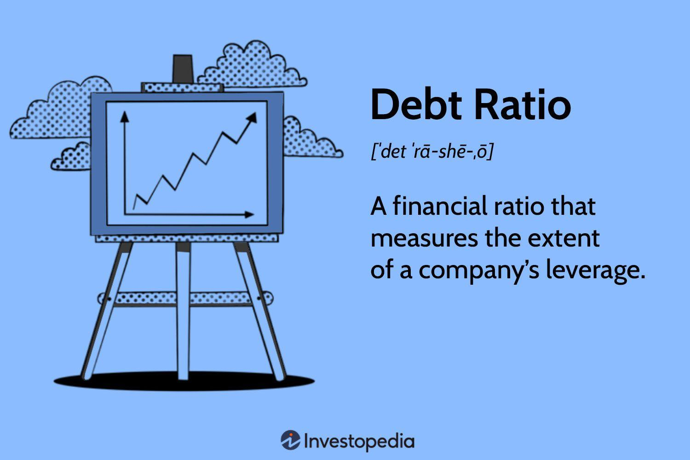

## Table of Contents

## What is the debt ratio in finance?

The debt ratio is a simple way to see how much a company owes compared to what it owns. It is calculated by dividing a company's total debts by its total assets. This gives a number that shows the percentage of a company's assets that are financed by debt. If the debt ratio is high, it means the company has a lot of debt compared to its assets. If it's low, the company has less debt in relation to its assets.

Understanding the debt ratio can help investors and managers make decisions. A high debt ratio might mean the company is riskier because it has to pay back a lot of money. This could be a problem if the company's earnings drop. On the other hand, a low debt ratio might show that the company is more stable and less risky. But, what's considered a good debt ratio can be different for each industry, so it's important to compare it with other companies in the same field.

## How is the debt ratio calculated?

The debt ratio is figured out by dividing a company's total debts by its total assets. This gives a number that shows what part of the company's assets are paid for with borrowed money. If a company has $100,000 in debt and $200,000 in assets, the debt ratio would be $100,000 divided by $200,000, which equals 0.5 or 50%. This means half of the company's assets are financed by debt.

This ratio is important because it tells us how much risk a company is taking on. A higher debt ratio means the company is using more borrowed money to buy its assets, which can be risky if the company struggles to pay back the debt. A lower debt ratio means the company is less reliant on borrowed money, which might make it more stable. But, what counts as a good or bad debt ratio can vary depending on the industry the company is in.

## Why is the debt ratio important for businesses?

The debt ratio is important for businesses because it shows how much of their stuff is paid for with borrowed money. If a business has a high debt ratio, it means they owe a lot compared to what they own. This can be risky because if the business has a tough time, it might struggle to pay back what it owes. On the other hand, a low debt ratio means the business doesn't rely as much on borrowed money, which can make it more stable and less risky.

Knowing the debt ratio helps business owners and investors make smart decisions. For example, if a business wants to borrow more money, a high debt ratio might make lenders nervous because it shows the business already has a lot of debt. Also, investors look at the debt ratio to decide if a business is a good investment. A business with a lower debt ratio might be seen as safer because it has less debt to worry about. But, what's considered a good or bad debt ratio can be different for each type of business, so it's important to compare it with other businesses in the same industry.

## What does a high debt ratio indicate about a company's financial health?

A high debt ratio means that a company has a lot of debt compared to its assets. This can be a sign that the company is taking on a lot of risk. When a company borrows a lot of money, it has to pay it back, and if things go wrong, like if the company doesn't make enough money, it might struggle to make those payments. This could lead to serious problems, like not being able to keep the business running or even going bankrupt.

On the other hand, a high debt ratio isn't always bad. Sometimes, companies borrow money to grow or invest in new projects that could make them more money in the future. If these investments pay off, the company can use the extra money to pay back the debt and end up in a better position. But, it's important for the company to have a good plan for how it will pay back the debt, because if it can't, the high debt ratio could hurt its financial health.

## What does a low debt ratio suggest about a company's financial strategy?

A low debt ratio means that a company isn't using a lot of borrowed money to buy its stuff. This can show that the company is being careful with its money and trying to stay stable. When a company has a low debt ratio, it might be focusing on growing slowly and steadily without taking on too much risk. This can be a good thing because it means the company doesn't have to worry as much about paying back big loans, which can make it more stable and less likely to run into money problems.

However, a low debt ratio might also mean that the company is missing out on chances to grow faster. If a company doesn't borrow money, it might not be able to invest in new projects or expand as quickly as it could if it used debt. So, while a low debt ratio can show that a company is being careful, it might also mean that the company is not taking advantage of opportunities to make more money in the future. It's all about finding the right balance between being safe and growing the business.

## How does the debt ratio differ from the debt-to-equity ratio?

The debt ratio and the debt-to-equity ratio are both ways to look at a company's debt, but they measure it differently. The debt ratio is calculated by dividing a company's total debt by its total assets. This shows what part of the company's stuff is paid for with borrowed money. A high debt ratio means the company has a lot of debt compared to its assets, which can be risky. A low debt ratio means the company doesn't rely as much on borrowed money, which can make it more stable.

On the other hand, the debt-to-equity ratio is calculated by dividing a company's total debt by its total equity. Equity is the value of the company that belongs to the owners or shareholders after all the debts are paid off. This ratio shows how much the company is using debt compared to money from its owners. A high debt-to-equity ratio means the company is using a lot of borrowed money compared to money from its owners, which can also be risky. A low debt-to-equity ratio means the company is relying more on its owners' money than on borrowed money, which can make it more stable.

Both ratios help us understand a company's financial health, but they focus on different things. The debt ratio looks at debt in relation to all the company's assets, while the debt-to-equity ratio looks at debt in relation to the owners' stake in the company. Depending on what you want to know, one ratio might be more useful than the other.

## What are the industry standards for debt ratios, and how do they vary by sector?

Industry standards for debt ratios can be different depending on the type of business. For example, in industries like utilities and telecom, it's common to see higher debt ratios because these companies need a lot of money to build things like power plants or networks. They often borrow money to pay for these big projects. A debt ratio of 0.5 or 50% might be normal for these kinds of companies. On the other hand, in industries like technology or retail, where companies don't need as much money to start up, a lower debt ratio is more common. A debt ratio of 0.2 or 20% might be seen as healthy in these sectors.

It's important to compare a company's debt ratio to others in the same industry because what's considered good or bad can vary a lot. For example, in the manufacturing sector, a debt ratio around 0.4 or 40% might be seen as okay, but in the healthcare sector, a debt ratio of 0.3 or 30% might be more typical. Knowing the industry standard helps investors and managers understand if a company is taking on too much debt or if it's being too cautious. It's all about finding the right balance for the type of business and the risks it faces.

## Can the debt ratio be used to compare companies of different sizes?

The debt ratio can be used to compare companies of different sizes because it's a percentage. It shows how much of a company's stuff is paid for with borrowed money, no matter how big or small the company is. If one company has a debt ratio of 0.5 and another has a debt ratio of 0.3, you can see that the first company is using more debt to buy its stuff, even if one company is much bigger than the other.

However, it's important to be careful when comparing companies of different sizes using the debt ratio. Sometimes, bigger companies might have more access to borrowing money, so their debt ratio might be higher just because they can borrow more easily. Also, smaller companies might not need as much debt to run their business, so their debt ratio might be lower. It's always a good idea to look at other things, like how the company is doing in its industry, to get a full picture of its financial health.

## How does the debt ratio impact a company's ability to secure additional financing?

A company's debt ratio can affect its ability to get more loans or financing. If a company has a high debt ratio, it means it already owes a lot of money compared to what it owns. Lenders might see this as risky because if the company has trouble paying back what it already owes, it might struggle to pay back new loans too. So, a high debt ratio might make it harder for a company to borrow more money, or it might have to pay higher interest rates to convince lenders to take the risk.

On the other hand, a company with a low debt ratio might find it easier to get more financing. A low debt ratio shows that the company isn't relying too much on borrowed money, which can make lenders feel more confident that the company will be able to pay back new loans. This can lead to better loan terms, like lower interest rates, because the company seems less risky to lenders. But, what's considered a good debt ratio can vary by industry, so it's important to compare a company's debt ratio to others in the same field when thinking about its ability to get more financing.

## What are the limitations of using the debt ratio as a sole measure of financial health?

Using the debt ratio by itself to judge a company's financial health can be tricky because it doesn't tell the whole story. The debt ratio only looks at how much of a company's stuff is paid for with borrowed money, but it doesn't show if the company can actually pay back that debt. For example, a company might have a high debt ratio but also be making a lot of money, which means it can handle its debt well. On the other hand, a company with a low debt ratio might not be making enough money to grow or even keep going.

Also, the debt ratio doesn't take into account other important things like how fast a company is growing, how much money it's making, or how well it's managing its money. Different industries have different normal debt ratios, so what's okay for one company might be too high or too low for another. For example, a tech startup might have a low debt ratio because it's new and doesn't need a lot of money yet, but a big utility company might have a high debt ratio because it needs a lot of money to build things like power plants. So, it's important to look at other numbers and details to really understand a company's financial health.

## How do changes in economic conditions affect the interpretation of a company's debt ratio?

Changes in economic conditions can make a big difference in how we look at a company's debt ratio. When the economy is doing well, companies might find it easier to pay back their debts because they're making more money. So, a high debt ratio might not seem as risky because the company has a good chance of paying it back. But, if the economy is struggling, a high debt ratio can be more worrying. Companies might not be making as much money, so it could be harder for them to pay back what they owe. This means that the same debt ratio can be seen as less risky or more risky depending on what's going on with the economy.

Also, interest rates can change how we think about a company's debt ratio. If interest rates go up, it costs more for companies to borrow money, and this can make a high debt ratio look riskier. Companies might have to pay more to keep their loans, which can be tough if they're not making a lot of money. On the other hand, if interest rates are low, borrowing money is cheaper, so a high debt ratio might not seem as scary. It's important to think about these economic changes when looking at a company's debt ratio to get a full picture of its financial health.

## What advanced analytical techniques can be used to enhance the insights gained from the debt ratio?

To get a better understanding of a company's financial health beyond just looking at its debt ratio, you can use a method called ratio analysis. This involves looking at other important numbers like the interest coverage ratio, which shows if a company is making enough money to pay the interest on its debt. Another useful ratio is the debt service coverage ratio, which tells us if the company has enough money to pay back both the interest and the principal on its debt. By comparing these ratios with the debt ratio, you can see if a high debt ratio is a problem or if the company can handle it because it's making enough money.

Another advanced technique is trend analysis, where you look at how the debt ratio changes over time. This can help you see if the company is getting better or worse at managing its debt. For example, if the debt ratio is going down, it might mean the company is paying off its debt or growing its assets. On the other hand, if the debt ratio is going up, it could be a sign that the company is borrowing more money or not growing its assets as fast as its debt. By looking at these trends, you can get a better idea of where the company is heading and if its debt management is improving or getting worse.

## What is the understanding of Debt Ratio?

The debt ratio is a financial metric that evaluates the proportion of a company's total debt relative to its total assets. It is a key indicator used by analysts and investors to assess a company's financial leverage and overall financial health. The debt ratio formula is:

$$
\text{Debt Ratio} = \frac{\text{Total Debt}}{\text{Total Assets}}
$$

A high debt ratio indicates a greater degree of leverage, suggesting that a significant portion of a company's assets is financed by debt. This might imply financial risk if the company is unable to meet its debt obligations, especially in economic downturns. Conversely, a low debt ratio suggests that a company relies less on borrowing and more on equity financing, pointing towards lower financial risk.

### Examples of Varying Debt Ratios

Different companies exhibit varying debt ratios based on their industry, business model, and financial strategy. For example, utility companies often have higher debt ratios, sometimes exceeding 50%, due to the capital-intensive nature of their industry and the predictable cash flows that support debt servicing. In contrast, technology companies might maintain lower debt ratios, often below 30%, as they emphasize innovation and flexibility over capital expenditure.

### Industry-Specific Norms

Debt ratio norms vary significantly across industries. Industries like utilities and real estate generally accept higher debt ratios due to stable cash flows and tangible assets that can be leveraged. Conversely, industries with rapid change and instability, such as technology and biotechnology, usually aim for lower debt ratios to minimize the risks associated with high leverage.

Understanding the context in which a debt ratio exists is crucial. A high debt ratio in one industry might be standard practice, while in another, it could signal financial distress. Thus, industry benchmarks and norms play a vital role in interpreting this financial metric accurately.

## What is the role of financial metrics in evaluating company performance?

Financial metrics are vital tools for evaluating a company's performance and stability, providing quantitative measurements that inform stakeholders about various aspects of a company’s financial health. These metrics enable analysts, investors, and managers to assess both short-term performance and long-term financial strategies.

### Debt Ratio and its Context

The debt ratio is a key financial metric, calculated as the ratio of a company’s total debt to its total assets. This metric is instrumental in assessing a company’s leverage and financial leverage risk. A higher debt ratio suggests greater leverage, meaning more of the company’s assets are financed by debt. Conversely, a lower debt ratio implies that a company is less reliant on borrowed funds, potentially indicating a more stable financial position. However, the ideal debt ratio varies across industries due to differing capital structures and business models. For instance, utility companies may have higher debt ratios due to the capital-intensive nature of their operations, whereas tech firms might operate effectively with lower debt ratios due to less reliance on tangible assets.

### Broader Financial Metrics

The debt ratio fits into a larger framework of financial metrics used by analysts to analyze company performance. Two important ratios in this framework are the equity ratio and the [liquidity](/wiki/liquidity-risk-premium) ratio.

The **equity ratio** is defined as:

$$
\text{Equity Ratio} = \frac{\text{Total Equity}}{\text{Total Assets}}
$$

This ratio reflects the proportion of a company's assets financed by shareholder equity. A high equity ratio often suggests a strong financial foundation, with a larger cushion to absorb potential losses.

The **liquidity ratio**, such as the current ratio, evaluates a company’s ability to cover its short-term liabilities with short-term assets. The current ratio is calculated as:

$$
\text{Current Ratio} = \frac{\text{Current Assets}}{\text{Current Liabilities}}
$$

A higher current ratio indicates better liquidity and a stronger ability to meet short-term obligations.

### Insights from Financial Ratios

These ratios collectively provide insights into a company's financial structure, profitability, and risk profile. By examining these metrics, analysts can ascertain:

- **Financial Structure:** The balance between debt and equity financing, which impacts financial flexibility and risk exposure.
- **Profitability:** Metrics like Return on Equity (ROE) and Return on Assets (ROA) further complement the understanding of how effectively a company generates income relative to its equity and asset base.
- **Risk:** While debt offers the potential for higher returns, excessive leverage increases financial risk, particularly in volatile economic conditions.

### Impact on Investment Decisions

The insights derived from these financial ratios significantly influence investment decisions. Investors use these metrics to evaluate a company’s attractiveness by assessing its financial health and comparing it to industry peers. High leverage may deter risk-averse investors but attract those seeking higher returns. Conversely, strong liquidity and favorable profit margins can be attractive to a broad range of investors, demonstrating the company’s capacity to sustain operations and deliver value.

Overall, financial metrics serve as a crucial foundation for making informed, strategic investment decisions, guiding stakeholders in their evaluation of company performance, potential growth, and risk management strategies.

## References & Further Reading

[1]: Brunnermeier, M.K., & Pedersen, L.H. (2009). ["Market Liquidity and Funding Liquidity."](https://www.jstor.org/stable/30225714) The Review of Financial Studies, 22(6), 2201–2238.

[2]: Durand, D., & Lintner, J. (1946). ["Cost of debt and equity funds for business: Trends and problems of measurement."](https://www.semanticscholar.org/paper/Costs-of-Debt-and-Equity-Funds-for-Business%3A-Trends-Durand/18b88996632684e65d4ad7d8a4a5596bb30c466f) Conference on Research in Business Finance.

[3]: Lopez de Prado, M. (2018). ["Advances in Financial Machine Learning."](https://www.amazon.com/Advances-Financial-Machine-Learning-Marcos/dp/1119482089) Wiley.

[4]: Derman, E. (2002). ["The Practice of Risk Management."](https://catalogimages.wiley.com/images/db/pdf/9780470977613.excerpt.pdf) Wiley.

[5]: Jansen, S. (2018). ["Machine Learning for Algorithmic Trading."](https://searchworks.stanford.edu/view/13246850) Packt Publishing.

[6]: Chan, E.P. (2009). ["Quantitative Trading: How to Build Your Own Algorithmic Trading Business."](https://github.com/ftvision/quant_trading_echan_book) Wiley.

[7]: Aronson, D.R. (2007). ["Evidence-Based Technical Analysis: Applying the Scientific Method and Statistical Inference to Trading Signals."](https://www.amazon.com/Evidence-Based-Technical-Analysis-Scientific-Statistical/dp/0470008741) Wiley.