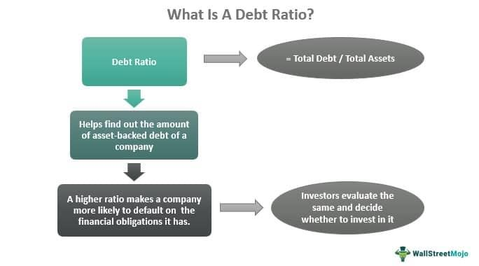

In finance, two fundamental metrics, the debt ratio and the leverage ratio, are instrumental in assessing financial health. The debt ratio measures the proportion of a company's assets financed by debt, providing insight into its leverage level. It is calculated as:

$$
\text{Debt Ratio} = \frac{\text{Total Liabilities}}{\text{Total Assets}}
$$



A higher debt ratio may indicate a higher degree of leverage, suggesting potential financial instability or increased risk of insolvency. However, industries vary in their typical debt ratios, with capital-intensive sectors often operating with higher leverage due to their nature.

The leverage ratio, particularly the debt-to-equity ratio, offers insights into the balance between a company's use of debt and equity to finance its operations. It is defined as:

$$
\text{Debt-to-Equity Ratio} = \frac{\text{Total Debt}}{\text{Total Equity}}
$$

High leverage ratios can magnify both potential returns and risks, serving as a double-edged sword in financial decision-making. These ratios are crucial for evaluating a company's financial stability and risk profile.

The significance of these metrics is further amplified with the rise of algorithmic trading, which involves using automated systems to execute trades based on predefined strategies. Understanding debt and leverage ratios is essential for traders and investors within this field, as it helps in crafting strategies that manage risk exposure effectively. By incorporating these financial metrics, algorithmic trading can optimize capital deployment and enhance decision-making, ensuring investors achieve a well-balanced risk and reward outcome.

## Table of Contents

## Understanding Debt Ratio

Debt ratio is a financial metric that quantifies the proportion of a company's assets that is financed through debt. It is calculated by dividing a company's total liabilities by its total assets. The formula for the debt ratio is:

$$
\text{Debt Ratio} = \frac{\text{Total Liabilities}}{\text{Total Assets}}
$$

This ratio provides insight into a company's financial structure and its capacity to meet long-term obligations. A higher debt ratio suggests that a company has a larger proportion of its assets financed by debt, which could signal potential over-leverage. Over-leverage increases the risk of insolvency, as the company might struggle to meet its debt obligations in adverse economic conditions or if its revenue streams are disrupted.

Debt ratios vary significantly across industries; some sectors inherently operate with higher leverage due to their capital-intensive nature. For instance, industries like utilities, telecommunications, and transportation often have substantial infrastructure investments, resulting in higher debt levels compared to sectors such as technology or pharmaceuticals, where less capital expenditure is required. These capital-intensive industries can sustain higher debt ratios because they typically have stable and predictable cash flows that assure creditors of consistent debt repayment.

Understanding these industry-specific variations is crucial for investors and financial analysts when interpreting debt ratios. A high debt ratio in a sector accustomed to using more leverage may not be as concerning as it would be in a sector that typically carries less debt. Consequently, when evaluating a company's financial health, it is important to compare its debt ratio with industry standards to assess whether its leverage level is manageable or indicative of financial distress.

## Leverage Ratio Explained

The leverage ratio, most notably the debt-to-equity (D/E) ratio, is a significant indicator of how a company finances its operations through debt compared to equity. Calculated as:

$$
\text{Debt-to-Equity Ratio} = \frac{\text{Total Liabilities}}{\text{Shareholders' Equity}}
$$

this ratio provides insights into the balance between a company's use of debt and equity. A higher ratio may suggest that a company is more reliant on debt, which can lead to amplified returns on equity due to the tax advantages of debt financing. However, it also heightens financial risk, as obligations to creditors must be met, regardless of the company's financial state.

In the context of [algorithmic trading](/wiki/algorithmic-trading) and fintech, leverage ratios are pivotal. They assist in crafting strategies that balance risk and reward. For instance, algorithms may use leverage ratios to determine optimal position sizing and risk management frameworks. This quantitative approach ensures that trading strategies are within acceptable risk parameters, optimizing both capital allocation and return potential. By integrating such financial metrics, traders can make informed decisions, enhancing their overall strategy efficiency and robustness against market [volatility](/wiki/volatility-trading-strategies).

## Importance of Financial Metrics in Algorithmic Trading

Algorithmic trading, an increasingly prominent facet of modern financial markets, predominantly relies on quantitative metrics to drive decision-making processes and trade execution. Among these metrics, debt and leverage ratios hold particular importance as they enable a comprehensive evaluation of trading risks associated with different companies or sectors.

Debt and leverage ratios aid in determining the financial stability of the entities involved by assessing their risk profiles. The debt ratio, defined as the total liabilities over total assets, reveals the proportion of a company's assets financed by debt, providing insights into its financial leverage and potential vulnerability to adverse economic conditions. Simultaneously, leverage ratios, such as the debt-to-equity ratio, offer valuable information regarding the balance between debt financing and equity, highlighting potential risks and returns.

In the context of algorithmic trading, these ratios are critical for optimizing capital allocation and minimizing exposure to unfavorable market movements. Algorithms can dynamically adjust trading strategies based on real-time data on these ratios. For instance, a company with an elevated debt ratio might signal higher risk, prompting algorithms to reduce position sizes or avoid trades altogether. Conversely, favorable ratios might encourage increased investment.

Incorporating financial metrics such as debt and leverage ratios into algorithmic models significantly enhances trading efficiency and accuracy. These metrics enable algorithms to make informed decisions by factoring in the financial health of asset classes, thereby facilitating better risk management. This application not only improves the precision of trading strategies but also ensures that capital is allocated to opportunities with the most favorable risk-return profiles.

The integration of financial ratios in algorithmic trading systems is often supported by advanced technologies, including [machine learning](/wiki/machine-learning) and [artificial intelligence](/wiki/ai-artificial-intelligence). Python, a popular programming language in algorithmic trading, offers libraries and tools that allow traders and financial analysts to incorporate these metrics seamlessly. Here's an example of how Python can be used to calculate a debt ratio:

```python
def calculate_debt_ratio(total_liabilities, total_assets):
    if total_assets == 0:
        raise ValueError("Total assets cannot be zero.")
    return total_liabilities / total_assets

# Example usage
total_liabilities = 500000
total_assets = 1000000

debt_ratio = calculate_debt_ratio(total_liabilities, total_assets)
print(f"Debt Ratio: {debt_ratio:.2f}")
```

Ultimately, leveraging these financial metrics empowers trading algorithms to adapt to new market information efficiently, ensuring a higher level of precision in executing trades under varying market conditions. This capability is indispensable for both high-frequency traders and long-term investors aiming for optimized investment outcomes.

## How Financial Ratios Affect Trading Strategies

Financial ratios play a crucial role in shaping trading strategies by providing insights into a company's financial health, which in turn influences market conditions. By evaluating ratios such as the debt ratio and leverage ratio, traders can make informed decisions about leverage levels and risk management. 

The debt ratio, calculated as the total liabilities divided by total assets, offers a snapshot of a company's financial leverage. A high debt ratio may signal a higher risk of insolvency, while a lower ratio may indicate stronger financial stability. Traders consider these implications when deciding on leverage levels, aiming to minimize exposure to companies with excessive debt that could impact their stock prices adversely.

Leverage ratio, often expressed as the debt-to-equity ratio, gives further insight into how a company finances its operations. It is computed as:

$$
\text{Debt-to-Equity Ratio} = \frac{\text{Total Debt}}{\text{Total Equity}}
$$

A higher leverage ratio suggests that a company relies more on debt than equity to finance its activities, potentially increasing its risk profile. For traders, high leverage ratios can signal both increased risk and the opportunity for amplified returns. The challenge lies in balancing these risks and rewards by strategically adjusting leverage in trading portfolios. Effective management of the leverage ratio can optimize the risk-return profile, potentially enhancing returns while limiting volatility.

Algorithmic trading systems incorporate these financial ratios to refine trading strategies. By continuously analyzing and reacting to changes in these ratios, algorithms can dynamically adjust their strategies in response to market conditions. For instance, an increase in a company's debt ratio might prompt a reduction in exposure to that company's stock, thereby limiting potential losses.

Python code can automate the evaluation of such ratios, assisting traders in making real-time decisions. An example code snippet to calculate and assess these ratios might look like:

```python
def calculate_ratios(total_assets, total_liabilities, total_debt, total_equity):
    debt_ratio = total_liabilities / total_assets
    leverage_ratio = total_debt / total_equity
    return debt_ratio, leverage_ratio

# Example data
total_assets = 1000000
total_liabilities = 400000
total_debt = 300000
total_equity = 200000

debt_ratio, leverage_ratio = calculate_ratios(total_assets, total_liabilities, total_debt, total_equity)
print(f'Debt Ratio: {debt_ratio:.2f}')
print(f'Leverage Ratio: {leverage_ratio:.2f}')
```

Understanding these financial ratios enables traders to craft strategies that maximize returns while carefully controlling risk exposure. By maintaining a delicate balance between potential gains and losses, traders can effectively navigate financial markets and optimize their overall performance.

## Conclusion

Debt and leverage ratios are indispensable tools in finance, providing critical insights into a company's risk and health. These ratios inform key aspects of financial analysis by quantifying the extent to which a company is using borrowed funds to finance its operations. Understanding these financial metrics becomes crucial for optimizing strategies, especially in algorithmic trading, where precise risk management is essential. 

Algorithmic trading relies on these metrics to guide strategy development, aiming to optimize performance while minimizing exposure to adverse financial events. By integrating debt and leverage ratios, algorithms can dynamically adjust trading decisions, thereby enhancing capital efficiency and accuracy in risk assessment. This allows for better allocation of financial resources, ensuring that trading models remain both responsive and resilient to changes in market conditions.

A comprehensive understanding of debt and leverage ratios is vital for investors, traders, and financial institutions. Such knowledge facilitates informed decision-making, leading to improved financial outcomes and enhanced risk management. By accurately interpreting these ratios, financial professionals can create robust strategies that balance the potential returns against the associated risks of leveraging, ultimately contributing to sustainable financial health and performance.

## References & Further Reading

[1]: ["Corporate Financing and Governance in Japan: The Road to the Future"](https://mitpress.mit.edu/9780262582483/corporate-financing-and-governance-in-japan/) by Takeo Hoshi and Anil K. Kashyap

[2]: Modigliani, F., & Miller, M. H. (1958). ["The Cost of Capital, Corporation Finance and the Theory of Investment."](https://www.jstor.org/stable/1812919) The Quarterly Journal of Economics, 68(3), 261-297.

[3]: Damodaran, A. (2012). ["Investment Valuation: Tools and Techniques for Determining the Value of Any Asset."](https://www.wiley.com/en-us/Investment+Valuation%3A+Tools+and+Techniques+for+Determining+the+Value+of+Any+Asset%2C+3rd+Edition-p-9781118011522) Wiley Finance.

[4]: ["The Handbook of Financial Instruments"](https://www.wiley.com/en-us/The+Handbook+of+Financial+Instruments-p-9781119522966) by Frank J. Fabozzi

[5]: Adelman, B. J. (2001). ["Algorithmic Trading: Winning Strategies and Their Rationale."](https://play.google.com/store/books/details/Algorithmic_Trading_Winning_Strategies_and_Their_R?id=CIwCTVqEj4oC&hl=en-US)