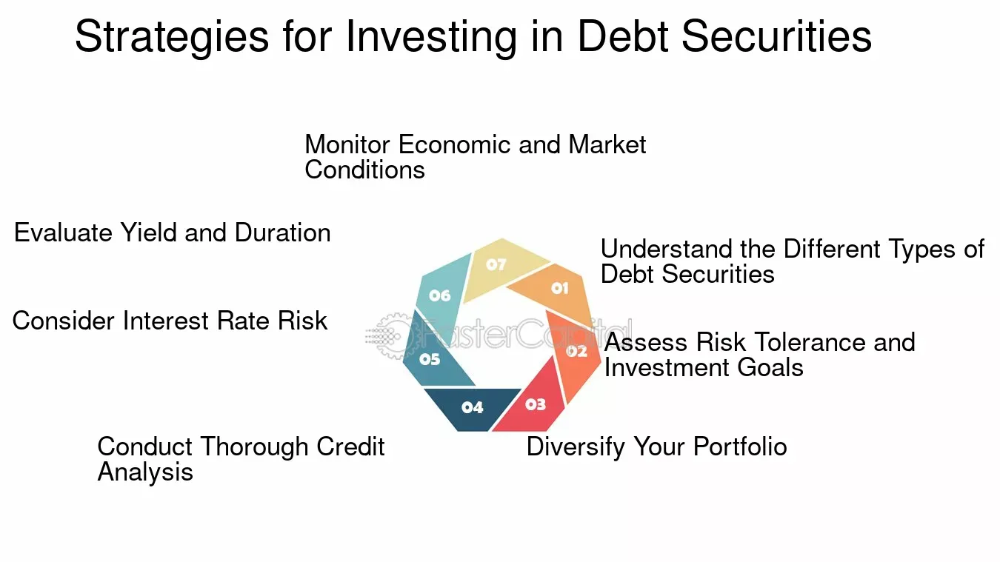

## Table of Contents

## What is a debt security?

A debt security is a type of investment where you lend money to a company or government. In return, they promise to pay you back the money you lent them, plus some extra money called interest. It's like when you lend money to a friend and they agree to pay you back with a little more as a thank you.

Debt securities can be things like bonds or treasury notes. They are considered safer than other types of investments because you know you'll get your money back as long as the borrower doesn't go bankrupt. But, the interest you earn might be less than what you could make from riskier investments.

## How do debt securities differ from equity securities?

Debt securities and equity securities are two different ways to invest your money. A debt security is like lending money to a company or government. They promise to pay you back with interest over time. It's safer because you know you'll get your money back as long as they don't go bankrupt. But, the interest you earn might be less than what you could make from other investments.

On the other hand, an equity security means you own a piece of a company. This is usually in the form of stocks. When you own stocks, you can make money if the company does well and the value of the stock goes up. But, if the company doesn't do well, the value of your stock can go down, and you could lose money. Equity securities can be riskier, but they also have the potential for higher rewards.

In simple terms, debt securities are like loans with interest, while equity securities are like owning a part of a business. Debt securities offer more stability and predictable returns, while equity securities offer the chance for bigger gains but with more risk.

## What are the main types of debt securities?

Debt securities come in different forms, but the main ones are bonds, treasury securities, and corporate bonds. Bonds are like IOUs where you lend money to a company or government, and they promise to pay you back with interest over time. Treasury securities are special bonds issued by the government, like treasury bills, notes, and bonds. They are seen as very safe because the government is less likely to go bankrupt.

Corporate bonds are issued by companies to raise money. They can be riskier than government bonds because a company might have a harder time paying back the money if it runs into financial trouble. But, to make up for the higher risk, corporate bonds often offer higher interest rates. So, when you invest in debt securities, you have to think about how safe the investment is and how much interest you might earn.

## What are government bonds and how do they work?

Government bonds are a type of debt security where you lend money to the government. They promise to pay you back with interest over time. These bonds are seen as very safe because the government is less likely to go bankrupt compared to a company. When you buy a government bond, you're basically helping the government raise money to pay for things like roads, schools, and other public projects.

When you buy a government bond, you get regular interest payments until the bond matures. The maturity date is when the government pays you back the full amount you lent them. The [interest rate](/wiki/interest-rate-trading-strategies) on government bonds is usually lower than what you might get from riskier investments, but it's more predictable. So, if you want a safe place to put your money and get steady returns, government bonds can be a good choice.

## What are corporate bonds and what are their characteristics?

Corporate bonds are a type of debt security where you lend money to a company. The company promises to pay you back with interest over time. These bonds can be riskier than government bonds because a company might have a harder time paying back the money if it runs into financial trouble. But, to make up for the higher risk, corporate bonds often offer higher interest rates than government bonds. This means you can earn more money if you're willing to take on more risk.

When you buy a corporate bond, you receive regular interest payments until the bond matures. The maturity date is when the company pays you back the full amount you lent them. The interest rate on corporate bonds depends on things like how healthy the company is and how long you're willing to lend them the money. If you think the company is likely to do well, you might be comfortable with the risk and see corporate bonds as a good way to earn more interest than you would from safer investments.

## What are municipal bonds and what makes them unique?

Municipal bonds, or "munis," are debt securities issued by local governments like cities, counties, or states. They are used to raise money for public projects like building schools, roads, or hospitals. When you buy a municipal bond, you're lending money to the local government, and they promise to pay you back with interest over time. These bonds can be a good choice if you want to help your community and get some interest on your money.

What makes municipal bonds unique is that the interest you earn from them is often tax-free. This means you don't have to pay federal taxes on the interest, and sometimes you don't have to pay state or local taxes either. This can make municipal bonds more attractive than other types of bonds, especially if you're in a high tax bracket. But, like all investments, they come with some risk. If the local government runs into financial trouble, it might have a hard time paying you back. So, it's important to look at the financial health of the local government before you invest.

## How can someone invest in debt securities?

Investing in debt securities is pretty straightforward. You can buy them through a broker or directly from the issuer. If you want to buy government bonds, you can do it through the U.S. Department of the Treasury's website. For corporate or municipal bonds, you'll usually need to go through a broker or a financial institution. They can help you find the right bonds and handle the buying process for you.

Once you've bought a debt security, you'll start getting interest payments. These payments can come monthly, quarterly, or annually, depending on the bond. You'll keep getting these payments until the bond matures, which is when you get your original investment back. It's a good idea to think about how long you want to invest your money and how much risk you're okay with before you buy any debt securities.

## What are the risks associated with investing in debt securities?

Investing in debt securities comes with some risks. One big risk is that the issuer might not be able to pay you back. This can happen if a company goes bankrupt or if a government runs into financial trouble. When this happens, you might not get all your money back, or you might get it back late. This risk is higher with corporate bonds than with government bonds, but it's still something to think about.

Another risk is that interest rates might change. If interest rates go up after you buy a bond, the value of your bond can go down. This is because new bonds will be issued with higher interest rates, making your bond less attractive to other investors. If you need to sell your bond before it matures, you might have to sell it for less than what you paid for it. This is called interest rate risk, and it's something to keep in mind, especially if you might need your money back before the bond matures.

Lastly, there's inflation risk. Over time, the value of money can go down because of inflation. If the interest rate on your bond is lower than the rate of inflation, the real value of the money you get back will be less than what you started with. This means you might not be able to buy as much with your money as you could when you first invested. So, it's important to think about how inflation might affect the value of your investment in debt securities.

## How do interest rates affect the value of debt securities?

Interest rates can change the value of debt securities in a big way. When interest rates go up, the value of existing bonds goes down. This is because new bonds that are issued will have higher interest rates, making your old bond less attractive to other investors. If you need to sell your bond before it matures, you might have to sell it for less than what you paid for it. This is called interest rate risk, and it's something to think about if you might need your money back before the bond matures.

On the other hand, when interest rates go down, the value of your existing bonds can go up. This is because your bond is now paying a higher interest rate than new bonds being issued. If you want to sell your bond, other investors might be willing to pay more for it because it offers a better return than what they can get from new bonds. So, keeping an eye on interest rates can help you understand how the value of your debt securities might change over time.

## What is the yield to maturity and how is it calculated for debt securities?

Yield to maturity (YTM) is a way to figure out the total return you can expect from a debt security if you hold it until it matures. It takes into account the bond's current market price, its face value, the interest payments you'll get, and how long you have to wait until the bond matures. YTM is like a yearly rate that shows you how much you'll earn from the bond over time, including both the interest payments and any gain or loss if you bought the bond at a price different from its face value.

To calculate YTM, you need to use a formula that can be a bit tricky. You start with the bond's current market price, the face value (the amount you'll get back when the bond matures), the annual interest payments, and the number of years until the bond matures. Then, you solve for the interest rate that makes the present value of all future cash flows (interest payments and the face value at maturity) equal to the bond's current market price. This rate is the yield to maturity. There are also online calculators and financial software that can do this math for you, making it easier to find out the YTM for any bond you're thinking about buying.

## What strategies can be used to manage a portfolio of debt securities?

Managing a portfolio of debt securities involves keeping an eye on interest rates and diversifying your investments. Interest rates can change the value of your bonds, so it's smart to think about how long you want to hold onto your bonds. If you think interest rates might go up, you might want to stick with shorter-term bonds. These are less affected by interest rate changes and give you the chance to reinvest at higher rates sooner. On the other hand, if you think rates will stay the same or go down, longer-term bonds can offer higher interest payments and more stability.

Diversification is another key strategy. By spreading your money across different types of debt securities, like government bonds, corporate bonds, and municipal bonds, you can lower your risk. If one type of bond doesn't do well, the others might help balance things out. It's also a good idea to mix bonds with different maturity dates. This way, you won't have all your money tied up in bonds that mature at the same time, which can help you manage your cash flow and reinvest at different times.

## How do credit ratings impact the investment decisions in debt securities?

Credit ratings are important when you're thinking about investing in debt securities. They tell you how likely it is that the company or government you're lending money to will pay you back. Agencies like Moody's, Standard & Poor's, and Fitch give out these ratings. A high credit rating means the issuer is seen as safe and likely to pay you back. A low credit rating means there's more risk that they might not be able to pay you back. So, if you see a bond with a high credit rating, you might feel more comfortable investing in it because it's less risky.

But, bonds with lower credit ratings often offer higher interest rates to make up for the extra risk. This can be tempting if you're looking to earn more money from your investment. You just have to decide if the higher potential reward is worth the higher risk. It's all about balancing how much risk you're okay with and how much return you're hoping to get. Credit ratings help you make that decision by giving you a clear idea of how safe your investment might be.

## What are the considerations for investment in debt securities?

Debt securities, which include bonds and debentures, constitute a foundational component of both corporate finance and personal investment strategies. These securities are categorized under fixed-income instruments, known for their promise to return the principal amount alongside agreed-upon interest. This characteristic distinguishes them from equity investments, as they generally present lower risk profiles.

One of the primary reasons investors are drawn to debt securities is their capacity to generate stable cash flows, which is particularly advantageous during periods of market [volatility](/wiki/volatility-trading-strategies). The predictable nature of these cash flows allows investors to plan their financial strategies with greater certainty.

A critical aspect of investing in debt securities is the assessment of credit risk. Credit risk refers to the possibility that the issuer of the debt security may default on its obligations, leading to a potential loss for the investor. Evaluating this risk necessitates a thorough analysis of the issuer’s financial health and the terms of the security. Key to this evaluation are metrics such as yield, maturity, and credit rating.

1. **Yield**: This is the return that an investor can expect to earn from a debt security. The yield is often expressed as a percentage of the investment and can be calculated using the formula:
$$
   \text{Yield} = \frac{\text{Annual Coupon Payment}}{\text{Current Market Price}}

$$

   Yield is inversely related to the price of the bond; as price falls, yield increases and vice versa. Understanding yield is essential for comparing the potential returns of different debt instruments.

2. **Maturity**: This refers to the length of time until the principal amount of the debt security is to be paid back. Maturity affects the interest rate risk and the overall duration of the investment. Longer maturity periods generally involve higher risk due to potential changes in interest rates over time, but they can also offer higher yields to compensate for this risk.

3. **Credit Rating**: Agencies such as Moody's, Standard & Poor's, and Fitch provide credit ratings that assess the creditworthiness of debt securities. These ratings range from high-grade (indicating a low risk of default) to junk status (indicating a high risk of default). Investors typically seek higher-rated securities to minimize risk, although these tend to offer lower yields compared to lower-rated, higher-risk instruments.

By analyzing these metrics, investors can make informed decisions about which debt securities to include in their portfolios, aligning their choices with their risk tolerance and financial objectives.

 to Algorithmic Trading

Algorithmic trading, commonly referred to as 'algo trading,' is an advanced trading method where sophisticated mathematical models and pre-programmed algorithms are employed to execute trades at optimal times. This innovative approach leverages computer systems to make trading decisions at speeds and frequencies far exceeding human capabilities, offering the potential to enhance returns. 

The core advantage of [algorithmic trading](/wiki/algorithmic-trading) lies in its ability to process vast amounts of data quickly, identifying trading opportunities that may not be apparent through manual analysis. For example, in a matter of milliseconds, an algorithm can assess multiple market indicators, historical data patterns, and even news events to determine the best [course](/wiki/best-algorithmic-trading-courses) of action for executing trades. 

Algorithms operate by following a set of predefined instructions, which can be as simple as executing a trade when a stock hits a particular price or as complex as employing [machine learning](/wiki/machine-learning) models to predict future market movements. Key strategies employed in algorithmic trading include statistical [arbitrage](/wiki/arbitrage), where traders exploit price discrepancies in different markets or instruments; [trend following](/wiki/trend-following), where algorithms capitalize on upward or downward shifts in market prices; and [market making](/wiki/market-making), a strategy that seeks to profit from the bid-ask spread.

A notable transformation in algorithmic trading has been driven by advancements in [artificial intelligence](/wiki/ai-artificial-intelligence) (AI) and machine learning. These technologies empower trading algorithms to learn from historical data, improve their predictions over time, and adapt to changing market conditions. Consequently, algo trading systems are becoming more autonomous and intelligent, further optimizing trading outcomes and strategies.

However, despite its potential benefits, algorithmic trading is not without risks. The speed and [volume](/wiki/volume-trading-strategy) of trades executed by algorithms can contribute to market volatility and systemic risks, as evidenced by events such as the 'Flash Crash' of 2010. As such, while algorithmic trading has become a cornerstone for institutional investors aiming to manage large trade volumes efficiently, it also demands robust risk management frameworks and regulatory oversight to ensure market stability.

## References & Further Reading

[1]: ["Advances in Financial Machine Learning"](https://www.amazon.com/Advances-Financial-Machine-Learning-Marcos/dp/1119482089) by Marcos Lopez de Prado

[2]: ["Quantitative Trading: How to Build Your Own Algorithmic Trading Business"](https://www.amazon.com/Quantitative-Trading-Build-Algorithmic-Business/dp/1119800064) by Ernest P. Chan

[3]: ["Machine Learning for Asset Managers"](https://github.com/emoen/Machine-Learning-for-Asset-Managers) by Marcos Lopez de Prado

[4]: Gomber, P., Arndt, B., Lutat, M., & Uhle, T. (2011). ["High-Frequency Trading."](https://papers.ssrn.com/sol3/papers.cfm?abstract_id=1858626) University of Virginia Law School Working Paper Series.

[5]: Aldridge, I. (2013). ["High-Frequency Trading: A Practical Guide to Algorithmic Strategies and Trading Systems."](https://www.ahmetbeyefendi.com/wp-content/uploads/2020/07/High-Frequency-Trading-Irene-Aldridge.pdf) Wiley Trading.

[6]: ["Fixed Income Securities: Tools for Today's Markets"](https://www.amazon.com/Fixed-Income-Securities-Markets-Finance/dp/1119835550) by Bruce Tuckman and Angel Serrat

[7]: Biais, B., Foucault, T., & Moinas, S. (2015). ["Equilibrium Fast Trading."](https://www.sciencedirect.com/science/article/pii/S0304405X15000288) Journal of Financial Economics, 116(2).