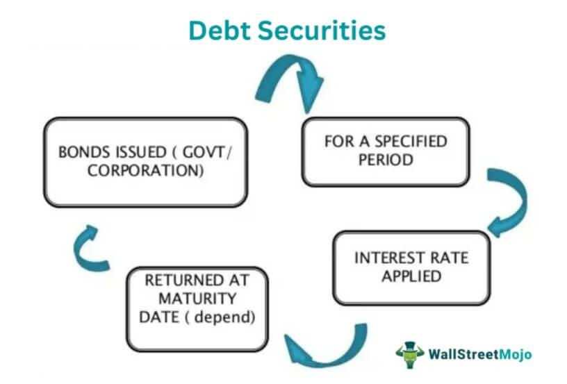

In the ever-evolving landscape of finance, understanding the different modes of investment is vital for investors and financial analysts alike. Financial instruments serve as fundamental tools that facilitate a wide array of investment opportunities. Among these instruments, debt securities like bonds and debentures are integral for both corporate and personal investment strategies due to their fixed-income nature. Alongside these traditional investment vehicles, the burgeoning field of algorithmic trading is transforming how trades are executed in financial markets.

Investment in debt securities holds significant importance as they typically offer more stable returns compared to equities. They promise the return of principal along with pre-agreed interest payments, rendering them relatively lower risk investments. This characteristic makes them especially appealing amid volatile market conditions. Evaluating credit risk is a critical component in choosing suitable debt securities, with metrics like yield, maturity, and credit rating being essential factors for assessment.

Simultaneously, algorithmic trading—often known as 'algo trading'—leverages complex mathematical models and pre-defined instructions to make trading decisions at speeds and frequencies beyond human capability. This advanced trading strategy is widely used by institutional investors to efficiently manage large trading volumes. By optimizing trade execution with minimal human supervision, algo trading can potentially maximize returns. However, it also introduces systemic risks due to its fast-paced nature and the potential for triggering market instabilities, as evidenced in past events.

The intersection of investment in debt securities and algorithmic trading offers expansive opportunities but also introduces new challenges. Automated systems can rapidly evaluate market conditions, allowing for optimal trade executions and portfolio adjustments. This integration could lead to reduced transaction costs and minimized human errors but also presents potential risks such as increased market volatility and complex regulatory challenges.

The following sections of this article will provide readers with a comprehensive understanding of these financial elements. We will explore how the combination of traditional financial instruments and modern algorithmic trading technologies interacts to create both opportunities and risks within financial markets. By understanding these dynamics, investors can better position themselves to leverage these advancements while managing the inherent challenges.

## Table of Contents

## Understanding Financial Instruments

Financial instruments form the core foundation of investment and finance, offering a wide array of opportunities for diversification and risk management. These instruments include securities, commodities, and currencies, each serving unique roles within the broader financial ecosystem. Primarily, financial instruments can be grouped into two categories: equity instruments and debt instruments.

Equity instruments, such as stocks, represent ownership in a company and provide investors with the potential for capital appreciation and dividends. In contrast, debt instruments, including bonds and debentures, involve borrowing arrangements where the issuer promises to repay the principal with interest over a defined period, thereby offering fixed returns.

The diversity of financial instruments enables investors to construct portfolios that align with their risk tolerance and financial objectives. For instance, a risk-averse investor might prioritize debt securities for their stable cash flows, whereas an aggressive investor might favor equity instruments for higher growth potential. 

Understanding these financial instruments is crucial for making informed investment decisions. A comprehensive grasp allows investors to anticipate market movements, assess potential risks, and strategically allocate assets. This understanding extends beyond simple identification; it involves evaluating the underlying factors that influence these instruments' performance, such as economic indicators, interest rates, and issuer creditworthiness.

Debt securities warrant particular attention due to their role in providing fixed returns over specific periods. They are essential components of conservative investment strategies, offering a predictable income stream and a degree of capital preservation. However, assessing debt securities necessitates analyzing key metrics such as yield, maturity, and credit rating, each offering insights into the investment's potential risk and return profile. 

In summary, financial instruments are diverse in nature, serving as fundamental tools for achieving various investment goals. Familiarity with their characteristics and market dynamics is essential for crafting well-balanced investment portfolios and responding adeptly to the evolving financial landscape.

## Investment in Debt Securities

Debt securities, which include bonds and debentures, constitute a foundational component of both corporate finance and personal investment strategies. These securities are categorized under fixed-income instruments, known for their promise to return the principal amount alongside agreed-upon interest. This characteristic distinguishes them from equity investments, as they generally present lower risk profiles.

One of the primary reasons investors are drawn to debt securities is their capacity to generate stable cash flows, which is particularly advantageous during periods of market [volatility](/wiki/volatility-trading-strategies). The predictable nature of these cash flows allows investors to plan their financial strategies with greater certainty.

A critical aspect of investing in debt securities is the assessment of credit risk. Credit risk refers to the possibility that the issuer of the debt security may default on its obligations, leading to a potential loss for the investor. Evaluating this risk necessitates a thorough analysis of the issuer’s financial health and the terms of the security. Key to this evaluation are metrics such as yield, maturity, and credit rating.

1. **Yield**: This is the return that an investor can expect to earn from a debt security. The yield is often expressed as a percentage of the investment and can be calculated using the formula:
$$
   \text{Yield} = \frac{\text{Annual Coupon Payment}}{\text{Current Market Price}}

$$

   Yield is inversely related to the price of the bond; as price falls, yield increases and vice versa. Understanding yield is essential for comparing the potential returns of different debt instruments.

2. **Maturity**: This refers to the length of time until the principal amount of the debt security is to be paid back. Maturity affects the interest rate risk and the overall duration of the investment. Longer maturity periods generally involve higher risk due to potential changes in interest rates over time, but they can also offer higher yields to compensate for this risk.

3. **Credit Rating**: Agencies such as Moody's, Standard & Poor's, and Fitch provide credit ratings that assess the creditworthiness of debt securities. These ratings range from high-grade (indicating a low risk of default) to junk status (indicating a high risk of default). Investors typically seek higher-rated securities to minimize risk, although these tend to offer lower yields compared to lower-rated, higher-risk instruments.

By analyzing these metrics, investors can make informed decisions about which debt securities to include in their portfolios, aligning their choices with their risk tolerance and financial objectives.

 to Algorithmic Trading

Algorithmic trading, commonly referred to as 'algo trading,' is an advanced trading method where sophisticated mathematical models and pre-programmed algorithms are employed to execute trades at optimal times. This innovative approach leverages computer systems to make trading decisions at speeds and frequencies far exceeding human capabilities, offering the potential to enhance returns. 

The core advantage of [algorithmic trading](/wiki/algorithmic-trading) lies in its ability to process vast amounts of data quickly, identifying trading opportunities that may not be apparent through manual analysis. For example, in a matter of milliseconds, an algorithm can assess multiple market indicators, historical data patterns, and even news events to determine the best [course](/wiki/best-algorithmic-trading-courses) of action for executing trades. 

Algorithms operate by following a set of predefined instructions, which can be as simple as executing a trade when a stock hits a particular price or as complex as employing [machine learning](/wiki/machine-learning) models to predict future market movements. Key strategies employed in algorithmic trading include statistical [arbitrage](/wiki/arbitrage), where traders exploit price discrepancies in different markets or instruments; [trend following](/wiki/trend-following), where algorithms capitalize on upward or downward shifts in market prices; and [market making](/wiki/market-making), a strategy that seeks to profit from the bid-ask spread.

A notable transformation in algorithmic trading has been driven by advancements in [artificial intelligence](/wiki/ai-artificial-intelligence) (AI) and machine learning. These technologies empower trading algorithms to learn from historical data, improve their predictions over time, and adapt to changing market conditions. Consequently, algo trading systems are becoming more autonomous and intelligent, further optimizing trading outcomes and strategies.

However, despite its potential benefits, algorithmic trading is not without risks. The speed and [volume](/wiki/volume-trading-strategy) of trades executed by algorithms can contribute to market volatility and systemic risks, as evidenced by events such as the 'Flash Crash' of 2010. As such, while algorithmic trading has become a cornerstone for institutional investors aiming to manage large trade volumes efficiently, it also demands robust risk management frameworks and regulatory oversight to ensure market stability.

## The Intersection of Debt Securities and Algo Trading

The integration of algorithmic trading into the arena of debt securities trading has significantly transformed how investment decisions are made and how swiftly these markets operate. Automated systems equipped with advanced algorithms enable traders to rapidly evaluate market conditions, execute trades, and manage portfolios with enhanced precision. These systems utilize data-driven models to identify the most opportune moments for trading, effectively automating what were once manually intensive processes.

The benefits of using algorithmic trading in debt securities investment are notable. One primary advantage is the reduction of transaction costs, as automated executions minimize bid-ask spreads and capital outlay associated with manual trading interventions. Additionally, algorithmic trading reduces human error risk; unlike human traders, automated systems operate with consistent logic and are less prone to emotional or psychological biases that can hinder decision-making. The speed at which algorithms can operate allows traders to capitalize on fleeting market inefficiencies that might otherwise go unnoticed.

Nevertheless, the sophistication and rapid pace of algorithmic trading also pose considerable challenges. The complexity of these systems often demands significant oversight to ensure they function correctly and adhere to regulatory standards. As a result, firms face strict scrutiny from regulatory bodies concerned with maintaining fair and orderly markets. Instances like the "Flash Crash" of 2010 illustrate the potential for algorithmic systems to inadvertently contribute to market volatility, as errant algorithms can cascade through the market, amplifying fluctuations.

Several case studies illustrate the dual nature of algorithmic trading in the context of debt securities. In some cases, algorithmic trading has successfully enhanced market [liquidity](/wiki/liquidity-risk-premium) and efficiency, enabling firms to optimize their fixed-income portfolios effectively. For example, high-frequency trading algorithms have streamlined the process of arbitraging discrepancies between bond markets and derivatives, improving market pricing mechanisms. Conversely, there have been instances where systemic risks materialized due to unforeseen interactions between trading algorithms, underscoring the importance of rigorous risk management frameworks in automated trading environments.

These developments in algorithmic trading highlight a transformative shift in debt markets, with significant implications for market participants. Advancements in technology continue to shape the landscape, offering both opportunities for increased efficiency and the challenge of managing complex, automated systems. Investors, traders, and regulatory bodies must remain vigilant in navigating this evolving terrain to harness the benefits while safeguarding market integrity.

## Risks and Challenges

Algorithmic trading and investment in debt securities, while offering several advantages, are fraught with risks that investors and institutions must navigate carefully. One of the primary concerns with algorithmic trading is its potential to induce market instability. This was starkly highlighted during the 'Flash Crash' on May 6, 2010, when the Dow Jones Industrial Average plummeted nearly 1,000 points within minutes before recovering just as swiftly. Investigation revealed that automated selling amplified the speed and extent of the crash, resulting in significant financial turmoil in a matter of minutes.

In the context of debt securities, investors face risks that stem from various sources, including changes in interest rates and inflation. An increase in interest rates can lead to a decrease in the value of existing bonds, as new bonds are issued with higher yields, making older bonds less attractive. Inflation also erodes the purchasing power of the fixed payments associated with debt securities, increasing the real yield required by investors. Additionally, issuer default risk—where the entity that issued the debt security fails to meet its financial obligations—remains a critical consideration. Evaluating the credit rating and historical financial stability of an issuer is essential for managing this risk.

On the regulatory front, the increasing reliance on complex algorithms poses significant challenges. Regulators must balance the benefits of technological advancements with the need to maintain market stability and protect investors. The rapid pace of algo trading can outstrip traditional regulatory frameworks, necessitating continual updates and adaptations to these frameworks. Furthermore, ethical standards and compliance become even more crucial as algorithms can be manipulated to exploit less sophisticated market participants. A failure in technology, whether due to algorithmic errors or cybersecurity threats, could have catastrophic consequences, both financially and reputationally.

Vigilance is required on multiple fronts: algorithmic accuracy, risk management procedures, and adherence to ethical guidelines. Investors must develop robust systems to ensure compliance and preparedness for potential algorithmic failures. Advanced monitoring tools and fallback mechanisms are essential components of risk mitigation strategies to safeguard against the unpredictable nature of modern financial markets.

## Conclusion

The synergy between financial instruments, particularly debt securities, and algorithmic trading is significantly transforming investment strategies in the financial sector. This convergence enables investors and financial institutions to capitalize on the benefits of both stable income streams from fixed-income securities and the efficiency and precision of algorithmic trading. The rapid advancements in technology necessitate that investors remain informed about emerging tools and techniques to effectively leverage opportunities while navigating inherent risks.

A robust understanding of the intersection between debt securities and algorithmic trading equips investors to maximize returns in a dynamic financial environment. By integrating algorithmic trading models, investors can optimize the timing and execution of trades, potentially enhancing yield and minimizing transaction costs. Nonetheless, this comes with challenges, including regulatory considerations and market sensitivity to algorithm-driven activities. The dual capabilities of systematic algorithms and the reliable returns from debt securities offer a promising yet complex landscape for investors.

The future of investment is increasingly characterized by the fusion of sophisticated algorithmic techniques with the established reliability of fixed-income securities. Algorithms, powered by artificial intelligence and machine learning, further enhance the decision-making process in managing debt instruments. Consequently, it is imperative to develop frameworks that support innovation while ensuring market stability and protecting investor interests. Balancing these factors harmoniously will be crucial for sustainable growth and confidence in financial markets.

Continuous efforts towards refining regulatory standards and improving the transparency of algorithmic models are necessary to align with market developments. Collaborative initiatives among financial institutions, technology developers, and regulatory bodies can foster an environment conducive to innovation while maintaining the integrity and stability of financial markets. Through such frameworks, investors can better navigate the complex interactions between technological advancements and traditional investment vehicles.

## References & Further Reading

[1]: ["Advances in Financial Machine Learning"](https://www.amazon.com/Advances-Financial-Machine-Learning-Marcos/dp/1119482089) by Marcos Lopez de Prado

[2]: ["Quantitative Trading: How to Build Your Own Algorithmic Trading Business"](https://www.amazon.com/Quantitative-Trading-Build-Algorithmic-Business/dp/1119800064) by Ernest P. Chan

[3]: ["Machine Learning for Asset Managers"](https://github.com/emoen/Machine-Learning-for-Asset-Managers) by Marcos Lopez de Prado

[4]: Gomber, P., Arndt, B., Lutat, M., & Uhle, T. (2011). ["High-Frequency Trading."](https://papers.ssrn.com/sol3/papers.cfm?abstract_id=1858626) University of Virginia Law School Working Paper Series.

[5]: Aldridge, I. (2013). ["High-Frequency Trading: A Practical Guide to Algorithmic Strategies and Trading Systems."](https://www.ahmetbeyefendi.com/wp-content/uploads/2020/07/High-Frequency-Trading-Irene-Aldridge.pdf) Wiley Trading.

[6]: ["Fixed Income Securities: Tools for Today's Markets"](https://www.amazon.com/Fixed-Income-Securities-Markets-Finance/dp/1119835550) by Bruce Tuckman and Angel Serrat

[7]: Biais, B., Foucault, T., & Moinas, S. (2015). ["Equilibrium Fast Trading."](https://www.sciencedirect.com/science/article/pii/S0304405X15000288) Journal of Financial Economics, 116(2).