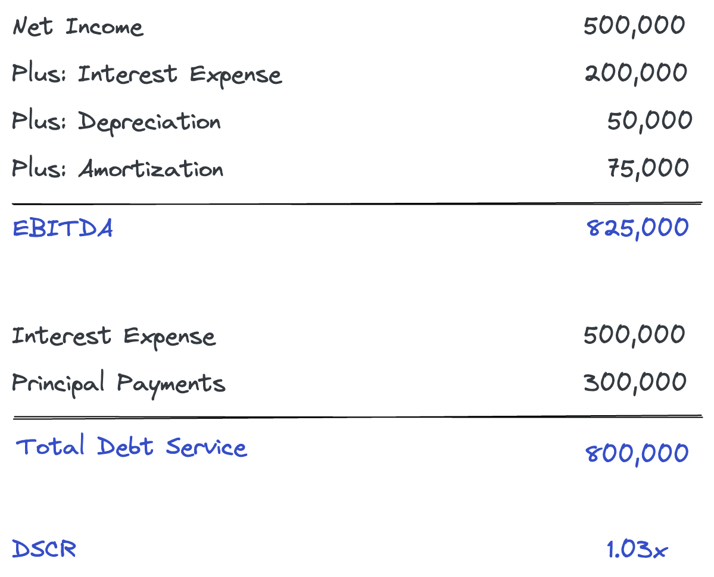

## Table of Contents

## What is the Debt-Service Coverage Ratio (DSCR)?

The Debt-Service Coverage Ratio (DSCR) is a financial measure used to see if a business or person can pay back their loans. It compares the money they earn before paying interest and taxes to the money they need to pay for their loans, including both the principal and interest. A DSCR of more than 1 means they have enough money to cover their loan payments, which is good. If it's less than 1, they might have trouble paying back their loans.

Lenders often use DSCR to decide if they should give someone a loan. A higher DSCR shows that the borrower is more likely to pay back the loan on time. For example, if a company has a DSCR of 1.5, it means they earn 1.5 times more than what they need to pay for their debts. This makes them a safer choice for lenders. Different industries might have different standards for what is considered a good DSCR, but generally, a higher ratio is better.

## Why is the Debt-Service Coverage Ratio important for businesses?

The Debt-Service Coverage Ratio is important for businesses because it shows if they can pay back their loans. It compares the money a business makes before paying taxes and interest to the money they need to pay for their loans. If this ratio is more than 1, it means the business earns enough to cover its loan payments. This is good because it shows the business is not at risk of not being able to pay its debts.

Lenders look at the Debt-Service Coverage Ratio to decide if they should give a business a loan. A high ratio means the business is more likely to pay back the loan on time, which makes it a safer choice for the lender. For example, if a business has a ratio of 1.5, it means they earn 1.5 times more than what they need to pay for their debts. This can help the business get better loan terms or lower interest rates, which can save them money and help them grow.

## How is the Debt-Service Coverage Ratio calculated?

The Debt-Service Coverage Ratio (DSCR) is calculated by dividing the money a business makes before paying interest and taxes (this is called EBITDA, which stands for Earnings Before Interest, Taxes, Depreciation, and Amortization) by the total amount of money the business needs to pay for its loans each year. This includes both the interest on the loans and the principal payments. The formula looks like this: DSCR = EBITDA / Total Debt Service.

For example, if a business makes $200,000 before paying interest and taxes and needs to pay $150,000 for its loans each year, the DSCR would be $200,000 divided by $150,000, which equals 1.33. This means the business earns 1.33 times more than what it needs to pay for its debts. A DSCR of more than 1 is good because it shows the business can cover its loan payments.

## What are the key components needed to calculate DSCR?

To calculate the Debt-Service Coverage Ratio (DSCR), you need two main pieces of information. The first piece is the business's earnings before interest, taxes, depreciation, and amortization, which is often called EBITDA. This tells you how much money the business makes before it pays for its loans and other expenses. The second piece is the total debt service, which is the total amount of money the business needs to pay for its loans each year. This includes both the interest on the loans and the principal payments.

Once you have these two numbers, you can calculate the DSCR by dividing the EBITDA by the total debt service. For example, if a business makes $200,000 before paying interest and taxes and needs to pay $150,000 for its loans each year, the DSCR would be $200,000 divided by $150,000, which equals 1.33. This means the business earns 1.33 times more than what it needs to pay for its debts. A DSCR of more than 1 is good because it shows the business can cover its loan payments.

## What is considered a good Debt-Service Coverage Ratio?

A good Debt-Service Coverage Ratio (DSCR) is usually more than 1. This means the business makes enough money to pay back its loans. Lenders like to see a DSCR of at least 1.25 or higher because it shows the business can cover its loan payments and still have money left over. Different industries might have different standards for what is considered a good DSCR, but a higher number is always better.

For example, if a business has a DSCR of 1.5, it means they earn 1.5 times more than what they need to pay for their debts. This makes them a safer choice for lenders. A high DSCR can help a business get better loan terms or lower interest rates, which can save them money and help them grow.

## How does DSCR affect loan approvals and interest rates?

The Debt-Service Coverage Ratio (DSCR) plays a big role in whether a business gets a loan approved and what [interest rate](/wiki/interest-rate-trading-strategies) they get. Lenders look at DSCR to see if the business can pay back the loan. If the DSCR is high, like over 1.25, it shows the business earns more than enough to cover its loan payments. This makes the business look safer to the lender, so they are more likely to approve the loan.

A high DSCR can also help a business get a lower interest rate. When a business has a DSCR of 1.5 or higher, it means they earn a lot more than they need to pay for their debts. Lenders see this as less risk, so they might offer a lower interest rate. This can save the business money and help them grow because they won't have to pay as much for their loans.

## Can DSCR be used for personal finance, or is it strictly for business?

The Debt-Service Coverage Ratio (DSCR) is mainly used for businesses, but it can also be used for personal finance. It helps people see if they can pay back their loans, like mortgages or car loans. To use DSCR for personal finance, you would compare your income before taxes to the total amount you need to pay for your loans each month. If your DSCR is more than 1, it means you earn enough to cover your loan payments, which is good.

Even though DSCR is not as common in personal finance as it is in business, it can still be a helpful tool. Lenders might not use it as much for personal loans, but knowing your DSCR can help you understand if you can handle more debt. If your DSCR is high, you might be able to get better loan terms or lower interest rates, which can save you money.

## What are the limitations of using DSCR as a financial metric?

DSCR is a helpful tool, but it has some limits. One big limit is that it only looks at how much money a business makes before paying interest and taxes. It doesn't think about other important costs like running the business or paying employees. So, a business might have a good DSCR but still struggle to pay all its bills.

Another limit is that DSCR doesn't change with time. It's a snapshot of how the business is doing right now. If a business has a good DSCR today, it doesn't mean it will be good in the future. Things like the economy or the industry can change, and these changes can affect the business's ability to pay back its loans. So, while DSCR is useful, it's important to look at other financial measures too to get a full picture of a business's health.

## How does DSCR vary across different industries?

DSCR can be different in different industries because each industry has its own way of making money and its own costs. For example, industries like real estate or utilities might have a higher DSCR because they have steady income from rent or services. These industries are seen as safer by lenders, so they might need a DSCR of around 1.25 or higher to get a loan.

On the other hand, industries like restaurants or retail might have a lower DSCR because their income can go up and down a lot. These businesses might need a DSCR of 1.5 or more to show lenders they can pay back their loans, even if their income changes. So, what counts as a good DSCR can change depending on the type of business and how steady its income is.

## What strategies can businesses employ to improve their DSCR?

Businesses can improve their Debt-Service Coverage Ratio (DSCR) by increasing their income. They can do this by selling more products or services, raising prices, or finding new ways to make money. Another way is to cut costs. This means spending less on things like supplies, rent, or salaries. By making more money or spending less, the business will have more left over to pay back its loans, which will make its DSCR higher.

Another strategy is to change the terms of their loans. Businesses can talk to their lenders about getting a longer time to pay back the loan or a lower interest rate. This will make their monthly loan payments smaller, which will also help improve their DSCR. It's important for businesses to keep a close eye on their finances and make smart choices to keep their DSCR high, so they can show lenders they are a safe bet for loans.

## How can changes in economic conditions impact DSCR?

Changes in economic conditions can have a big impact on a business's DSCR. When the economy is doing well, businesses usually make more money. This can make their DSCR go up because they have more money to pay back their loans. But if the economy gets worse, businesses might make less money. This can make their DSCR go down because they have less money to pay back their loans. So, the health of the economy can change how easy it is for a business to cover its loan payments.

Also, changes in interest rates can affect DSCR. If interest rates go up, the cost of borrowing money goes up too. This means businesses have to pay more for their loans, which can make their DSCR go down. On the other hand, if interest rates go down, borrowing money becomes cheaper. This can help businesses improve their DSCR because their loan payments will be smaller. So, businesses need to keep an eye on economic conditions and interest rates to manage their DSCR well.

## What advanced financial models incorporate DSCR for forecasting and analysis?

Some advanced financial models that use DSCR for forecasting and analysis include cash flow models and financial forecasting models. These models help businesses predict how much money they will make and spend in the future. By including DSCR, these models can show if the business will be able to pay back its loans over time. For example, a cash flow model might use DSCR to see if the business's future earnings will be enough to cover its loan payments, even if the economy changes or interest rates go up.

Another type of model that uses DSCR is a risk assessment model. These models help lenders understand how likely a business is to pay back its loans. By looking at DSCR, the model can predict if the business will have enough money to make its loan payments in different economic situations. This helps lenders decide if they should give the business a loan and what interest rate to charge. So, DSCR is a key part of these models because it shows how well a business can handle its debt.

## What is the Debt-Service Coverage Ratio (DSCR) and how is it understood?

The Debt-Service Coverage Ratio (DSCR) is a critical financial metric used to assess a company's ability to meet its debt obligations. Essential for both lenders and investors, the DSCR provides a snapshot of a firm's financial health by determining whether it generates sufficient income to cover its debt payments. The formula for calculating DSCR is:

$$
\text{DSCR} = \frac{\text{Net Operating Income (NOI)}}{\text{Total Debt Service}}
$$

**Net Operating Income (NOI)** is the total revenue generated by a company from its operations, minus the operating expenses, before the deduction of taxes and interest payments. It serves as an indicator of the firm's operational efficiency and profitability, excluding the effects of financing and accounting decisions.

**Total Debt Service** encompasses the sum of all interest, principal, sinking fund, and lease payments a company is obligated to pay within a given period, typically annually. This figure conveys the total burden of debt repayments a company faces.

A DSCR of 1 indicates a break-even point, where a company's net operating income is precisely enough to cover its debt service. A DSCR greater than 1 signifies that a company produces more income than necessary to fulfill its debt obligations, suggesting financial stability and a lower credit risk. Conversely, a DSCR below 1 implies that a company does not generate adequate operational income to satisfy its debt commitments, raising concerns about its [liquidity](/wiki/liquidity-risk-premium) and creditworthiness.

The implications of DSCR vary across industries. For instance, in real estate, a DSCR below 1 might not pose an immediate risk if the property appreciates over time, whereas, in sectors like manufacturing or retail, a low DSCR could signal impending financial distress. Therefore, understanding the industry context is crucial when interpreting DSCR values.

In credit analysis, DSCR plays a pivotal role in guiding lenders on whether to extend credit or loans to businesses. Banks and financial institutions often set minimum DSCR thresholds to mitigate the risk of loan defaults. A robust DSCR not only facilitates access to financing but also enhances a company’s negotiating power, potentially resulting in more favorable loan terms.

In conclusion, the DSCR is an indispensable tool in financial analysis, offering significant insights into a company's capacity to honor its debt obligations. Its evaluation assists stakeholders in making informed investment, credit, and strategic decisions, underscoring the importance of maintaining a healthy DSCR for sustainable financial stability.

## How do you calculate DSCR: A Step-by-Step Guide?

Calculating the Debt-Service Coverage Ratio (DSCR) is crucial for understanding a company's financial health, particularly its ability to cover debt obligations. The formula for DSCR is:

$$

\text{DSCR} = \frac{\text{Net Operating Income (NOI)}}{\text{Total Debt Service}}
$$

### Step-by-Step Calculation Guide

1. **Determine Net Operating Income (NOI):**
   - Net Operating Income is calculated by subtracting operating expenses from gross income. It's essential to consider all revenue streams and associated expenses.
   - **Example:** Suppose a company has a gross income of $500,000 and operating expenses totaling $300,000. The NOI would be:
$$
     \text{NOI} = 500,000 - 300,000 = 200,000

$$

2. **Calculate Total Debt Service:**
   - Total Debt Service includes all the payments required to cover principal and interest on outstanding debt within a given period.
   - **Example:** If a company needs to pay $50,000 in interest and has a principal repayment of $150,000, the total debt service is:
$$
     \text{Total Debt Service} = 50,000 + 150,000 = 200,000

$$

3. **Compute the DSCR:**
   - Use the values obtained for NOI and Total Debt Service in the DSCR formula.
   - **Example continued:** With an NOI of $200,000 and Total Debt Service of $200,000:
$$
     \text{DSCR} = \frac{200,000}{200,000} = 1.0

$$
   - A DSCR of 1.0 indicates that a company generates just enough income to cover its debt obligations.

### Data Sources Required

To accurately calculate DSCR, the following data sources are necessary:
- **Financial Statements:** Particularly the income statement for identifying revenues and expenses.
- **Loan Agreements:** To obtain details about principal and interest payments.
- **Market Data:** Where relevant, to ensure that expenses align with current industry standards.

### Common Challenges and Pitfalls

- **Inaccurate Income or Expense Reporting:** Leading to erroneous NOI calculations.
- **Ignoring Variable Debt Payments:** Debt obligations can change over time, particularly with variable interest rates.
- **Overlooking Other Non-Operating Income:** Can distort the view of core business performance.

To avoid these pitfalls:
- Ensure thorough and accurate financial data collection.
- Regularly update calculations to reflect changes in financial data.
- Verify data against reliable sources, possibly involving financial auditors.

### Tips for Accuracy and Reliability

- Cross-verify financial data between different accounting periods.
- Use spreadsheet tools or financial software to automate calculations and reduce human error.
- Incorporate sensitivity analysis to understand how changes in assumptions impact DSCR.

Using this comprehensive approach to calculate DSCR not only aids in understanding a company’s debt service capability but also enhances financial decision-making processes.

## References & Further Reading

[1]: Damodaran, A. (2012). ["Investment Valuation: Tools and Techniques for Determining the Value of Any Asset."](https://books.google.com/books/about/Investment_Valuation.html?id=5SRHAAAAQBAJ) Wiley Finance.

[2]: Fabozzi, F. J., & Peterson Drake, P. (2009). ["Finance: Capital Markets, Financial Management, and Investment Management."](https://books.google.com/books/about/Finance.html?id=mUBsAwAAQBAJ) Wiley.

[3]: Hull, J. (2020). ["Options, Futures, and Other Derivatives."](https://books.google.com/books/about/Options_Futures_and_Other_Derivatives_Gl.html?id=sdg2EAAAQBAJ) Pearson.

[4]: Chincarini, L. B., & Kim, D. (2006). ["Quantitative Equity Portfolio Management: An Active Approach to Portfolio Construction and Management."](https://www.amazon.com/Quantitative-Equity-Portfolio-Management-Construction/dp/0071459391) McGraw-Hill.

[5]: Mouline, N. (2021). ["Risk Management and Algorithms in Finance."](https://www.sciencedirect.com/science/article/pii/S2665917423000922) KDP Publishing.