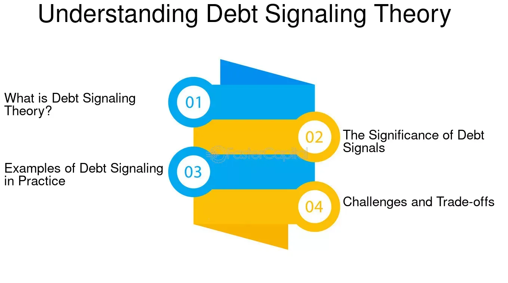

## Table of Contents

## What is debt signaling?

Debt signaling is a concept in finance where a company uses debt to send a message to the market about its financial health and future prospects. When a company takes on debt, it's telling investors and others that it believes it can handle the debt and still make profits. This can be seen as a sign of confidence. For example, if a company borrows money to expand its business, it's signaling that it expects to grow and earn enough to pay back the debt.

However, debt signaling can also have risks. If a company takes on too much debt, it might worry investors. They might think the company is desperate or not managing its finances well. This can lead to a drop in the company's stock price. So, while taking on debt can be a positive signal, it needs to be done carefully. The amount and type of debt a company takes on can tell a lot about its strategy and how it sees its future.

## Why is debt signaling important in finance?

Debt signaling is important in finance because it helps investors and other people understand what a company thinks about its future. When a company borrows money, it's like they're saying, "We believe we can make more money and pay this back." This can make investors feel good about the company because it shows confidence. If a company is willing to take on debt, it might mean they have good plans to grow and make more profit.

But, debt signaling can also be risky. If a company borrows too much money, it might make investors worried. They might think the company is in trouble or not good at managing money. This can make the company's stock price go down. So, it's really important for a company to use debt in a smart way. The amount and type of debt they take on can tell a lot about what they plan to do and how they see their future.

## How does debt signaling work as a mechanism?

Debt signaling works as a way for companies to show the world what they think about their future. When a company borrows money, it's like they're telling everyone, "We believe we can make more money and pay this back." This can make investors feel good about the company. If a company is willing to take on debt, it might mean they have good plans to grow and make more profit. So, debt signaling is a way for a company to say, "We're confident in our future."

But, debt signaling can also be risky. If a company borrows too much money, it might make investors worried. They might think the company is in trouble or not good at managing money. This can make the company's stock price go down. So, it's really important for a company to use debt in a smart way. The amount and type of debt they take on can tell a lot about what they plan to do and how they see their future.

## Can you provide a simple example of debt signaling?

Imagine a small bakery called "Sweet Treats" wants to open a new location. They believe they can make more money with a second store. So, they decide to borrow money from the bank to pay for the new location. By taking on this debt, Sweet Treats is telling everyone, "We think we can make enough money at our new store to pay back this loan." This is an example of debt signaling.

If people see that Sweet Treats is confident enough to borrow money, they might think the bakery has a good plan. They might even want to buy stock in Sweet Treats if it's a public company. But, if Sweet Treats borrows too much money and can't pay it back, people might get worried. They might think the bakery is in trouble, and the value of the bakery could go down. So, it's important for Sweet Treats to borrow just the right amount to show they are confident but not desperate.

## What are the key components involved in debt signaling?

Debt signaling involves a few key parts that help show what a company thinks about its future. The first part is the amount of debt a company takes on. If a company borrows a lot of money, it's like they're saying, "We believe we can make enough money to pay this back." This can make investors feel good because it shows the company is confident. But, if a company borrows too much, it might make investors worried. They might think the company is in trouble or not good at managing money.

The second part is the type of debt a company uses. There are different kinds of debt, like short-term loans or long-term bonds. The type of debt a company chooses can tell people about their plans. For example, if a company uses a short-term loan, it might mean they need money quickly for a project they think will pay off soon. If they use long-term bonds, it might mean they have big plans that will take a while to make money. So, the type of debt is another way a company can signal what they think about their future.

## How does debt signaling affect a company's cost of capital?

Debt signaling can affect a company's cost of capital by changing how investors see the company. When a company borrows money, it's telling investors, "We think we can make enough money to pay this back." If investors believe this, they might think the company is doing well and be more willing to invest. This can lower the company's cost of capital because it's easier for the company to get money. The company might get better interest rates on loans or a higher price for its stock because people are more confident in it.

But, if a company borrows too much money, it can make investors worried. They might think the company is in trouble or not good at managing money. This can make the company's cost of capital go up because it's harder for the company to get money. The company might have to pay higher interest rates on loans or sell its stock at a lower price because people are less confident in it. So, debt signaling can change the cost of capital by changing how investors feel about the company's future.

## What are the potential risks associated with debt signaling?

Debt signaling can be risky for a company. If a company borrows too much money, it might make investors worried. They might think the company is desperate or not good at managing money. This can lead to a drop in the company's stock price. If the stock price goes down, it can be harder for the company to get more money in the future. The company might have to pay higher interest rates on loans or sell its stock at a lower price because people are less confident in it.

Another risk is that the company might not be able to pay back the debt. If the company's plans don't work out and it can't make enough money, it might have to use all its money to pay back the debt. This can leave the company with no money to grow or even to keep running. If the company can't pay back the debt, it might have to declare bankruptcy. This can be very bad for the company and its investors. So, while debt signaling can be a good way to show confidence, it needs to be done carefully to avoid these risks.

## How do investors interpret different levels of debt signaling?

When a company takes on a small amount of debt, investors often see it as a good sign. It's like the company is saying, "We think we can make more money and pay this back." This can make investors feel good about the company because it shows confidence. They might think the company has good plans to grow and make more profit. If investors feel this way, they might be more willing to invest in the company, which can help the company's stock price go up.

But if a company takes on a lot of debt, investors might start to worry. They might think the company is desperate or not good at managing money. This can make the company's stock price go down. If the stock price goes down, it can be harder for the company to get more money in the future. They might have to pay higher interest rates on loans or sell their stock at a lower price because people are less confident in the company. So, the level of debt a company takes on can tell investors a lot about what the company thinks about its future.

## What role does debt signaling play in corporate strategy?

Debt signaling is a big part of how companies plan their future. When a company decides to borrow money, it's like they're telling everyone, "We believe we can make more money and pay this back." This can be a good way to show confidence in their plans. For example, if a company wants to open a new store or start a new project, they might borrow money to do it. By doing this, they're telling investors and others that they think the new store or project will make them more money. This can make people feel good about the company and be more willing to invest in it.

But, debt signaling can also be risky. If a company borrows too much money, it might make people worried. They might think the company is in trouble or not good at managing money. This can make the company's stock price go down. If the stock price goes down, it can be harder for the company to get more money in the future. They might have to pay higher interest rates on loans or sell their stock at a lower price because people are less confident in the company. So, when a company uses debt signaling, they need to be careful about how much debt they take on and what they plan to do with it.

## How can debt signaling be used to predict financial distress?

Debt signaling can be a way to guess if a company might have money problems in the future. If a company starts borrowing a lot more money than usual, it might mean they are in trouble. They might be borrowing because they need money to keep going, not because they have a good plan to grow. If investors see this, they might worry that the company won't be able to pay back the debt. This can make the company's stock price go down and make it harder for them to get more money in the future.

But, it's not always easy to tell if a company is in trouble just because they are borrowing money. Sometimes, a company might borrow money because they have a good plan to grow and make more money. If they borrow the right amount and use it wisely, it can actually help them do better in the future. So, when looking at debt signaling to predict financial distress, it's important to think about why the company is borrowing and if they have a good plan to pay it back.

## What are the differences between debt signaling and equity signaling?

Debt signaling and equity signaling are ways companies show what they think about their future, but they do it differently. When a company borrows money, it's called debt signaling. They're telling everyone, "We believe we can make enough money to pay this back." This can make investors feel good because it shows the company is confident. But, if a company borrows too much, it might make investors worried. They might think the company is in trouble or not good at managing money.

Equity signaling happens when a company sells part of itself, like its stock, to get money. This is different because the company is not borrowing money; it's giving away a piece of the company. When a company does this, it's telling people, "We think our company is worth more in the future." If investors believe this, they might buy the stock and help the company's stock price go up. But, if a company sells too much of its stock or at a low price, it might make investors think the company doesn't believe in its future as much. So, both debt and equity signaling can tell investors a lot about what a company thinks about its future, but they do it in different ways.

## How has the theory of debt signaling evolved in recent economic research?

The theory of debt signaling has changed a lot in recent economic research. At first, people thought that when a company borrows money, it's a good sign that the company believes in its future. But now, researchers are looking at more than just the amount of debt. They are thinking about things like the type of debt, the company's past, and what's happening in the economy. This helps them understand better what the company is really trying to say when it borrows money.

New studies also look at how debt signaling can be different for different companies. For example, a big company with a lot of money might borrow to show it's confident, but a small company might borrow because it needs money to keep going. Researchers are also using new ways to study debt signaling, like looking at data from many companies over time. This helps them see patterns and understand how debt signaling works in the real world. So, the theory of debt signaling is getting more detailed and helpful for understanding what companies are really thinking.

## What are financial signals and why are they important?

Financial signals serve as critical indicators of a company's fiscal health and future performance, providing valuable guidance for investors aiming to optimize their portfolios. Among the most significant signals are earnings reports, dividend announcements, and debt-related news.

Earnings reports offer comprehensive insights into a company’s profitability. They include essential metrics such as revenue, net income, and earnings per share (EPS). Positive earnings growth often signals robust business operations, potentially leading to increased investor confidence and a higher stock price. Conversely, a decline in earnings can indicate potential issues and result in stock price depreciation.

Dividend announcements are another key financial signal. Companies declaring substantial dividends often reflect strong cash flow and an optimistic outlook on their economic stability. Investors may view consistent or increasing dividends as a sign of financial strength, thus enhancing a stock's attractiveness. On the other hand, reduced or suspended dividends can be interpreted as cautionary signals, suggesting that a company might be redirecting cash reserves to address financial challenges.

Debt-related news provides further context to a company's financial narrative. An increase in debt can suggest that a company is investing in growth opportunities, perceived as a positive signal if the investments lead to future profits exceeding the cost of debt. However, excessive debt accumulation could indicate financial strain, potentially deterring investors due to the added risk of insolvency.

Understanding these signals is pivotal for assessing the risk and potential of investments. By analyzing financial statements and market news, investors can discern a company's financial trajectory, aiding in creating informed and strategic investment decisions. This goes beyond simple surface-level analysis, requiring investors to weigh contextual variables and market conditions that may influence these financial signals.

For example, the Price-to-Earnings (P/E) ratio is a frequently used metric to evaluate company value relative to its earnings. Calculated as:

$$
\text{P/E ratio} = \frac{\text{Market Value per Share}}{\text{Earnings per Share (EPS)}}
$$

A high P/E ratio might indicate that a stock's price is high relative to earnings, often attributed to expectations of future growth. However, it also necessitates a cautious approach, as it might also reflect overvaluation. Thus, financial signals and their nuanced interpretations form the backbone for sound investment analysis, empowering investors to better navigate the complexities of the financial markets.

## What is Debt Signaling: Theory and Application?

Debt signaling refers to the process by which a company's decisions regarding its debt, such as incurring new debt or retiring existing debt, send implicit messages to investors and stakeholders about its financial health, stability, or growth ambitions. This concept is grounded in information asymmetry, where company insiders possess more information about the firm's future prospects than external investors. Consequently, debt-related actions can serve as signals that bridge this information gap.

When a company opts to raise funds through debt, it may suggest to investors that the company is confident in its future cash flows and growth potential. This is because debt creates a fixed obligation that the company must meet, and by taking this on, the company signals that it expects to generate sufficient future income to cover these obligations. A prominent example includes Netflix, which has strategically utilized debt financing to fund its expansion into original content. By issuing debt, Netflix has been able to invest heavily in its content library, thereby enhancing its competitive position and potential for revenue growth. This move can be interpreted as a positive signal, indicating Netflix's confidence in [earning](/wiki/earning-announcement) sufficient returns from these investments.

Conversely, if a company focuses on reducing its debt load, it might project an image of caution or financial trouble. High levels of debt can sometimes indicate financial distress if the company struggles to meet its obligations. In such situations, an effort to decrease debt might suggest to the market that the company is prioritizing financial stability over aggressive expansion, which could be seen as a cautionary signal about its growth prospects.

Mathematically, debt signaling can be analyzed through metrics such as the debt-to-equity ratio (D/E), which offers insights into the relative proportion of shareholder equity and debt used to finance a company's assets. A higher debt-to-equity ratio may signal increased financial leverage, posing both opportunities and risks:

$$
\text{Debt-to-Equity Ratio} = \frac{\text{Total Debt}}{\text{Shareholder's Equity}}
$$

In Python, we can illustrate how to compute and assess this ratio:

```python
def debt_to_equity_ratio(total_debt, shareholder_equity):
    """
    This function calculates the Debt-to-Equity Ratio.

    Parameters:
    total_debt (float): The total debt of the company.
    shareholder_equity (float): The shareholder's equity of the company.

    Returns:
    float: Debt-to-Equity Ratio.
    """
    return total_debt / shareholder_equity

# Example calculation
total_debt = 15000000  # Example total debt
shareholder_equity = 5000000  # Example shareholder's equity

de_ratio = debt_to_equity_ratio(total_debt, shareholder_equity)
print(f"Debt-to-Equity Ratio: {de_ratio:.2f}")  # Output will be: Debt-to-Equity Ratio: 3.00
```

Through strategic debt management and signaling, companies can thus influence investor perceptions and indirectly affect their stock valuations and market stability. Successful interpretation of these signals requires investors to consider the broader context of a firm's operational and strategic objectives.

## References & Further Reading

[1]: "Statistics," World Bank, https://data.worldbank.org/.

[2]: "Financial Signals and Their Importance," Investopedia, https://www.investopedia.com/.

[3]: "Debt Signaling Theory," Corporate Finance Institute, https://corporatefinanceinstitute.com/.

[4]: Bergstra, J., Bardenet, R., Bengio, Y., & Kégl, B. (2011). ["Algorithms for Hyper-Parameter Optimization."](https://dl.acm.org/doi/10.5555/2986459.2986743) Advances in Neural Information Processing Systems 24.

[5]: "Advances in Financial Machine Learning" by Marcos Lopez de Prado, https://www.amazon.com/Advances-Financial-Machine-Learning-Marcos/dp/1119482089

[6]: "Evidence-Based Technical Analysis: Applying the Scientific Method and Statistical Inference to Trading Signals" by David Aronson, https://www.wiley.com/en-gb/Evidence+Based+Technical+Analysis:+Applying+the+Scientific+Method+and+Statistical+Inference+to+Trading+Signals-p-9780470008744

[7]: "Machine Learning for Algorithmic Trading" by Stefan Jansen, https://www.amazon.com/Machine-Learning-Algorithmic-Trading-intelligence/dp/9918608013

[8]: "Quantitative Trading: How to Build Your Own Algorithmic Trading Business" by Ernest P. Chan, https://www.amazon.com/Quantitative-Trading-Build-Algorithmic-Business/dp/0470284889