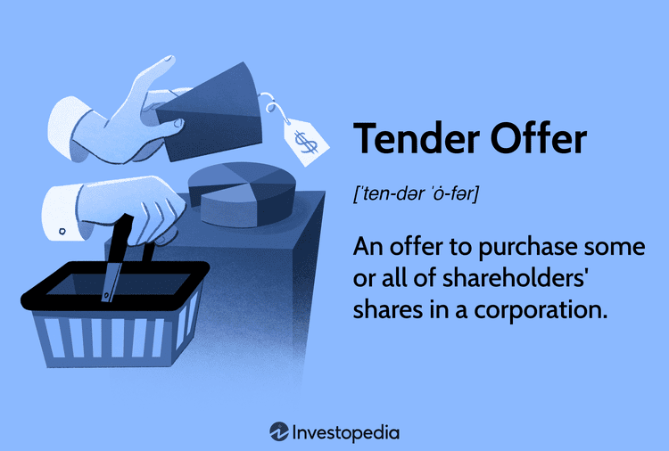

## Table of Contents

## What is a debt tender offer?

A debt tender offer is when a company asks its bondholders to give back their bonds before they are due. The company offers to pay the bondholders a certain amount of money for each bond they return. This amount can be more or less than what the bond is worth at that time. Companies do this for different reasons, like to reduce their debt or to change the terms of their borrowing.

Sometimes, a company might want to replace old bonds with new ones that have different terms. For example, they might offer new bonds with a lower interest rate. By doing a debt tender offer, the company can manage its debt better and possibly save money on interest payments. It's important for bondholders to think carefully about whether to accept the offer, as it can affect their investment returns.

## Why do companies issue debt tender offers?

Companies issue debt tender offers mainly to manage their debt better. When a company has a lot of debt, it can be hard to pay it all back. By doing a debt tender offer, the company can ask bondholders to give back their bonds early. The company then pays the bondholders for the bonds, which can help the company reduce how much debt it has. This can make the company's financial situation healthier and easier to manage.

Another reason companies use debt tender offers is to change the terms of their borrowing. Sometimes, a company might want to replace old bonds with new ones that have lower interest rates. This can save the company money because they won't have to pay as much interest over time. By offering bondholders a deal to swap their old bonds for new ones, the company can improve its financial position and make its debt more manageable.

## What are the different types of debt tender offers?

There are a few different types of debt tender offers that companies might use. One type is a cash tender offer, where the company offers to pay bondholders cash in exchange for their bonds. This is straightforward and gives bondholders money right away. Another type is an exchange offer, where the company offers new bonds or securities instead of cash. This can be good for the company if they want to change the terms of their debt without spending a lot of cash.

Another kind of debt tender offer is a modified Dutch auction. In this type, the company asks bondholders to say how much money they want for their bonds. The company then picks a price and buys back bonds from everyone who asked for that price or less. This can help the company buy back its debt at a good price. Each type of offer has its own advantages and can be used depending on what the company wants to achieve with its debt management.

## How does a fixed price tender offer work?

A fixed price tender offer is when a company offers to buy back its bonds at a set price. The company tells bondholders how much money they will get for each bond they give back. Bondholders can choose to accept the offer or keep their bonds. If they accept, they get the fixed amount of money for each bond they return to the company.

This type of offer is simple because everyone who accepts gets the same price. It helps the company because they know exactly how much they will have to pay to buy back their bonds. For bondholders, it's a clear choice: they can take the money offered or wait until the bond matures. This can be a good option if the fixed price is higher than what the bond is currently worth in the market.

## What is a Dutch auction tender offer and how does it differ from a fixed price offer?

A Dutch auction tender offer is a way for a company to buy back its bonds where bondholders tell the company how much money they want for their bonds. The company then looks at all the offers and picks a price. They buy back bonds from everyone who asked for that price or less. This means that if you asked for a lower price, you might get your bonds bought back, but if you asked for too much, the company might not buy your bonds.

A Dutch auction is different from a fixed price offer because in a fixed price offer, the company sets one price and everyone who gives back their bonds gets that same amount of money. With a Dutch auction, the price can change based on what bondholders ask for. This can be good for the company because they might end up paying less for the bonds than they would with a fixed price offer. For bondholders, a Dutch auction gives them a chance to say what they think their bonds are worth, but they also take a risk that the company might not buy their bonds if their price is too high.

## What are the key rules and regulations governing debt tender offers?

Debt tender offers are controlled by rules and laws to make sure they are fair and clear. In the United States, the main rules come from the Securities and Exchange Commission (SEC). The SEC has rules that say companies need to give a lot of information when they make a tender offer. This includes details about the offer, like how long it will last and what the price is. Companies also have to tell everyone the same information at the same time, so no one gets an unfair advantage.

Another important rule is that once a company starts a tender offer, they can't change it in a way that makes it less good for bondholders. This is called the "best price rule." It means if the company ends up paying more for some bonds, they have to pay that higher price to everyone who gives back their bonds. There are also rules about how long the offer has to stay open, usually at least 20 business days. These rules help make sure that everyone has a fair chance to decide if they want to take the offer or not.

## How does the Securities and Exchange Commission (SEC) regulate debt tender offers?

The Securities and Exchange Commission (SEC) makes rules to keep debt tender offers fair and clear. When a company wants to buy back its bonds, they have to follow SEC rules. One big rule is that the company must give a lot of information about the offer. This includes how long the offer will last, what the price is, and other important details. The company also has to make sure everyone gets the same information at the same time, so no one can get an unfair advantage.

Another important rule from the SEC is the "best price rule." This means if a company ends up paying more for some bonds during the offer, they have to pay that higher price to everyone who gives back their bonds. This keeps things fair for all bondholders. The SEC also says that a debt tender offer must stay open for at least 20 business days. This gives everyone enough time to decide if they want to take the offer or not.

## What are the steps involved in executing a debt tender offer?

When a company wants to do a debt tender offer, they start by deciding what they want to do with their debt. They might want to buy back some bonds to lower their debt or change the terms of their borrowing. Once they know what they want to do, they need to tell the Securities and Exchange Commission (SEC) about their plan. They have to give a lot of information about the offer, like how long it will last and what price they will pay for the bonds. This information has to be shared with everyone at the same time so it's fair.

After the company tells the SEC about the offer, they make the offer public. They let all the bondholders know about the offer and give them time to decide if they want to give back their bonds. The offer has to stay open for at least 20 business days, so bondholders have enough time to make their choice. If bondholders decide to take the offer, they send their bonds back to the company and get paid the price that was set. If the company ends up paying more for some bonds, they have to pay that higher price to everyone who gives back their bonds, which is called the "best price rule."

## How do bondholders participate in a debt tender offer?

When a company makes a debt tender offer, they tell all the bondholders about it. The company says how much money they will pay for each bond and how long the offer will last. Bondholders then have to decide if they want to give their bonds back to the company. They have at least 20 business days to make this choice. If they decide to take the offer, they send their bonds back to the company and get the money that was promised.

Sometimes, bondholders might want to wait and see if the company will pay more for the bonds. If the company does end up paying more for some bonds, they have to pay that higher price to everyone who gives back their bonds. This is called the "best price rule." It's important for bondholders to think about whether the money offered is a good deal compared to what the bond might be worth in the future. They need to decide if it's better to take the money now or keep the bond until it matures.

## What are the tax implications for bondholders participating in a debt tender offer?

When bondholders decide to take part in a debt tender offer, they need to think about how it might affect their taxes. If they give back their bonds and get cash, they might have to pay taxes on any profit they make. This profit is called a capital gain. If the bond was bought for less than the price the company offers in the tender offer, the difference is the capital gain. Depending on how long the bondholder owned the bond, the gain could be taxed as a short-term or long-term capital gain. Short-term gains are usually taxed at a higher rate than long-term gains.

If bondholders swap their old bonds for new ones in an exchange offer, the tax situation can be different. Sometimes, this kind of swap can be seen as a tax-free exchange, which means they won't have to pay taxes right away. But if the new bonds have different terms, like a different interest rate, there might be some tax to pay on the difference in value. It's a good idea for bondholders to talk to a tax advisor to understand how a debt tender offer could affect their taxes.

## Can you provide a real-world example of a successful debt tender offer?

In 2020, Ford Motor Company did a successful debt tender offer. They wanted to buy back some of their bonds to lower their debt. Ford offered to pay bondholders cash for their bonds before they were due. Many bondholders took the offer because Ford's price was good. By doing this, Ford was able to reduce its debt and save money on interest payments.

This tender offer was good for Ford because it helped them manage their money better during a tough time. The company told everyone about the offer and followed all the rules from the SEC. Bondholders had time to decide if they wanted to take the cash or keep their bonds. In the end, it worked out well for both Ford and the bondholders who took the offer.

## What are the potential risks and considerations for companies when launching a debt tender offer?

When a company decides to launch a debt tender offer, there are some risks they need to think about. One big risk is that the offer might not work as well as they hope. If not enough bondholders take the offer, the company might not be able to buy back as many bonds as they wanted. This can leave them with more debt than they planned. Also, if the company offers too high a price, it can end up costing them a lot of money. They need to be careful to set a price that is good enough for bondholders to take the offer but not so high that it hurts the company's finances.

Another thing companies need to consider is how the tender offer might affect their relationship with bondholders. If bondholders feel like the offer is not fair, they might not want to work with the company again. The company also has to follow all the rules from the SEC, like giving everyone the same information and keeping the offer open for at least 20 business days. If they don't follow these rules, they could get in trouble. So, it's important for companies to plan carefully and think about all these risks before they start a debt tender offer.

## References & Further Reading

[1]: Berman, K. (2018). ["Bond Markets, Analysis, and Strategies"](https://mitpress.mit.edu/9780262046275/bond-markets-analysis-and-strategies/) by Frank J. Fabozzi.

[2]: Klausner, M. (2020). ["Debt Tender Offers and Exchange Offers by Public Companies"](https://carpenterwellington.com/post/an-introduction-to-debt-tender-and-exchange-offers/) Journal of Law and Finance.

[3]: Lopez de Prado, M. (2018). ["Advances in Financial Machine Learning"](https://www.amazon.com/Advances-Financial-Machine-Learning-Marcos/dp/1119482089) by Marcos Lopez de Prado.

[4]: Koller, T. (2015). ["Valuation: Measuring and Managing the Value of Companies"](https://books.google.com/books/about/Valuation.html?id=fGXjDwAAQBAJ) by McKinsey & Company Inc.

[5]: SEC. (2023). ["Regulation 14E of the Securities Exchange Act of 1934"](https://dart.deloitte.com/USDART/home/accounting/sec/rules-regulations/240-securities-exchange-act-1934-rules/a-rules-regulations-under-securities-exchange/240-14e-regulation-14e) Securities and Exchange Commission.

[6]: Scholz, K. (2017). ["Algorithmic and High-Frequency Trading"](https://assets.cambridge.org/97811070/91146/frontmatter/9781107091146_frontmatter.pdf) by Álvaro Cartea, Sebastian Jaimungal, and José Penalva.

[7]: Hull, J. C. (2021). ["Options, Futures, and Other Derivatives"](https://elibrary.pearson.de/book/99.150005/9781292410623) by John C. Hull.

[8]: Harris, L. (2003). ["Trading and Exchanges: Market Microstructure for Practitioners"](https://academic.oup.com/book/52292) by Larry Harris.