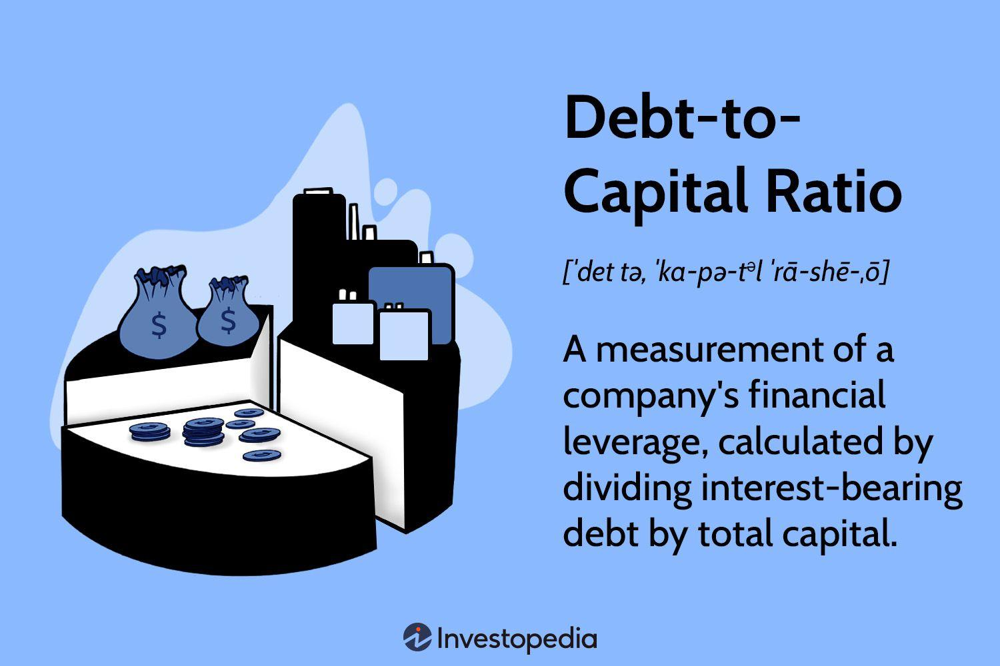

In today’s dynamic financial landscape, businesses continuously seek strategies to optimize their financial health and maximize shareholder value. To achieve these objectives, they rely on a combination of capital management, debt reduction, and algorithmic trading. These elements are not isolated; they form an interconnected framework that underpins corporate financial strategies. 

Capital management is essential for ensuring that a company's resources are allocated efficiently. By maintaining an optimal balance of assets and liabilities, businesses can support ongoing operations while investing in future growth opportunities. This involves not only investment in profitable ventures but also ensuring liquidity and managing financial risks effectively. 



Simultaneously, debt reduction is crucial for maintaining financial health. High levels of debt can increase a company's risk profile and cost of capital, potentially jeopardizing its financial stability. Effective debt management enhances revenue through efficient practices and structured debt restructuring programs. Analyzing debt-to-capital ratios provides valuable insights into a company’s leverage, enabling informed decision-making to maintain financial balance and sustainability.

Algorithmic trading represents a technological advancement in executing trades with speed and precision, leveraging computer-driven strategies to optimize outcomes in financial markets. These strategies rely heavily on financial metrics, such as debt ratios, to assess and manage risk exposure effectively.

By examining how capital management, debt reduction, and algorithmic trading interact, businesses can bolster their financial stability and growth. This convergence allows companies to navigate the complexities of the current financial environment and improve their financial strategies to maximize shareholder value.

## Table of Contents

## Understanding Capital Management

Capital management is a critical component of a company's financial strategy. It involves overseeing the financial resources of an organization to achieve optimal resource allocation and ensure long-term financial stability. This process is essential for fostering growth, maintaining liquidity, and mitigating risks associated with financial operations.

Effective capital management begins with a clear understanding of the company's financial portfolio. This includes the analysis of current assets and liabilities to make informed decisions on resource allocation. One of the primary goals is to direct investments towards ventures that promise sustainable profitability. By evaluating potential returns and risks associated with different investment opportunities, companies can channel their capital into projects that align with their strategic objectives.

Maintaining [liquidity](/wiki/liquidity-risk-premium) is another integral aspect of capital management. Liquidity ensures that a company can meet its short-term obligations without stress, thereby safeguarding against potential financial crises. Companies focus on maintaining a balance between liquid assets and investments. This balance is crucial to handle unexpected expenses or take advantage of sudden opportunities in the market. The ability to convert assets into cash quickly without significant loss of value is vital for maintaining operational efficiency.

Financial risk management is also a core component of capital management. Companies employ various strategies to hedge against potential financial losses, such as diversification of investment portfolios and the use of financial instruments like derivatives. Risk management ensures that the company's capital is protected from market [volatility](/wiki/volatility-trading-strategies) and economic downturns.

Strategies for successful capital management include prudent budgeting practices. Budgeting involves planning and controlling future income and expenditures to ensure that financial resources are utilized efficiently. Companies set realistic financial goals and monitor cash flows to ensure that expenditures do not exceed income.

Investing in growth opportunities is also pivotal. Growth investments might include upgrading technology, expanding into new markets, or acquiring other businesses. Such investments are essential for keeping pace with industry advancements and competitive pressures.

Ensuring sufficient working capital is vital for day-to-day operations. Working capital, defined as current assets minus current liabilities, reflects the company's ability to cover its short-term debts and obligations. A positive working capital indicates good financial health, while a negative working capital may suggest a need for strategic adjustments.

In summary, capital management involves a comprehensive approach to managing a company’s financial portfolio. By focusing on investment in profitable ventures, conserving liquidity, and managing financial risks, organizations can position themselves for sustained growth and financial health. Prudent budgeting, strategic investment in growth opportunities, and ensuring sufficient working capital are foundational strategies that support these objectives.

## Debt Reduction Strategies

Debt management plays a critical role in sustaining financial health, directly impacting a company's risk profile and cost of capital. Effective debt reduction strategies are essential for ensuring stability and fostering growth. Companies can reduce their debt through various approaches, including enhancing revenue, efficient inventory management, and implementing structured debt restructuring programs.

Revenue enhancement focuses on increasing income to better manage and pay down existing debt. This can involve expanding product lines, entering new markets, or improving sales efficiency. By boosting revenue, companies can allocate additional resources to debt servicing.

Efficient inventory management also contributes to debt reduction. By optimizing inventory levels, businesses can free up cash that might otherwise be tied up in unsold goods. Techniques such as just-in-time (JIT) inventory systems and demand forecasting can enhance inventory turnover rates, thereby aiding in debt repayment.

Structured debt restructuring programs offer tailored solutions for managing overdue liabilities. These may include renegotiating terms with creditors, extending payment schedules, or converting debt to equity. Such measures can lower immediate financial burdens and improve long-term financial stability.

A key metric used in assessing a company's debt management is the debt-to-capital ratio, which provides insight into a company’s leverage. The formula for the debt-to-capital ratio is:

$$
\text{Debt-to-Capital Ratio} = \frac{\text{Total Debt}}{\text{Total Debt} + \text{Shareholders' Equity}}
$$

A lower debt-to-capital ratio generally indicates a healthier balance sheet and a lower financial risk profile. Monitoring this ratio helps companies understand their leverage and make informed decisions about capital structure adjustments.

In summary, employing revenue enhancement, efficient inventory management, and structured debt restructuring programs can effectively reduce corporate debt. Analyzing financial metrics such as the debt-to-capital ratio further aids in understanding and managing financial leverage, leading to improved financial stability.

## Algorithmic Trading and Financial Strategy

Algorithmic trading employs sophisticated computer-driven strategies to execute trades with exceptional speed and efficiency, essential in the rapidly evolving financial markets. This approach leverages algorithms to process a vast array of financial data, facilitating optimal trade execution by minimizing the time delay between decision and action.

A significant aspect of [algorithmic trading](/wiki/algorithmic-trading) is its reliance on financial metrics, such as debt ratios, to optimize risk exposure and augment decision-making processes. Algorithms may utilize the Debt-to-Equity (D/E) ratio, a key financial indicator that reflects a company's financial leverage. This ratio helps trading algorithms determine a company's risk level by evaluating how much debt is used compared to shareholders' equity. For instance, a high D/E ratio might indicate greater financial risk, which could inform a trading strategy that reduces exposure to that company's securities.

Integrating insights from debt and capital management further enhances the capability of algorithmic trading systems to improve portfolio performance and manage risk more effectively. This integration allows for a comprehensive analysis that accounts for liquidity, solvency, and long-term viability of investments. By assimilating data on a company’s capital structure and its ability to meet short- and long-term obligations, algorithms can make more informed decisions regarding asset allocation and investment strategies.

Moreover, advanced [machine learning](/wiki/machine-learning) techniques and [artificial intelligence](/wiki/ai-artificial-intelligence) have propelled algorithmic trading into an era where systems can adapt and learn from historical data to predict future market movements. Implementing these technologies enables traders and institutions to construct models that integrate macroeconomic indicators, including interest rates and inflation, alongside company-specific metrics.

A simple Python example of how an algorithm might use financial data to inform trading decisions is provided below:

```python
import numpy as np

def trade_signal(debt_to_equity, interest_coverage, market_volatility):
    # Thresholds for decision-making
    d_e_threshold = 1.5  # Example threshold for Debt-to-Equity ratio
    interest_cover_threshold = 2.0  # Example threshold for Interest Coverage
    volatility_limit = 0.5  # Example for volatility limit

    # Decision logic
    if (debt_to_equity < d_e_threshold and
        interest_coverage > interest_cover_threshold and
        market_volatility < volatility_limit):
        return "Buy"
    elif debt_to_equity > d_e_threshold:
        return "Sell"
    else:
        return "Hold"

# Example data
d_to_e = 1.2
interest_cover = 2.5
market_vol = 0.45

# Determine trading action
action = trade_signal(d_to_e, interest_cover, market_vol)
print(f"Trading action: {action}")
```

This code snippet evaluates a company's financial health and market conditions to generate a trading signal, demonstrating the integration of financial metrics into an automated decision-making process.

In conclusion, algorithmic trading, fortified by comprehensive financial metrics analytics, including debt and capital management insights, significantly enhances portfolio management and risk mitigation. As financial markets continue to evolve, the strategic application of these technological advancements holds the promise of more informed, effective, and efficient trading.

## Synergizing Debt Reduction with Algo Trading

Combining debt reduction strategies with algorithmic trading offers businesses a powerful toolkit to enhance financial performance and leverage market opportunities. Companies adopting effective debt reduction strategies often find themselves in a favorable position to reinvest in growth-oriented initiatives. With reduced leverage, firms can access capital at lower costs, enabling strategic investments through algorithm-driven trading.

Algorithmic trading systems provide a functional edge by using computational models and algorithms to automate and optimize trading processes. These systems can analyze large volumes of financial data rapidly, making swift, data-driven decisions that human traders may not replicate at the same speed. Python, a preferred language for developing algorithmic trading systems, allows developers to leverage extensive libraries such as NumPy or Pandas for data analysis, facilitating the update of trading algorithms based on real-time market data. Here's an example of a simple Python snippet using Pandas for analyzing moving averages:

```python
import pandas as pd

# Assuming 'data' is a DataFrame containing price data with columns ['Date', 'Close']
data['SMA_50'] = data['Close'].rolling(window=50).mean()
data['SMA_200'] = data['Close'].rolling(window=200).mean()

# Generate signals based on moving average crossovers
data['Signal'] = 0
data.loc[data['SMA_50'] > data['SMA_200'], 'Signal'] = 1
data.loc[data['SMA_50'] < data['SMA_200'], 'Signal'] = -1
```

As firms decrease their debt burdens, their improved financial standing can enhance the accuracy and efficiency of these trading systems. A lower debt-to-capital ratio implies a stronger balance sheet, favorable for engaging in more aggressive or diversified trading strategies. Algorithmic trading can also be directly informed by metrics related to debt and capital management, adapting algorithms to balance risk and reward more effectively.

This integrated approach supports sustainable growth while controlling financial risks. By leveraging algorithmic trading in tandem with debt reduction, companies can dynamically adjust their investment strategies, capturing opportunities while retaining the capacity to absorb market volatilities. Such a synchronized strategy ensures that enterprises can maintain a forward-looking perspective, prioritizing long-term financial stability and operational efficiency.

## Conclusion

Navigating the complexities of financial strategies requires an integrated and balanced approach, focusing on effective capital management and leveraging technological advancements like algorithmic trading. Effective capital management involves strategic allocation of resources, ensuring liquidity while mitigating financial risks. Simultaneously, debt reduction strategies play a crucial role in maintaining financial stability by alleviating the cost burden and reducing risk exposure. By integrating these strategies with algorithmic trading, companies can create a more dynamic and responsive financial management system. 

Algorithmic trading, with its emphasis on optimizing speed and efficiency, provides a sophisticated mechanism to refine risk management and enhance financial outcomes. The implementation of algorithm-driven strategies ensures that trading decisions are informed by real-time financial metrics, including debt ratios and capital allocations, leading to more precise and effective market maneuvers. This integration not only streamlines operations but also creates opportunities for strategic investments, supporting sustainable growth while maintaining an optimal risk balance.

Continual learning and adaptation to evolving market conditions are vital to ensure these financial strategies remain aligned with long-term goals. As technology and markets evolve, so too must the tools and strategies employed. Staying informed about the latest market trends, regulatory changes, and technological advancements is imperative for maintaining a competitive edge. This adaptability enables companies to refine their strategies continuously, fostering long-term financial health and success.

## References & Further Reading

[1]: Bergstra, J., Bardenet, R., Bengio, Y., & Kégl, B. (2011). ["Algorithms for Hyper-Parameter Optimization."](https://dl.acm.org/doi/10.5555/2986459.2986743) Advances in Neural Information Processing Systems 24.

[2]: ["Advances in Financial Machine Learning"](https://www.amazon.com/Advances-Financial-Machine-Learning-Marcos/dp/1119482089) by Marcos Lopez de Prado

[3]: ["Evidence-Based Technical Analysis: Applying the Scientific Method and Statistical Inference to Trading Signals"](https://www.amazon.com/Evidence-Based-Technical-Analysis-Scientific-Statistical/dp/0470008741) by David Aronson

[4]: ["Machine Learning for Algorithmic Trading"](https://github.com/stefan-jansen/machine-learning-for-trading) by Stefan Jansen

[5]: ["Quantitative Trading: How to Build Your Own Algorithmic Trading Business"](https://www.amazon.com/Quantitative-Trading-Build-Algorithmic-Business/dp/1119800064) by Ernest P. Chan