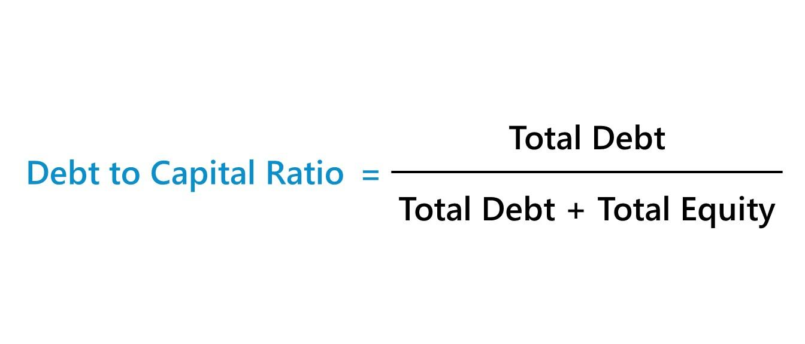

The world of finance is intricate and under perpetual change, characterized by a multitude of tools and metrics designed to evaluate a company's financial health. Among these analytical tools, financial ratios play a pivotal role. They are indispensable for assessing a company's risk and profitability, providing foundational insights that shape investment strategies. This article zeroes in on one specific financial metric: the debt-to-capital ratio. This metric is of paramount importance within the broader context of capital structure analysis and its consequential application in algorithmic trading.

Understanding the debt-to-capital ratio is crucial for gaining insights into a company's use of leverage. This ratio measures the proportion of a company's capital that is financed through debt, reflecting its financial risk and stability. A company with a high debt-to-capital ratio is perceived as having greater financial risk, which is a critical factor that investors and creditors consider when making investment or lending decisions. The implications of this ratio extend deeply into trading strategies, where it can serve as a guide for evaluating financial leverage and predicting future performance.



In the era of algorithmic trading, incorporating financial insights such as those derived from the debt-to-capital ratio can significantly optimize investment decision-making. Algorithmic trading, or the use of computer algorithms to execute trades, can be enriched by integrating these metrics, allowing traders to respond dynamically to shifts in market conditions and refine their strategies for enhanced precision and efficacy.

The integration of financial ratios into algorithmic trading frameworks offers a sophisticated approach to investment, enabling traders to harness detailed financial insights in real-time. As we explore the intricacies of financial ratios, particularly the debt-to-capital ratio, we aim to highlight its vital position in modern trading architectures and its potential to revolutionize traditional investment paradigms.

## Table of Contents

## Understanding Financial Ratios

Financial ratios are crucial analytical tools that derive from a company's financial statements, providing insights into its overall operational health. They are invaluable for investors, analysts, and business managers in making informed financial decisions. Broadly, these ratios fall into four main categories: profitability, liquidity, efficiency, and leverage, each serving distinct purposes in financial analysis.

Profitability ratios measure a company's ability to generate earnings relative to sales, assets, and equity. Common examples include the net profit margin, return on assets (ROA), and return on equity (ROE). These ratios help stakeholders assess the company's ability to generate profit over time, which is a key indicator of its financial success and viability. For instance, the net profit margin is calculated as:

$$
\text{Net Profit Margin} = \left( \frac{\text{Net Income}}{\text{Revenue}} \right) \times 100
$$

Liquidity ratios, such as the current ratio and quick ratio, evaluate a company's capacity to meet short-term obligations with its current assets. This aspect is crucial for assessing the immediate financial stability of a company. The current ratio, for example, is calculated using the formula:

$$
\text{Current Ratio} = \frac{\text{Current Assets}}{\text{Current Liabilities}}
$$

Efficiency ratios, including inventory turnover and accounts receivable turnover, focus on how well a company utilizes its assets. They indicate the effectiveness of the company's use of its resources to generate sales. High efficiency ratios often reflect positively on a company's operational performance and managerial efficiency.

Leverage ratios, such as the debt-to-equity ratio and debt-to-capital ratio, provide insights into the extent of a company's financial leverage—its use of borrowed funds to finance operations. These ratios are paramount in evaluating a company's risk profile and capital structure. A commonly used leverage ratio, the debt-to-equity ratio, is computed as:

$$
\text{Debt-to-Equity Ratio} = \frac{\text{Total Debt}}{\text{Shareholders' Equity}}
$$

Each category of financial ratios offers diverse perspectives on a company's operational and financial status, aiding in the appraisal of its past performance and predicting future performance trends. The accurate interpretation of these ratios equips stakeholders to form a solid foundation for evaluating potential risks and returns, guiding strategic business and investment decisions.

## The Debt-to-Capital Ratio: Definition and Significance

The debt-to-capital ratio is a vital indicator used to evaluate the financial leverage of a company. It measures the extent to which a company is financing its operations through debt compared to its total capital, which includes both debt and shareholders' equity. The ratio is simply calculated as follows:

$$
\text{Debt-to-Capital Ratio} = \frac{\text{Total Debt}}{\text{Total Debt} + \text{Shareholders' Equity}}
$$

This metric provides insights into the financial risk associated with a company's capital structure. A higher ratio indicates a larger proportion of debt in the company’s financing, suggesting that the company is potentially exposed to higher financial risk. It implies that the company relies more heavily on borrowed funds, which may increase its vulnerability to market fluctuations and [interest rate](/wiki/interest-rate-trading-strategies) changes. On the other hand, a lower debt-to-capital ratio signifies a more conservative financing strategy, with less reliance on debt.

Understanding this ratio is crucial for stakeholders, as it informs them about the financial strategies adopted by a company. A company with a higher debt-to-capital ratio might be aggressively pursuing growth opportunities, leveraging debt to fund expansion or acquisitions. However, this can also lead to increased pressure to meet debt obligations, particularly in times of economic downturns or when revenue streams are disrupted.

For investors and analysts, this ratio is an invaluable tool for comparing companies within the same industry. It helps in assessing which companies might be taking on excessive risk versus those maintaining a balanced approach to financing. Moreover, the debt-to-capital ratio is an essential component when evaluating the cost of capital for a company, as it influences both the cost of equity and cost of debt, based on the perceived risk associated with the company's financial structure.

In conclusion, the debt-to-capital ratio provides a straightforward yet comprehensive measure of a company's debt levels relative to its overall capital base, offering critical insights into its financial leverage and risk profile.

## Financial Ratios and Capital Structure

Capital structure refers to the combination of debt and equity that a company utilizes to fund its operations and growth. This composition is crucial for understanding a company’s financial leverage and stability. Financial leverage, or the use of borrowed capital, can amplify returns but also increases risk, thus making the understanding of this mix vital for stakeholders.

Evaluating the balance between debt and equity is imperative for assessing the company's financial strategy and risk profile. A key metric used in this analysis is the debt-to-equity ratio, calculated as:

$$
\text{Debt-to-Equity Ratio} = \frac{\text{Total Debt}}{\text{Total Equity}}
$$

This ratio helps investors and analysts determine how much of a company's operations are financed through debt versus its own funds. A higher ratio can indicate aggressive borrowing practices, potentially increasing the company's risk of financial distress during economic downturns. Conversely, a lower ratio might suggest a more conservative approach, relying more heavily on equity financing.

Analyzing leverage ratios such as the debt-to-equity ratio enables stakeholders to assess a company's long-term sustainability. These ratios inform about the company's ability to meet its financial obligations, maintain operations, and pursue expansion without over-relying on borrowed funds. Companies must carefully manage their capital structure to optimize their cost of capital while maintaining financial flexibility.

In summary, financial ratios are integral for understanding a company’s capital structure and its implications on financial health and strategic decision-making. By examining these ratios, stakeholders can gain insights into a company’s capability to sustain its operations and achieve long-term financial goals.

## Algorithmic Trading and Financial Ratios

Algorithmic trading employs sophisticated computer programs to execute trades with precision and speed, relying on pre-set criteria. One significant aspect of these criteria involves financial ratios, such as the debt-to-capital ratio. This integration can greatly enhance the precision and efficacy of the algorithms.

Financial ratios provide algorithmic traders with quantitative measures of a company's financial health, serving as key indicators in trade decision-making processes. The debt-to-capital ratio is particularly vital because it represents a firm's financial leverage by comparing its total debt to its total capital. When integrated into [algorithmic trading](/wiki/algorithmic-trading) systems, this ratio can influence decisions on trading direction, timing, and magnitude.

For instance, a high debt-to-capital ratio indicates a company might be over-leveraged, suggesting a potential risk in equity holdings. An algorithm might be structured to trigger sell orders or reduce exposures if a company's debt-to-capital ratio exceeds a certain threshold, thus managing risk effectively. Python, a popular language for implementing such algorithms due to its robust libraries, can be used to manage trading strategies incorporating this ratio. Below is a simple example of how Python might be used to analyze changes in this ratio:

```python
def calculate_debt_to_capital(total_debt, total_capital):
    return total_debt / total_capital

def adjust_trading_strategy(company_data):
    for company in company_data:
        debt_to_capital_ratio = calculate_debt_to_capital(company['total_debt'], company['total_capital'])
        if debt_to_capital_ratio > threshold:
            execute_sell_order(company['stock_symbol'])
        else:
            evaluate_buying_opportunity(company['stock_symbol'])

```

Incorporating real-time financial data ensures that algorithms can adapt swiftly to market fluctuations. With high-frequency trading, even minute changes in financial ratios can be leveraged to exploit short-term market opportunities. Dynamic adjustments based on the debt-to-capital ratio enable traders to maintain a competitive edge in various market conditions.

The ability to semantically embed gearing ratios into trading strategies ensures that the decisions are data-driven and less susceptible to human error or bias. By systematically utilizing financial ratios, algorithms not only optimize trading decisions but also enhance risk management, ensuring sustainable investment practices.

## Incorporating Financial Ratios into Trading Strategies

Incorporating financial ratios into trading strategies involves employing algorithms that leverage these metrics to make informed trading decisions. A fundamental aspect of this process is the use of [backtesting](/wiki/backtesting). Backtesting involves applying a trading strategy to historical data to evaluate its effectiveness. By simulating trades based on previous market conditions, traders can refine their strategies to identify patterns and anomalies associated with certain financial ratios.

Algorithmic traders often utilize the debt-to-capital ratio, among other financial ratios, to assess the leverage and financial health of a company in real time. This dynamic evaluation enables traders to adjust their positions in response to changes in these ratios, optimizing the risk-reward balance. For instance, a sudden increase in a company's debt-to-capital ratio might signal potential financial distress, prompting an algorithm to reduce exposure or take a short position.

Here is a basic Python example illustrating how one might incorporate a financial ratio like the debt-to-capital ratio into an algorithmic trading strategy:

```python
import pandas as pd

def debt_to_capital_ratio(total_debt, shareholders_equity):
    return total_debt / (total_debt + shareholders_equity)

def trading_strategy(df):
    signals = []
    for index, row in df.iterrows():
        ratio = debt_to_capital_ratio(row['Total Debt'], row['Shareholders Equity'])
        if ratio > 0.6:  # Example threshold
            signals.append('SELL')
        elif ratio < 0.4:
            signals.append('BUY')
        else:
            signals.append('HOLD')
    return signals

# Example DataFrame with historical financial data
data = {'Total Debt': [100, 200, 150, 300, 250],
        'Shareholders Equity': [400, 300, 350, 400, 450]}

df = pd.DataFrame(data)

trade_signals = trading_strategy(df)
print(trade_signals)
```

In this script, a simplistic trading decision is made based on the debt-to-capital ratio. The algorithm suggests a 'SELL' action when the ratio exceeds 0.6, indicating a high level of debt, and a 'BUY' action when the ratio falls below 0.4, potentially signaling a healthier balance sheet.

Practical applications of such algorithms demonstrate how financial ratios can manage risks and seize market opportunities effectively. The adaptability of these algorithms is crucial as they can recalibrate based on incoming data, ensuring that the trading strategy remains aligned with the company's financial indicators. By aligning algorithmic decisions with comprehensive financial analysis, traders can gain a more nuanced understanding of market movements and enhance their investment outcomes.

## Benefits and Challenges

Utilizing financial ratios in trading strategies offers significant advantages. These metrics provide a comprehensive view of a company's financial health, enabling traders to conduct detailed risk assessments and enhance trading accuracy. Financial ratios allow traders to evaluate key aspects of a firm's performance, such as profitability, debt levels, and investment efficiency, which are crucial for making informed trading decisions and managing risk effectively.

One of the primary benefits is the ability to quantify a company's financial risks systematically. Ratios such as the debt-to-capital ratio help traders understand how much of a company's capital structure is financed through debt, which can be indicative of financial risk levels. By integrating this information into trading algorithms, traders can optimize their strategies based on current financial data, thus improving their ability to predict market movements and react promptly.

However, incorporating financial ratios into trading strategies is not without its challenges. Ensuring the integrity and accuracy of the financial data used is paramount. Inaccurate or outdated data can lead to erroneous conclusions and poor trading decisions. Therefore, maintaining a robust system for data validation and real-time data feeds is essential for the reliability of trading algorithms.

Another significant challenge is adapting algorithms to changing market dynamics. Financial ratios are inherently backward-looking, relying on historical financial statements. Thus, they may not fully capture future market conditions or sudden shifts in economic environments. Traders must develop adaptive models that can recalibrate based on both current and predicted changes in market conditions, ensuring that their strategies remain effective and relevant.

In summary, while the use of financial ratios in trading strategies enhances risk management and decision-making, it necessitates stringent data management and adaptive algorithm development to address inherent challenges in a dynamic market environment.

## Conclusion

The integration of financial ratios into algorithmic trading provides a critical advantage by enhancing decision-making processes. Through the effective use of these metrics, traders can finely tune their strategies, optimizing for both risk management and investment returns. Financial ratios, particularly the debt-to-capital ratio, offer invaluable insights into a company's financial health. This ratio serves as a barometer for understanding leverage and assessing the sustainability of a company’s financial practices.

In algorithmic trading, the ability to quantify and integrate these insights into algorithmic models allows traders to make data-driven decisions that are both timely and informed. The adaptability of algorithms ensures that they can respond swiftly to changes in financial indicators, harnessing the power of real-time data. As such, incorporating financial ratios into trading strategies enables a more dynamic approach—one that can mitigate risks while maximizing opportunities for gain.

As the financial industry continues its rapid evolution, driven by technological advancements and increasing data availability, the importance of these metrics in both traditional and algorithmic trading frameworks is expected to grow. They remain pivotal in providing transparency, shaping strategic decisions, and championing a disciplined approach to trading. By embedding financial ratios into trading algorithms, financial professionals are equipped with the means to stay ahead in a competitive market landscape, reinforcing the essential role these metrics play in contemporary finance.

## References & Further Reading

Books, articles, and resources provide valuable insights into financial ratios and their applications in trading, offering readers a deeper understanding of these critical financial metrics. For those interested in enhancing their knowledge about financial ratios, algorithmic trading, and capital structures, the following resources are recommended:

1. **Books**:
   - *Financial Ratios for Executives: How to Assess Company Strength, Fix Problems, and Make Better Decisions* by Michael Rist. This book offers practical guidance for executives and traders to utilize financial ratios effectively.
   - *Algorithmic Trading: Winning Strategies and Their Rationale* by Ernie Chan. This resource explores various strategies in algorithmic trading, including the integration of financial ratios for improved decision-making.
   - *The Essentials of Financial Analysis* by Samuel Weaver and J. Fred Weston. It provides a comprehensive overview of financial ratios and their applications in assessing a company's financial health.

2. **Articles and Papers**:
   - "The Role of Leverage in Financial Markets" published in the *Journal of Finance*. This paper discusses how leverage ratios like the debt-to-capital ratio impact market behavior and investment strategies.
   - "Enhancing Algorithmic Trading with Fundamental Financial Ratios" from *Algorithmic Finance*. The article focuses on how integrating financial ratios into trading algorithms can improve trading outcomes.

3. **Online Resources**:
   - Investopedia offers an extensive library of articles on financial ratios, their calculations, and interpretations, which are invaluable for both beginners and experienced traders.
   - Khan Academy provides free courses on financial statements and their analysis, including lessons on leveraging financial ratios for better investment insights.

4. **Further Reading on Algorithmic Trading and Capital Structure**:
   - The concise guide *Introduction to Algorithmic Trading: Advanced Trading Strategies and Techniques* by Gayane Hovhannisyan provides insights into crafting effective algorithmic trading strategies that incorporate financial ratios.
   - For those interested in capital structure, *Capital Structure and Corporate Financing Decisions: Theory, Evidence, and Practice* by H. Kent Baker and Gerald S. Martin offers an in-depth exploration of how companies manage their capital structures and the strategic use of debt.

These recommended resources should serve as a solid foundation for anyone seeking to enhance their understanding of financial ratios and their practical applications in evaluating company health and constructing sophisticated trading strategies.