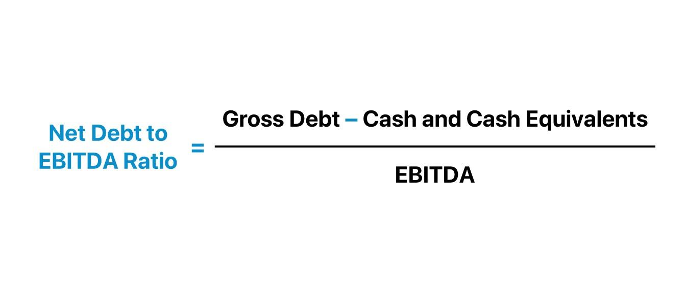

## Table of Contents

## What is the Debt-to-EBITDA ratio?

The Debt-to-EBITDA ratio is a financial metric used to assess a company's ability to pay off its debts. It compares a company's total debt to its earnings before interest, taxes, depreciation, and amortization (EBITDA). A lower ratio means the company has less debt compared to its earnings, which is generally seen as a sign of better financial health.

This ratio is often used by investors and creditors to evaluate the risk of lending money to a company or investing in it. A higher Debt-to-EBITDA ratio might suggest that a company could struggle to manage its debt, especially if its earnings decrease. Generally, a ratio of less than 3 is considered good, but this can vary by industry.

## Why is the Debt-to-EBITDA ratio important for businesses?

The Debt-to-EBITDA ratio is important for businesses because it helps them understand how much debt they have compared to their earnings. This ratio tells a business if it can easily pay back what it owes. If the ratio is low, it means the business is in a good spot because it has enough earnings to cover its debts. This makes the business look safer to people who might want to lend money or invest in it.

On the other hand, if the Debt-to-EBITDA ratio is high, it can be a warning sign. It might mean the business is struggling to make enough money to pay off its debts. This can scare away lenders and investors because they worry the business might not be able to pay them back. Knowing this ratio helps businesses make smart choices about borrowing money and managing their finances to stay healthy and grow.

## How is the Debt-to-EBITDA ratio calculated?

The Debt-to-EBITDA ratio is calculated by dividing a company's total debt by its EBITDA. Total debt includes both short-term and long-term liabilities, such as loans, bonds, and other borrowings. EBITDA stands for Earnings Before Interest, Taxes, Depreciation, and Amortization, which is a measure of a company's operating performance.

To find the ratio, you first need to add up all the debt the company has. Then, you calculate the EBITDA by taking the company's earnings and adding back the interest, taxes, depreciation, and amortization that were subtracted to get those earnings. Once you have both numbers, you divide the total debt by the EBITDA to get the Debt-to-EBITDA ratio.

## What does a high Debt-to-EBITDA ratio indicate?

A high Debt-to-EBITDA ratio means a company has a lot of debt compared to the money it makes. This can be a warning sign that the company might have trouble paying back what it owes. If a company's earnings drop, it could struggle even more to manage its debt, which might scare away people who want to lend money or invest in the business.

However, a high ratio isn't always bad. Sometimes, a company might take on a lot of debt on purpose to grow quickly or buy other businesses. If the company has a good plan and can keep making enough money, a high Debt-to-EBITDA ratio might not be a big problem. But it's important for the company to watch this ratio closely to make sure it doesn't get too high and cause trouble.

## What does a low Debt-to-EBITDA ratio suggest?

A low Debt-to-EBITDA ratio means a company doesn't have a lot of debt compared to the money it makes. This is good because it shows the company can easily pay back what it owes. If a company has a low ratio, it looks safer to people who might want to lend money or invest in it. They feel more confident that the company won't have trouble paying them back.

However, a very low ratio might also mean the company isn't using debt to grow. Sometimes, taking on some debt can help a business expand or buy new things that can make more money in the future. So, while a low Debt-to-EBITDA ratio is usually a good sign, it's important for the company to find the right balance between having enough debt to grow and not having so much that it becomes risky.

## How does the Debt-to-EBITDA ratio differ from the Debt-to-Equity ratio?

The Debt-to-EBITDA ratio and the Debt-to-Equity ratio are both used to understand how much debt a company has, but they look at it in different ways. The Debt-to-EBITDA ratio compares a company's total debt to its earnings before interest, taxes, depreciation, and amortization (EBITDA). This tells you how many years it would take for a company to pay off its debt if it used all its EBITDA to do so. It's a good way to see if a company can handle its debt with the money it makes from its operations.

On the other hand, the Debt-to-Equity ratio compares a company's total debt to its shareholders' equity. This ratio shows how much the company is financed by debt compared to what the owners have put into the business. It helps people understand the balance between debt and equity in the company's capital structure. While the Debt-to-EBITDA ratio focuses on the company's ability to pay off debt with its earnings, the Debt-to-Equity ratio looks at the overall financial structure and risk from the perspective of the company's owners.

## What is considered a good Debt-to-EBITDA ratio in different industries?

A good Debt-to-EBITDA ratio can be different depending on the industry. In industries like utilities or telecoms, where big projects need a lot of money, a ratio of 4 or 5 might be okay. These industries often have steady income, so they can handle more debt. But in industries like technology or retail, where things can change quickly, a lower ratio of around 2 or 3 is usually better. These industries need to be more careful with debt because their earnings can go up and down.

It's also important to compare a company's Debt-to-EBITDA ratio with others in the same industry. What's good for one company might not be good for another. For example, if most companies in an industry have a ratio of about 3, a company with a ratio of 5 might be seen as riskier. But if everyone in the industry has a higher ratio because of how the industry works, then a ratio of 5 might not be a problem. So, it's not just about the number itself, but how it fits with what's normal in the industry.

## How can a company improve its Debt-to-EBITDA ratio?

A company can improve its Debt-to-EBITDA ratio by focusing on increasing its earnings or reducing its debt. One way to boost earnings is by growing the business, which can be done by finding new customers, selling more to existing customers, or raising prices if the market allows. Another way is to cut costs, like reducing expenses on things that aren't necessary or finding cheaper ways to do things. By making more money, the company's EBITDA goes up, which helps lower the Debt-to-EBITDA ratio.

The other way to improve the ratio is by paying down debt. A company can do this by using extra cash to pay off loans or by refinancing debt to get better terms, like lower interest rates. Sometimes, a company might sell off assets it doesn't need to get cash to pay down debt. By reducing the total amount of debt, the company's Debt-to-EBITDA ratio goes down, making it look healthier to lenders and investors.

## What are the limitations of using the Debt-to-EBITDA ratio as a financial metric?

The Debt-to-EBITDA ratio is helpful, but it has some limits. One big problem is that it doesn't think about how much a company needs to spend to keep running. For example, if a company has to spend a lot of money to keep its machines working, the ratio might make the company look healthier than it really is. Also, different industries have different normal ratios, so what's good for one company might not be good for another. This makes it hard to compare companies from different industries just by looking at their Debt-to-EBITDA ratios.

Another limit is that the ratio can be changed by things that don't have to do with how well the company is doing. For example, if a company sells off some of its business, it might look like it has less debt, but it might also have less income coming in. Also, the ratio doesn't tell you if the debt is short-term or long-term, which can be important because short-term debt needs to be paid back faster. So, while the Debt-to-EBITDA ratio is a useful tool, it's important to use it along with other ways of looking at a company's money situation.

## How does the Debt-to-EBITDA ratio impact a company's ability to secure loans?

The Debt-to-EBITDA ratio is important when a company wants to get a loan. Banks and other lenders look at this ratio to see if the company can pay back the money they borrow. If the ratio is low, it means the company doesn't have much debt compared to the money it makes. This makes lenders feel safer because they think the company can easily pay back the loan. So, a company with a low Debt-to-EBITDA ratio is more likely to get a loan with good terms, like lower interest rates.

On the other hand, if the Debt-to-EBITDA ratio is high, it might be harder for a company to get a loan. A high ratio means the company has a lot of debt compared to its earnings, which can scare lenders. They might worry that the company won't be able to pay back the loan, especially if its earnings go down. If a company does get a loan with a high ratio, the lender might charge higher interest rates or ask for more guarantees to make up for the extra risk.

## Can the Debt-to-EBITDA ratio be used to compare companies across different sectors?

The Debt-to-EBITDA ratio can be used to compare companies, but it's not always easy or fair to compare companies from different sectors. Each industry has its own normal range for this ratio. For example, industries like utilities or telecoms might have higher ratios because they need a lot of money for big projects, but they also have steady income. On the other hand, industries like technology or retail might have lower ratios because their earnings can change a lot. So, if you compare a tech company with a utility company just by looking at their Debt-to-EBITDA ratios, you might not get a clear picture of which one is doing better.

To get a better idea, it's important to compare companies within the same sector. This way, you can see how a company's Debt-to-EBITDA ratio stacks up against others in its industry. If a company's ratio is much higher or lower than the average for its sector, that can tell you something about its financial health. But even within the same sector, you need to look at other things too, like how the company makes money and what its plans are for the future. So, while the Debt-to-EBITDA ratio is a useful tool, it's just one part of understanding a company's financial situation.

## How has the interpretation of the Debt-to-EBITDA ratio evolved over time?

The way people look at the Debt-to-EBITDA ratio has changed over time. In the past, this ratio was mostly used by banks and big investors to see if a company could handle its debt. They thought a ratio below 3 was good, but this could be different depending on the industry. As more people started paying attention to how companies manage their money, the Debt-to-EBITDA ratio became more popular. Now, not just big investors but also small investors and business owners use it to make decisions.

Today, the understanding of what makes a good Debt-to-EBITDA ratio has gotten more detailed. People know that what's a good ratio in one industry might not be good in another. For example, industries like utilities might have higher ratios because they need a lot of money for big projects, but they also have steady income. Also, with changes in the economy and new ways of doing business, people look at this ratio along with other numbers to get a full picture of a company's health. So, while the basic idea of the ratio hasn't changed, how it's used and understood has become more complex and tailored to different situations.

## What is the Debt-to-EBITDA Ratio and how can it be understood?

The Debt-to-EBITDA ratio is a key financial metric used to evaluate a company’s ability to manage and repay its debt. This ratio is calculated by dividing a company's total debt by its earnings before interest, taxes, depreciation, and amortization (EBITDA). The formula can be expressed as:

$$
\text{Debt-to-EBITDA Ratio} = \frac{\text{Total Debt}}{\text{EBITDA}}
$$

This metric serves as a snapshot of a company's financial leverage and risk profile. A higher Debt-to-EBITDA ratio indicates that a company has a considerable amount of debt relative to its earnings, which suggests elevated financial risk. High levels of debt may restrict a company's financial flexibility and increase its vulnerability to market fluctuations and economic downturns. Such companies may face challenges in meeting debt obligations, potentially leading to [liquidity](/wiki/liquidity-risk-premium) issues.

Conversely, a lower Debt-to-EBITDA ratio is typically viewed favorably as it suggests effective debt management and a lower financial risk. Companies with lower ratios often demonstrate stronger operational performance and greater capacity to service their debt, which can facilitate easier access to additional financing and lower borrowing costs.

The utility of the Debt-to-EBITDA ratio extends across various industry sectors. However, it is essential to recognize that acceptable levels of this ratio can vary significantly between industries due to differing capital structure norms and operational characteristics. For instance, industries with stable cash flows, such as utilities, might have higher ratios, while sectors sensitive to economic cycles, like technology, might maintain lower ratios to mitigate risk.

Overall, the Debt-to-EBITDA ratio is a valuable tool for assessing a company's financial health, providing insights into its leverage and capacity to fulfill debt obligations. However, for a comprehensive analysis, it is often considered alongside other financial metrics.

## What is involved in Calculation and Interpretation?

The calculation of the Debt-to-EBITDA ratio involves dividing a company's total debt by its earnings before interest, taxes, depreciation, and amortization (EBITDA). It is a simple mathematical expression:

$$
\text{Debt-to-EBITDA Ratio} = \frac{\text{Total Debt}}{\text{EBITDA}}
$$

This straightforward formula can uncover significant financial risks that might not be immediately evident. For instance, a company with a total debt of $100 million and an EBITDA of $10 million results in a Debt-to-EBITDA ratio of 10. This high ratio indicates that the company has a substantial debt burden compared to its earnings before interest, taxes, depreciation, and amortization, suggesting potential financial stress if its earnings were to fluctuate.

Moreover, industry variations play a critical role in interpreting this ratio. Different sectors exhibit varying capital structures. Industries such as utilities and telecommunications often operate with higher debt levels due to the substantial infrastructure investments required, making higher ratios somewhat customary. In contrast, sectors like technology might exhibit lower ratios reflective of their capital-light business models. Therefore, understanding these nuances is essential when evaluating a company's financial health against its industry peers.

While the Debt-to-EBITDA ratio offers valuable insights, it should be evaluated in conjunction with industry standards and other financial metrics to form a holistic view of a company's financial stability and risk profile.

## References & Further Reading

[1]: ["Corporate Finance"](https://www.investopedia.com/terms/c/corporatefinance.asp) by Jonathan Berk and Peter DeMarzo

[2]: ["Advances in Financial Machine Learning"](https://www.amazon.com/Advances-Financial-Machine-Learning-Marcos/dp/1119482089) by Marcos Lopez de Prado

[3]: ["Quantitative Risk Management: Concepts, Techniques, and Tools"](http://assets.press.princeton.edu/chapters/c10496.pdf) by Alexander J. McNeil, Rüdiger Frey, and Paul Embrechts

[4]: ["Principles of Corporate Finance"](https://www.amazon.com/Principles-Corporate-Finance-Richard-Brealey/dp/0077404890) by Richard A. Brealey, Stewart C. Myers, and Franklin Allen

[5]: ["Machine Learning for Algorithmic Trading"](https://github.com/stefan-jansen/machine-learning-for-trading) by Stefan Jansen