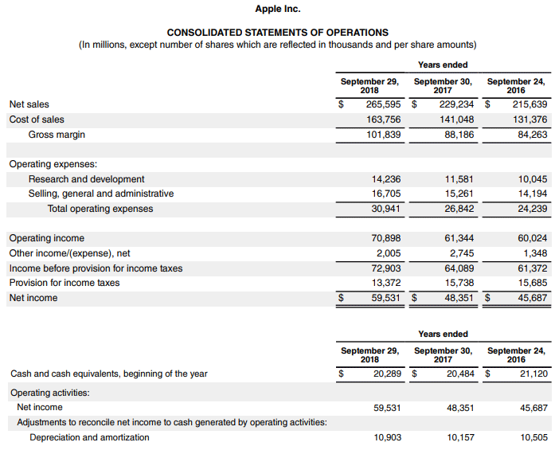

The financial world is full of metrics that help assess the fiscal health of companies. Among these metrics, the Debt-to-EBITDA ratio stands out as a significant indicator of a company's financial leverage. It provides a snapshot of a firm's ability to manage its debts relative to its earnings, excluding interest, taxes, depreciation, and amortization (EBITDA). This ratio is widely used by analysts, investors, and lenders to evaluate the financial health and creditworthiness of a business.

In the context of algorithmic trading, the Debt-to-EBITDA ratio becomes crucial for designing trading algorithms that can synthesize vast amounts of data to make informed decisions. By incorporating financial metrics such as this ratio into trading models, traders can enhance their strategies to monitor potential investment opportunities with a better risk-reward balance.



This article will explore the Debt-to-EBITDA ratio, emphasizing its calculation and interpretation, significance for lenders and investors, and role within algorithmic trading strategies. Through this examination, we aim to provide insights for traders and investors keen on optimizing their approaches using this pivotal financial metric. Understanding how to effectively apply the Debt-to-EBITDA ratio can empower market participants to become more adept at managing the dynamic nature of financial markets.

## Table of Contents

## Understanding the Debt-to-EBITDA Ratio

The Debt-to-EBITDA ratio is a key financial metric used to evaluate a company’s ability to manage and repay its debt. This ratio is calculated by dividing a company's total debt by its earnings before interest, taxes, depreciation, and amortization (EBITDA). The formula can be expressed as:

$$
\text{Debt-to-EBITDA Ratio} = \frac{\text{Total Debt}}{\text{EBITDA}}
$$

This metric serves as a snapshot of a company's financial leverage and risk profile. A higher Debt-to-EBITDA ratio indicates that a company has a considerable amount of debt relative to its earnings, which suggests elevated financial risk. High levels of debt may restrict a company's financial flexibility and increase its vulnerability to market fluctuations and economic downturns. Such companies may face challenges in meeting debt obligations, potentially leading to [liquidity](/wiki/liquidity-risk-premium) issues.

Conversely, a lower Debt-to-EBITDA ratio is typically viewed favorably as it suggests effective debt management and a lower financial risk. Companies with lower ratios often demonstrate stronger operational performance and greater capacity to service their debt, which can facilitate easier access to additional financing and lower borrowing costs.

The utility of the Debt-to-EBITDA ratio extends across various industry sectors. However, it is essential to recognize that acceptable levels of this ratio can vary significantly between industries due to differing capital structure norms and operational characteristics. For instance, industries with stable cash flows, such as utilities, might have higher ratios, while sectors sensitive to economic cycles, like technology, might maintain lower ratios to mitigate risk.

Overall, the Debt-to-EBITDA ratio is a valuable tool for assessing a company's financial health, providing insights into its leverage and capacity to fulfill debt obligations. However, for a comprehensive analysis, it is often considered alongside other financial metrics.

## Calculation and Interpretation

The calculation of the Debt-to-EBITDA ratio involves dividing a company's total debt by its earnings before interest, taxes, depreciation, and amortization (EBITDA). It is a simple mathematical expression:

$$
\text{Debt-to-EBITDA Ratio} = \frac{\text{Total Debt}}{\text{EBITDA}}
$$

This straightforward formula can uncover significant financial risks that might not be immediately evident. For instance, a company with a total debt of $100 million and an EBITDA of $10 million results in a Debt-to-EBITDA ratio of 10. This high ratio indicates that the company has a substantial debt burden compared to its earnings before interest, taxes, depreciation, and amortization, suggesting potential financial stress if its earnings were to fluctuate.

Moreover, industry variations play a critical role in interpreting this ratio. Different sectors exhibit varying capital structures. Industries such as utilities and telecommunications often operate with higher debt levels due to the substantial infrastructure investments required, making higher ratios somewhat customary. In contrast, sectors like technology might exhibit lower ratios reflective of their capital-light business models. Therefore, understanding these nuances is essential when evaluating a company's financial health against its industry peers.

While the Debt-to-EBITDA ratio offers valuable insights, it should be evaluated in conjunction with industry standards and other financial metrics to form a holistic view of a company's financial stability and risk profile.

## Significance for Lenders and Investors

Lenders often rely on the Debt-to-EBITDA ratio to evaluate a company's creditworthiness and establish loan covenants. This ratio serves as an essential metric that highlights a company's capacity to repay its debts relative to its earnings. For lenders, a lower Debt-to-EBITDA ratio is generally perceived as a positive indicator, signifying that the company possesses a robust ability to fulfill its debt obligations. This lower ratio implies less financial risk, making the company a more attractive candidate for lending, as it suggests the company is less likely to default on its debt.

From an investor's perspective, the Debt-to-EBITDA ratio plays a pivotal role in assessing the risk associated with a company’s debt levels. Investors often use this metric to compare companies within the same industry, aiding in the identification of firms with potentially excessive debt burdens. A higher Debt-to-EBITDA ratio might indicate that a company is over-leveraged, increasing the risk of financial distress, especially in economic downturns. Conversely, a lower ratio could point to prudent debt management, enhancing investor confidence in the company's financial stability and long-term viability.

Furthermore, industry benchmarks are important when interpreting this ratio since different sectors have varying thresholds for what constitutes an acceptable Debt-to-EBITDA level. For example, capital-intensive industries, such as utilities or telecommunications, may generally operate with higher ratios due to the nature of their business models that require significant capital investment. Investors and lenders must therefore consider sector-specific norms when making informed decisions based on this financial metric.

In summary, the Debt-to-EBITDA ratio is a critical tool for both lenders and investors, offering insights into a company's financial leverage and risk profile. A careful evaluation of this ratio, alongside industry standards and other financial metrics, can lead to better-informed financial assessments and decision-making.

## Limitations of the Debt-to-EBITDA Ratio

The Debt-to-EBITDA ratio, while a widely utilized financial metric, has several limitations that require careful consideration. One primary limitation is its exclusion of interest, depreciation, and tax expenses. The absence of these factors in the ratio can sometimes lead to an overly optimistic view of a company's profitability and financial health. For instance, two companies with identical Debt-to-EBITDA ratios might have vastly different actual profitability when these costs are considered, as interest expenses can vary greatly depending on the company's borrowing costs and capitalization structure.

Moreover, the reliance on EBITDA can introduce variability due to the use of non-GAAP measures, which companies might employ to present a more favorable financial picture. EBITDA is not a standardized measure under Generally Accepted Accounting Principles (GAAP), allowing companies to make adjustments that can potentially skew the ratio. For example, certain companies might add back extraordinary expenses to EBITDA, inflating the earnings figure and thus lowering the Debt-to-EBITDA ratio artificially.

Additionally, the Debt-to-EBITDA ratio should be interpreted in the context of industry norms. Industries with capital-intensive operations, such as utilities and telecommunications, typically [carry](/wiki/carry-trading) higher debt levels as part of standard business practices. Therefore, a ratio that appears high in one industry may be quite reasonable in another. Such sector-specific differences necessitate a more comprehensive assessment that includes other financial metrics alongside Debt-to-EBITDA.

In summary, while the Debt-to-EBITDA ratio is a useful indicator of financial leverage, it must be evaluated with an understanding of its limitations. It is prudent to accompany this analysis with additional financial metrics and qualitative factors to gain a more accurate picture of a company's financial health. This multifaceted approach helps mitigate the risks associated with relying solely on one quantitative measurement.

## Role in Algorithmic Trading

Algorithmic trading integrates various quantitative metrics to develop and execute trading strategies. Among these metrics, the Debt-to-EBITDA ratio is particularly significant because it helps quantify the financial risk associated with holding specific investment assets. By evaluating the degree of financial leverage a company carries, traders can make informed decisions about the risk-return profile of potential trades.

Algorithms can be programmed to analyze a company's financial health, flagging those with high or increasing Debt-to-EBITDA ratios. For instance, a high ratio may suggest elevated financial risk, prompting algorithms to reduce positions in those investments to avoid potential losses. Conversely, a lower ratio can signal sound financial management, potentially indicating a safer investment. This kind of financial scrutiny allows for a systematic approach to assessing risk, where adjustments are made dynamically based on financial health indicators.

Here's a simple Python example illustrating how an algorithm might use the Debt-to-EBITDA ratio:

```python
def assess_company(debt, ebitda):
    # Calculate the Debt-to-EBITDA ratio
    if ebitda > 0:
        debt_to_ebitda = debt / ebitda
    else:
        return "EBITDA must be greater than 0"

    # Decision rule based on Debt-to-EBITDA ratio
    if debt_to_ebitda > 5:
        return "High Risk - Consider reducing position"
    elif debt_to_ebitda < 3:
        return "Low Risk - Consider maintaining or increasing position"
    else:
        return "Moderate Risk - Monitor closely"

# Example usage:
company_debt = 120  # in millions
company_ebitda = 30  # in millions

risk_assessment = assess_company(company_debt, company_ebitda)
print(risk_assessment)
```

This code snippet assesses a company’s risk level based on its Debt-to-EBITDA ratio and suggests trading actions. While simplistic, it exemplifies how algorithms evaluate financial metrics to automate decision-making processes, crucial for the swift nature of [algorithmic trading](/wiki/algorithmic-trading). In practice, such algorithms would be more complex and consider various other factors alongside the Debt-to-EBITDA ratio to optimize trade outcomes. By leveraging financial metrics like this ratio, traders can maintain a balanced portfolio that adjusts dynamically to changes in financial health indicators.

## Conclusion

The Debt-to-EBITDA ratio is a key indicator that plays a pivotal role in both traditional financial analysis and algorithmic trading. This metric provides valuable insights into a company’s ability to manage its debt effectively, offering an assessment of the financial stability that is critical for making informed investment decisions. It highlights how much debt a company carries relative to its earnings, offering a snapshot of its financial leverage and risk profile.

For traders and investors aiming to craft optimal trading strategies, it is imperative to incorporate the Debt-to-EBITDA ratio alongside other financial indicators. This combination helps elucidate a more comprehensive view of a company's financial health and risk factors, thereby facilitating a more informed decision-making process. Considering this ratio alone might not capture the entire financial landscape, so integrating it with other metrics, such as interest coverage ratio or cash flow analysis, is beneficial. This integration can be implemented in algorithmic trading strategies by programming algorithms to analyze these multiple factors together, assessing the holistic financial condition of potential investments.

By adopting a well-rounded approach, traders and investors can aim to achieve a balanced risk and reward profile in the ever-evolving landscape of algorithmic trading. Algorithms can be calibrated to adjust positions in a dynamic manner, responding to changes in a company’s financial metrics. In doing so, algorithmic strategies can become more robust, aligning risk management with potential rewards, and maintaining agility to capitalize on market opportunities efficiently.

## References & Further Reading

[1]: ["Corporate Finance"](https://www.investopedia.com/terms/c/corporatefinance.asp) by Jonathan Berk and Peter DeMarzo

[2]: ["Advances in Financial Machine Learning"](https://www.amazon.com/Advances-Financial-Machine-Learning-Marcos/dp/1119482089) by Marcos Lopez de Prado

[3]: ["Quantitative Risk Management: Concepts, Techniques, and Tools"](http://assets.press.princeton.edu/chapters/c10496.pdf) by Alexander J. McNeil, Rüdiger Frey, and Paul Embrechts

[4]: ["Principles of Corporate Finance"](https://www.amazon.com/Principles-Corporate-Finance-Richard-Brealey/dp/0077404890) by Richard A. Brealey, Stewart C. Myers, and Franklin Allen

[5]: ["Machine Learning for Algorithmic Trading"](https://github.com/stefan-jansen/machine-learning-for-trading) by Stefan Jansen