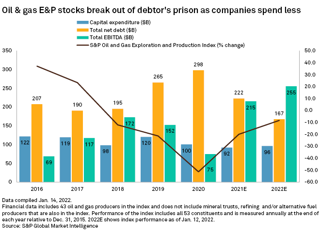

The dynamic landscape of the oil and gas industry presents numerous investment opportunities and challenges that investors and analysts must navigate. To make informed decisions, it is crucial to understand the financial metrics that drive this sector. Among these metrics, the debt-to-equity (D/E) ratio holds significant importance, providing insights into a company's financial leverage and stability. This article will highlight the significance of the D/E ratio and other financial metrics relevant to oil and gas companies. Additionally, the rising trend of algorithmic trading impacts financial analysis by offering advanced tools to interpret complex datasets. Through algorithmic trading, investors can process vast amounts of information, enhancing their ability to make swift and informed decisions. Our comprehensive overview will equip investors with the knowledge needed to navigate the complexities of financial metrics and algorithmic trading strategies in the oil and gas industry. This approach promises to provide a competitive edge in this ever-evolving market.

## Table of Contents



## Understanding the Debt-to-Equity Ratio

The debt-to-equity (D/E) ratio is a critical financial metric that serves as an indicator of a company's financial leverage. It is defined mathematically as:

$$
\text{Debt-to-Equity Ratio} = \frac{\text{Total Liabilities}}{\text{Shareholders' Equity}}
$$

In the oil and gas sector, this ratio provides insights into how a company finances its operations through debt versus wholly owned funds. A low D/E ratio typically suggests conservative financial management, which may be vital for stability amidst fluctuating oil prices and volatile market conditions. Oil and gas companies often maintain relatively low D/E ratios due to the capital-intensive nature of their operations, where immense capital expenditure is required for exploration, extraction, and production activities. 

This sector's preference for a balanced D/E ratio is influenced by several factors. High debt levels might increase vulnerability during downturns, such as those caused by plummeting oil prices. Conversely, too little debt may suggest potential under-leveraging, missing out on growth opportunities to finance expansive projects at potentially favorable interest rates. Thus, a moderate D/E ratio can indicate a sound balance between risk and growth potential.

For investors, analyzing a company's D/E ratio can aid in assessing its risk profile and financial health. A higher ratio might signal greater risk, as the company is more reliant on borrowed funds, while a lower ratio implies a more secure financial position with less debt obligation. However, the ideal D/E ratio varies across different sectors within the industry, influenced by factors such as regional economic stability and global oil prices. Understanding these nuances is essential for informed investment decisions in the oil and gas industry.

## Financial Metrics in Oil and Gas

In addition to the debt-to-equity (D/E) ratio, analyzing other financial metrics is essential when valuing oil and gas companies. Key metrics such as EBITDA, EV/EBITDA, and cash flow per share offer crucial insights into a company's operational and financial health, aiding analysts in making well-informed investment decisions within the sector.

**EBITDA (Earnings Before Interest, Taxes, Depreciation, and Amortization):**

EBITDA is a popular metric used to evaluate a company's operating performance. It provides a clear picture of profitability by excluding the non-operating expenses and non-cash charges such as depreciation and amortization. The formula for EBITDA is:

$$
\text{EBITDA} = \text{Net Income} + \text{Interest} + \text{Taxes} + \text{Depreciation} + \text{Amortization}
$$

In the oil and gas industry, EBITDA helps compare companies by focusing on operational efficiency and profitability without the influence of capital structure and tax environments, which can vary significantly between companies and countries.

**EV/EBITDA (Enterprise Value to EBITDA Ratio):**

The EV/EBITDA ratio is a valuation metric that compares a company's enterprise value (EV) to its EBITDA. This ratio is useful for assessing a company's valuation while considering debt and cash levels:

$$
\text{EV/EBITDA} = \frac{\text{Enterprise Value}}{\text{EBITDA}}
$$

Enterprise value is calculated as the sum of market capitalization, preferred stock, minority interest, and debt, minus total cash and cash equivalents. The EV/EBITDA ratio is particularly useful in the oil and gas sector where capital-intensive operations mean that companies often [carry](/wiki/carry-trading) significant levels of debt. A lower EV/EBITDA ratio may indicate that a company is undervalued relative to its peers.

**Cash Flow per Share:**

Cash flow per share is an indicator of a company's financial health, representing the cash generated from operations on a per-share basis. It provides insight into a company’s ability to generate cash to fund operations, pay debts, and distribute dividends. The formula is:

$$
\text{Cash Flow per Share} = \frac{\text{Operating Cash Flow} - \text{Preferred Dividends}}{\text{Outstanding Shares}}
$$

For oil and gas companies, which typically experience fluctuating profit margins due to volatile commodity prices, cash flow per share is a vital metric to assess financial stability and the capability to invest in development projects or return capital to shareholders.

By understanding these metrics, analysts can evaluate oil and gas companies from various perspectives, such as operational efficiency, market valuation, and cash generation. This multifaceted analysis is critical for assessing company performance, profitability, and sustainability in the competitive and ever-evolving oil and gas sector.

## The Role of Algorithmic Trading

Algorithmic trading has become a significant component in financial markets, penetrating sectors like oil and gas. It involves the use of advanced algorithms to process vast quantities of data at unprecedented speeds, allowing traders to execute orders that are more informed and timely. This technology leverages mathematical models and statistical analyses to evaluate financial metrics such as the debt-to-equity (D/E) ratio, enabling traders to anticipate market trends and refine trading strategies.

These algorithms are built to analyze patterns across various datasets, including stock prices, trading volumes, and economic indicators. They can identify correlations among these factors, which may not be apparent through traditional analysis. For instance, by continuously monitoring the D/E ratio and other financial metrics, algorithms can predict possible fluctuations in a company's financial health or industry trends, prompting timely buy or sell decisions.

One key advantage of [algorithmic trading](/wiki/algorithmic-trading) is its capacity for automation, allowing for the execution of trades without human intervention. This feature is crucial given the rapid pace of market changes in the oil and gas sector, where delays can mean the difference between significant gains or losses. Automation not only enhances efficiency but also reduces the emotional biases that can influence human decisions.

As technology advances, the integration of [artificial intelligence](/wiki/ai-artificial-intelligence) (AI) and [machine learning](/wiki/machine-learning) into algorithmic trading is expected to enhance these systems further. AI can improve predictive accuracy by learning from historical data and adapting to new data patterns over time. Machine learning models can iterate on this knowledge, identifying even more complex patterns that static algorithms might miss.

For instance, a machine learning algorithm might employ a linear regression model to study the relationship between oil prices and the D/E ratio. Using Python, a simple representation of this approach could involve:

```python
import numpy as np
from sklearn.linear_model import LinearRegression

# Example data representing oil prices and D/E ratios
oil_prices = np.array([[50], [55], [60], [65], [70]])
de_ratios = np.array([1.5, 1.6, 1.7, 1.8, 1.9])

# Creating a linear regression model
model = LinearRegression()
model.fit(oil_prices, de_ratios)

# Predicting the D/E ratio for a new oil price
predicted_de_ratio = model.predict(np.array([[75]]))
print(f"Predicted D/E Ratio for $75 oil price: {predicted_de_ratio}")
```

This code highlights how predictive models can anticipate changes in financial metrics based on previous data patterns, aiding in strategic decision-making.

In conclusion, algorithmic trading stands at the forefront of modern financial analysis within the oil and gas industry. Its ability to swiftly process data and execute trades based on real-time and predictive analytics provides a competitive edge. As AI and machine learning continue to evolve, they are likely to further enhance these capabilities, promising even more sophisticated and accurate trading strategies in the future.

## Trends and Challenges in the Oil and Gas Industry

The oil and gas industry has witnessed a series of transformative trends and challenges, significantly affecting its financial metrics. These changes are largely driven by technological advancements, shifts in energy demand, and economic factors that influence the industry's stability and growth prospects.

Fracking and shale production have revolutionized the oil and gas extraction process, leading to an increase in production capacity and supply. This surge has often contributed to fluctuations in oil prices, as the balance between supply and demand is constantly re-calibrated. Lower oil prices can lead to reduced revenues for companies, necessitating precise financial management to preserve profitability. Consequently, companies must frequently reassess their debt-to-equity (D/E) ratios to ensure they are not over-leveraged, particularly in periods of market [volatility](/wiki/volatility-trading-strategies).

Economic recessions have historically impacted the oil and gas sector by dampening global demand for energy. Such recessions lead to lower oil and gas prices, directly affecting the revenue streams of companies within the sector. In response, firms often concentrate on enhancing efficiency and reducing operational costs. Strategies such as streamlining production processes, optimizing supply chains, and implementing cost-control measures become critical. Furthermore, managing debt becomes a top priority to maintain financial resilience during economic downturns.

To adapt to these shifting dynamics, companies within the oil and gas industry have increasingly focused on diversifying their business models. This includes investments in renewable energy sources and technological innovation, which aim to broaden their energy portfolios and reduce reliance on traditional oil and gas revenues. Diversification not only mitigates financial risk but also aligns businesses with the global transition towards sustainable energy practices.

Investors must maintain a keen awareness of these evolving industry trends to optimize their investment strategies. By monitoring developments in production technologies, market conditions, and financial management practices, investors can better anticipate shifts in company valuations and identify potential opportunities and risks. In a market that is inherently volatile and subject to rapid changes, staying informed and adaptable is crucial for maximizing returns and achieving long-term investment success.

## Conclusion

Financial metrics such as the debt-to-equity ratio are essential for evaluating the financial stability and risk profile of oil and gas companies. This ratio provides insights into a company's financial leverage, helping investors understand how much debt a company is using to finance its operations relative to its equity. A balanced debt-to-equity ratio may indicate a stable financial structure, while a high ratio could imply higher risk, especially in a sector as volatile as oil and gas.

Algorithmic trading has emerged as a powerful tool for investors in this sector, offering a significant advantage through faster and data-driven decision-making processes. By employing sophisticated algorithms, traders can analyze large datasets in real-time, allowing them to react swiftly to market changes and optimize their trading strategies. For instance, algorithms can be designed to take into account financial metrics like the debt-to-equity ratio and anticipate market movements or identify [arbitrage](/wiki/arbitrage) opportunities.

Combining the analytical power of financial metrics with the speed and efficiency of algorithmic trading can provide investors with a comprehensive understanding of the opportunities and risks prevalent in the oil and gas sector. This dual approach enhances the ability to make informed investment decisions by integrating [fundamental analysis](/wiki/fundamental-analysis) with real-time data analytics.

To navigate this ever-evolving market successfully, staying informed about industry trends and technological advancements is paramount. Continuous monitoring of market dynamics, technological progress in trading platforms, and shifts in financial metrics is crucial for maximizing returns and mitigating risks. By leveraging both traditional financial analysis and modern technological tools, investors can strategically position themselves to capitalize on the potential gains within the oil and gas industry while effectively managing associated risks.

## References & Further Reading

[1]: Gogineni, S. (2010). ["Oil and Gas Industry Cost Estimating."](https://onlinelibrary.wiley.com/doi/abs/10.1111/j.1540-6288.2010.00282.x) Oil and Gas Facilities.

[2]: Gaffen, D. (2019). ["Debt-to-Equity Ratios Offer Insight into Oil Company's Financial Health."](https://accountinginsights.org/understanding-debt-ratios-for-financial-health-analysis/) Reuters.

[3]: Hull, J. (2018). ["Options, Futures, and Other Derivatives."](https://www.amazon.com/Options-Futures-Other-Derivatives-10th/dp/013447208X) Pearson.

[4]: Silver, N. (2012). ["The Signal and the Noise: Why So Many Predictions Fail—but Some Don't."](https://www.amazon.com/Signal-Noise-Many-Predictions-Fail-but/dp/0143125087) Penguin Books.

[5]: Narang, R. K. (2013). ["Inside the Black Box: A Simple Guide to Quantitative and High-Frequency Trading,"](https://onlinelibrary.wiley.com/doi/book/10.1002/9781118662717) Wiley.