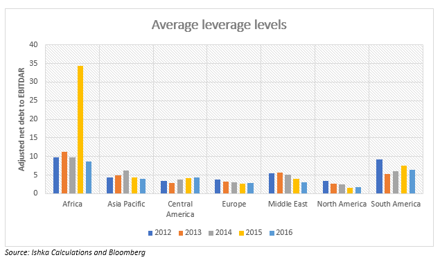

## Table of Contents

## What is the debt-to-equity ratio?

The debt-to-equity ratio is a financial measure that shows how much a company relies on borrowed money compared to money invested by its owners. It is calculated by dividing a company's total liabilities by its total shareholders' equity. This ratio helps investors and analysts understand the company's financial health and how it manages its debts.

A high debt-to-equity ratio can mean that a company might be risky because it uses a lot of borrowed money. If the ratio is low, it might mean the company is more stable because it relies more on money from its owners. However, what is considered a good or bad ratio can vary depending on the industry and the specific situation of the company.

## Why is the debt-to-equity ratio important for the airline industry?

The debt-to-equity ratio is very important for the airline industry because airlines often need a lot of money to buy planes and run their business. Planes are expensive, and airlines usually borrow money to buy them. The debt-to-equity ratio helps show if an airline is borrowing too much money compared to what the owners have put into the company. If the ratio is high, it means the airline is using a lot of borrowed money, which can be risky. If something goes wrong, like a drop in passengers or higher fuel costs, the airline might struggle to pay back its loans.

On the other hand, a lower debt-to-equity ratio can make an airline look more stable and less risky to investors. This is because the company is not relying as much on borrowed money. However, the airline industry can be very competitive, and sometimes airlines need to take on debt to grow or stay competitive. So, while a lower ratio is generally better, what is considered a good ratio can vary. It depends on the specific airline and how it compares to others in the industry.

## How is the debt-to-equity ratio calculated?

The debt-to-equity ratio is calculated by dividing a company's total liabilities by its total shareholders' equity. Total liabilities are all the money the company owes, like loans and bills. Total shareholders' equity is the money that the owners have put into the company, plus any profits that have been kept in the business.

For example, if a company has $100,000 in liabilities and $50,000 in shareholders' equity, the debt-to-equity ratio would be $100,000 divided by $50,000, which equals 2. This means the company has twice as much debt as equity. This simple calculation helps show how much a company relies on borrowed money compared to money from its owners.

## What is considered a healthy debt-to-equity ratio in the airline industry?

In the airline industry, a healthy debt-to-equity ratio can vary, but generally, a ratio between 1 and 2 is often seen as reasonable. This means that for every dollar of equity, the airline has between one and two dollars of debt. Airlines need to borrow money to buy expensive planes and keep their business running, so some debt is normal. But too much debt can be risky, especially if the airline faces problems like fewer passengers or higher fuel costs.

What is considered healthy can also depend on how an airline compares to others in the industry. If most airlines in the industry have a debt-to-equity ratio around 1.5, then an airline with a ratio of 2 might be seen as having too much debt. On the other hand, if the industry average is higher, a ratio of 2 might be seen as okay. It's important for airlines to keep their debt at a level that they can manage, even if things get tough.

## How does the debt-to-equity ratio of airlines compare to other industries?

Airlines often have higher debt-to-equity ratios compared to many other industries. This is because buying airplanes is very expensive, so airlines need to borrow a lot of money. A debt-to-equity ratio of 1 to 2 is common in the airline industry, which means they have between one and two dollars of debt for every dollar of equity. In contrast, industries like technology or retail might have lower ratios, often below 1, because they don't need to spend as much on big, expensive equipment.

For example, tech companies might have a lot of their value in things like software and intellectual property, which don't require as much borrowing. Retail companies might also have lower debt because they can often operate with less capital investment compared to airlines. So, while a debt-to-equity ratio of 1.5 might be seen as normal for an airline, the same ratio could be considered high for a tech or retail company. This shows how what is considered a healthy debt-to-equity ratio can vary a lot between different industries.

## What factors influence the debt-to-equity ratio in the airline industry?

The debt-to-equity ratio in the airline industry is influenced by many things. One big [factor](/wiki/factor-investing) is the cost of airplanes. Airplanes are very expensive, so airlines often need to borrow a lot of money to buy them. This means their debt goes up, which can make their debt-to-equity ratio higher. Another factor is how well the airline is doing. If an airline is making good profits, it might not need to borrow as much money, so its debt-to-equity ratio could be lower. But if the airline is losing money, it might need to borrow more, making the ratio higher.

Interest rates also play a role. When interest rates are low, it's cheaper for airlines to borrow money, so they might take on more debt. This can push up their debt-to-equity ratio. On the other hand, if interest rates are high, airlines might be more careful about borrowing, which could keep the ratio lower. The overall economy can affect this too. In good economic times, more people might fly, so airlines might do well and not need to borrow as much. But in bad economic times, fewer people might fly, and airlines might need more loans to keep going, which can raise their debt-to-equity ratio.

## How have historical events, like economic downturns or pandemics, affected the debt-to-equity ratio of airlines?

Economic downturns and pandemics have a big impact on the debt-to-equity ratio of airlines. During tough times like these, fewer people want to travel, so airlines make less money. When airlines don't make enough money, they might need to borrow more to keep running. This makes their debt go up, and since their profits are down, their equity doesn't grow as much. So, their debt-to-equity ratio gets higher. For example, during the 2008 financial crisis, many airlines saw their debt-to-equity ratios go up because they needed loans to survive while fewer people were flying.

The COVID-19 pandemic was another big event that affected airlines' debt-to-equity ratios. When the pandemic started, countries closed their borders and people stopped traveling. Airlines had to stop flying a lot of their planes, which meant they were making almost no money. To keep going, many airlines had to borrow a lot of money. This made their debt much higher while their equity stayed the same or even went down because they were losing money. As a result, the debt-to-equity ratios of many airlines went up a lot during the pandemic.

## Can you provide examples of airlines with high and low debt-to-equity ratios?

Some airlines have high debt-to-equity ratios because they borrow a lot of money to buy planes and keep their business going. For example, Delta Air Lines had a debt-to-equity ratio of around 5.5 in 2020. This was because they needed to borrow money to survive during the COVID-19 pandemic when fewer people were flying. Another airline with a high debt-to-equity ratio is American Airlines, which had a ratio of about 7 in 2020. These high ratios show that these airlines are using a lot of borrowed money compared to what their owners have put into the company.

On the other hand, some airlines have lower debt-to-equity ratios, which can mean they are less risky. Southwest Airlines is an example of an airline with a lower debt-to-equity ratio. In 2020, their ratio was around 1.2. Southwest has been known for being careful with borrowing money and focusing on keeping costs low. Another example is Ryanair, which had a debt-to-equity ratio of about 0.5 in 2020. Ryanair's lower ratio shows that they rely less on borrowed money and more on money from their owners, which can make them more stable during tough times.

## How do different financing strategies impact the debt-to-equity ratio in the airline industry?

Different financing strategies can really change the debt-to-equity ratio in the airline industry. If an airline decides to borrow a lot of money to buy new planes or expand, their debt goes up. This makes their debt-to-equity ratio higher because they have more debt compared to the money their owners have put into the company. For example, if an airline takes out big loans to buy new planes, their debt-to-equity ratio will go up because they're borrowing more money. This can be risky if the airline doesn't make enough money to pay back the loans, but it can also help them grow faster.

On the other hand, if an airline chooses to use less debt and more money from their owners or profits, their debt-to-equity ratio will be lower. This can make the airline look more stable and less risky to investors. For instance, if an airline decides to use its own money to buy planes instead of borrowing, their debt stays the same or goes down, while their equity might go up if they're making profits. This keeps the debt-to-equity ratio low, which can be good during tough times like economic downturns or pandemics when borrowing more money might be hard or expensive.

## What are the potential risks associated with a high debt-to-equity ratio in the airline industry?

A high debt-to-equity ratio in the airline industry can be risky. It means the airline is using a lot of borrowed money compared to the money from its owners. If the airline runs into problems, like fewer people flying or higher fuel costs, it might have trouble paying back its loans. This can make the airline look risky to investors, which can make it harder for the airline to borrow more money in the future. If the airline can't pay its debts, it could even go bankrupt.

Another risk is that a high debt-to-equity ratio can limit what the airline can do. If most of the airline's money is going to pay back loans, it might not have enough money left to invest in new planes or other things that could help it grow. This can make it hard for the airline to stay competitive. Also, if interest rates go up, the cost of paying back the loans goes up too, which can put even more pressure on the airline's finances.

## How can airlines manage or improve their debt-to-equity ratio?

Airlines can manage or improve their debt-to-equity ratio by focusing on making more money and borrowing less. If an airline can increase its profits, it can use that money to pay down its debts. This means the airline's total debt goes down, which can lower the debt-to-equity ratio. Another way to improve the ratio is by being careful about taking on new debt. Instead of borrowing to buy new planes, an airline might choose to lease them or buy them with money from profits. This keeps the debt from growing too fast and helps keep the ratio in a healthy range.

Airlines can also work on their equity part of the ratio. They can do this by keeping more of their profits in the business instead of paying them out to owners as dividends. This increases the shareholders' equity, which can lower the debt-to-equity ratio. Another way to boost equity is by getting more money from investors. If the airline can convince people to buy more shares, the money from those sales adds to the equity, which can also help improve the ratio. By balancing how much they borrow and how much they keep in the business, airlines can manage their debt-to-equity ratio to stay stable and competitive.

## What future trends might influence the debt-to-equity ratio in the airline industry?

In the future, changes in technology could affect the debt-to-equity ratio in the airline industry. If new, more efficient planes come out, airlines might want to buy them to save money on fuel and other costs. But these new planes can be expensive, so airlines might need to borrow more money to buy them. This would make their debt go up, which could push their debt-to-equity ratio higher. On the other hand, if technology helps airlines make more money by flying more often or filling more seats, they might be able to pay down their debts faster, which could lower their debt-to-equity ratio.

Another trend that could influence the debt-to-equity ratio is how the economy is doing. If the economy is strong and more people are flying, airlines might make more money and not need to borrow as much. This could help keep their debt-to-equity ratio low. But if there's another economic downturn or a new health crisis, airlines might see fewer passengers and need to borrow more money to keep going. This would make their debt go up and their debt-to-equity ratio could get higher. So, the future of the debt-to-equity ratio in the airline industry depends a lot on technology and the economy.

## What is the Debt-to-Equity Ratio and How Can It Be Understood?

The debt-to-equity (D/E) ratio is a critical financial metric utilized to evaluate a company's financial structure by comparing its total liabilities to shareholder equity. This ratio provides essential insights into a company's financial leverage, which is the use of borrowed funds to increase the potential return on equity. The formula for calculating the D/E ratio is:

$$
\text{Debt-to-Equity Ratio} = \frac{\text{Total Liabilities}}{\text{Shareholder Equity}}
$$

In industries like aviation, which are heavily reliant on capital, the D/E ratio gains particular significance. The airline industry requires substantial investments in aircraft, infrastructure, and technology, often financed through debt. Consequently, firms in this sector typically exhibit higher D/E ratios, reflecting their dependency on external financing.

A high D/E ratio can be indicative of greater financial risk. Companies with substantial debt obligations face higher fixed costs in the form of interest payments, which can be a burden in times of economic downturn or reduced revenues—as vividly illustrated during the COVID-19 pandemic when airlines experienced a drastic drop in travel demand. However, a high ratio can also reflect strategic use of leverage, where a company uses borrowed funds to fuel growth or expansion, potentially leading to higher shareholder returns.

It's crucial to contextualize the D/E ratio within the broader operational and economic environment of the company. A high ratio isn't inherently negative; if managed properly, it can provide opportunities for growth. The ratio should be analyzed alongside other financial metrics to draw a comprehensive picture of a company’s financial health and strategy.

## What are the key financial ratios for analyzing airlines?

Apart from the debt-to-equity (D/E) ratio, several other financial ratios serve as critical indicators of an airline's financial health. Liquidity ratios, such as the quick and current ratios, are essential for assessing an airline's ability to meet its short-term obligations. The current ratio, defined as current assets divided by current liabilities, provides insight into the company's capacity to cover short-term liabilities with short-term assets:

$$
\text{Current Ratio} = \frac{\text{Current Assets}}{\text{Current Liabilities}}
$$

A current ratio above 1 indicates that the airline has more current assets than current liabilities, suggesting better [liquidity](/wiki/liquidity-risk-premium) management, which is particularly vital for an industry characterized by high fixed costs and variable revenues.

Profitability ratios, including operating margins, are also crucial in evaluating an airline's financial performance. The operating margin, calculated as operating income divided by revenue, measures the proportion of revenue left after covering operating expenses:

$$
\text{Operating Margin} = \frac{\text{Operating Income}}{\text{Revenue}} \times 100\%
$$

This ratio aids in determining how efficiently an airline converts revenue into profit, providing insights into cost management and pricing strategies. A higher operating margin indicates better operational efficiency and profitability potential.

In addition to these general financial metrics, industry-specific metrics like available seat miles (ASM) and revenue per available seat mile (RASM) are indispensable for comprehensive analysis in the airline sector. ASM measures an airline's passenger-carrying capacity by multiplying the number of seats available by the miles flown. RASM, on the other hand, assesses the revenue generated per mile for every seat available:

$$
\text{RASM} = \frac{\text{Total Revenue}}{\text{Available Seat Miles}}
$$

These industry-specific metrics allow for a more nuanced understanding of an airline's operational performance and revenue efficiency. By integrating these ratios into their analysis, investors and analysts can better assess an airline's operational efficiency, liquidity, and profitability potential, ultimately facilitating informed decision-making processes.

## References & Further Reading

[1]: ["Financial Statement Analysis and Security Valuation"](https://www.mheducation.com/highered/product/financial-statement-analysis-security-valuation-penman/M9780078025310.html) by Stephen H. Penman

[2]: Modigliani, F., & Miller, M. H. (1958). ["The Cost of Capital, Corporation Finance and the Theory of Investment."](https://www.aeaweb.org/aer/top20/48.3.261-297.pdf) The American Economic Review, 48(3), 261-297.

[3]: ["Airline Finance"](https://www.routledge.com/Airline-Finance/Morrell/p/book/9780367481384) by Peter S. Morrell

[4]: ["The Handbook of Airline Strategy"](https://www.amazon.com/Handbook-Airline-Strategy-Butler/dp/0079823939) by Gail F. Butler et al.

[5]: Jegadeesh, N., & Titman, S. (1993). ["Returns to Buying Winners and Selling Losers: Implications for Stock Market Efficiency."](https://www.bauer.uh.edu/rsusmel/phd/jegadeesh-titman93.pdf) The Journal of Finance, 48(1), 65-91.

[6]: ["Options, Futures, and Other Derivatives"](https://www.amazon.com/Options-Futures-Other-Derivatives-9th/dp/0133456315) by John C. Hull

[7]: ["Algorithmic Trading & DMA: An introduction to direct access trading strategies"](https://archive.org/details/algorithmictradi0000john) by Barry Johnson

[8]: ["Risk Management and Financial Institutions"](https://www.simonfoucher.com/MBA/FINA%20695%20-%20Risk%20Management/riskmanagementandfinancialinstitutions4theditionjohnhull-150518225205-lva1-app6892.pdf) by John C. Hull