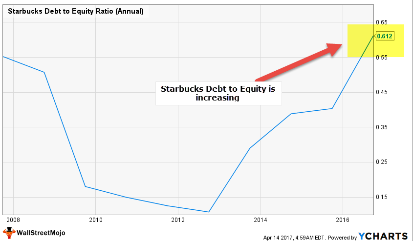

The financial health of a company is a key consideration for stakeholders, particularly in the food and beverage industry, which is known for its volatility due to changing consumer preferences, regulatory shifts, and supply chain challenges. Evaluating this financial health necessitates using various financial metrics, one of the most critical being the debt-to-equity ratio (D/E ratio). This ratio provides insight into a company's financial leverage by comparing its total liabilities to its shareholder equity. 

In this article, we assess the importance of the D/E ratio within the food and beverage sector. This sector includes an array of companies, from multinational giants like PepsiCo to small artisanal food producers, each exhibiting unique financial structures and risk profiles. Consequently, the D/E ratio serves as a pivotal indicator of financial risk and operational strategy, giving investors a clearer picture of how a company funds its operations and growth.



Additionally, we investigate the integration of financial metrics, such as the D/E ratio, into algorithmic trading systems. Algorithmic trading employs pre-programmed trading instructions to execute trades rapidly, considering various financial metrics to optimize investment decisions. By incorporating the D/E ratio, algorithms can assess a company's financial stability in real-time, thereby facilitating informed and swift trading decisions. 

Understanding both the conventional use of the D/E ratio in financial analysis and its application in advanced trading strategies is essential for stakeholders aiming to navigate the complexities of the food and beverage industry.

## Table of Contents

## Understanding the Debt-to-Equity Ratio

The debt-to-equity (D/E) ratio is an essential financial metric that measures a company's financial leverage, representing the proportion of debt and equity used to finance its assets. It is calculated by dividing a company’s total liabilities by its shareholders' equity. The formula is expressed as:

$$
\text{Debt-to-Equity Ratio} = \frac{\text{Total Liabilities}}{\text{Shareholders' Equity}}
$$

This ratio provides insight into the financial structure of a company and its reliance on debt. A higher D/E ratio indicates that a company has been aggressively financing its growth with debt, which can result in higher interest obligations and increased financial risk. A company with a higher D/E ratio may face more difficulties in securing additional financing or weathering economic downturns compared to a company with a lower D/E ratio.

Conversely, a lower D/E ratio suggests a more conservative financial approach, with a higher reliance on equity for funding. While this may imply less financial risk, it may also indicate that the company is not fully utilizing the potential to leverage its equity for growth opportunities.

Understanding the D/E ratio is crucial for investors, creditors, and analysts as it helps assess the company's financial health and risk profile. It is important to compare the D/E ratio with industry averages and consider the company's historical ratio to gain a comprehensive understanding of its financial strategy and stability.

## Importance of D/E Ratio in the Food and Beverage Industry

The food and beverage industry is characterized by its wide range of businesses, each with unique financial structures. This diversity is reflected in the debt-to-equity (D/E) ratios observed within the sector. A D/E ratio is defined as:

$$
\text{D/E Ratio} = \frac{\text{Total Liabilities}}{\text{Shareholder Equity}}
$$

In this industry, the average D/E ratio can be misleading due to the heterogeneous nature of companies involved. For instance, companies focused on health foods might maintain different financial strategies than those involved in liquor production, leading to varied D/E ratios.

A high D/E ratio may suggest that a company is heavily reliant on debt financing, which could be riskier, while a low ratio could indicate a more conservative financial approach. However, what constitutes a 'high' or 'low' ratio can be subjective and highly dependent on the specific context of each company. Within the food and beverage sector, the ratios vary significantly due to diverse business models and financial strategies.

PepsiCo and Nestlé are exemplary in showcasing this diversity. PepsiCo, engaging heavily in both food and beverages, manages a different D/E ratio compared to Nestlé, which has a distinct portfolio focusing on nutrition, health, and wellness. These differences underscore the variability of financial strategies, reflecting how companies manage debt and equity in alignment with their business goals.

Therefore, while examining the D/E ratio in this industry, it's crucial to consider the specific market segment within the sector. A single metric like the average D/E ratio may overlook the nuances that exist due to this diversity. Investors and analysts must consider the context of each company, understanding that what might be a normal ratio in one segment could be atypical in another. This careful consideration ensures a more accurate interpretation of financial health and risk profiles, aiding in more informed investment decisions.

## Algorithmic Trading and Financial Metrics

Algorithmic trading, often referred to as algo-trading, involves the use of pre-programmed instructions to execute trades based on various market variables. These variables typically include time, price, and [volume](/wiki/volume-trading-strategy), allowing for efficient and rapid trading decisions that human traders might not execute as swiftly. The core advantage of [algorithmic trading](/wiki/algorithmic-trading) lies in its ability to analyze large datasets and execute orders at speeds unachievable by manual trading.

Financial metrics such as the debt-to-equity (D/E) ratio can be integral to algorithmic trading strategies. The D/E ratio, calculated as $\frac{\text{Total Liabilities}}{\text{Shareholder's Equity}}$, provides insights into a company's financial leverage, offering an indication of the financial risk associated with the company. High D/E ratios suggest greater leverage, reflecting a potential higher risk of financial instability, and can therefore be a critical statistic for algorithms designed to assess risk profiles.

By incorporating the D/E ratio into trading algorithms, traders can automate the evaluation of a company's financial stability, allowing for rapid adjustments to their portfolios. For instance, an algorithm could be programmed to flag companies with D/E ratios that exceed a predefined threshold, prompting a review or an automatic adjustment of holdings in such firms. 

In Python, a simple function to assess the D/E ratio's implication on a trading decision could look like this:

```python
def evaluate_de_ratio(total_liabilities, shareholders_equity, threshold=1.0):
    de_ratio = total_liabilities / shareholders_equity
    if de_ratio > threshold:
        return "High risk, consider reducing exposure"
    else:
        return "Acceptable risk, maintain or increase exposure"

# Example usage:
total_liabilities = 1000000
shareholders_equity = 800000
decision = evaluate_de_ratio(total_liabilities, shareholders_equity)
print(decision)  # Output: High risk, consider reducing exposure
```

In the modern investment landscape, algorithmic trading plays a pivotal role, particularly in high-frequency trading environments where trading speed is critical. By harnessing financial metrics such as the D/E ratio, these algorithms can effectively assess and respond to changes in financial stability, aiding traders in optimizing their investment strategies based on quantitative data rather than subjective interpretations.

## Special Considerations in Analyzing D/E Ratio

Analyzing the debt-to-equity (D/E) ratio necessitates a nuanced understanding of both market conditions and the specific financial circumstances of each company. The D/E ratio, calculated by dividing a company's total liabilities by its shareholder equity, provides a snapshot of financial leverage. However, this metric does not uniformly apply across all sectors and thus demands contextual interpretation.

In the food and beverage industry, for example, the acceptance of a high D/E ratio can vary significantly depending on the company's sector within the industry. Capital-intensive sectors, such as those involved in large-scale production facilities or extensive distribution networks, may inherently operate with higher D/E ratios. These sectors require substantial initial investment, often funded through debt, to achieve economies of scale and maintain competitive advantages. Therefore, while a high D/E ratio might typically be a red flag, it could be quite normal for a beverage manufacturer with large bottling operations or a food producer with expansive agricultural ventures.

In contrast, companies focusing on niche, health-oriented food products might operate with a lower D/E ratio due to smaller operational scales and the lower capital intensity of their business models. Investors need to consider these nuances by reviewing sector-specific benchmarks and understanding individual company strategies before drawing conclusions based solely on the D/E ratio.

Moreover, macroeconomic conditions can significantly alter the implications of a company's D/E ratio. During periods of economic expansion, firms might opt for increased leverage to capitalize on growth opportunities, leading to naturally higher D/E ratios. Conversely, in economic downturns, high leverage can signal financial distress as declining revenues may not suffice to cover debt obligations.

Understanding these variabilities enhances investment decision-making, allowing investors to better assess the risk and future prospects of a company. For instance, evaluating whether a high D/E ratio is part of a strategic expansion plan or a symptom of over-leverage requires detailed scrutiny of financial statements and industry forecasts.

Finally, geographical considerations also play a role. Companies operating in emerging markets might have higher D/E ratios due to less mature equity markets and greater reliance on debt financing. Therefore, an investor must incorporate awareness of regional economic climates and financing norms while analyzing these metrics. In essence, the D/E ratio, while a useful tool, benefits greatly from a context-driven analysis that aligns with the broader economic landscape and the specific financial conditions of an industry or company.

## Conclusion

The debt-to-equity (D/E) ratio remains an essential metric for assessing financial leverage and risk across industries. In the food and beverage sector, interpreting this ratio requires a nuanced understanding of the industry's diverse characteristics and market dynamics. Companies within this sector, such as those focusing on health foods or alcohol production, often exhibit varying D/E ratios. This highlights the need for contextual analysis when evaluating financial health and investment potential. 

Algorithmic trading introduces a modern dimension to investment strategies by employing automated systems that integrate financial metrics like the D/E ratio. These algorithms can rapidly analyze large datasets, using the D/E ratio as a parameter to assess a company's financial stability and risk profile. By leveraging this ratio, algorithmic trading enhances decision-making processes, optimizing investment strategies to align with the investor's risk tolerance and financial goals.

Careful consideration of industry-specific nuances and the strategic integration of financial metrics into trading algorithms reveal the continued value of the D/E ratio. It aids not only in traditional financial analyses but also in sophisticated, technology-driven investment environments.

## References & Further Reading

[1]: ["Debt-to-Equity Ratio: Definition, Formula, and Examples"](https://www.investopedia.com/terms/d/debtequityratio.asp) by Investopedia.

[2]: Damodaran, Aswath. ["Applying Debt to Equity Ratios: The Right Way and the Wrong Way"](https://people.stern.nyu.edu/adamodar/pdfiles/valonlineslides/session6.pdf).

[3]: ["Advances in Financial Machine Learning"](https://www.amazon.com/Advances-Financial-Machine-Learning-Marcos/dp/1119482089) by Marcos Lopez de Prado.

[4]: ["Financial Ratio Analysis: The debt-to-equity ratio"](https://www.investopedia.com/terms/d/debtequityratio.asp) by Corporate Finance Institute.

[5]: ["Machine Learning for Algorithmic Trading"](https://github.com/stefan-jansen/machine-learning-for-trading) by Stefan Jansen.

[6]: ["An Analysis of the Impact of Leverage on Stock Returns in the Food and Beverage Sector"](https://www.researchgate.net/publication/343304943_Effect_of_Financial_Performance_on_Stock_Return_Evidence_from_the_Food_and_Beverages_Sector) by Ekpenyong, S.D., & Umoren, A.O. (2019).

[7]: ["Quantitative Trading: How to Build Your Own Algorithmic Trading Business"](https://github.com/LucindaYa/quant-resources/blob/master/Quantitative%20Trading%20How%20to%20Build%20Your%20Own%20Algorithmic%20Trading%20Business.pdf) by Ernest P. Chan. 

[8]: ["Algorithmic Trading & DMA: An Introduction to Direct Access Trading Strategies"](https://www.amazon.com/Algorithmic-Trading-DMA-introduction-strategies/dp/0956399207) by Barry Johnson.