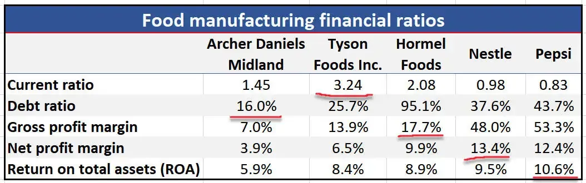

## Table of Contents

## What is the debt-to-equity ratio and how is it calculated?

The debt-to-equity ratio is a financial measure that shows how much a company is using debt compared to its equity to finance its operations. It helps investors and analysts understand the company's financial health and risk level. A higher ratio means the company is using more debt, which can be riskier because it has to pay back the debt with interest.

To calculate the debt-to-equity ratio, you take the total liabilities of the company and divide them by the total shareholders' equity. For example, if a company has total liabilities of $100,000 and total equity of $50,000, the debt-to-equity ratio would be $100,000 divided by $50,000, which equals 2. This means the company has twice as much debt as equity.

## Why is the debt-to-equity ratio important for businesses in the food and beverage industry?

The debt-to-equity ratio is important for businesses in the food and beverage industry because it shows how they are balancing debt and equity to run their operations. This industry often needs a lot of money for things like buying ingredients, equipment, and running stores or restaurants. If a company has a high debt-to-equity ratio, it means it is using more borrowed money. This can be risky because the company needs to pay back the debt with interest, which can be hard if the business is not doing well.

On the other hand, a lower debt-to-equity ratio can mean the company is using more of its own money or money from investors, which can be safer. But it also means the company might not be growing as fast as it could if it used more debt. So, investors and managers in the food and beverage industry look at this ratio to decide if a company is taking on too much risk or if it is being too cautious. It helps them make better decisions about investing in or managing the business.

## How does the debt-to-equity ratio differ across various segments of the food and beverage industry?

The debt-to-equity ratio can vary a lot across different parts of the food and beverage industry. For example, big food manufacturers like those making snacks or drinks might have a higher debt-to-equity ratio. They need a lot of money to buy machines and ingredients, and they often use debt to do this. But because they make a lot of products and sell them to many stores, they can usually handle the debt.

On the other hand, small restaurants or cafes might have a lower debt-to-equity ratio. They don't need as much money for big machines, and they often use their own money or money from a few investors. This makes them less risky because they don't have to pay back big loans, but it also means they might grow more slowly.

Lastly, companies that focus on fast food or chain restaurants might be somewhere in the middle. They need money to open new locations and buy equipment, but they also make a lot of money from selling food. So, their debt-to-equity ratio can be higher than small restaurants but lower than big manufacturers.

## What is considered a healthy debt-to-equity ratio in the food and beverage sector?

In the food and beverage sector, a healthy debt-to-equity ratio often falls between 0.5 and 1.5. This means that for every dollar of equity, the company has between 50 cents and $1.50 in debt. This range is seen as a good balance because it shows the company is using some debt to grow, but not so much that it becomes too risky.

However, what is considered healthy can change depending on the specific part of the industry. For example, big food manufacturers might have a higher ratio, around 1.5 or even higher, because they need a lot of money for equipment and ingredients. On the other hand, small restaurants might aim for a lower ratio, closer to 0.5, because they don't need as much money and want to avoid the risk of big debts.

## How can changes in the debt-to-equity ratio impact a food and beverage company's financial health?

Changes in the debt-to-equity ratio can have a big effect on a food and beverage company's financial health. If the ratio goes up, it means the company is using more debt. This can be good if the company uses the money to grow and make more profit. But it can also be bad if the company can't pay back the debt, especially if sales go down or costs go up. A high debt-to-equity ratio can make it harder for the company to get more loans, and it might worry investors who think the company is too risky.

On the other hand, if the debt-to-equity ratio goes down, it means the company is using less debt and more equity. This can make the company safer because it doesn't have to worry as much about paying back loans. But it can also mean the company is not growing as fast as it could if it used more debt. Investors might see a low ratio as a sign that the company is being careful, but they might also think it's not taking enough risks to grow. So, the right balance depends on the company's goals and the part of the food and beverage industry it is in.

## What are the common factors that influence the debt-to-equity ratio in the food and beverage industry?

Several factors can change the debt-to-equity ratio in the food and beverage industry. One big [factor](/wiki/factor-investing) is how much the company wants to grow. If a company wants to open new stores or buy new equipment, it might need to borrow more money, which would make the debt-to-equity ratio go up. Another factor is how well the company is doing. If sales are good and the company is making a lot of money, it might not need to borrow as much, which would keep the ratio lower. But if sales go down, the company might need to borrow more to keep going, pushing the ratio up.

The type of business in the food and beverage industry also matters. Big companies that make a lot of food or drinks usually need a lot of money for machines and ingredients, so they might have a higher debt-to-equity ratio. Small restaurants or cafes might not need as much money, so they can keep their ratio lower. Also, how easy it is to get loans can affect the ratio. If banks are willing to lend money at good rates, companies might borrow more, making the ratio go up. If loans are hard to get or expensive, companies might use less debt, keeping the ratio lower.

## How do food and beverage companies manage their debt-to-equity ratio?

Food and beverage companies manage their debt-to-equity ratio by balancing how much money they borrow and how much they get from investors or their own profits. If they want to keep the ratio low, they might use more of their own money or get more investors to put money into the company. This makes the company safer because it doesn't have to worry about paying back big loans. But it can also mean the company grows more slowly because it's not using as much borrowed money.

On the other hand, if a company wants to grow faster, it might borrow more money, which makes the debt-to-equity ratio go up. This can be good if the company uses the money to open new stores or buy new equipment that helps it make more profit. But it can also be risky because the company has to pay back the loans with interest, and if sales go down or costs go up, it might have trouble doing that. So, companies in the food and beverage industry need to find the right balance based on their goals and the part of the industry they are in.

## Can you provide examples of food and beverage companies with high and low debt-to-equity ratios?

A food and beverage company with a high debt-to-equity ratio is Kraft Heinz. They make a lot of food products like ketchup and macaroni and cheese. Because they need a lot of money to buy ingredients and machines, they borrow a lot. This makes their debt-to-equity ratio higher than many other companies in the industry. It's a way for them to grow and make more products, but it also means they have to be careful about paying back their loans.

On the other hand, a company with a low debt-to-equity ratio is Chipotle Mexican Grill. They run a chain of restaurants that serve Mexican food. Chipotle doesn't need as much money for big machines or a lot of ingredients because they focus on fresh food. They use more of their own money or money from investors, which keeps their debt-to-equity ratio low. This makes them safer because they don't have to worry about big loans, but it also means they might not grow as fast as companies that use more debt.

## How does the debt-to-equity ratio of food and beverage companies compare to other industries?

Food and beverage companies usually have a debt-to-equity ratio that is about the same as many other industries, but it can be different depending on the specific part of the industry. For example, big food manufacturers like Kraft Heinz might have a higher ratio because they need a lot of money for machines and ingredients. This is similar to other industries that need a lot of money for equipment, like car manufacturers or energy companies. But small restaurants or cafes, like Chipotle, might have a lower ratio because they don't need as much money and can use more of their own or investors' money.

Compared to industries like technology or software, food and beverage companies often have a higher debt-to-equity ratio. Tech companies like Apple or Google usually don't need as much money for big machines or buildings, so they can keep their debt low and use more of their own money or money from investors. This makes their debt-to-equity ratio lower than many food and beverage companies. But compared to industries like real estate or utilities, which often have very high debt-to-equity ratios because they need a lot of money for buildings or power plants, food and beverage companies might have a lower ratio.

## What are the potential risks associated with a high debt-to-equity ratio in the food and beverage industry?

A high debt-to-equity ratio in the food and beverage industry can be risky. If a company has a lot of debt, it means it has to pay back a lot of money with interest. This can be hard if the company's sales go down or if costs like ingredients or rent go up. If the company can't pay back the debt, it might have to close stores, lay off workers, or even go bankrupt. This can scare away investors who think the company is too risky to put their money into.

Also, having a lot of debt can make it harder for the company to get more loans. Banks might not want to lend more money to a company that already has a lot of debt. This can stop the company from growing or fixing problems. If the company needs money to open new stores or buy new equipment, it might not be able to do that if it can't get more loans. So, a high debt-to-equity ratio can make it harder for the company to handle problems and grow in the future.

## How do economic cycles affect the debt-to-equity ratio in the food and beverage sector?

Economic cycles can change how food and beverage companies use debt and equity. During good times when the economy is growing, companies might borrow more money to open new stores or buy new equipment. This can make their debt-to-equity ratio go up because they are using more debt. They do this because they think they can make more money and pay back the loans easily. But if the economy is doing well, they might also make more profit and use that money to pay down debt, which could keep the ratio from going too high.

On the other hand, during bad economic times, like a recession, companies might be more careful about borrowing money. They might try to use less debt and more of their own money or money from investors to keep the business running. This can make the debt-to-equity ratio go down because they are using less debt. But if sales go down a lot during a recession, the company might need to borrow more money just to stay open, which could push the ratio up. So, economic cycles can make the debt-to-equity ratio go up or down depending on how the company decides to handle its money.

## What advanced financial strategies can food and beverage companies use to optimize their debt-to-equity ratio?

Food and beverage companies can use different strategies to make their debt-to-equity ratio better. One way is to sell off assets they don't need, like old equipment or buildings, and use the money to pay down debt. This makes the debt part of the ratio smaller without changing the equity part. Another strategy is to raise more money from investors by selling new shares of the company. This increases the equity part of the ratio, making it smaller overall. Companies can also try to make more profit by cutting costs or raising prices, and then use that extra money to pay down debt.

Another advanced strategy is to use financial tools like [interest rate](/wiki/interest-rate-trading-strategies) swaps to make debt cheaper. If a company has a loan with a high interest rate, it can swap that for a loan with a lower rate, which makes it easier to pay back the debt. Companies can also look at their debt and see if they can refinance it, which means getting a new loan with better terms to pay off an old loan. This can make the debt part of the ratio smaller if the new loan is smaller or has a lower interest rate. By using these strategies, food and beverage companies can keep their debt-to-equity ratio at a healthy level and grow their business safely.

## What is the Debt-to-Equity Ratio and How Can It Be Understood?

The debt-to-equity (D/E) ratio is an essential financial metric that measures a company's financial leverage, representing the proportion of debt and equity used to finance its assets. It is calculated by dividing a company’s total liabilities by its shareholders' equity. The formula is expressed as:

$$
\text{Debt-to-Equity Ratio} = \frac{\text{Total Liabilities}}{\text{Shareholders' Equity}}
$$

This ratio provides insight into the financial structure of a company and its reliance on debt. A higher D/E ratio indicates that a company has been aggressively financing its growth with debt, which can result in higher interest obligations and increased financial risk. A company with a higher D/E ratio may face more difficulties in securing additional financing or weathering economic downturns compared to a company with a lower D/E ratio.

Conversely, a lower D/E ratio suggests a more conservative financial approach, with a higher reliance on equity for funding. While this may imply less financial risk, it may also indicate that the company is not fully utilizing the potential to leverage its equity for growth opportunities.

Understanding the D/E ratio is crucial for investors, creditors, and analysts as it helps assess the company's financial health and risk profile. It is important to compare the D/E ratio with industry averages and consider the company's historical ratio to gain a comprehensive understanding of its financial strategy and stability.

## What is the importance of the D/E ratio in the Food and Beverage Industry?

The food and beverage industry is characterized by its wide range of businesses, each with unique financial structures. This diversity is reflected in the debt-to-equity (D/E) ratios observed within the sector. A D/E ratio is defined as:

$$
\text{D/E Ratio} = \frac{\text{Total Liabilities}}{\text{Shareholder Equity}}
$$

In this industry, the average D/E ratio can be misleading due to the heterogeneous nature of companies involved. For instance, companies focused on health foods might maintain different financial strategies than those involved in liquor production, leading to varied D/E ratios.

A high D/E ratio may suggest that a company is heavily reliant on debt financing, which could be riskier, while a low ratio could indicate a more conservative financial approach. However, what constitutes a 'high' or 'low' ratio can be subjective and highly dependent on the specific context of each company. Within the food and beverage sector, the ratios vary significantly due to diverse business models and financial strategies.

PepsiCo and Nestlé are exemplary in showcasing this diversity. PepsiCo, engaging heavily in both food and beverages, manages a different D/E ratio compared to Nestlé, which has a distinct portfolio focusing on nutrition, health, and wellness. These differences underscore the variability of financial strategies, reflecting how companies manage debt and equity in alignment with their business goals.

Therefore, while examining the D/E ratio in this industry, it's crucial to consider the specific market segment within the sector. A single metric like the average D/E ratio may overlook the nuances that exist due to this diversity. Investors and analysts must consider the context of each company, understanding that what might be a normal ratio in one segment could be atypical in another. This careful consideration ensures a more accurate interpretation of financial health and risk profiles, aiding in more informed investment decisions.

## References & Further Reading

[1]: ["Debt-to-Equity Ratio: Definition, Formula, and Examples"](https://www.investopedia.com/terms/d/debtequityratio.asp) by Investopedia.

[2]: Damodaran, Aswath. ["Applying Debt to Equity Ratios: The Right Way and the Wrong Way"](https://people.stern.nyu.edu/adamodar/pdfiles/valonlineslides/session6.pdf).

[3]: ["Advances in Financial Machine Learning"](https://www.amazon.com/Advances-Financial-Machine-Learning-Marcos/dp/1119482089) by Marcos Lopez de Prado.

[4]: ["Financial Ratio Analysis: The debt-to-equity ratio"](https://www.investopedia.com/terms/d/debtequityratio.asp) by Corporate Finance Institute.

[5]: ["Machine Learning for Algorithmic Trading"](https://github.com/stefan-jansen/machine-learning-for-trading) by Stefan Jansen.

[6]: ["An Analysis of the Impact of Leverage on Stock Returns in the Food and Beverage Sector"](https://www.researchgate.net/publication/343304943_Effect_of_Financial_Performance_on_Stock_Return_Evidence_from_the_Food_and_Beverages_Sector) by Ekpenyong, S.D., & Umoren, A.O. (2019).

[7]: ["Quantitative Trading: How to Build Your Own Algorithmic Trading Business"](https://github.com/LucindaYa/quant-resources/blob/master/Quantitative%20Trading%20How%20to%20Build%20Your%20Own%20Algorithmic%20Trading%20Business.pdf) by Ernest P. Chan. 

[8]: ["Algorithmic Trading & DMA: An Introduction to Direct Access Trading Strategies"](https://www.amazon.com/Algorithmic-Trading-DMA-introduction-strategies/dp/0956399207) by Barry Johnson.