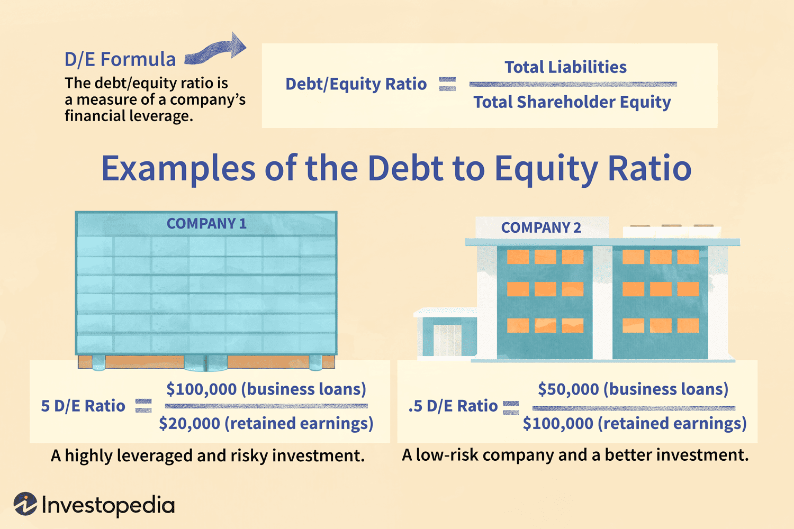

The financial landscape is constantly evolving, and evaluating a company's performance requires robust methodologies. Among these, the debt-to-equity (D/E) ratio stands as a crucial financial metric used to evaluate a company's financial leverage. This ratio provides insight into the proportion of a company's funding that comes from creditors compared to what is sourced from shareholders. Understanding the D/E ratio aids in assessing a company's strategic positioning and financial health, making it an indispensable tool for investors, analysts, and decision-makers.

Mathematically, the D/E ratio is expressed as:



$$
\text{Debt-to-Equity Ratio} = \frac{\text{Total Liabilities}}{\text{Shareholder Equity}}
$$

This metric signifies the level of financial leverage a company employs in its operations. A high D/E ratio can suggest that a company is aggressively financing its growth with debt, which could imply higher financial risk if not managed properly. Conversely, a lower D/E ratio may indicate a conservative approach to growth with less reliance on borrowed funds.

The contemporary role of the D/E ratio extends beyond traditional financial analysis; it is increasingly significant in investment decisions and algorithmic trading. Investors use this ratio to evaluate a company's stability and risk profile, influencing their portfolio strategies. In algorithmic trading, the D/E ratio is utilized within complex models that assess financial health and identify potential trading opportunities in fluctuating markets.

This article aims to explore the multifaceted role of the D/E ratio in finance and investment, emphasizing its relevance in understanding a company's financial structure and strategic approach. Through analysis of its application in various sectors and its growing prominence in algorithmic trading, the discussion will highlight why continuous evaluation of this metric is important for informed financial decision-making.

## Table of Contents

## Understanding Debt-to-Equity Ratio

The debt-to-equity (D/E) ratio is a key financial metric used to evaluate a company's financial leverage, illustrating the balance between debt financing and equity financing. It is calculated as follows:

$$
\text{Debt-to-Equity Ratio} = \frac{\text{Total Liabilities}}{\text{Shareholder Equity}}
$$

This ratio conveys the extent to which a company is utilizing borrowed funds relative to the funds invested by its shareholders. A high D/E ratio suggests that a company might be heavily reliant on debt for financing its operations. This reliance on debt implies higher financial risk, particularly if the company faces challenges in generating sufficient cash flow to meet its debt obligations promptly. Such a scenario could potentially lead to financial distress or even bankruptcy if not managed carefully.

In contrast, a lower D/E ratio indicates that a company relies less on external debt financing, which may suggest a more conservative financial structure with reduced financial risk. Companies with lower ratios may have more stable financing through equity, which enables them to weather economic downturns with greater resilience.

Understanding the D/E ratio is crucial for stakeholders, including investors and creditors, in assessing a company's financial health and risk profile. Investors might seek a balanced D/E ratio, which often signifies prudent financial management and operational stability. Creditors, on the other hand, might favor lending to companies with lower D/E ratios, as these firms represent lower credit risk.

Overall, the D/E ratio is a fundamental metric that provides insights into a company's capital structure, helping stakeholders make informed decisions regarding investment, lending, and risk assessment.

## Optimal Debt-to-Equity Ratio by Industry

Debt-to-equity (D/E) ratios exhibit significant variability across different industries, reflecting the unique financial strategies and market conditions tailored to each sector. Recognizing these variances is critical for performing accurate financial analysis and making knowledgeable investment decisions.

In capital-intensive sectors like utilities, companies often have higher D/E ratios. This is primarily because these industries require substantial investments in infrastructure, which are typically financed through debt. Utilities can sustain such leverage due to stable and predictable revenue streams that provide assurance to creditors about their capacity to meet debt obligations. As a result, a higher D/E ratio within this sector is not necessarily a sign of financial distress but rather an indicator of strategic financial structuring to maximize capital efficiency.

On the other hand, sectors such as technology and biotechnology generally exhibit lower D/E ratios. These industries are characterized by volatile revenues and uncertainty concerning research outcomes or technological advancements, which can be daunting for creditors. Thus, companies in these sectors often rely more on equity financing. Raising funds through equity reduces financial risk and allows these firms to navigate the inherent uncertainties of innovation without the pressure of fixed debt repayments.

Industry-specific norms in D/E ratios are vital for interpreting a company's financial health accurately. Investors and analysts should compare a company’s D/E ratio with industry benchmarks rather than relying solely on absolute values. A D/E ratio considered high in one sector might be average or even low in another, underscoring the importance of contextual financial scrutiny.

Strategic understanding of industry-specific D/E norms helps in making informed investment decisions. Investors can use these insights to assess the risk profile and growth potential of companies within a sector. A thorough comprehension of these nuances allows investors to align their portfolios with their risk appetite and financial goals, optimizing returns while managing potential downsides. 

In summary, the disparity in D/E ratios across industries emphasizes the necessity of context when analyzing financial leverage, guiding investors towards more informed and strategic decision-making processes.

## Debt Capital and Corporate Growth

Debt capital serves as a pivotal tool for companies aiming to expand without diluting their ownership. By obtaining financing through debt, companies can pursue projects such as research and development (R&D), acquisitions, and market expansion. These initiatives are crucial for maintaining competitiveness and fostering long-term growth.

However, managing the debt-to-equity (D/E) ratio is essential to prevent excessive leverage, which can pose significant financial risks. Over-leveraging can lead to higher interest obligations and potential financial distress in unfavorable market conditions. To strike the right balance between debt and equity financing, companies often rely on the concept of the Weighted Average Cost of Capital (WACC). The WACC represents the average rate that a company is expected to pay to finance its assets. It takes into account the cost of debt and the cost of equity, weighted by their respective proportions in the company's capital structure:

$$
\text{WACC} = \left( \frac{E}{V} \times Re \right) + \left( \frac{D}{V} \times Rd \times (1-T) \right)
$$

where:
- $E$ is the market value of the equity,
- $D$ is the market value of the debt,
- $V = E + D$ is the total market value of the company’s financing (equity and debt),
- $Re$ is the cost of equity,
- $Rd$ is the cost of debt,
- $T$ is the corporate tax rate.

Strategically managing the D/E ratio and WACC enables a business to optimize its capital structure, ensuring that the benefits of debt financing outweigh the costs. An optimal D/E ratio lowers the overall cost of capital, enhancing shareholder value and profitability. By balancing debt and equity, companies can achieve growth objectives while minimizing financial risk, ultimately leading to sustainable value creation for shareholders.

## Algorithmic Trading and Financial Metrics

Algorithmic trading has revolutionized the financial markets by leveraging quantitative models and computer algorithms to automate trading decisions. Among the numerous financial ratios employed in these models, the debt-to-equity (D/E) ratio serves as a pivotal indicator of a company's financial health and risk profile. By evaluating the proportion of debt to equity, traders can gauge financial leverage and potential vulnerabilities in volatile markets.

The D/E ratio provides valuable insights into a company's capital structure, which algorithms exploit to forecast market trends and uncover trading opportunities. For instance, a high D/E ratio might suggest that a company is heavily reliant on debt financing, potentially making it more susceptible to [interest rate](/wiki/interest-rate-trading-strategies) fluctuations and economic downturns. Conversely, a lower D/E ratio may indicate a more conservative approach to financial leverage, potentially signifying lower risk in unstable market conditions.

Python, with its extensive libraries for data analysis and manipulation, is an indispensable tool for developing and refining trading algorithms. Libraries like Pandas and NumPy facilitate efficient handling and analysis of financial data, while [machine learning](/wiki/machine-learning) frameworks such as Scikit-learn and TensorFlow empower traders to construct predictive models based on historical D/E ratios and other financial metrics. A basic Python script to calculate the D/E ratio for a given dataset could look like this:

```python
import pandas as pd

# Sample data
data = {'Total Liabilities': [500000, 300000],
        'Shareholder Equity': [200000, 150000]}

# Create a DataFrame
df = pd.DataFrame(data)

# Calculate D/E ratio
df['Debt-to-Equity Ratio'] = df['Total Liabilities'] / df['Shareholder Equity']

print(df)
```

In the high-frequency trading landscape, the swift execution of trades based on real-time data analysis is crucial. Algorithms integrating the D/E ratio enable traders to navigate the complexities of modern financial markets swiftly while maintaining an eye on strategic financial analysis. These algorithms evaluate the risk-return profile of various securities, optimizing trade execution by correlating financial metrics with market movements.

The application of [algorithmic trading](/wiki/algorithmic-trading) techniques not only enhances the precision and speed of trades but also aligns with broader financial strategies aimed at mitigating risk and maximizing returns. As markets continue to evolve, the integration of sophisticated algorithms that incorporate financial metrics like the D/E ratio remains a cornerstone of modern trading and investment practices.

## Conclusion

The debt-to-equity (D/E) ratio is a pivotal metric for gauging a company’s financial health and informing strategic management decisions. This ratio, defined as the proportion of total liabilities to shareholder equity, provides insights into a company's financial leverage, offering a snapshot of how much financing is derived from creditors versus owners. A balanced D/E ratio typically indicates a healthy equilibrium between debt and equity, underpinning financial stability and reducing exposure to financial risks.

In corporate finance, the D/E ratio is indispensable for risk management. Companies with high D/E ratios may face increased risk due to substantial obligations to creditors, potentially resulting in financial distress during economic downturns. Conversely, a lower D/E ratio may suggest that a company is conservative in its borrowing, possibly limiting its growth potential but maintaining stability. 

In the rapidly evolving domain of algorithmic trading, the D/E ratio is employed as a critical component in the development of strategies and models. Algorithms incorporate this ratio to evaluate the financial robustness of companies, which is especially crucial in volatile markets. The ability to quickly assess and adapt to market conditions through these quantitative assessments equips traders with the means to execute decisions based on financial health insights. Python, with its extensive libraries for financial analysis, offers tools such as Pandas and Numpy to automate the calculation and analysis of the D/E ratio, thus enhancing the precision and speed of trading activities.

Investors, irrespective of their strategy, should continuously monitor the D/E ratios of their potential or current investments to ensure alignment with their broader financial objectives. This ongoing evaluation enables investors to adjust their portfolios by accounting for changes in financial leverage and market conditions, thereby optimizing their risk-return profile. 

In conclusion, the D/E ratio remains a cornerstone of financial analysis, vital for assessing a company’s potential for growth and sustainability. Its integration into both corporate finance and sophisticated trading algorithms highlights its significance in strategic decision-making, underscoring the need for investors to maintain a vigilant approach when evaluating this critical financial metric.

## References & Further Reading

Investopedia provides an excellent overview of the Debt-to-Equity (D/E) Ratio, exploring its significance in assessing financial leverage and stability within a company. This resource is a valuable starting point for those looking to grasp the basic principles of how this metric functions and its implications on corporate finance.

"Corporate Finance: Theory and Practice" by Aswath Damodaran (2001) is a seminal work for understanding the broader context of financial metrics, including the D/E ratio. Damodaran's text offers in-depth insights into the evaluation methodologies and strategic implications of financial ratios, providing readers with a comprehensive understanding of corporate finance dynamics.

The CFA Institute's materials on financial leverage and the Debt-to-Equity Ratio provide a detailed examination of how these metrics contribute to evaluating a company's capital structure and risk [factor](/wiki/factor-investing). These resources are tailored for financial professionals seeking to apply these concepts in practical scenarios, enhancing their analytical and decision-making capabilities.

John C. Hull's "Options, Futures, and Other Derivatives" (2012) includes an exploration of how different financial derivatives may interact with corporate financial metrics, such as the D/E ratio. Hull's work is critical for understanding how leverage can influence valuations and the management of financial risk in derivative markets.

The study by K. Tsatsaronis and H. Zhu (2004), titled "What Drives Housing Price Dynamics: Cross-country Evidence," provides empirical evidence on factors influencing housing markets. While the focus is on housing prices, insights from this study may indirectly relate to how external economic factors can impact a company's financial ratios, including its D/E ratio, through changes in asset values and investment strategies.

