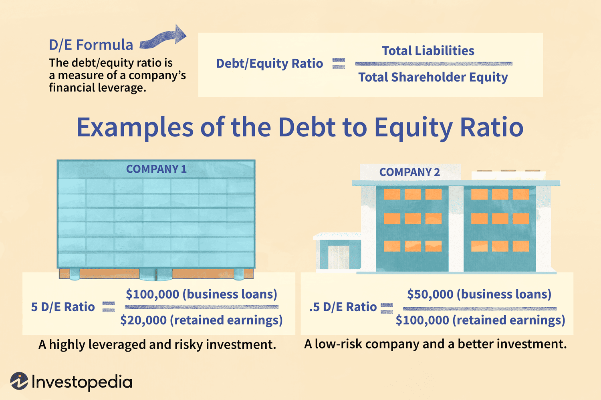

## Table of Contents

## What is the debt-to-equity ratio?

The debt-to-equity ratio is a financial measure that shows how much a company uses debt compared to its equity to finance its operations. It is calculated by dividing a company's total liabilities by its total shareholders' equity. This ratio helps investors and analysts understand the financial structure of a company and assess its risk level. A higher debt-to-equity ratio means the company relies more on borrowed money, which can be riskier because it must pay back the debt with interest.

A lower debt-to-equity ratio indicates that a company is using less debt and more of its own money to run its business. This can be seen as less risky because the company is not as dependent on loans. However, the ideal debt-to-equity ratio can vary by industry. Some industries, like utilities, often have higher ratios because they need a lot of capital to operate, while tech companies might have lower ratios because they need less physical infrastructure. Understanding the industry norms is important when evaluating this ratio.

## How is the debt-to-equity ratio calculated?

The debt-to-equity ratio is figured out by dividing a company's total liabilities by its total shareholders' equity. Liabilities are all the money a company owes, like loans and bills. Shareholders' equity is the money that belongs to the people who own the company, after all the debts are paid off.

This ratio helps people see how a company is balancing between money it borrows and money from its owners. If the ratio is high, it means the company is using a lot of borrowed money. If it's low, the company is mostly using its own money. Different types of businesses will have different normal levels for this ratio, so it's good to compare it with others in the same industry.

## Why is the debt-to-equity ratio important for businesses?

The debt-to-equity ratio is important for businesses because it shows how they are balancing between using borrowed money and their own money. This helps business owners, investors, and lenders understand if a company is taking on too much risk. If a company has a high debt-to-equity ratio, it means it is using a lot of borrowed money. This can be risky because the company needs to pay back the loans with interest. If it can't, it might get into financial trouble.

On the other hand, a low debt-to-equity ratio means the company is mostly using its own money to run the business. This is usually seen as less risky because the company isn't as dependent on loans. However, using too little debt might mean the company is not taking advantage of opportunities to grow. The right balance depends on the type of business and what is normal for its industry. By looking at the debt-to-equity ratio, people can make better decisions about investing in or lending to the company.

## What does a high debt-to-equity ratio indicate?

A high debt-to-equity ratio means a company is using a lot of borrowed money compared to the money it gets from its owners. This can be risky because the company has to pay back the loans with interest. If it can't, it might run into financial problems. Lenders and investors might see a high ratio as a sign that the company could be in trouble if things don't go well.

However, a high debt-to-equity ratio isn't always bad. Some industries, like utilities or telecoms, often have high ratios because they need a lot of money to build things like power plants or networks. If a company can use the borrowed money to make more money than it costs to pay back the loans, a high ratio might actually help the company grow. It's important to compare the ratio with other companies in the same industry to understand if it's too high or just normal.

## What does a low debt-to-equity ratio suggest?

A low debt-to-equity ratio means a company is using less borrowed money and more of its own money to run the business. This is usually seen as less risky because the company isn't as dependent on loans. If a company doesn't owe much money, it's easier for it to handle its finances and it's less likely to run into problems if business gets tough.

However, a low debt-to-equity ratio might also mean the company isn't using borrowed money to grow. Some companies can borrow money to invest in new projects or expand, and if they can make more money than it costs to pay back the loans, borrowing can help them grow faster. So, while a low ratio is often good, it's important to look at the whole picture and compare it with other companies in the same industry to see if it's the right balance for that business.

## How does industry affect the ideal debt-to-equity ratio?

The ideal debt-to-equity ratio can be different for different industries. Some businesses, like utilities or telecom companies, need a lot of money to build big things like power plants or networks. Because of this, it's normal for them to have higher debt-to-equity ratios. They borrow money to pay for these big projects, hoping to make more money than it costs to pay back the loans. So, a high ratio might be okay in these industries because it's part of how they work.

On the other hand, industries like technology or software might have lower debt-to-equity ratios. These businesses often don't need as much money to start up or run because they don't need big physical things. They can grow using their own money or by selling shares to investors. So, a low ratio is more common and seen as good in these industries. When looking at a company's debt-to-equity ratio, it's important to compare it with others in the same industry to see if it's too high, too low, or just right.

## What are the risks associated with a high debt-to-equity ratio?

A high debt-to-equity ratio means a company is using a lot of borrowed money. This can be risky because the company has to pay back the loans with interest. If the company can't make enough money to pay back the loans, it might get into financial trouble. Lenders and investors might see a high ratio as a sign that the company could be in danger if things don't go well. This can make it harder for the company to borrow more money in the future because lenders might be worried about getting their money back.

However, a high debt-to-equity ratio isn't always bad. Some industries, like utilities or telecoms, often have high ratios because they need a lot of money to build things like power plants or networks. If a company can use the borrowed money to make more money than it costs to pay back the loans, a high ratio might actually help the company grow. It's important to compare the ratio with other companies in the same industry to understand if it's too high or just normal for that type of business.

## How can a company optimize its debt-to-equity ratio?

A company can optimize its debt-to-equity ratio by finding the right balance between using borrowed money and its own money. One way to do this is by paying down debts. If a company has a lot of loans, it can use its profits to pay them off. This will lower the total amount of debt and, in turn, lower the debt-to-equity ratio. Another way is to raise more money from its owners by selling more shares. This will increase the shareholders' equity, which also helps lower the ratio. The key is to make sure the company isn't using too much debt, but also not missing out on chances to grow by borrowing too little.

It's also important for a company to think about what's normal for its industry. Some industries need a lot of money to operate, so a higher debt-to-equity ratio might be okay. A company should compare its ratio to others in the same industry to see if it's too high or just right. If it's too high, the company might want to focus on paying down debt or raising more equity. If it's too low, the company might look for ways to borrow money to invest in new projects or expand. Finding the right balance helps a company stay healthy and grow in a smart way.

## What are the differences between debt-to-equity ratio and other financial leverage ratios?

The debt-to-equity ratio is one way to look at how much a company uses borrowed money compared to its own money. It's calculated by dividing total liabilities by total shareholders' equity. This ratio shows how much risk a company is taking by using debt. Another common financial leverage ratio is the debt ratio, which is calculated by dividing total liabilities by total assets. This tells you how much of the company's assets are paid for with borrowed money. The debt-to-equity ratio focuses on the relationship between debt and equity, while the debt ratio looks at debt in relation to all assets.

Another important financial leverage ratio is the equity ratio, which is total equity divided by total assets. This ratio shows how much of a company's assets are owned by the shareholders, not borrowed. It's the opposite of the debt ratio in a way, because a high equity ratio means less debt. The debt-to-equity ratio and the equity ratio both look at equity, but they give different views. The debt-to-equity ratio compares debt to equity directly, while the equity ratio compares equity to total assets. Each of these ratios helps people understand a company's financial health and risk in different ways.

## How do changes in interest rates impact the debt-to-equity ratio?

Changes in interest rates can affect a company's debt-to-equity ratio. When interest rates go up, it becomes more expensive for a company to borrow money. This means that if a company already has a lot of debt, the cost to pay back that debt goes up. A company might decide to slow down on taking new loans because they're more expensive. This could lead to a lower debt-to-equity ratio over time if the company pays off its existing debt faster or stops borrowing more. On the other hand, if a company can't pay its debts because of higher interest rates, it might need to borrow even more, which could increase the ratio.

When interest rates go down, borrowing money becomes cheaper. This might encourage a company to take on more debt to grow or invest in new projects. If a company decides to borrow more because of lower interest rates, its debt-to-equity ratio could go up. However, if the company uses the borrowed money wisely and makes more money than it costs to pay back the loans, this could be good for the company. The impact of [interest rate](/wiki/interest-rate-trading-strategies) changes on the debt-to-equity ratio depends a lot on how the company manages its borrowing and its overall financial strategy.

## What role does the debt-to-equity ratio play in investment decisions?

The debt-to-equity ratio is a key number that investors look at when deciding if they want to put money into a company. It shows how much the company is using borrowed money compared to its own money. If the ratio is high, it means the company is using a lot of debt. This can be risky because the company has to pay back the loans with interest. If it can't, the company might run into money problems. Investors might see a high ratio as a sign that the company could be in trouble if things don't go well. On the other hand, if the ratio is low, it means the company is mostly using its own money. This is usually seen as less risky because the company isn't as dependent on loans.

However, the debt-to-equity ratio isn't the only thing investors look at. They also think about what's normal for the company's industry. Some industries, like utilities or telecoms, often have high ratios because they need a lot of money to build things like power plants or networks. A high ratio might be okay in these industries. Investors also look at how well the company is doing overall. If a company can use borrowed money to make more money than it costs to pay back the loans, a high ratio might actually help the company grow. So, while the debt-to-equity ratio is important, investors need to look at the whole picture to make smart choices about where to put their money.

## How do global economic conditions influence optimal debt-to-equity levels?

Global economic conditions can change what is seen as the best debt-to-equity ratio for a company. When the world economy is doing well, companies might feel more comfortable borrowing money because they think they can make more money than it costs to pay back the loans. During good times, a higher debt-to-equity ratio might be okay because businesses can use the borrowed money to grow and make more profit. But if the global economy starts to slow down or goes into a recession, companies might want to have less debt. They might try to pay off loans faster or not borrow as much because it's harder to make money when the economy is struggling. A lower debt-to-equity ratio can help a company stay safer during tough times.

Different parts of the world can also affect what's considered a good debt-to-equity ratio. For example, if interest rates are low in one country, companies there might borrow more money because it's cheaper. This could lead to higher debt-to-equity ratios in that country. But if another country is going through a financial crisis, companies there might be more careful and try to keep their debt low. So, what's seen as the best debt-to-equity ratio can change depending on where a company is and what's happening in the global economy. Companies need to keep an eye on these conditions to make smart choices about how much debt to take on.

## What is the Debt-to-Equity Ratio and How Can It Be Understood?

The debt-to-equity (D/E) ratio is an important financial metric used to evaluate a company's financial structure. It quantifies the proportion of a company's funding that comes from debt compared to shareholder equity. The formula for calculating the D/E ratio is:

$$
\text{Debt-to-Equity Ratio} = \frac{\text{Total Liabilities}}{\text{Shareholder Equity}}
$$

This ratio offers a window into a company's financial leverage, illustrating how much debt is utilized in relation to equity to finance the company's assets. A higher D/E ratio suggests that a company is more heavily financed by debt, which might imply greater financial risk, especially if the company is unable to meet its debt obligations during economic downturns. Conversely, a lower D/E ratio typically signals less reliance on borrowing, indicating a more robust balance sheet and potentially lower financial risk.

Investors and creditors commonly use the D/E ratio to evaluate the financial health of a company. It serves as a measure for confidence in a company's stability and resilience in adverse economic conditions. A balanced D/E ratio varies by industry; however, a consistently high ratio might suggest that a company is overly leveraged, potentially limiting its ability to secure additional financing or affecting its creditworthiness. 

The D/E ratio is particularly significant during periods of economic distress, as it indicates a company's ability to manage its debt effectively and quantifies the buffer available to absorb financial shocks without endangering shareholder value. Understanding this ratio helps stakeholders make informed decisions regarding investment opportunities and risk management, thereby playing a vital role in assessing the long-term sustainability and profitability of a company.

## How does debt capital influence corporate growth?

Debt capital is a critical resource that empowers companies to undertake expansion and development projects without diluting ownership by issuing additional equity. By accessing debt capital, companies can fund initiatives such as research and development, acquisitions, technological upgrades, and market expansion. This form of financing can enable companies to maintain operational competitiveness and achieve strategic goals.

The strategic use of debt is, however, a balancing act. While acquiring debt capital can propel growth, excessive borrowing can lead to financial distress. The key lies in meticulous management of the debt-to-equity (D/E) ratio, ensuring that the company does not over-leverage itself. A well-structured debt capital plan can increase shareholder value and enhance profitability, provided the cost of debt does not surpass the anticipated returns from the financed projects.

The effectiveness of using debt capital hinges on understanding the trade-offs between the cost of debt and potential returns on investment. The cost of debt, often influenced by interest rates and the company's creditworthiness, should be lower than the expected returns from investment. Companies often evaluate their Weighted Average Cost of Capital (WACC) to determine the optimal capital structure. The formula for WACC is:

$$

WACC = \left(\frac{E}{V} \times Re\right) + \left(\frac{D}{V} \times Rd \times (1-Tc)\right) 
$$

where:
- $E$ is the market value of equity
- $D$ is the market value of debt
- $V$ is the total market value of the company’s financing (Equity + Debt)
- $Re$ is the cost of equity
- $Rd$ is the cost of debt
- $Tc$ is the corporate tax rate

This formula helps the company understand the average cost of each dollar of financing, assisting in decision-making regarding whether to finance projects through equity or debt.

In summary, debt capital serves as a significant lever for corporate growth, with its strategic use contingent upon careful assessment of the associated risks and returns. By effectively managing their D/E ratio and understanding their WACC, companies can successfully exploit debt capital to realize growth and development goals, ultimately enhancing their market position and financial performance.

## What is the relationship between Algorithmic Trading and Financial Metrics?

Algorithmic trading utilizes advanced computational algorithms to execute trades based on a set of predetermined criteria, often involving financial metrics such as the debt-to-equity (D/E) ratio. The D/E ratio serves as a key indicator of a company's financial health and leverage, offering traders valuable insights into potential investment risks and opportunities. By incorporating the D/E ratio into trading algorithms, traders can make more informed decisions regarding the timing and scope of trades.

To develop robust trading algorithms, it is crucial to understand financial health indicators comprehensively. The D/E ratio is a measure of a company’s financial leverage, calculated as:

$$
\text{D/E Ratio} = \frac{\text{Total Liabilities}}{\text{Shareholder Equity}}
$$

A higher D/E ratio may suggest higher financial risk due to increased reliance on debt, whereas a lower ratio could indicate a more conservative financial structure with potentially lower risk. Algorithmic traders analyze these ratios to evaluate a company’s ability to withstand economic fluctuations. This evaluation is essential in volatile markets where financial stability plays a critical role in determining stock performance.

Algorithmic trading systems, equipped with the capability to process vast amounts of financial data rapidly, can identify trading opportunities based on variations in D/E ratios across different companies and industries. For example, an algorithm might be programmed to prioritize buying stocks from companies with a lower D/E ratio during market downturns, under the assumption that these companies are more resilient to economic stress.

In Python, a basic implementation to screen companies based on the D/E ratio could involve using a library like Pandas to manage and analyze financial data:

```python
import pandas as pd

# Example DataFrame with company financials
data = {'Company': ['A', 'B', 'C'], 
        'Total Liabilities': [500, 700, 300], 
        'Shareholder Equity': [1000, 400, 300]}
df = pd.DataFrame(data)

# Calculate D/E Ratio
df['D/E Ratio'] = df['Total Liabilities'] / df['Shareholder Equity']

# Filter for companies with a desirable D/E ratio (e.g., less than 1)
optimal_companies = df[df['D/E Ratio'] < 1]

print(optimal_companies)
```

For algorithmic traders, incorporating D/E ratio evaluations into trading strategies helps build models that are responsive to both microeconomic conditions and broader market trends. Monitoring these ratios continuously allows for adaptive strategies that aim to maximize returns while managing risk effectively. As a result, [algorithmic trading](/wiki/algorithmic-trading) becomes not only a method for swift execution but also a tool for strategic financial analysis and decision-making.

## References & Further Reading

[1]: ["Debt-Equity Ratio Overview"](https://www.investopedia.com/terms/d/debtequityratio.asp) by Investopedia

[2]: Damodaran, A. (2001). ["Corporate Finance: Theory and Practice"](https://www.wiley.com/en-us/Corporate+Finance%3A+Theory+and+Practice%2C+2nd+Edition-p-9780471283324). Wiley.

[3]: ["Financial Leverage and the Debt-to-Equity Ratio"](https://www.investopedia.com/terms/d/debtequityratio.asp) by the CFA Institute

[4]: Hull, J. C. (2012). ["Options, Futures, and Other Derivatives"](https://www.semanticscholar.org/paper/Options%2C-Futures%2C-and-Other-Derivatives-Hull/89bdee500c8623864fc9eb7a471546aa713acc44). Pearson.

[5]: Tsatsaronis, K., & Zhu, H. (2004). ["What drives housing price dynamics: cross-country evidence"](https://www.bis.org/publ/qtrpdf/r_qt0403f.pdf). BIS Quarterly Review.

[6]: ["The Handbook of Fixed Income Securities, Ninth Edition"](https://www.amazon.com/Handbook-Fixed-Income-Securities-Ninth/dp/1260473899) by Frank J. Fabozzi