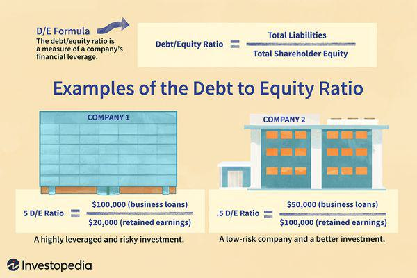

## Table of Contents

## What is a debt-to-equity ratio?

The debt-to-equity ratio is a way to measure how a company is using borrowed money compared to money from its owners. It's like looking at a seesaw where debt is on one side and equity (the owner's money) is on the other. To find this ratio, you take the company's total debt and divide it by the total equity. This number tells you how much the company relies on debt to grow or run its business.

If the debt-to-equity ratio is high, it means the company is using a lot of borrowed money. This can be risky because the company has to pay back the debt, plus interest. But it can also mean the company is trying to grow quickly. If the ratio is low, the company is using less debt and more of its own money. This might be safer, but it could also mean the company is not growing as fast as it could. Investors and bankers look at this ratio to decide if a company is a good investment or if it's too risky.

## Why is the debt-to-equity ratio important in the real estate sector?

In the real estate sector, the debt-to-equity ratio is really important because it shows how much a real estate company is borrowing to buy or develop properties compared to how much money it has from its owners or investors. Real estate often involves big projects that need a lot of money, so companies might borrow to get started. If the debt-to-equity ratio is high, it means the company is using a lot of borrowed money. This can be risky because if the real estate market goes down, the company might struggle to pay back its loans.

On the other hand, a low debt-to-equity ratio in real estate can mean the company is more stable because it's not relying as much on borrowed money. It's using more of its own money or money from investors. This can be safer, especially if the real estate market faces tough times. But, it might also mean the company is growing slower because it's not using as much debt to expand. So, investors and lenders look at this ratio to decide if they want to invest in or lend money to a real estate company.

## How do you calculate the debt-to-equity ratio for a real estate company?

To calculate the debt-to-equity ratio for a real estate company, you need to know two things: the total debt and the total equity of the company. The total debt includes all the money the company has borrowed, like loans or mortgages. The total equity is the money that the owners or shareholders have put into the company. Once you have these numbers, you divide the total debt by the total equity. The formula looks like this: Debt-to-Equity Ratio = Total Debt / Total Equity.

For example, if a real estate company has $2 million in debt and $1 million in equity, the debt-to-equity ratio would be calculated as $2 million divided by $1 million, which equals 2. This means for every dollar of equity, the company has $2 of debt. This ratio helps investors and lenders understand how much the company is relying on borrowed money to operate and grow its real estate projects.

## What is considered a healthy debt-to-equity ratio in real estate?

In real estate, a healthy debt-to-equity ratio can vary, but many experts think a ratio between 1 and 1.5 is good. This means for every dollar the owners put in, the company borrows between one and one and a half dollars. This balance lets the company grow without taking too much risk. If the ratio is too low, like below 1, the company might not be using enough debt to grow quickly. But if it's too high, like above 2, it might be too risky because the company could struggle to pay back its loans if things go wrong.

However, what's considered healthy can change depending on the economy, the type of real estate, and the company's goals. During good economic times, a higher ratio might be okay because it's easier to pay back loans. But in tough times, a lower ratio is safer. Also, some types of real estate, like commercial buildings, might handle more debt than others, like residential properties. So, it's important to look at the whole picture and not just the number when deciding if a real estate company's debt-to-equity ratio is healthy.

## How does the debt-to-equity ratio differ across various types of real estate businesses?

Different types of real estate businesses can have different debt-to-equity ratios because they have different needs and risks. For example, companies that develop big commercial buildings, like shopping centers or office towers, might have higher debt-to-equity ratios. These projects need a lot of money upfront, so these companies often borrow more. They think the future income from renting out the buildings will help them pay back the loans. But this can be risky if the economy slows down and fewer people want to rent space.

On the other hand, companies that focus on residential properties, like apartments or houses, might have lower debt-to-equity ratios. These businesses might not need as much debt because the projects are smaller and the demand for homes can be more stable. They might use less borrowed money to be safer, especially since people always need places to live. So, the type of real estate a company works with can change how much debt it's comfortable taking on compared to its equity.

## What are the implications of a high debt-to-equity ratio for a real estate firm?

A high debt-to-equity ratio for a real estate firm means it's using a lot of borrowed money compared to the money from its owners. This can be risky because the firm has to pay back the loans, plus interest. If the real estate market goes down, the firm might have trouble making these payments. It could even lead to bankruptcy if the firm can't pay back what it owes. Lenders and investors might see a high debt-to-equity ratio as a red flag, making it harder for the firm to get more loans or attract investment.

On the other hand, a high debt-to-equity ratio can also mean the firm is trying to grow quickly. By borrowing more, the firm can take on bigger projects and expand faster. If the market is doing well, this strategy can pay off with higher profits. But it's a balance; the firm needs to make sure it can handle the debt and that the growth from new projects will be enough to cover the loan payments. So, while a high debt-to-equity ratio can help a real estate firm grow, it also comes with higher risks.

## How can a real estate company improve its debt-to-equity ratio?

A real estate company can improve its debt-to-equity ratio by reducing its debt or increasing its equity. One way to lower debt is by paying off loans faster. The company can use its profits to make extra payments on its loans, which will slowly decrease the total debt. Another way is to refinance its loans. If the company can get a loan with a lower [interest rate](/wiki/interest-rate-trading-strategies), it can save money and pay off the debt quicker. Selling off some properties that aren't making much money can also help. By selling these, the company can use the money to pay down debt.

Another way to improve the debt-to-equity ratio is by increasing equity. The company can do this by bringing in more investors. If new investors buy shares in the company, this adds to the equity. The company can also keep its profits instead of paying them out as dividends. By keeping the profits, the company increases its equity. Sometimes, the company can even sell new shares to the public in a process called a stock offering. This brings in more money and increases the equity, which helps lower the debt-to-equity ratio. By using these strategies, a real estate company can make its financial position stronger and safer.

## What role does the debt-to-equity ratio play in real estate investment decisions?

The debt-to-equity ratio is really important when people are deciding whether to invest in a real estate company. It shows how much the company is borrowing compared to the money it has from its owners. If the ratio is high, it means the company is using a lot of borrowed money. This can be risky because the company has to pay back the loans, plus interest. If the real estate market goes down, the company might struggle to make these payments. Investors might see a high debt-to-equity ratio as a warning sign and think twice before putting their money into the company. They want to make sure the company can handle its debt and won't go bankrupt.

On the other hand, a low debt-to-equity ratio can make a real estate company look more stable and less risky. It means the company is not relying as much on borrowed money and is using more of its own money or money from investors. This can be safer, especially if the real estate market faces tough times. But, it might also mean the company is growing slower because it's not using as much debt to expand. So, investors look at the debt-to-equity ratio to decide if they want to invest in a real estate company. They want to find a balance between growth and safety, and the debt-to-equity ratio helps them make that decision.

## How does the debt-to-equity ratio impact the financial stability of real estate companies during economic downturns?

During an economic downturn, a high debt-to-equity ratio can make things really tough for real estate companies. If a company has a lot of debt, it has to keep paying it back, even when the economy is bad. If people aren't buying or renting as much, the company might not make enough money to cover its loan payments. This can lead to big problems, like not being able to pay bills or even going bankrupt. So, a high debt-to-equity ratio can make a real estate company more vulnerable during tough economic times.

On the other hand, a real estate company with a low debt-to-equity ratio might be in a better spot during an economic downturn. If the company isn't relying as much on borrowed money, it doesn't have as many loan payments to worry about. This can give the company more breathing room to weather the storm. Even if the market slows down, the company might still be able to keep going without too much trouble. So, a lower debt-to-equity ratio can help a real estate company stay more stable and secure during economic downturns.

## Can you compare the debt-to-equity ratios of leading real estate companies globally?

When we look at the debt-to-equity ratios of leading real estate companies around the world, we see some differences. For example, a company like Simon Property Group, which focuses on shopping malls in the United States, might have a debt-to-equity ratio around 7. This means they use a lot of borrowed money to grow their business. On the other hand, a company like Unibail-Rodamco-Westfield, which operates in Europe and the U.S., might have a lower ratio, around 1.5. This shows they use less debt and more of their own money.

Another example is Brookfield Asset Management, a global real estate firm with a debt-to-equity ratio around 1.2. They manage a wide range of properties, from offices to homes, and their lower ratio suggests they are more cautious about borrowing. In contrast, China Evergrande Group, a major player in China's real estate market, has faced challenges with a very high debt-to-equity ratio, sometimes over 10. This high ratio shows they borrow a lot to fuel their growth, which can be risky, especially in tough economic times.

## How do changes in interest rates affect the debt-to-equity ratios in the real estate sector?

Changes in interest rates can have a big impact on the debt-to-equity ratios of real estate companies. When interest rates go up, borrowing money becomes more expensive. This means that real estate companies might think twice before taking on more debt. If they already have a lot of loans, higher interest rates can make it harder for them to pay back what they owe. So, they might try to pay down their debt faster or look for other ways to bring in money, like selling properties. This can help lower their debt-to-equity ratio, making their financial situation look better.

On the other hand, when interest rates go down, borrowing money becomes cheaper. This can make real estate companies more willing to take on debt to grow their business. They might borrow more to buy new properties or start new projects. This can push their debt-to-equity ratio higher because they're using more borrowed money compared to their own money. But if they can make more money from these new projects, it might still be a good move. So, interest rates can really change how real estate companies handle their debt and equity, affecting their debt-to-equity ratios in big ways.

## What advanced financial strategies can real estate companies employ to manage their debt-to-equity ratios effectively?

Real estate companies can use a strategy called debt restructuring to manage their debt-to-equity ratios better. This means they might talk to their lenders about changing the terms of their loans. They could ask for lower interest rates or longer time to pay back the loans. This can make their debt easier to handle and lower their debt-to-equity ratio. Another smart move is to use interest rate swaps. This is when a company agrees to exchange its variable interest rate debt for a fixed rate. If interest rates go up, the company won't have to pay more, which can help keep their debt under control and their debt-to-equity ratio stable.

Another advanced strategy is to use mezzanine financing. This is a type of loan that sits between regular debt and equity. It's riskier for the lender, so it comes with higher interest rates, but it can help a real estate company grow without adding too much to its debt-to-equity ratio. The company can also look into issuing preferred equity. This is a special type of stock that gives investors a fixed dividend before common shareholders get anything. By bringing in more equity this way, the company can lower its debt-to-equity ratio without taking on more debt. These strategies can help real estate companies balance their debt and equity more effectively, making them more stable and attractive to investors.

## What is the Debt-to-Equity Ratio in Real Estate and How Can It Be Understood?

The debt-to-equity (D/E) ratio is a fundamental metric used to evaluate a company's financial leverage. It is calculated by dividing the total liabilities by the shareholder equity of the company. This ratio provides investors an insight into the extent to which a company is financing its operations through debt versus wholly owned funds. 

$$
\text{D/E Ratio} = \frac{\text{Total Liabilities}}{\text{Shareholder Equity}}
$$

In real estate, a sector characterized by substantial capital requirements, the D/E ratio serves a critical role. Real estate investments often involve high leverage, meaning that companies use a significant amount of debt relative to equity to finance property acquisitions. This approach can amplify returns when the value of real estate assets appreciates, but it also heightens risk, particularly if property values decline or if the company faces cash flow challenges. 

Due to the capital-intensive nature of the real estate sector, maintaining an optimal D/E ratio is essential for financial health. A high D/E ratio may suggest aggressive borrowing and significant leverage, which can result in elevated risk levels. Conversely, a low D/E ratio might imply a more conservative approach, potentially signalling missed opportunities for growth through leveraging.

Real estate companies often exhibit a wide range of D/E ratios, typically spanning from 1.0 to over 8.0. This variation reflects the diversity in capital structures and asset portfolios within the industry. Factors influencing a company's D/E ratio include the type of real estate it invests in (e.g., residential, commercial, industrial), geographic market conditions, and the company's specific investment strategy. 

Monitoring the D/E ratio is crucial for stakeholders, including investors and creditors, as it enables them to assess the risk associated with lending to or investing in a real estate company. It also helps these stakeholders gauge the company's capacity to endure downturns in property markets. Therefore, the D/E ratio remains a vital tool for managing financial risk in real estate investments.

## References & Further Reading

[1]: Bergstra, J., Bardenet, R., Bengio, Y., & Kégl, B. (2011). ["Algorithms for Hyper-Parameter Optimization."](https://papers.nips.cc/paper/4443-algorithms-for-hyper-parameter-optimization) Advances in Neural Information Processing Systems 24.

[2]: ["Advances in Financial Machine Learning"](https://www.amazon.com/Advances-Financial-Machine-Learning-Marcos/dp/1119482089) by Marcos Lopez de Prado

[3]: ["Evidence-Based Technical Analysis: Applying the Scientific Method and Statistical Inference to Trading Signals"](https://www.amazon.com/Evidence-Based-Technical-Analysis-Scientific-Statistical/dp/0470008741) by David Aronson

[4]: ["Machine Learning for Algorithmic Trading"](https://github.com/stefan-jansen/machine-learning-for-trading) by Stefan Jansen

[5]: ["Quantitative Trading: How to Build Your Own Algorithmic Trading Business"](https://www.amazon.com/Quantitative-Trading-Build-Algorithmic-Business/dp/1119800064) by Ernest P. Chan